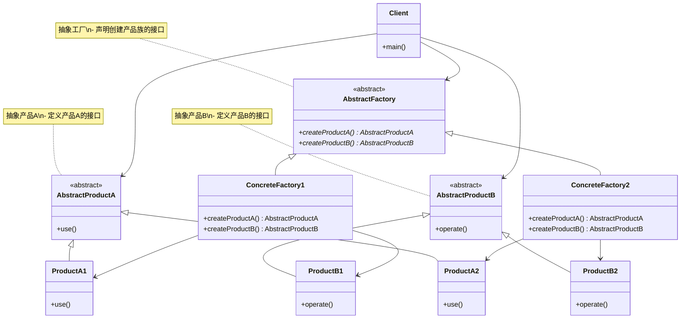
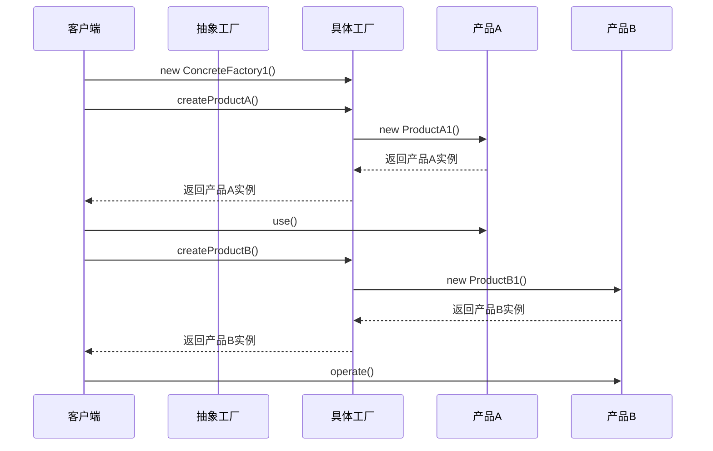
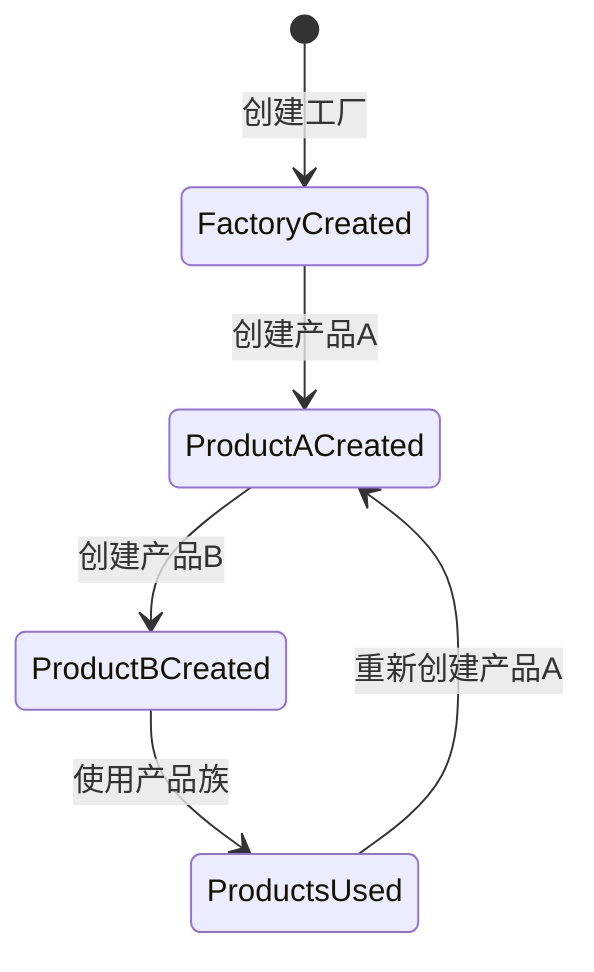

# 抽象工厂模式 (Abstract Factory Pattern) 详解

## 1. 模式定义

抽象工厂模式是一种创建型设计模式，它提供一个创建一系列相关或相互依赖对象的接口，而无需指定它们具体的类。

## 2. 模式动机

在软件开发中，我们经常需要创建一组相关的对象。如果使用工厂方法模式，我们需要为每一个产品创建一个工厂类，这会导致类的数量急剧增加。抽象工厂模式通过提供一个统一的接口来创建一组相关的产品，从而解决了这个问题。

抽象工厂模式强调的是产品族的概念，即一组相关或相互依赖的产品对象，它们通常一起使用，具有相同的主题或风格。

## 3. UML 类图



## 4. 角色分析

1. **AbstractFactory（抽象工厂）**：声明创建产品族的接口
2. **ConcreteFactory（具体工厂）**：实现抽象工厂接口，创建具体产品族
3. **AbstractProduct（抽象产品）**：定义产品的接口
4. **ConcreteProduct（具体产品）**：实现抽象产品接口的具体产品
5. **Client（客户端）**：使用抽象工厂和抽象产品

## 5. 时序图

### 5.1 基本时序图



## 6. 实现方式

### 6.1 基本实现

```java
// 抽象产品A
public interface AbstractProductA {
    void use();
}

// 抽象产品B
public interface AbstractProductB {
    void operate();
}

// 具体产品A1
public class ProductA1 implements AbstractProductA {
    @Override
    public void use() {
        System.out.println("使用产品A1");
    }
}

// 具体产品A2
public class ProductA2 implements AbstractProductA {
    @Override
    public void use() {
        System.out.println("使用产品A2");
    }
}

// 具体产品B1
public class ProductB1 implements AbstractProductB {
    @Override
    public void operate() {
        System.out.println("操作产品B1");
    }
}

// 具体产品B2
public class ProductB2 implements AbstractProductB {
    @Override
    public void operate() {
        System.out.println("操作产品B2");
    }
}

// 抽象工厂
public interface AbstractFactory {
    AbstractProductA createProductA();
    AbstractProductB createProductB();
}

// 具体工厂1
public class ConcreteFactory1 implements AbstractFactory {
    @Override
    public AbstractProductA createProductA() {
        return new ProductA1();
    }
    
    @Override
    public AbstractProductB createProductB() {
        return new ProductB1();
    }
}

// 具体工厂2
public class ConcreteFactory2 implements AbstractFactory {
    @Override
    public AbstractProductA createProductA() {
        return new ProductA2();
    }
    
    @Override
    public AbstractProductB createProductB() {
        return new ProductB2();
    }
}
```

### 6.2 扩展实现

```java
// 产品族接口
public interface ProductFamily {
    AbstractProductA getProductA();
    AbstractProductB getProductB();
    
    default void useFamily() {
        getProductA().use();
        getProductB().operate();
    }
}

// 具体产品族1
public class ProductFamily1 implements ProductFamily {
    private AbstractProductA productA;
    private AbstractProductB productB;
    
    public ProductFamily1() {
        this.productA = new ProductA1();
        this.productB = new ProductB1();
    }
    
    @Override
    public AbstractProductA getProductA() {
        return productA;
    }
    
    @Override
    public AbstractProductB getProductB() {
        return productB;
    }
}

// 具体产品族2
public class ProductFamily2 implements ProductFamily {
    private AbstractProductA productA;
    private AbstractProductB productB;
    
    public ProductFamily2() {
        this.productA = new ProductA2();
        this.productB = new ProductB2();
    }
    
    @Override
    public AbstractProductA getProductA() {
        return productA;
    }
    
    @Override
    public AbstractProductB getProductB() {
        return productB;
    }
}
```

## 7. 状态图



## 8. 实际应用场景

1. **UI主题系统**：根据操作系统创建不同风格的UI组件（Windows主题、Mac主题等）
2. **游戏开发**：根据游戏场景创建不同风格的游戏道具和角色
3. **数据库访问层**：根据不同的数据库类型创建相应的连接和操作对象
4. **跨平台应用**：为不同的操作系统创建相应的系统接口实现
5. **文档处理系统**：根据文档类型创建相应的解析器和处理器

## 9. 常见问题及解决方案

### 9.1 产品族扩展困难

**问题**：增加新的产品族容易，但增加新的产品种类困难

**解决方案**：
1. 使用反射机制动态创建对象
2. 结合其他创建型模式
3. 使用配置文件指定类名

### 9.2 工厂接口臃肿

**问题**：随着产品种类增加，工厂接口变得臃肿

**解决方案**：
1. 将相关的产品分组到不同的工厂接口中
2. 使用分层工厂模式

### 9.3 客户端依赖具体工厂

**问题**：客户端需要知道使用哪个具体工厂

**解决方案**：
1. 使用配置文件或环境变量决定使用哪个工厂
2. 使用简单工厂模式作为补充

## 10. 与其他模式的关系

1. **与工厂方法模式**：抽象工厂模式通常使用工厂方法模式来实现
2. **与单例模式**：具体工厂可以是单例
3. **与建造者模式**：建造者模式关注复杂对象的构建过程，而抽象工厂模式关注产品族的创建

## 11. 优缺点分析

### 11.1 优点

1. **产品族的一致性**：确保创建的产品族是相互兼容的
2. **符合开闭原则**：增加新的产品族时，无需修改现有代码
3. **良好的封装性**：客户端不需要知道具体产品的创建细节
4. **易于切换产品族**：只需更换工厂实例即可切换整个产品族

### 11.2 缺点

1. **增加系统复杂度**：引入了多个抽象层
2. **扩展产品种类困难**：增加新的产品种类需要修改抽象工厂接口
3. **类数量增加**：需要为每个产品族创建对应的工厂类

## 12. 最佳实践

1. **合理使用**：只有在需要创建产品族时才使用抽象工厂模式
2. **产品族设计**：合理设计产品族，确保产品之间的相关性
3. **结合配置文件**：通过配置文件决定使用哪个具体工厂
4. **异常处理**：在工厂方法中添加适当的异常处理
5. **文档说明**：详细说明每个产品族的用途和特点

## 13. 代码示例场景

以一个跨平台UI组件系统为例，不同操作系统需要不同的UI组件：

```java
// 按钮接口
public interface Button {
    void render();
    void onClick();
}

// 文本框接口
public interface TextBox {
    void render();
    void inputText(String text);
}

// Windows按钮
public class WindowsButton implements Button {
    @Override
    public void render() {
        System.out.println("渲染Windows按钮");
    }
    
    @Override
    public void onClick() {
        System.out.println("Windows按钮被点击");
    }
}

// Mac按钮
public class MacButton implements Button {
    @Override
    public void render() {
        System.out.println("渲染Mac按钮");
    }
    
    @Override
    public void onClick() {
        System.out.println("Mac按钮被点击");
    }
}

// Windows文本框
public class WindowsTextBox implements TextBox {
    @Override
    public void render() {
        System.out.println("渲染Windows文本框");
    }
    
    @Override
    public void inputText(String text) {
        System.out.println("在Windows文本框中输入: " + text);
    }
}

// Mac文本框
public class MacTextBox implements TextBox {
    @Override
    public void render() {
        System.out.println("渲染Mac文本框");
    }
    
    @Override
    public void inputText(String text) {
        System.out.println("在Mac文本框中输入: " + text);
    }
}

// UI工厂接口
public interface UIFactory {
    Button createButton();
    TextBox createTextBox();
}

// Windows UI工厂
public class WindowsUIFactory implements UIFactory {
    @Override
    public Button createButton() {
        return new WindowsButton();
    }
    
    @Override
    public TextBox createTextBox() {
        return new WindowsTextBox();
    }
}

// Mac UI工厂
public class MacUIFactory implements UIFactory {
    @Override
    public Button createButton() {
        return new MacButton();
    }
    
    @Override
    public TextBox createTextBox() {
        return new MacTextBox();
    }
}
```

## 14. 总结

抽象工厂模式是一种强大的创建型设计模式，它通过提供一个创建产品族的统一接口，确保了产品族的一致性和兼容性。虽然会增加系统的复杂度，但在需要创建一组相关对象的场景下，抽象工厂模式是一个很好的选择。

在实际应用中，应该根据具体需求选择合适的实现方式，可以结合其他设计模式一起使用，以达到更好的设计效果。抽象工厂模式特别适用于需要支持多种产品族的系统，能够很好地隔离具体产品族的实现细节。