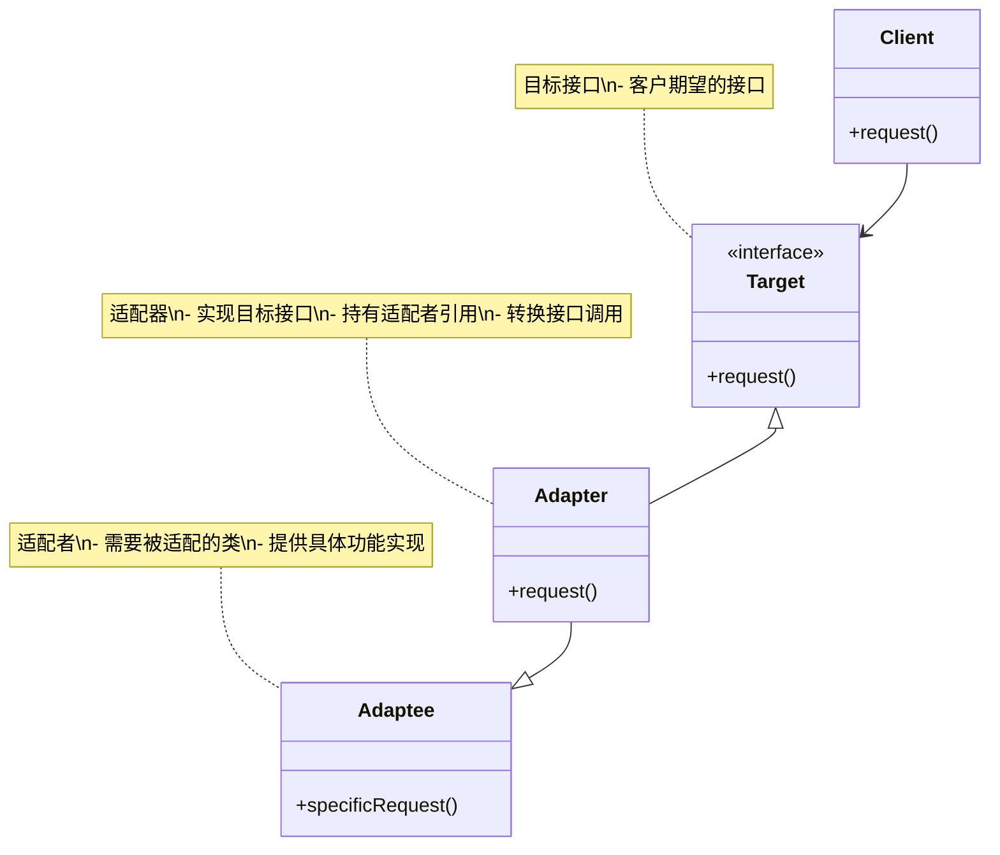
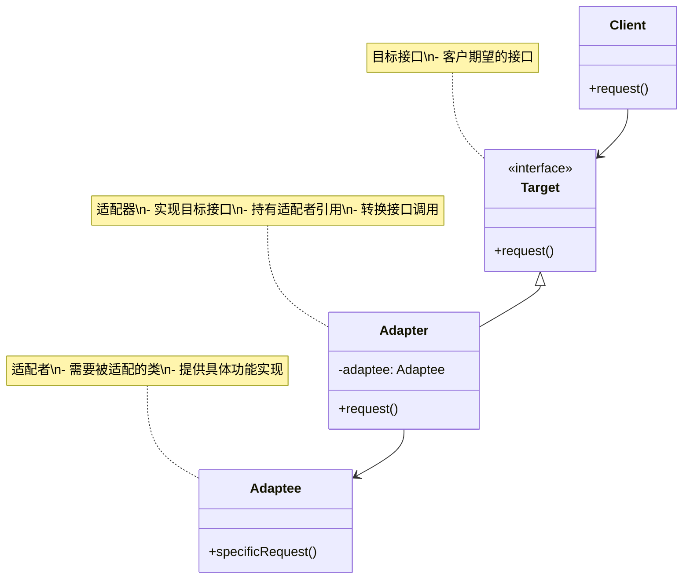
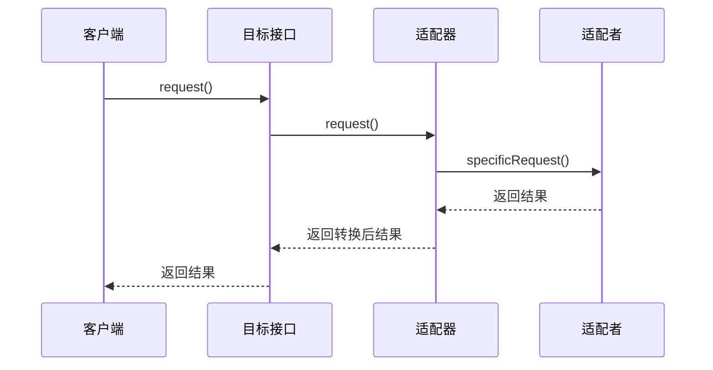
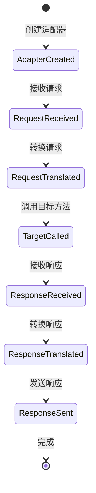

# 适配器模式 (Adapter Pattern) 详解

## 1. 模式定义

适配器模式是一种结构型设计模式，它允许不兼容的接口协同工作。适配器模式将一个类的接口转换成客户期望的另一个接口，使得原本由于接口不兼容而不能一起工作的类可以一起工作。

## 2. 模式动机

在软件开发中，我们经常遇到以下情况：

1. **遗留代码重用**：需要重用一些现有的类，但它们的接口不符合当前需求
2. **第三方库集成**：需要集成第三方库，但其接口与现有系统不兼容
3. **接口不匹配**：不同团队开发的组件接口不一致，无法直接集成
4. **系统扩展**：需要在不修改现有代码的情况下扩展系统功能

适配器模式通过创建一个适配器类来解决这些问题，该类实现了客户期望的接口，并将调用委托给现有的类。

## 3. UML 类图

### 3.1 类适配器



### 3.2 对象适配器



## 4. 角色分析

1. **Target（目标接口）**：客户期望的接口，适配器需要实现这个接口
2. **Adapter（适配器）**：实现目标接口，并持有对适配者的引用，负责将请求转换为适配者可以处理的调用
3. **Adaptee（适配者）**：需要被适配的类，提供具体的功能实现
4. **Client（客户端）**：使用目标接口的客户

## 5. 时序图

### 5.1 类适配器时序图



### 5.2 对象适配器时序图


## 6. 实现方式

### 6.1 类适配器实现

```java
// 目标接口
public interface MediaPlayer {
    void play(String audioType, String fileName);
}

// 适配者 - 已有的音频播放器
public class Mp3Player {
    public void playMp3(String fileName) {
        System.out.println("Playing MP3 file: " + fileName);
    }
}

// 适配者 - 已有的视频播放器
public class Mp4Player {
    public void playMp4(String fileName) {
        System.out.println("Playing MP4 file: " + fileName);
    }
    
    public void playVlc(String fileName) {
        System.out.println("Playing VLC file: " + fileName);
    }
}

// 类适配器 - 继承适配者并实现目标接口
public class Mp3Adapter extends Mp3Player implements MediaPlayer {
    @Override
    public void play(String audioType, String fileName) {
        if ("mp3".equalsIgnoreCase(audioType)) {
            playMp3(fileName);
        } else {
            System.out.println("Invalid media type: " + audioType);
        }
    }
}

// 类适配器 - 继承适配者并实现目标接口
public class VideoAdapter extends Mp4Player implements MediaPlayer {
    @Override
    public void play(String audioType, String fileName) {
        if ("mp4".equalsIgnoreCase(audioType)) {
            playMp4(fileName);
        } else if ("vlc".equalsIgnoreCase(audioType)) {
            playVlc(fileName);
        } else {
            System.out.println("Invalid media type: " + audioType);
        }
    }
}
```

### 6.2 对象适配器实现

```java
// 目标接口
public interface AdvancedMediaPlayer {
    void play(String audioType, String fileName);
}

// 适配者接口
public interface MediaPlayer {
    void play(String audioType, String fileName);
}

// 已有的音频播放器实现
public class VlcPlayer implements MediaPlayer {
    @Override
    public void play(String audioType, String fileName) {
        if ("vlc".equalsIgnoreCase(audioType)) {
            System.out.println("Playing VLC file: " + fileName);
        } else {
            System.out.println("Invalid media type: " + audioType);
        }
    }
}

public class Mp4Player implements MediaPlayer {
    @Override
    public void play(String audioType, String fileName) {
        if ("mp4".equalsIgnoreCase(audioType)) {
            System.out.println("Playing MP4 file: " + fileName);
        } else {
            System.out.println("Invalid media type: " + audioType);
        }
    }
}

// 对象适配器 - 持有适配者引用
public class MediaAdapter implements AdvancedMediaPlayer {
    private MediaPlayer mediaPlayer;
    
    public MediaAdapter(String audioType) {
        if ("vlc".equalsIgnoreCase(audioType)) {
            mediaPlayer = new VlcPlayer();
        } else if ("mp4".equalsIgnoreCase(audioType)) {
            mediaPlayer = new Mp4Player();
        }
    }
    
    @Override
    public void play(String audioType, String fileName) {
        if (mediaPlayer != null) {
            mediaPlayer.play(audioType, fileName);
        } else {
            System.out.println("Unsupported media type: " + audioType);
        }
    }
}
```

### 6.3 双向适配器实现

```java
// 目标接口1
public interface Shape {
    void draw();
    void resize();
}

// 目标接口2
public interface GeometricShape {
    void render();
    void scale(double factor);
}

// 适配者
public class Rectangle {
    private int width;
    private int height;
    
    public Rectangle(int width, int height) {
        this.width = width;
        this.height = height;
    }
    
    public void display() {
        System.out.println("Displaying rectangle: " + width + "x" + height);
    }
    
    public void changeSize(int width, int height) {
        this.width = width;
        this.height = height;
        System.out.println("Resizing rectangle to: " + width + "x" + height);
    }
}

// 双向适配器
public class ShapeAdapter implements Shape, GeometricShape {
    private Rectangle rectangle;
    
    public ShapeAdapter(Rectangle rectangle) {
        this.rectangle = rectangle;
    }
    
    // 实现Shape接口
    @Override
    public void draw() {
        rectangle.display();
    }
    
    @Override
    public void resize() {
        // 假设调整为100x50
        rectangle.changeSize(100, 50);
    }
    
    // 实现GeometricShape接口
    @Override
    public void render() {
        rectangle.display();
    }
    
    @Override
    public void scale(double factor) {
        // 简化实现
        System.out.println("Scaling rectangle by factor: " + factor);
    }
}
```

### 6.4 接口适配器实现

```java
// 定义一个包含多个方法的复杂接口
public interface DatabaseOperations {
    void connect();
    void disconnect();
    void executeQuery(String sql);
    void executeUpdate(String sql);
    void beginTransaction();
    void commit();
    void rollback();
    void createIndex(String tableName, String columnName);
    void dropIndex(String tableName, String columnName);
}

// 接口适配器 - 提供默认实现
public abstract class DatabaseAdapter implements DatabaseOperations {
    @Override
    public void connect() {
        // 默认实现
        System.out.println("Connecting to database...");
    }
    
    @Override
    public void disconnect() {
        // 默认实现
        System.out.println("Disconnecting from database...");
    }
    
    @Override
    public void executeQuery(String sql) {
        // 默认实现
        System.out.println("Executing query: " + sql);
    }
    
    @Override
    public void executeUpdate(String sql) {
        // 默认实现
        System.out.println("Executing update: " + sql);
    }
    
    @Override
    public void beginTransaction() {
        // 默认实现
        System.out.println("Beginning transaction...");
    }
    
    @Override
    public void commit() {
        // 默认实现
        System.out.println("Committing transaction...");
    }
    
    @Override
    public void rollback() {
        // 默认实现
        System.out.println("Rolling back transaction...");
    }
    
    @Override
    public void createIndex(String tableName, String columnName) {
        // 默认实现
        System.out.println("Creating index on " + tableName + "." + columnName);
    }
    
    @Override
    public void dropIndex(String tableName, String columnName) {
        // 默认实现
        System.out.println("Dropping index on " + tableName + "." + columnName);
    }
}

// 具体实现类 - 只需要重写需要的方法
public class SimpleDatabase extends DatabaseAdapter {
    @Override
    public void connect() {
        System.out.println("Simple database connecting...");
    }
    
    @Override
    public void executeQuery(String sql) {
        System.out.println("Simple database executing query: " + sql);
    }
    
    @Override
    public void executeUpdate(String sql) {
        System.out.println("Simple database executing update: " + sql);
    }
}
```

## 7. 状态图



## 8. 实际应用场景

1. **系统集成**：集成不同厂商的系统或组件
2. **遗留代码重用**：在不修改现有代码的情况下重用遗留组件
3. **第三方库适配**：适配第三方库的接口到现有系统
4. **跨平台兼容**：适配不同操作系统的API差异
5. **版本兼容**：适配不同版本的API变化
6. **数据格式转换**：在不同数据格式之间进行转换
7. **协议适配**：适配不同的通信协议
8. **UI组件适配**：适配不同UI框架的组件

## 9. 常见问题及解决方案

### 9.1 性能问题

**问题**：适配器模式可能引入额外的调用开销，影响性能

**解决方案**：
1. 优化适配器内部的转换逻辑
2. 使用缓存机制减少重复转换
3. 在性能关键路径上避免不必要的适配

### 9.2 复杂性增加

**问题**：过度使用适配器模式会增加系统复杂性

**解决方案**：
1. 仅在必要时使用适配器模式
2. 合理设计适配器层次结构
3. 提供清晰的文档说明适配器的用途

### 9.3 维护困难

**问题**：适配器代码可能难以维护和理解

**解决方案**：
1. 编写详细的注释说明适配逻辑
2. 保持适配器代码的简洁性
3. 定期重构和优化适配器实现

### 9.4 接口膨胀

**问题**：适配器可能需要实现大量方法

**解决方案**：
1. 使用接口适配器提供默认实现
2. 将大接口拆分为多个小接口
3. 使用组合而非继承来减少接口数量

## 10. 与其他模式的关系

1. **与桥接模式**：适配器模式用于连接不同的接口，而桥接模式用于分离抽象和实现
2. **与装饰器模式**：适配器模式改变接口，装饰器模式增强功能
3. **与外观模式**：适配器模式转换接口，外观模式简化接口
4. **与代理模式**：适配器模式用于接口转换，代理模式用于控制访问

## 11. 优缺点分析

### 11.1 优点

1. **单一职责原则**：适配器将接口转换逻辑封装在单独的类中
2. **开闭原则**：可以在不修改现有代码的情况下引入适配器
3. **灵活性**：可以适配多个不同的接口
4. **复用性**：可以复用现有的类而无需修改它们
5. **透明性**：客户端无需知道适配器的存在

### 11.2 缺点

1. **复杂性**：增加了额外的类和对象
2. **性能开销**：可能引入额外的调用开销
3. **理解困难**：代码的可读性可能降低
4. **维护成本**：需要维护适配器代码

## 12. 最佳实践

1. **合理使用**：仅在确实需要接口转换时使用适配器模式
2. **保持简单**：适配器应该尽量简单，避免复杂的转换逻辑
3. **文档说明**：清楚地说明适配器的用途和转换规则
4. **测试覆盖**：确保适配器的各种转换场景都有测试覆盖
5. **性能考虑**：在性能敏感的场景中优化适配器实现

## 13. 代码示例场景

以一个媒体播放器系统为例，说明适配器模式的使用：

```java
// 媒体播放器接口
public interface MediaPlayer {
    void play(String audioType, String fileName);
}

// 高级媒体播放器接口
public interface AdvancedMediaPlayer {
    void playVlc(String fileName);
    void playMp4(String fileName);
}

// VLC播放器实现
public class VlcPlayer implements AdvancedMediaPlayer {
    @Override
    public void playVlc(String fileName) {
        System.out.println("Playing VLC file: " + fileName);
    }
    
    @Override
    public void playMp4(String fileName) {
        // VLC播放器不支持MP4
        System.out.println("VLC player cannot play MP4 files");
    }
}

// MP4播放器实现
public class Mp4Player implements AdvancedMediaPlayer {
    @Override
    public void playVlc(String fileName) {
        // MP4播放器不支持VLC
        System.out.println("MP4 player cannot play VLC files");
    }
    
    @Override
    public void playMp4(String fileName) {
        System.out.println("Playing MP4 file: " + fileName);
    }
}

// 媒体适配器
public class MediaAdapter implements MediaPlayer {
    private AdvancedMediaPlayer advancedMediaPlayer;
    
    public MediaAdapter(String audioType) {
        if ("vlc".equalsIgnoreCase(audioType)) {
            advancedMediaPlayer = new VlcPlayer();
        } else if ("mp4".equalsIgnoreCase(audioType)) {
            advancedMediaPlayer = new Mp4Player();
        }
    }
    
    @Override
    public void play(String audioType, String fileName) {
        if ("vlc".equalsIgnoreCase(audioType)) {
            advancedMediaPlayer.playVlc(fileName);
        } else if ("mp4".equalsIgnoreCase(audioType)) {
            advancedMediaPlayer.playMp4(fileName);
        }
    }
}

// 音频播放器
public class AudioPlayer implements MediaPlayer {
    private MediaAdapter mediaAdapter;
    
    @Override
    public void play(String audioType, String fileName) {
        // 内置支持MP3播放
        if ("mp3".equalsIgnoreCase(audioType)) {
            System.out.println("Playing MP3 file: " + fileName);
        }
        // 支持高级媒体类型
        else if ("vlc".equalsIgnoreCase(audioType) || "mp4".equalsIgnoreCase(audioType)) {
            mediaAdapter = new MediaAdapter(audioType);
            mediaAdapter.play(audioType, fileName);
        } else {
            System.out.println("Invalid media type: " + audioType);
        }
    }
}

// 客户端使用示例
public class MediaPlayerDemo {
    public static void main(String[] args) {
        AudioPlayer audioPlayer = new AudioPlayer();
        
        audioPlayer.play("mp3", "song.mp3");
        audioPlayer.play("mp4", "movie.mp4");
        audioPlayer.play("vlc", "video.vlc");
        audioPlayer.play("avi", "clip.avi");
    }
}
```

## 14. 总结

适配器模式是一种非常实用的结构型设计模式，它通过创建适配器类来解决接口不兼容的问题。虽然会增加系统的复杂性，但在需要集成不同接口的场景下，适配器模式提供了优雅的解决方案。

在实际应用中，应该根据具体需求选择合适的适配器实现方式（类适配器或对象适配器），并注意避免过度使用适配器模式导致系统复杂性增加。适配器模式特别适用于以下场景：

1. 需要集成不兼容的接口
2. 需要重用现有的类而不能修改其源代码
3. 需要在不破坏现有代码的情况下扩展系统功能
4. 需要适配第三方库的接口

通过合理使用适配器模式，可以提高系统的灵活性和可维护性，同时保持代码的清晰性和可读性。