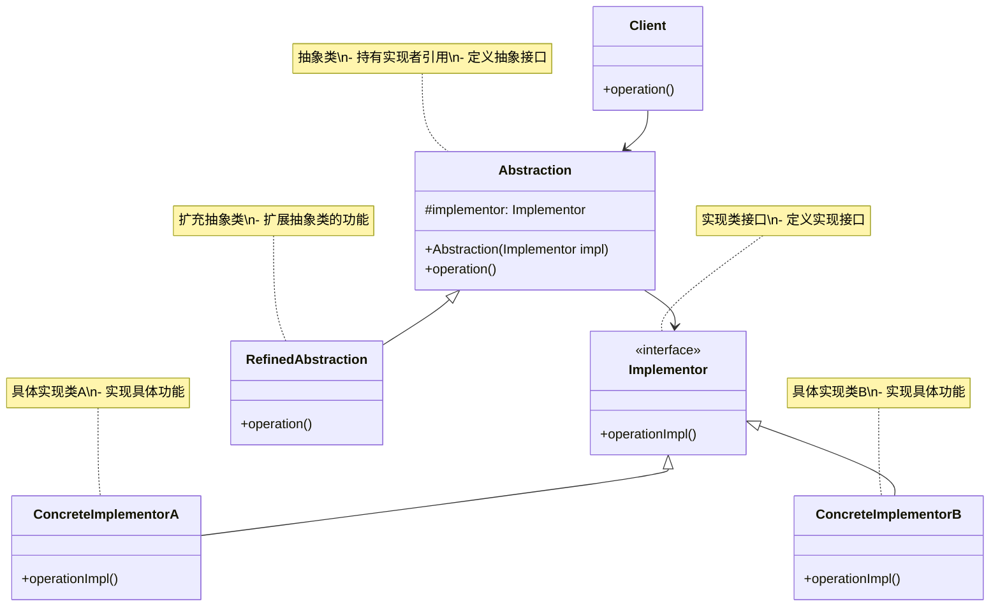
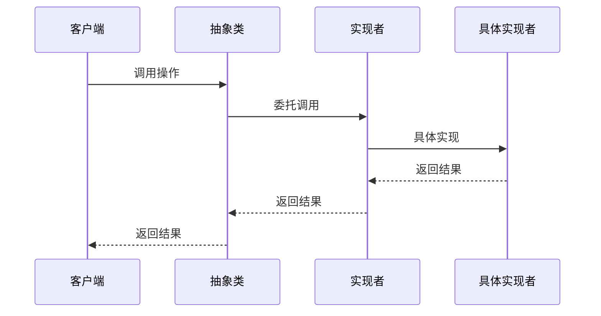
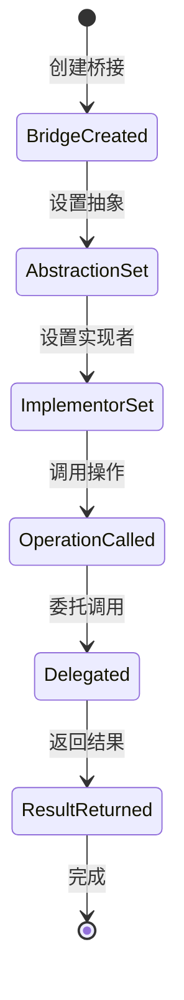

# 桥接模式 (Bridge Pattern) 详解

## 1. 模式定义

桥接模式是一种结构型设计模式，它将抽象部分与实现部分分离，使它们可以独立变化。桥接模式通过组合关系代替继承关系，降低了抽象和实现这两个可变维度的耦合度。

## 2. 模式动机

在软件开发中，我们经常遇到以下情况：

1. **类爆炸问题**：当一个类存在两个独立变化的维度时，使用继承会导致类的数量急剧增加
2. **紧耦合问题**：抽象和实现紧密耦合，难以独立扩展和修改
3. **维护困难**：类层次结构复杂，难以理解和维护
4. **扩展性差**：新增功能需要修改大量现有代码

桥接模式通过将抽象部分和实现部分分离，使用组合关系代替继承关系，解决了这些问题。

## 3. UML 类图



## 4. 角色分析

1. **Abstraction（抽象类）**：定义抽象接口，维护一个指向Implementor类型对象的引用
2. **RefinedAbstraction（扩充抽象类）**：扩充由Abstraction定义的接口
3. **Implementor（实现类接口）**：定义实现类的接口，该接口不一定要与Abstraction的接口完全一致
4. **ConcreteImplementor（具体实现类）**：实现Implementor接口并定义它的具体实现

## 5. 时序图



## 6. 实现方式

### 6.1 基本实现

```java
// 实现类接口
public interface DrawingAPI {
    void drawCircle(double x, double y, double radius);
}

// 具体实现类A
public class DrawingAPI1 implements DrawingAPI {
    @Override
    public void drawCircle(double x, double y, double radius) {
        System.out.println("API1.circle at (" + x + "," + y + ") with radius " + radius);
    }
}

// 具体实现类B
public class DrawingAPI2 implements DrawingAPI {
    @Override
    public void drawCircle(double x, double y, double radius) {
        System.out.println("API2.circle at (" + x + "," + y + ") with radius " + radius);
    }
}

// 抽象类
public abstract class Shape {
    protected DrawingAPI drawingAPI;
    
    protected Shape(DrawingAPI drawingAPI) {
        this.drawingAPI = drawingAPI;
    }
    
    public abstract void draw();
    public abstract void resizeByPercentage(double pct);
}

// 扩充抽象类
public class CircleShape extends Shape {
    private double x, y, radius;
    
    public CircleShape(double x, double y, double radius, DrawingAPI drawingAPI) {
        super(drawingAPI);
        this.x = x;
        this.y = y;
        this.radius = radius;
    }
    
    @Override
    public void draw() {
        drawingAPI.drawCircle(x, y, radius);
    }
    
    @Override
    public void resizeByPercentage(double pct) {
        radius *= pct;
    }
}
```

### 6.2 复杂实现

```java
// 颜色接口 - 另一个维度的变化
public interface Color {
    void applyColor();
}

// 具体颜色实现
public class Red implements Color {
    @Override
    public void applyColor() {
        System.out.println("Applying red color");
    }
}

public class Blue implements Color {
    @Override
    public void applyColor() {
        System.out.println("Applying blue color");
    }
}

// 形状抽象类
public abstract class Shape {
    protected DrawingAPI drawingAPI;
    protected Color color;
    
    protected Shape(DrawingAPI drawingAPI, Color color) {
        this.drawingAPI = drawingAPI;
        this.color = color;
    }
    
    public abstract void draw();
    public abstract void resizeByPercentage(double pct);
    public abstract void paint();
}

// 圆形
public class Circle extends Shape {
    private double x, y, radius;
    
    public Circle(double x, double y, double radius, DrawingAPI drawingAPI, Color color) {
        super(drawingAPI, color);
        this.x = x;
        this.y = y;
        this.radius = radius;
    }
    
    @Override
    public void draw() {
        drawingAPI.drawCircle(x, y, radius);
    }
    
    @Override
    public void resizeByPercentage(double pct) {
        radius *= pct;
    }
    
    @Override
    public void paint() {
        color.applyColor();
    }
}

// 矩形
public class Rectangle extends Shape {
    private double x, y, width, height;
    
    public Rectangle(double x, double y, double width, double height, DrawingAPI drawingAPI, Color color) {
        super(drawingAPI, color);
        this.x = x;
        this.y = y;
        this.width = width;
        this.height = height;
    }
    
    @Override
    public void draw() {
        System.out.println("Drawing rectangle at (" + x + "," + y + ") with width " + width + " and height " + height);
        drawingAPI.drawCircle(x, y, Math.min(width, height) / 2); // 简化实现
    }
    
    @Override
    public void resizeByPercentage(double pct) {
        width *= pct;
        height *= pct;
    }
    
    @Override
    public void paint() {
        color.applyColor();
    }
}
```

### 6.3 设备控制系统实现

```java
// 设备接口
public interface Device {
    boolean isEnabled();
    void enable();
    void disable();
    int getVolume();
    void setVolume(int percent);
    int getChannel();
    void setChannel(int channel);
    void printStatus();
}

// 电视机实现
public class Tv implements Device {
    private boolean on = false;
    private int volume = 30;
    private int channel = 1;
    
    @Override
    public boolean isEnabled() {
        return on;
    }
    
    @Override
    public void enable() {
        on = true;
    }
    
    @Override
    public void disable() {
        on = false;
    }
    
    @Override
    public int getVolume() {
        return volume;
    }
    
    @Override
    public void setVolume(int percent) {
        if (percent > 100) {
            volume = 100;
        } else if (percent < 0) {
            volume = 0;
        } else {
            volume = percent;
        }
    }
    
    @Override
    public int getChannel() {
        return channel;
    }
    
    @Override
    public void setChannel(int channel) {
        this.channel = channel;
    }
    
    @Override
    public void printStatus() {
        System.out.println("------------------------------------");
        System.out.println("| I'm TV set.");
        System.out.println("| I'm " + (on ? "enabled" : "disabled"));
        System.out.println("| Current volume is " + volume + "%");
        System.out.println("| Current channel is " + channel);
        System.out.println("------------------------------------\n");
    }
}

// 收音机实现
public class Radio implements Device {
    private boolean on = false;
    private int volume = 30;
    private int channel = 1;
    
    @Override
    public boolean isEnabled() {
        return on;
    }
    
    @Override
    public void enable() {
        on = true;
    }
    
    @Override
    public void disable() {
        on = false;
    }
    
    @Override
    public int getVolume() {
        return volume;
    }
    
    @Override
    public void setVolume(int percent) {
        if (percent > 100) {
            volume = 100;
        } else if (percent < 0) {
            volume = 0;
        } else {
            volume = percent;
        }
    }
    
    @Override
    public int getChannel() {
        return channel;
    }
    
    @Override
    public void setChannel(int channel) {
        this.channel = channel;
    }
    
    @Override
    public void printStatus() {
        System.out.println("------------------------------------");
        System.out.println("| I'm radio.");
        System.out.println("| I'm " + (on ? "enabled" : "disabled"));
        System.out.println("| Current volume is " + volume + "%");
        System.out.println("| Current channel is " + channel);
        System.out.println("------------------------------------\n");
    }
}

// 遥控器抽象类
public abstract class RemoteControl {
    protected Device device;
    
    protected RemoteControl(Device device) {
        this.device = device;
    }
    
    public void togglePower() {
        if (device.isEnabled()) {
            device.disable();
        } else {
            device.enable();
        }
    }
    
    public void volumeDown() {
        device.setVolume(device.getVolume() - 10);
    }
    
    public void volumeUp() {
        device.setVolume(device.getVolume() + 10);
    }
    
    public void channelDown() {
        device.setChannel(device.getChannel() - 1);
    }
    
    public void channelUp() {
        device.setChannel(device.getChannel() + 1);
    }
    
    public abstract void mute();
}

// 基本遥控器
public class BasicRemote extends RemoteControl {
    public BasicRemote(Device device) {
        super(device);
    }
    
    @Override
    public void mute() {
        device.setVolume(0);
    }
}

// 高级遥控器
public class AdvancedRemote extends RemoteControl {
    public AdvancedRemote(Device device) {
        super(device);
    }
    
    @Override
    public void mute() {
        device.setVolume(0);
    }
    
    public void setChannel(int channel) {
        device.setChannel(channel);
    }
}
```

## 7. 状态图



## 8. 实际应用场景

1. **图形界面库**：不同的UI组件在不同操作系统上的实现
2. **数据库驱动**：同一套API接口适配不同的数据库实现
3. **消息系统**：不同的消息格式适配不同的传输协议
4. **游戏开发**：不同的游戏逻辑适配不同的渲染引擎
5. **支付系统**：不同的支付接口适配不同的支付渠道
6. **日志系统**：不同的日志格式适配不同的存储方式
7. **设备控制**：不同的遥控器适配不同的设备
8. **文件系统**：不同的文件操作适配不同的存储介质

## 9. 常见问题及解决方案

### 9.1 性能问题

**问题**：桥接模式可能引入额外的间接调用开销

**解决方案**：
1. 优化委托调用逻辑
2. 使用缓存机制减少重复调用
3. 在性能关键路径上避免不必要的桥接

### 9.2 复杂性增加

**问题**：过度使用桥接模式会增加系统复杂性

**解决方案**：
1. 仅在确实需要分离抽象和实现时使用桥接模式
2. 合理设计桥接层次结构
3. 提供清晰的文档说明桥接关系

### 9.3 设计困难

**问题**：正确识别和分离抽象与实现维度较为困难

**解决方案**：
1. 仔细分析系统中的变化维度
2. 寻找稳定的抽象和易变的实现
3. 使用领域驱动设计方法识别核心概念

### 9.4 维护成本

**问题**：桥接模式的维护成本较高

**解决方案**：
1. 编写详细的注释说明桥接关系
2. 保持桥接代码的简洁性
3. 定期重构和优化桥接实现

## 10. 与其他模式的关系

1. **与适配器模式**：桥接模式用于分离抽象和实现，适配器模式用于接口转换
2. **与装饰器模式**：桥接模式分离维度，装饰器模式增强功能
3. **与组合模式**：桥接模式处理维度分离，组合模式处理树形结构
4. **与策略模式**：桥接模式分离抽象和实现，策略模式定义算法族

## 11. 优缺点分析

### 11.1 优点

1. **分离抽象和实现**：抽象和实现可以独立变化和扩展
2. **提高可扩展性**：可以独立地扩展抽象和实现维度
3. **隐藏实现细节**：客户端不需要知道实现的细节
4. **符合开闭原则**：对扩展开放，对修改封闭
5. **符合单一职责原则**：抽象和实现各司其职

### 11.2 缺点

1. **增加复杂性**：增加了系统的理解和设计复杂度
2. **性能开销**：可能引入额外的间接调用开销
3. **设计难度**：正确识别和分离维度需要经验
4. **维护成本**：需要维护更多的类和接口

## 12. 最佳实践

1. **合理使用**：仅在需要分离抽象和实现维度时使用桥接模式
2. **正确识别维度**：仔细分析系统中独立变化的维度
3. **保持简单**：桥接结构应该尽量简单，避免过度设计
4. **文档说明**：清楚地说明桥接关系和各部分职责
5. **测试覆盖**：确保桥接的各种组合场景都有测试覆盖

## 13. 代码示例场景

以一个图形绘制系统为例，说明桥接模式的使用：

```java
// 绘制API接口
public interface DrawAPI {
    void drawCircle(int radius, int x, int y);
    void drawRectangle(int width, int height, int x, int y);
}

// Windows绘制实现
public class WindowsDrawAPI implements DrawAPI {
    @Override
    public void drawCircle(int radius, int x, int y) {
        System.out.println("Windows: Drawing Circle[ radius: " + radius + ", x: " + x + ", y: " + y + "]");
    }
    
    @Override
    public void drawRectangle(int width, int height, int x, int y) {
        System.out.println("Windows: Drawing Rectangle[ width: " + width + ", height: " + height + ", x: " + x + ", y: " + y + "]");
    }
}

// Linux绘制实现
public class LinuxDrawAPI implements DrawAPI {
    @Override
    public void drawCircle(int radius, int x, int y) {
        System.out.println("Linux: Drawing Circle[ radius: " + radius + ", x: " + x + ", y: " + y + "]");
    }
    
    @Override
    public void drawRectangle(int width, int height, int x, int y) {
        System.out.println("Linux: Drawing Rectangle[ width: " + width + ", height: " + height + ", x: " + x + ", y: " + y + "]");
    }
}

// Mac绘制实现
public class MacDrawAPI implements DrawAPI {
    @Override
    public void drawCircle(int radius, int x, int y) {
        System.out.println("Mac: Drawing Circle[ radius: " + radius + ", x: " + x + ", y: " + y + "]");
    }
    
    @Override
    public void drawRectangle(int width, int height, int x, int y) {
        System.out.println("Mac: Drawing Rectangle[ width: " + width + ", height: " + height + ", x: " + x + ", y: " + y + "]");
    }
}

// 形状抽象类
public abstract class Shape {
    protected DrawAPI drawAPI;
    
    protected Shape(DrawAPI drawAPI) {
        this.drawAPI = drawAPI;
    }
    
    public abstract void draw();
}

// 圆形
public class Circle extends Shape {
    private int x, y, radius;
    
    public Circle(int x, int y, int radius, DrawAPI drawAPI) {
        super(drawAPI);
        this.x = x;
        this.y = y;
        this.radius = radius;
    }
    
    @Override
    public void draw() {
        drawAPI.drawCircle(radius, x, y);
    }
}

// 矩形
public class Rectangle extends Shape {
    private int x, y, width, height;
    
    public Rectangle(int x, int y, int width, int height, DrawAPI drawAPI) {
        super(drawAPI);
        this.x = x;
        this.y = y;
        this.width = width;
        this.height = height;
    }
    
    @Override
    public void draw() {
        drawAPI.drawRectangle(width, height, x, y);
    }
}

// 客户端使用示例
public class BridgePatternDemo {
    public static void main(String[] args) {
        // Windows平台上的图形
        Shape redCircle = new Circle(100, 100, 10, new WindowsDrawAPI());
        Shape greenRectangle = new Rectangle(10, 20, 100, 200, new WindowsDrawAPI());
        
        redCircle.draw();
        greenRectangle.draw();
        
        System.out.println();
        
        // Linux平台上的图形
        Shape blueCircle = new Circle(50, 50, 5, new LinuxDrawAPI());
        Shape yellowRectangle = new Rectangle(15, 25, 150, 250, new LinuxDrawAPI());
        
        blueCircle.draw();
        yellowRectangle.draw();
        
        System.out.println();
        
        // Mac平台上的图形
        Shape purpleCircle = new Circle(75, 75, 7, new MacDrawAPI());
        Shape orangeRectangle = new Rectangle(12, 22, 120, 220, new MacDrawAPI());
        
        purpleCircle.draw();
        orangeRectangle.draw();
    }
}
```

## 14. 总结

桥接模式是一种非常实用的结构型设计模式，它通过将抽象部分与实现部分分离，使它们可以独立变化。虽然会增加系统的复杂性，但在需要处理多个独立变化维度的场景下，桥接模式提供了优雅的解决方案。

在实际应用中，应该根据具体需求正确识别和分离抽象与实现维度，避免过度使用桥接模式导致系统复杂性增加。桥接模式特别适用于以下场景：

1. 不希望在抽象和实现之间形成固定的绑定关系
2. 抽象和实现部分都可以通过继承方式独立扩展
3. 对抽象的实现部分的改动不会影响客户端代码
4. 想要在多个对象间共享实现，但同时要求客户端不知道这一点

通过合理使用桥接模式，可以提高系统的灵活性和可维护性，同时保持代码的清晰性和可扩展性。