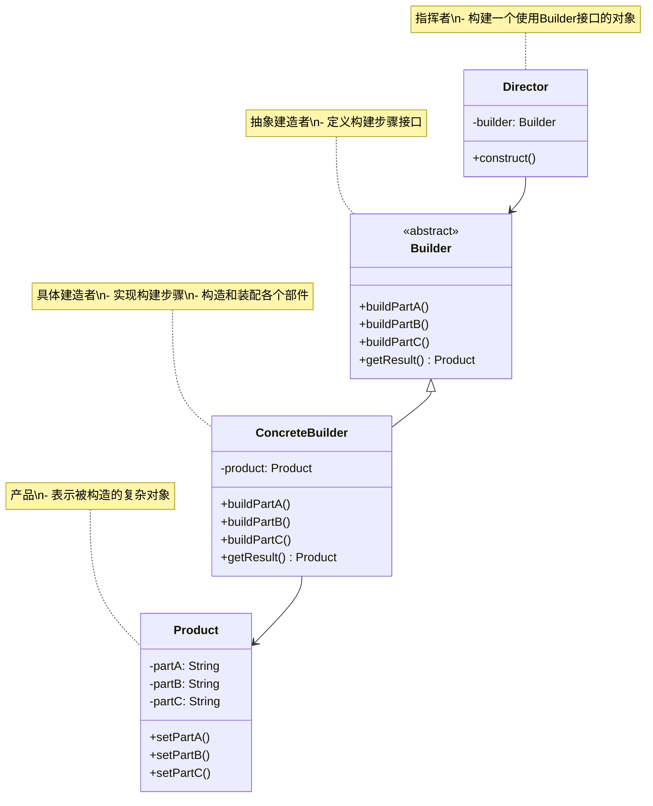
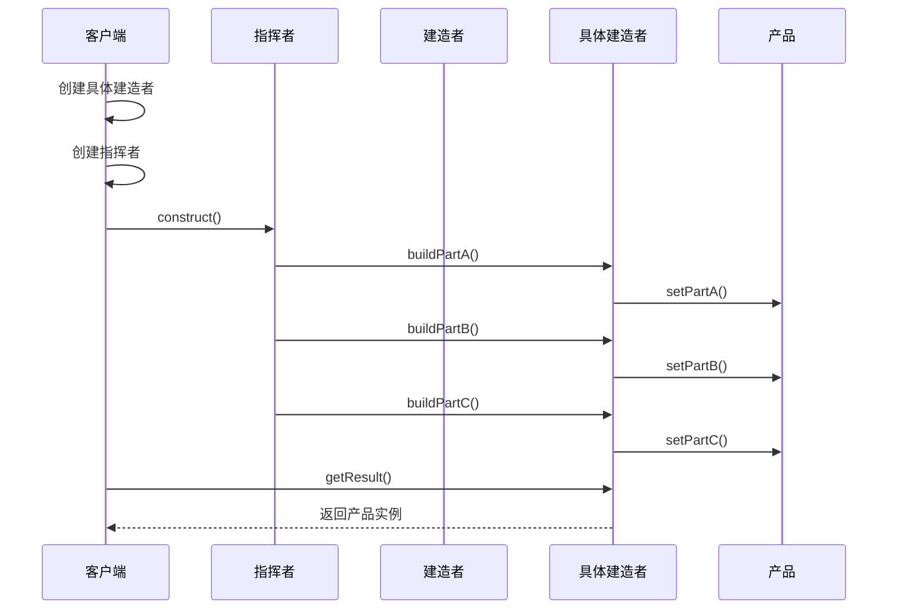
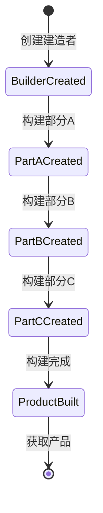

# 建造者模式 (Builder Pattern) 详解

## 1. 模式定义

建造者模式是一种创建型设计模式，它将一个复杂对象的构建与它的表示分离，使得同样的构建过程可以创建不同的表示。

## 2. 模式动机

在软件开发中，我们经常需要创建复杂的对象，这些对象可能包含多个组成部分，且创建过程较为复杂。如果直接使用构造函数或工厂方法来创建这些对象，可能会导致以下问题：

1. 构造函数参数过多，难以理解和使用
2. 参数列表过长，容易传错参数
3. 需要创建多个重载的构造函数
4. 对象的创建过程和表示耦合在一起

建造者模式通过将复杂的构建过程分解为多个步骤，并使用不同的建造者来实现这些步骤，从而解决了这些问题。

## 3. UML 类图



## 4. 角色分析

1. **Builder（抽象建造者）**：定义创建产品各个部分的接口
2. **ConcreteBuilder（具体建造者）**：实现Builder接口，构造和装配各个部件
3. **Director（指挥者）**：构造一个使用Builder接口的对象
4. **Product（产品）**：表示被构造的复杂对象

## 5. 时序图

### 5.1 基本时序图



## 6. 实现方式

### 6.1 基本实现

```java
// 产品类
public class Product {
    private String partA;
    private String partB;
    private String partC;
    
    public void setPartA(String partA) {
        this.partA = partA;
    }
    
    public void setPartB(String partB) {
        this.partB = partB;
    }
    
    public void setPartC(String partC) {
        this.partC = partC;
    }
    
    @Override
    public String toString() {
        return "Product{" +
                "partA='" + partA + '\'' +
                ", partB='" + partB + '\'' +
                ", partC='" + partC + '\'' +
                '}';
    }
}

// 抽象建造者
public abstract class Builder {
    public abstract void buildPartA();
    public abstract void buildPartB();
    public abstract void buildPartC();
    public abstract Product getResult();
}

// 具体建造者
public class ConcreteBuilder extends Builder {
    private Product product = new Product();
    
    @Override
    public void buildPartA() {
        product.setPartA("PartA");
    }
    
    @Override
    public void buildPartB() {
        product.setPartB("PartB");
    }
    
    @Override
    public void buildPartC() {
        product.setPartC("PartC");
    }
    
    @Override
    public Product getResult() {
        return product;
    }
}

// 指挥者
public class Director {
    private Builder builder;
    
    public Director(Builder builder) {
        this.builder = builder;
    }
    
    public void construct() {
        builder.buildPartA();
        builder.buildPartB();
        builder.buildPartC();
    }
}
```

### 6.2 流式建造者实现

```java
// 流式建造者
public class FluentBuilder {
    private Product product = new Product();
    
    public FluentBuilder buildPartA(String partA) {
        product.setPartA(partA);
        return this;
    }
    
    public FluentBuilder buildPartB(String partB) {
        product.setPartB(partB);
        return this;
    }
    
    public FluentBuilder buildPartC(String partC) {
        product.setPartC(partC);
        return this;
    }
    
    public Product build() {
        return product;
    }
}
```

### 6.3 带约束的建造者实现

```java
// 带约束的建造者
public class ConstrainedBuilder {
    private Product product = new Product();
    private boolean partASet = false;
    private boolean partBSet = false;
    
    public ConstrainedBuilder buildPartA(String partA) {
        product.setPartA(partA);
        partASet = true;
        return this;
    }
    
    public ConstrainedBuilder buildPartB(String partB) {
        product.setPartB(partB);
        partBSet = true;
        return this;
    }
    
    public ConstrainedBuilder buildPartC(String partC) {
        product.setPartC(partC);
        return this;
    }
    
    public Product build() {
        if (!partASet || !partBSet) {
            throw new IllegalStateException("必须先设置PartA和PartB");
        }
        return product;
    }
}
```

## 7. 状态图



## 8. 实际应用场景

1. **复杂对象的创建**：如汽车、房屋等复杂产品的构建
2. **GUI组件的创建**：创建复杂的用户界面组件
3. **文档生成**：生成RTF文档、HTML文档等
4. **SQL查询构建**：构建复杂的SQL查询语句
5. **配置对象的创建**：创建具有多个配置项的复杂配置对象
6. **API请求构建**：构建复杂的HTTP请求对象

## 9. 常见问题及解决方案

### 9.1 建造步骤固定

**问题**：建造步骤是固定的，不够灵活

**解决方案**：
1. 使用流式建造者模式
2. 提供可选的建造步骤
3. 使用策略模式动态决定建造步骤

### 9.2 产品类型单一

**问题**：只能创建一种类型的产品

**解决方案**：
1. 使用泛型建造者
2. 创建多个具体建造者
3. 使用抽象工厂模式结合建造者模式

### 9.3 建造过程复杂

**问题**：建造过程过于复杂，难以维护

**解决方案**：
1. 将复杂步骤分解为子步骤
2. 使用模板方法模式
3. 引入中间构建对象

## 10. 与其他模式的关系

1. **与抽象工厂模式**：建造者模式关注复杂对象的构建过程，而抽象工厂模式关注产品族的创建
2. **与模板方法模式**：建造者模式中的建造步骤可以使用模板方法模式来实现
3. **与组合模式**：建造者模式可以与组合模式结合使用来创建树形结构的对象

## 11. 优缺点分析

### 11.1 优点

1. **良好的封装性**：客户端不需要知道产品内部组成的细节
2. **建造者独立**：具体的建造者类之间相互独立，便于扩展
3. **便于控制细节风险**：建造者可以对创建过程逐步细化，而不影响其他模块
4. **产品内部结构复杂时更适用**：当产品的内部结构复杂时，建造者模式可以很好地隐藏创建细节

### 11.2 缺点

1. **产品必须有共同点**：产品必须有共同点，建造者模式的各个部分需要能够组装到一起
2. **建造者模式创建的产品一般具有较多的共同点**：如果产品的差异性很大，则不适合使用建造者模式
3. **如果产品的内部变化复杂**：可能会导致需要定义很多具体建造者类来实现这种变化，导致系统变得很庞大

## 12. 最佳实践

1. **合理使用**：只有在需要创建复杂对象时才使用建造者模式
2. **步骤设计**：合理设计建造步骤，确保步骤的独立性和可组合性
3. **约束检查**：在必要时添加约束检查，确保产品的完整性
4. **流式接口**：考虑使用流式接口提高可用性
5. **文档说明**：详细说明每个建造步骤的作用和使用方法

## 13. 代码示例场景

以一个计算机配置系统的例子来说明建造者模式的使用：

```java
// 计算机产品类
public class Computer {
    private String cpu;
    private String memory;
    private String storage;
    private String graphicsCard;
    private String motherboard;
    
    // 构造函数、getter、setter方法省略...
    
    @Override
    public String toString() {
        return "Computer{" +
                "cpu='" + cpu + '\'' +
                ", memory='" + memory + '\'' +
                ", storage='" + storage + '\'' +
                ", graphicsCard='" + graphicsCard + '\'' +
                ", motherboard='" + motherboard + '\'' +
                '}';
    }
}

// 计算机建造者接口
public interface ComputerBuilder {
    ComputerBuilder buildCPU(String cpu);
    ComputerBuilder buildMemory(String memory);
    ComputerBuilder buildStorage(String storage);
    ComputerBuilder buildGraphicsCard(String graphicsCard);
    ComputerBuilder buildMotherboard(String motherboard);
    Computer build();
}

// 具体计算机建造者
public class ConcreteComputerBuilder implements ComputerBuilder {
    private Computer computer = new Computer();
    
    @Override
    public ComputerBuilder buildCPU(String cpu) {
        computer.setCpu(cpu);
        return this;
    }
    
    @Override
    public ComputerBuilder buildMemory(String memory) {
        computer.setMemory(memory);
        return this;
    }
    
    @Override
    public ComputerBuilder buildStorage(String storage) {
        computer.setStorage(storage);
        return this;
    }
    
    @Override
    public ComputerBuilder buildGraphicsCard(String graphicsCard) {
        computer.setGraphicsCard(graphicsCard);
        return this;
    }
    
    @Override
    public ComputerBuilder buildMotherboard(String motherboard) {
        computer.setMotherboard(motherboard);
        return this;
    }
    
    @Override
    public Computer build() {
        return computer;
    }
}

// 计算机指挥者
public class ComputerDirector {
    public Computer buildGamingComputer(ComputerBuilder builder) {
        return builder
                .buildCPU("Intel i9-12900K")
                .buildMemory("32GB DDR4")
                .buildStorage("1TB NVMe SSD")
                .buildGraphicsCard("NVIDIA RTX 3080")
                .buildMotherboard("ASUS ROG Maximus Z690")
                .build();
    }
    
    public Computer buildOfficeComputer(ComputerBuilder builder) {
        return builder
                .buildCPU("Intel i5-12600K")
                .buildMemory("16GB DDR4")
                .buildStorage("512GB NVMe SSD")
                .buildGraphicsCard("Integrated Graphics")
                .buildMotherboard("MSI B660")
                .build();
    }
}
```

## 14. 总结

建造者模式是一种非常实用的创建型设计模式，它通过将复杂对象的构建过程与表示分离，使得同样的构建过程可以创建不同的表示。虽然会增加类的数量，但在需要创建复杂对象的场景下，建造者模式是一个很好的选择。

在实际应用中，应该根据具体需求选择合适的实现方式，可以结合其他设计模式一起使用，以达到更好的设计效果。建造者模式特别适用于以下场景：
1. 需要创建复杂对象，对象的创建过程比较复杂
2. 对象的创建过程需要独立于对象的组成部分
3. 需要控制对象创建过程中的细节风险
4. 需要创建不同表示的对象