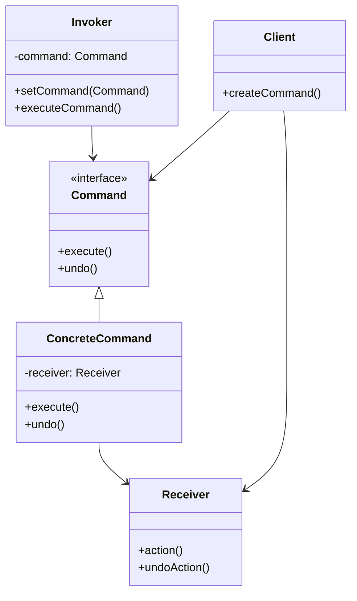
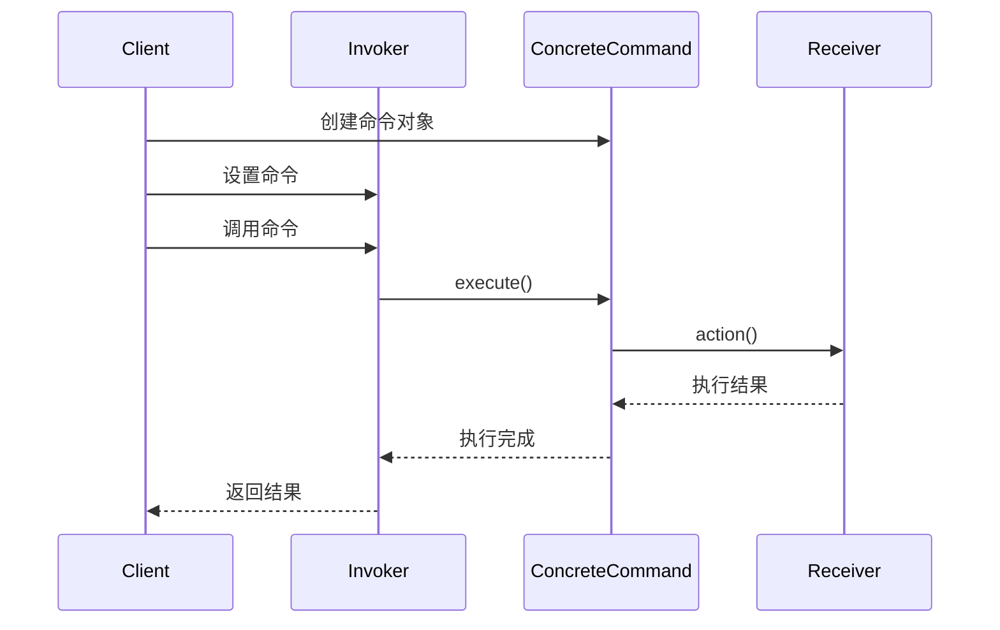
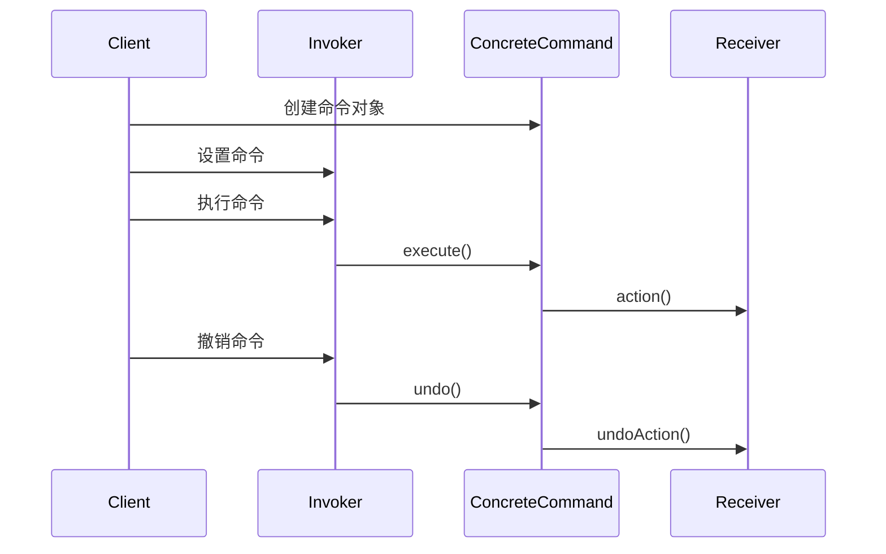
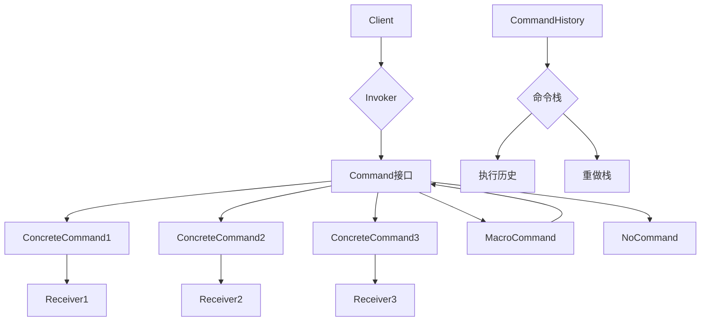
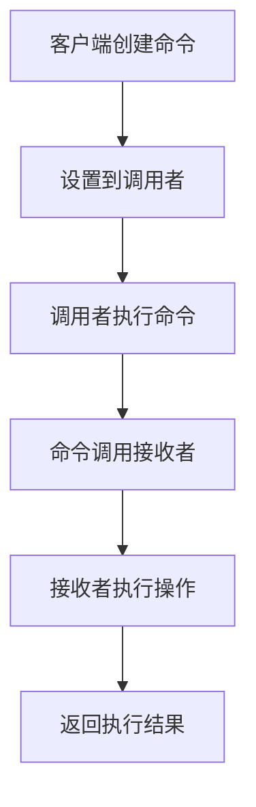
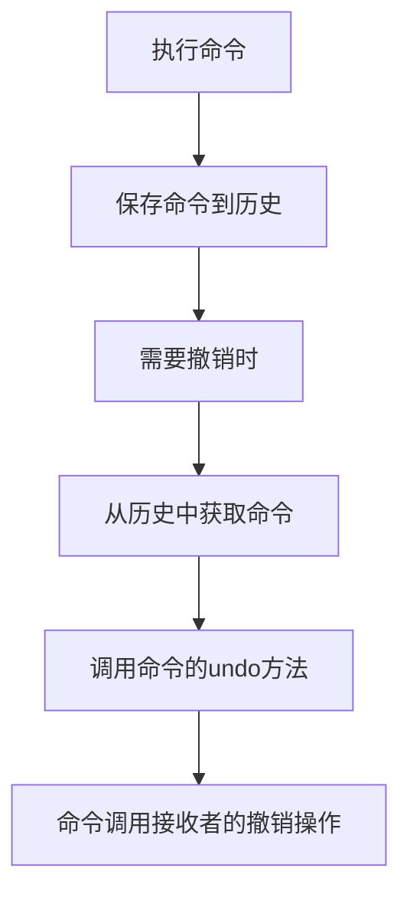

# 命令模式 (Command Pattern)

## 1. 模式定义

命令模式是一种行为型设计模式，它将请求封装成对象，从而使你可以用不同的请求对客户进行参数化，对请求排队或记录请求日志，以及支持可撤销的操作。命令模式将发出请求的对象和执行请求的对象解耦。

## 2. 核心思想

命令模式的核心思想是将一个请求封装为一个对象，从而使你可用不同的请求对客户进行参数化；对请求排队或记录请求日志，以及支持可撤销的操作。命令模式将发出请求的对象和执行请求的对象解耦，使得系统更加灵活。

## 3. 适用场景

- **GUI菜单和按钮**：将菜单项或按钮点击事件封装为命令对象
- **撤销/重做操作**：支持操作的撤销和重做功能
- **队列请求**：将请求放入队列中，按顺序处理
- **日志记录**：记录请求历史，用于系统恢复
- **宏命令**：将多个命令组合成一个宏命令
- **远程过程调用**：在网络中传输命令对象
- **事务处理**：将一系列操作封装为事务

## 4. 优缺点

### 优点
- **降低系统耦合度**：调用者和接收者之间完全解耦
- **易于扩展新命令**：增加新命令非常容易，符合开闭原则
- **支持撤销操作**：可以方便地实现命令的撤销和重做
- **支持队列请求**：可以将命令对象放入队列中按顺序执行
- **支持日志记录**：可以记录命令历史，用于系统恢复
- **支持宏命令**：可以将多个命令组合成复合命令

### 缺点
- **增加系统复杂性**：可能会导致系统中类的数量增加
- **每个命令都是一个具体类**：可能导致系统中存在过多的具体命令类
- **系统开销**：每个命令对象都会占用一定的内存空间

## 5. UML类图



## 6. 模式结构

### 6.1 主要角色

1. **Command（命令接口）**
   - 声明执行操作的接口
   - 通常包含execute()和undo()方法

2. **ConcreteCommand（具体命令类）**
   - 实现Command接口
   - 持有对接收者的引用
   - 调用接收者的相应操作来完成execute()和undo()

3. **Receiver（接收者）**
   - 知道如何实施与执行一个请求相关的操作
   - 任何类都可能作为一个接收者

4. **Invoker（调用者）**
   - 要求该命令执行这个请求
   - 持有命令对象的引用
   - 通常会有一个executeCommand()方法

5. **Client（客户端）**
   - 创建具体命令对象并设定其接收者
   - 负责创建命令对象并将其设置到调用者中

### 6.2 命令模式变体

1. **简单命令**：只包含execute()方法，不支持撤销操作
2. **可撤销命令**：包含execute()和undo()方法，支持撤销操作
3. **宏命令**：包含多个命令对象，可以一次性执行多个操作
4. **日志命令**：记录命令执行历史，支持系统恢复
5. **队列命令**：将命令放入队列中异步执行

## 7. 时序图

### 7.1 基本命令执行时序图



### 7.2 撤销操作时序图



## 8. 数据结构图



## 9. 工作流程图

### 9.1 命令执行工作流程



### 9.2 撤销操作工作流程



## 10. 实际应用示例

### 10.1 GUI应用程序

在图形用户界面中，菜单项、按钮等控件的点击事件可以封装为命令对象：

```java
// 菜单命令示例
public class MenuItem {
    private Command command;
    
    public void setCommand(Command command) {
        this.command = command;
    }
    
    public void click() {
        command.execute();
    }
}
```

### 10.2 事务处理系统

在数据库事务处理中，每个操作可以封装为命令，支持事务的提交和回滚：

```java
// 事务命令示例
public class DatabaseCommand implements Command {
    private DatabaseConnection connection;
    private String sql;
    
    public void execute() {
        connection.execute(sql);
    }
    
    public void undo() {
        connection.rollback();
    }
}
```

### 10.3 游戏开发

在游戏中，玩家的操作可以记录为命令，支持回放和撤销功能：

```java
// 游戏命令示例
public class MoveCommand implements Command {
    private Player player;
    private int deltaX, deltaY;
    
    public void execute() {
        player.move(deltaX, deltaY);
    }
    
    public void undo() {
        player.move(-deltaX, -deltaY);
    }
}
```

## 11. 与其他模式的关系

- **与备忘录模式**：命令模式可以与备忘录模式结合使用来实现撤销操作，命令模式负责执行和撤销操作，备忘录模式负责保存对象状态
- **与组合模式**：宏命令是组合模式的应用，将多个命令组合成一个复合命令
- **与职责链模式**：命令对象可以在处理者链中传递，每个处理者都可以处理或转发命令
- **与原型模式**：命令对象可以通过原型模式进行复制，创建新的命令实例

## 12. 常见问题和解决方案

### 12.1 命令类过多问题

**问题**：每个操作都需要创建一个具体的命令类，可能导致类的数量急剧增加

**解决方案**：
1. 使用泛型命令类减少重复代码
2. 使用函数式接口和Lambda表达式简化命令创建
3. 合理设计命令层次结构

### 12.2 撤销操作复杂性

**问题**：某些操作的撤销逻辑可能非常复杂

**解决方案**：
1. 使用备忘录模式保存对象状态
2. 记录操作前后的差异
3. 设计专门的状态管理器

### 12.3 性能问题

**问题**：命令对象会占用额外的内存空间，大量命令可能导致性能问题

**解决方案**：
1. 及时清理不需要的命令对象
2. 使用对象池管理命令对象
3. 对于简单操作，考虑使用轻量级命令

## 13. 最佳实践

1. **保持命令对象的简单性**
   - 每个命令应该只负责一个特定的操作
   - 避免在命令中实现复杂的业务逻辑

2. **合理设计撤销机制**
   - 确保每个命令都能正确撤销
   - 考虑撤销操作的性能影响

3. **使用空对象模式**
   - 为无效的命令槽位提供NoCommand实现
   - 避免空指针异常

4. **支持宏命令**
   - 将多个相关命令组合成宏命令
   - 简化复杂操作的执行

5. **记录命令历史**
   - 实现命令历史记录功能
   - 支持多级撤销和重做

## 14. 总结

命令模式是一种强大的行为型设计模式，它将请求封装成对象，从而使你可以用不同的请求对客户进行参数化。它特别适用于以下情况：
- 需要支持撤销和重做操作
- 需要将请求排队或记录请求日志
- 需要支持宏命令或复合命令
- 需要解耦请求的发送者和接收者

在使用命令模式时，需要注意保持命令对象的简单性，合理设计撤销机制，并考虑性能和内存使用的影响。通过正确应用命令模式，可以大大提高系统的灵活性和可维护性。