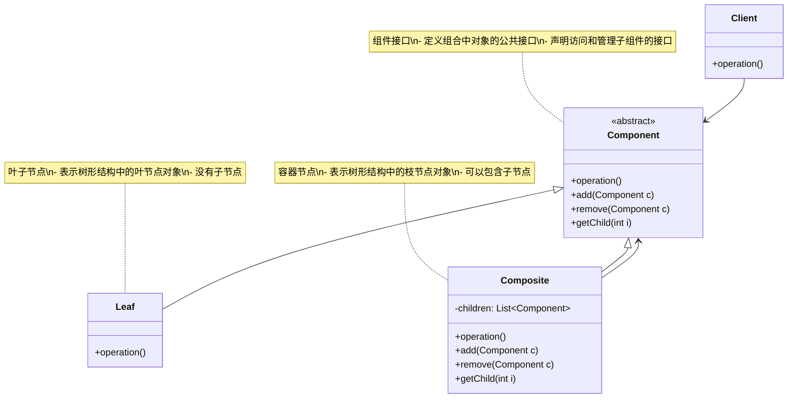
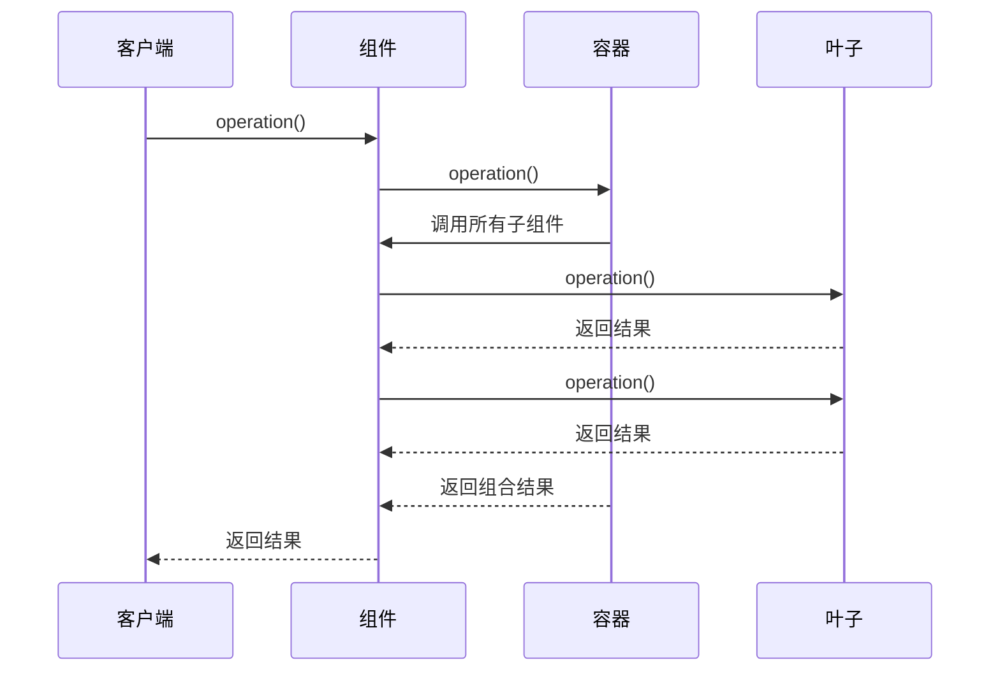
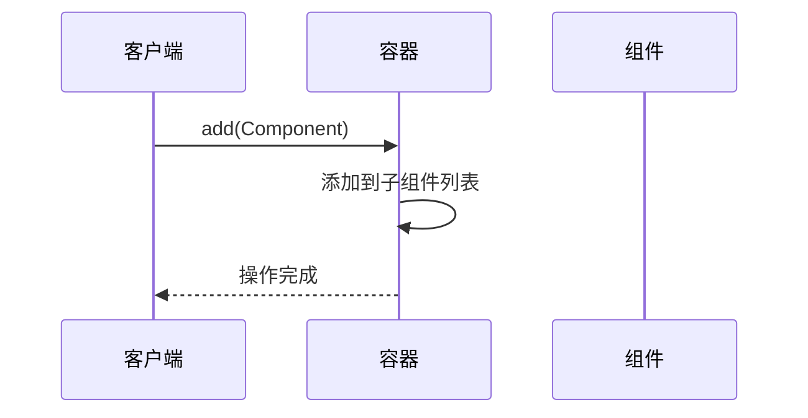
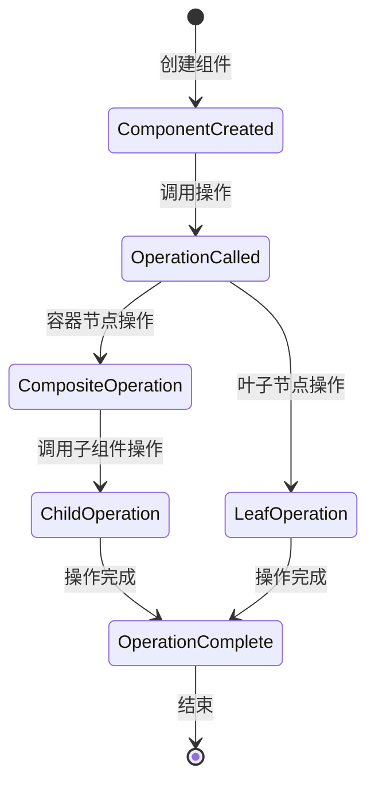

# 组合模式 (Composite Pattern) 详解

## 1. 模式定义

组合模式是一种结构型设计模式，它允许你将对象组合成树形结构来表示"部分-整体"的层次关系。组合模式使得客户端对单个对象和组合对象的使用具有一致性。

## 2. 模式动机

在软件开发中，我们经常遇到以下情况：

1. **树形结构需求**：需要表示对象的部分-整体层次结构
2. **一致性操作**：希望客户端忽略组合对象与单个对象的不同，统一地使用它们
3. **递归处理**：需要递归处理树形结构中的对象
4. **动态扩展**：需要动态地增加或删除树中的对象

组合模式通过将一组对象组织成树形结构，并提供统一的接口来处理单个对象和组合对象，解决了这些问题。

## 3. UML 类图



## 4. 角色分析

1. **Component（组件）**：声明组合中对象的公共接口，适当实现所有类共有接口的缺省行为
2. **Leaf（叶子）**：表示叶节点对象，没有子节点，在组合中定义图元对象的行为
3. **Composite（容器）**：定义有子部件的部件行为，存储子部件，并在Component接口中实现与子部件有关的操作
4. **Client（客户端）**：通过Component接口操纵组合部件的对象

## 5. 时序图

### 5.1 基本操作时序图



### 5.2 添加子组件时序图



## 6. 实现方式

### 6.1 基本实现

```java
import java.util.ArrayList;
import java.util.List;

// 组件接口
public abstract class FileSystemComponent {
    protected String name;
    
    public FileSystemComponent(String name) {
        this.name = name;
    }
    
    public abstract void display(int depth);
    public abstract long getSize();
    
    // 默认实现，叶子节点不需要这些操作
    public void add(FileSystemComponent component) {
        throw new UnsupportedOperationException("不支持此操作");
    }
    
    public void remove(FileSystemComponent component) {
        throw new UnsupportedOperationException("不支持此操作");
    }
    
    public FileSystemComponent getChild(int i) {
        throw new UnsupportedOperationException("不支持此操作");
    }
    
    protected String getDepthString(int depth) {
        StringBuilder sb = new StringBuilder();
        for (int i = 0; i < depth; i++) {
            sb.append("  ");
        }
        return sb.toString();
    }
}

// 叶子节点 - 文件
public class File extends FileSystemComponent {
    private long size;
    
    public File(String name, long size) {
        super(name);
        this.size = size;
    }
    
    @Override
    public void display(int depth) {
        System.out.println(getDepthString(depth) + "- File: " + name + " (" + size + " bytes)");
    }
    
    @Override
    public long getSize() {
        return size;
    }
}

// 容器节点 - 文件夹
public class Folder extends FileSystemComponent {
    private List<FileSystemComponent> children = new ArrayList<>();
    
    public Folder(String name) {
        super(name);
    }
    
    @Override
    public void add(FileSystemComponent component) {
        children.add(component);
    }
    
    @Override
    public void remove(FileSystemComponent component) {
        children.remove(component);
    }
    
    @Override
    public FileSystemComponent getChild(int i) {
        return children.get(i);
    }
    
    @Override
    public void display(int depth) {
        System.out.println(getDepthString(depth) + "+ Folder: " + name);
        for (FileSystemComponent component : children) {
            component.display(depth + 1);
        }
    }
    
    @Override
    public long getSize() {
        long totalSize = 0;
        for (FileSystemComponent component : children) {
            totalSize += component.getSize();
        }
        return totalSize;
    }
}
```

### 6.2 图形绘制系统实现

```java
import java.util.ArrayList;
import java.util.List;

// 图形组件接口
public abstract class Graphic {
    protected String name;
    
    public Graphic(String name) {
        this.name = name;
    }
    
    public abstract void draw();
    public abstract void move(int x, int y);
    public abstract double getArea();
    
    // 默认实现
    public void add(Graphic graphic) {
        throw new UnsupportedOperationException("不支持此操作");
    }
    
    public void remove(Graphic graphic) {
        throw new UnsupportedOperationException("不支持此操作");
    }
    
    public Graphic getChild(int i) {
        throw new UnsupportedOperationException("不支持此操作");
    }
}

// 叶子节点 - 点
public class Dot extends Graphic {
    private int x, y;
    
    public Dot(String name, int x, int y) {
        super(name);
        this.x = x;
        this.y = y;
    }
    
    @Override
    public void draw() {
        System.out.println("绘制点 " + name + " 在坐标 (" + x + ", " + y + ")");
    }
    
    @Override
    public void move(int x, int y) {
        this.x += x;
        this.y += y;
        System.out.println("移动点 " + name + " 到坐标 (" + this.x + ", " + this.y + ")");
    }
    
    @Override
    public double getArea() {
        return 0; // 点没有面积
    }
    
    // getter和setter
    public int getX() { return x; }
    public int getY() { return y; }
    public void setX(int x) { this.x = x; }
    public void setY(int y) { this.y = y; }
}

// 叶子节点 - 圆形
public class Circle extends Graphic {
    private int x, y, radius;
    
    public Circle(String name, int x, int y, int radius) {
        super(name);
        this.x = x;
        this.y = y;
        this.radius = radius;
    }
    
    @Override
    public void draw() {
        System.out.println("绘制圆形 " + name + " 在坐标 (" + x + ", " + y + ") 半径 " + radius);
    }
    
    @Override
    public void move(int x, int y) {
        this.x += x;
        this.y += y;
        System.out.println("移动圆形 " + name + " 到坐标 (" + this.x + ", " + this.y + ")");
    }
    
    @Override
    public double getArea() {
        return Math.PI * radius * radius;
    }
    
    // getter和setter
    public int getX() { return x; }
    public int getY() { return y; }
    public int getRadius() { return radius; }
    public void setX(int x) { this.x = x; }
    public void setY(int y) { this.y = y; }
    public void setRadius(int radius) { this.radius = radius; }
}

// 容器节点 - 图形组合
public class CompoundGraphic extends Graphic {
    private List<Graphic> children = new ArrayList<>();
    
    public CompoundGraphic(String name) {
        super(name);
    }
    
    @Override
    public void add(Graphic graphic) {
        children.add(graphic);
    }
    
    @Override
    public void remove(Graphic graphic) {
        children.remove(graphic);
    }
    
    @Override
    public Graphic getChild(int i) {
        return children.get(i);
    }
    
    @Override
    public void draw() {
        System.out.println("绘制组合图形 " + name + ":");
        for (Graphic graphic : children) {
            graphic.draw();
        }
    }
    
    @Override
    public void move(int x, int y) {
        System.out.println("移动组合图形 " + name + ":");
        for (Graphic graphic : children) {
            graphic.move(x, y);
        }
    }
    
    @Override
    public double getArea() {
        double totalArea = 0;
        for (Graphic graphic : children) {
            totalArea += graphic.getArea();
        }
        return totalArea;
    }
}
```

### 6.3 菜单系统实现

```java
import java.util.ArrayList;
import java.util.List;

// 菜单项接口
public abstract class MenuComponent {
    public String getName() {
        throw new UnsupportedOperationException();
    }
    
    public String getDescription() {
        throw new UnsupportedOperationException();
    }
    
    public double getPrice() {
        throw new UnsupportedOperationException();
    }
    
    public boolean isVegetarian() {
        throw new UnsupportedOperationException();
    }
    
    public void print() {
        throw new UnsupportedOperationException();
    }
    
    public void add(MenuComponent menuComponent) {
        throw new UnsupportedOperationException();
    }
    
    public void remove(MenuComponent menuComponent) {
        throw new UnsupportedOperationException();
    }
    
    public MenuComponent getChild(int i) {
        throw new UnsupportedOperationException();
    }
}

// 叶子节点 - 菜单项
public class MenuItem extends MenuComponent {
    private String name;
    private String description;
    private boolean vegetarian;
    private double price;
    
    public MenuItem(String name, String description, boolean vegetarian, double price) {
        this.name = name;
        this.description = description;
        this.vegetarian = vegetarian;
        this.price = price;
    }
    
    @Override
    public String getName() {
        return name;
    }
    
    @Override
    public String getDescription() {
        return description;
    }
    
    @Override
    public double getPrice() {
        return price;
    }
    
    @Override
    public boolean isVegetarian() {
        return vegetarian;
    }
    
    @Override
    public void print() {
        System.out.print("  " + getName());
        if (isVegetarian()) {
            System.out.print("(v)");
        }
        System.out.println(", $" + getPrice());
        System.out.println("    -- " + getDescription());
    }
}

// 容器节点 - 菜单
public class Menu extends MenuComponent {
    private List<MenuComponent> menuComponents = new ArrayList<>();
    private String name;
    private String description;
    
    public Menu(String name, String description) {
        this.name = name;
        this.description = description;
    }
    
    @Override
    public void add(MenuComponent menuComponent) {
        menuComponents.add(menuComponent);
    }
    
    @Override
    public void remove(MenuComponent menuComponent) {
        menuComponents.remove(menuComponent);
    }
    
    @Override
    public MenuComponent getChild(int i) {
        return menuComponents.get(i);
    }
    
    @Override
    public String getName() {
        return name;
    }
    
    @Override
    public String getDescription() {
        return description;
    }
    
    @Override
    public void print() {
        System.out.print("\n" + getName());
        System.out.println(", " + getDescription());
        System.out.println("---------------------");
        
        for (MenuComponent menuComponent : menuComponents) {
            menuComponent.print();
        }
    }
}
```

## 7. 状态图



## 8. 实际应用场景

1. **文件系统**：文件和文件夹的层次结构
2. **图形界面**：窗口、面板、按钮等GUI组件的层次结构
3. **组织架构**：部门和员工的层次结构
4. **菜单系统**：菜单和菜单项的层次结构
5. **XML/HTML解析**：DOM树的层次结构
6. **游戏开发**：游戏对象的层次结构
7. **表达式解析**：算术表达式的层次结构
8. **配置管理**：配置项的层次结构

## 9. 常见问题及解决方案

### 9.1 类型安全问题

**问题**：在组合模式中，容器节点和叶子节点的方法签名相同，但实现不同

**解决方案**：
1. 使用异常处理不支持的操作
2. 在运行时检查组件类型
3. 使用访问者模式来处理不同类型的操作

### 9.2 性能问题

**问题**：递归操作可能导致性能问题，特别是在大型树结构中

**解决方案**：
1. 使用迭代而非递归
2. 缓存计算结果
3. 优化树结构的遍历算法

### 9.3 内存使用问题

**问题**：大型树结构可能消耗大量内存

**解决方案**：
1. 使用享元模式共享叶子节点
2. 按需加载子节点
3. 使用懒加载机制

### 9.4 循环引用问题

**问题**：树结构中可能出现循环引用，导致无限递归

**解决方案**：
1. 在添加子节点时检查循环引用
2. 使用访问者模式跟踪访问路径
3. 实现引用计数机制

## 10. 与其他模式的关系

1. **与装饰器模式**：组合模式组织对象，装饰器模式增强对象功能
2. **与访问者模式**：访问者模式可以对组合结构执行操作
3. **与迭代器模式**：迭代器模式可以遍历组合结构
4. **与责任链模式**：责任链模式可以处理组合结构中的请求

## 11. 优缺点分析

### 11.1 优点

1. **一致性**：客户端可以一致地处理单个对象和组合对象
2. **灵活性**：容易增加新的组件类型
3. **简化客户端代码**：客户端不需要区分叶子节点和容器节点
4. **符合开闭原则**：容易扩展新的组件类型

### 11.2 缺点

1. **类型安全**：难以限制容器节点中组件的类型
2. **设计复杂**：设计更加复杂，需要花时间理清类之间的关系
3. **性能开销**：在大型树结构中，递归操作可能带来性能问题

## 12. 最佳实践

1. **合理使用**：仅在需要表示对象的部分-整体层次结构时使用组合模式
2. **类型检查**：在适当的时候进行类型检查，避免运行时错误
3. **性能优化**：对大型树结构进行性能优化
4. **文档说明**：清楚地说明组合结构的设计意图和使用方法

## 13. 代码示例场景

以一个公司组织架构系统为例，说明组合模式的使用：

```java
import java.util.ArrayList;
import java.util.List;

// 员工组件接口
public abstract class Employee {
    protected String name;
    protected String position;
    
    public Employee(String name, String position) {
        this.name = name;
        this.position = position;
    }
    
    public abstract void showDetails(int depth);
    public abstract double getCost();
    public abstract int getEmployeeCount();
    
    // 默认实现
    public void add(Employee employee) {
        throw new UnsupportedOperationException("不支持此操作");
    }
    
    public void remove(Employee employee) {
        throw new UnsupportedOperationException("不支持此操作");
    }
    
    public Employee getChild(int i) {
        throw new UnsupportedOperationException("不支持此操作");
    }
    
    protected String getDepthString(int depth) {
        StringBuilder sb = new StringBuilder();
        for (int i = 0; i < depth; i++) {
            sb.append("  ");
        }
        return sb.toString();
    }
    
    // getter方法
    public String getName() { return name; }
    public String getPosition() { return position; }
}

// 叶子节点 - 普通员工
public class RegularEmployee extends Employee {
    private double salary;
    
    public RegularEmployee(String name, String position, double salary) {
        super(name, position);
        this.salary = salary;
    }
    
    @Override
    public void showDetails(int depth) {
        System.out.println(getDepthString(depth) + "- 员工: " + name + " (" + position + ") - 薪资: $" + salary);
    }
    
    @Override
    public double getCost() {
        return salary;
    }
    
    @Override
    public int getEmployeeCount() {
        return 1;
    }
    
    // getter和setter
    public double getSalary() { return salary; }
    public void setSalary(double salary) { this.salary = salary; }
}

// 容器节点 - 管理者
public class Manager extends Employee {
    private double salary;
    private List<Employee> subordinates = new ArrayList<>();
    
    public Manager(String name, String position, double salary) {
        super(name, position);
        this.salary = salary;
    }
    
    @Override
    public void add(Employee employee) {
        subordinates.add(employee);
    }
    
    @Override
    public void remove(Employee employee) {
        subordinates.remove(employee);
    }
    
    @Override
    public Employee getChild(int i) {
        return subordinates.get(i);
    }
    
    @Override
    public void showDetails(int depth) {
        System.out.println(getDepthString(depth) + "+ 管理者: " + name + " (" + position + ") - 薪资: $" + salary);
        for (Employee employee : subordinates) {
            employee.showDetails(depth + 1);
        }
    }
    
    @Override
    public double getCost() {
        double totalCost = salary;
        for (Employee employee : subordinates) {
            totalCost += employee.getCost();
        }
        return totalCost;
    }
    
    @Override
    public int getEmployeeCount() {
        int count = 1; // 包括管理者自己
        for (Employee employee : subordinates) {
            count += employee.getEmployeeCount();
        }
        return count;
    }
    
    // getter和setter
    public double getSalary() { return salary; }
    public void setSalary(double salary) { this.salary = salary; }
    public List<Employee> getSubordinates() { return new ArrayList<>(subordinates); }
}

// 客户端使用示例
public class OrganizationDemo {
    public static void main(String[] args) {
        System.out.println("=== 公司组织架构演示 ===\n");
        
        // 创建CEO
        Manager ceo = new Manager("张三", "CEO", 100000);
        
        // 创建部门经理
        Manager techManager = new Manager("李四", "技术部经理", 80000);
        Manager salesManager = new Manager("王五", "销售部经理", 75000);
        Manager hrManager = new Manager("赵六", "人事部经理", 70000);
        
        // 创建普通员工
        RegularEmployee dev1 = new RegularEmployee("小明", "Java开发工程师", 60000);
        RegularEmployee dev2 = new RegularEmployee("小红", "前端开发工程师", 55000);
        RegularEmployee tester = new RegularEmployee("小刚", "测试工程师", 50000);
        
        RegularEmployee sales1 = new RegularEmployee("小丽", "销售代表", 45000);
        RegularEmployee sales2 = new RegularEmployee("小强", "销售代表", 45000);
        
        RegularEmployee hr = new RegularEmployee("小美", "人事专员", 40000);
        
        // 构建组织架构
        // CEO管理三个部门经理
        ceo.add(techManager);
        ceo.add(salesManager);
        ceo.add(hrManager);
        
        // 技术部经理管理开发人员和测试人员
        techManager.add(dev1);
        techManager.add(dev2);
        techManager.add(tester);
        
        // 销售部经理管理销售代表
        salesManager.add(sales1);
        salesManager.add(sales2);
        
        // 人事部经理管理人事专员
        hrManager.add(hr);
        
        // 显示组织架构
        System.out.println("公司组织架构:");
        ceo.showDetails(0);
        
        System.out.println("\n公司总成本: $" + ceo.getCost());
        System.out.println("公司总员工数: " + ceo.getEmployeeCount() + " 人");
        
        // 查看技术部信息
        System.out.println("\n技术部信息:");
        techManager.showDetails(1);
        System.out.println("技术部成本: $" + techManager.getCost());
        System.out.println("技术部员工数: " + techManager.getEmployeeCount() + " 人");
    }
}
```

## 14. 总结

组合模式是一种非常实用的结构型设计模式，它通过将对象组织成树形结构，使得客户端可以一致地处理单个对象和组合对象。虽然会增加系统的设计复杂度，但在需要表示对象的部分-整体层次结构的场景下，组合模式提供了优雅的解决方案。

在实际应用中，应该根据具体需求合理使用组合模式，注意处理类型安全和性能问题。组合模式特别适用于以下场景：

1. 需要表示对象的部分-整体层次结构
2. 希望客户端忽略组合对象与单个对象的不同，统一地使用它们
3. 需要动态地增加或删除树中的对象
4. 需要递归处理树形结构中的对象

通过合理使用组合模式，可以提高系统的灵活性和可维护性，同时保持代码的清晰性和一致性。