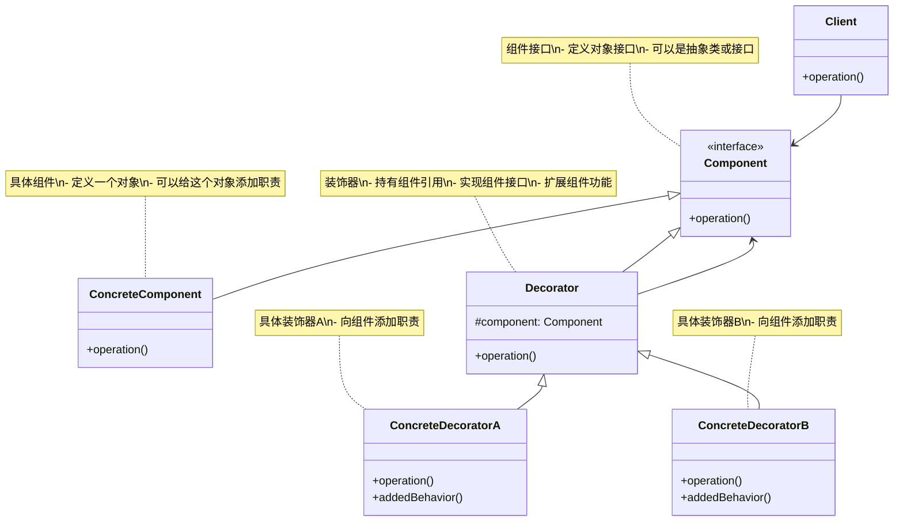
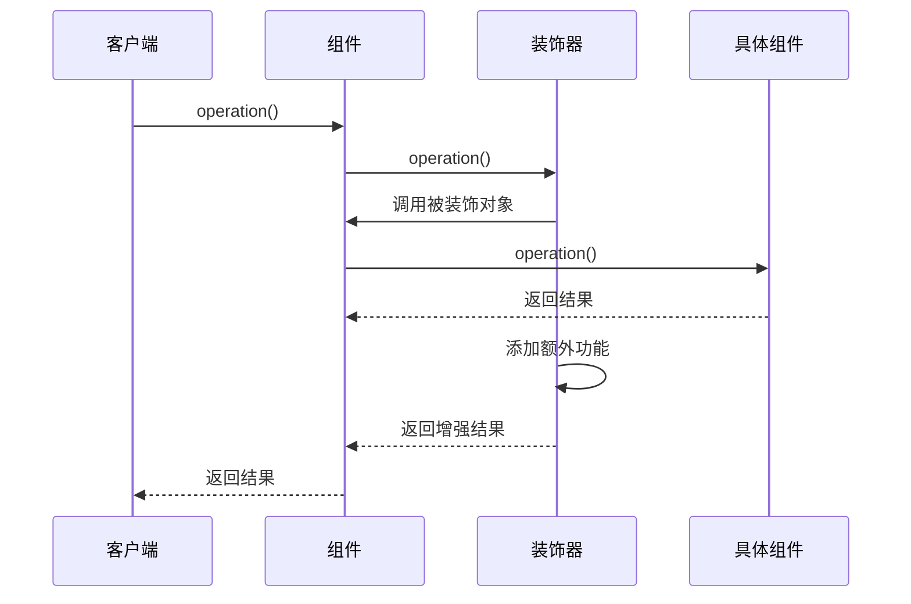
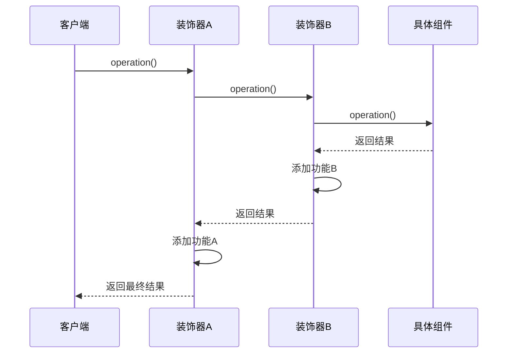
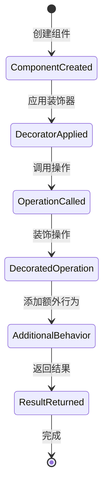

# 装饰模式 (Decorator Pattern) 详解

## 1. 模式定义

装饰模式是一种结构型设计模式，它允许你动态地给对象添加新的功能，同时又不改变其接口。装饰模式通过创建一个包装对象，也就是装饰器，来包裹真实的对象，从而在运行时扩展对象的功能。

## 2. 模式动机

在软件开发中，我们经常遇到以下情况：

1. **功能扩展需求**：需要在不修改现有代码的情况下为对象添加新功能
2. **继承局限性**：使用继承来扩展功能会导致类爆炸问题
3. **运行时扩展**：需要在运行时动态地添加或移除功能
4. **组合优于继承**：希望通过组合而非继承来实现功能扩展

装饰模式通过创建装饰器类来包装原始对象，在不改变原始对象接口的情况下动态地添加新功能，解决了这些问题。

## 3. UML 类图



## 4. 角色分析

1. **Component（组件）**：定义一个对象接口，可以给这些对象动态地添加职责
2. **ConcreteComponent（具体组件）**：定义一个具体的对象，也可以给这个对象添加一些职责
3. **Decorator（装饰器）**：维持一个指向Component对象的引用，并定义一个与Component接口一致的接口
4. **ConcreteDecorator（具体装饰器）**：向组件添加职责

## 5. 时序图

### 5.1 基本操作时序图



### 5.2 多层装饰时序图



## 6. 实现方式

### 6.1 基本实现

```java
// 组件接口
public interface Coffee {
    double getCost();
    String getDescription();
}

// 具体组件 - 简单咖啡
public class SimpleCoffee implements Coffee {
    @Override
    public double getCost() {
        return 2.0;
    }
    
    @Override
    public String getDescription() {
        return "简单咖啡";
    }
}

// 装饰器抽象类
public abstract class CoffeeDecorator implements Coffee {
    protected Coffee coffee;
    
    public CoffeeDecorator(Coffee coffee) {
        this.coffee = coffee;
    }
    
    @Override
    public double getCost() {
        return coffee.getCost();
    }
    
    @Override
    public String getDescription() {
        return coffee.getDescription();
    }
}

// 具体装饰器 - 牛奶
public class MilkDecorator extends CoffeeDecorator {
    public MilkDecorator(Coffee coffee) {
        super(coffee);
    }
    
    @Override
    public double getCost() {
        return super.getCost() + 0.5;
    }
    
    @Override
    public String getDescription() {
        return super.getDescription() + ", 牛奶";
    }
}

// 具体装饰器 - 糖
public class SugarDecorator extends CoffeeDecorator {
    public SugarDecorator(Coffee coffee) {
        super(coffee);
    }
    
    @Override
    public double getCost() {
        return super.getCost() + 0.3;
    }
    
    @Override
    public String getDescription() {
        return super.getDescription() + ", 糖";
    }
}

// 具体装饰器 - 奶油
public class CreamDecorator extends CoffeeDecorator {
    public CreamDecorator(Coffee coffee) {
        super(coffee);
    }
    
    @Override
    public double getCost() {
        return super.getCost() + 0.7;
    }
    
    @Override
    public String getDescription() {
        return super.getDescription() + ", 奶油";
    }
}
```

### 6.2 文本处理系统实现

```java
// 文本处理器接口
public interface TextProcessor {
    String process(String text);
}

// 具体组件 - 基本文本处理器
public class BasicTextProcessor implements TextProcessor {
    @Override
    public String process(String text) {
        return text;
    }
}

// 装饰器抽象类
public abstract class TextProcessorDecorator implements TextProcessor {
    protected TextProcessor textProcessor;
    
    public TextProcessorDecorator(TextProcessor textProcessor) {
        this.textProcessor = textProcessor;
    }
    
    @Override
    public String process(String text) {
        return textProcessor.process(text);
    }
}

// 具体装饰器 - 大写转换
public class UpperCaseDecorator extends TextProcessorDecorator {
    public UpperCaseDecorator(TextProcessor textProcessor) {
        super(textProcessor);
    }
    
    @Override
    public String process(String text) {
        String processedText = super.process(text);
        return processedText.toUpperCase();
    }
}

// 具体装饰器 - 小写转换
public class LowerCaseDecorator extends TextProcessorDecorator {
    public LowerCaseDecorator(TextProcessor textProcessor) {
        super(textProcessor);
    }
    
    @Override
    public String process(String text) {
        String processedText = super.process(text);
        return processedText.toLowerCase();
    }
}

// 具体装饰器 - 反转文本
public class ReverseDecorator extends TextProcessorDecorator {
    public ReverseDecorator(TextProcessor textProcessor) {
        super(textProcessor);
    }
    
    @Override
    public String process(String text) {
        String processedText = super.process(text);
        return new StringBuilder(processedText).reverse().toString();
    }
}

// 具体装饰器 - 添加前缀
public class PrefixDecorator extends TextProcessorDecorator {
    private String prefix;
    
    public PrefixDecorator(TextProcessor textProcessor, String prefix) {
        super(textProcessor);
        this.prefix = prefix;
    }
    
    @Override
    public String process(String text) {
        String processedText = super.process(text);
        return prefix + processedText;
    }
}

// 具体装饰器 - 添加后缀
public class SuffixDecorator extends TextProcessorDecorator {
    private String suffix;
    
    public SuffixDecorator(TextProcessor textProcessor, String suffix) {
        super(textProcessor);
        this.suffix = suffix;
    }
    
    @Override
    public String process(String text) {
        String processedText = super.process(text);
        return processedText + suffix;
    }
}
```

### 6.3 图形渲染系统实现

```java
// 图形接口
public interface Shape {
    void draw();
    double getArea();
}

// 具体组件 - 圆形
public class Circle implements Shape {
    private double radius;
    
    public Circle(double radius) {
        this.radius = radius;
    }
    
    @Override
    public void draw() {
        System.out.println("绘制圆形，半径: " + radius);
    }
    
    @Override
    public double getArea() {
        return Math.PI * radius * radius;
    }
    
    // getter和setter
    public double getRadius() { return radius; }
    public void setRadius(double radius) { this.radius = radius; }
}

// 具体组件 - 矩形
public class Rectangle implements Shape {
    private double width, height;
    
    public Rectangle(double width, double height) {
        this.width = width;
        this.height = height;
    }
    
    @Override
    public void draw() {
        System.out.println("绘制矩形，宽度: " + width + ", 高度: " + height);
    }
    
    @Override
    public double getArea() {
        return width * height;
    }
    
    // getter和setter
    public double getWidth() { return width; }
    public double getHeight() { return height; }
    public void setWidth(double width) { this.width = width; }
    public void setHeight(double height) { this.height = height; }
}

// 装饰器抽象类
public abstract class ShapeDecorator implements Shape {
    protected Shape shape;
    
    public ShapeDecorator(Shape shape) {
        this.shape = shape;
    }
    
    @Override
    public void draw() {
        shape.draw();
    }
    
    @Override
    public double getArea() {
        return shape.getArea();
    }
}

// 具体装饰器 - 红色边框
public class RedBorderDecorator extends ShapeDecorator {
    public RedBorderDecorator(Shape shape) {
        super(shape);
    }
    
    @Override
    public void draw() {
        super.draw();
        setRedBorder();
    }
    
    private void setRedBorder() {
        System.out.println("  添加红色边框");
    }
}

// 具体装饰器 - 蓝色填充
public class BlueFillDecorator extends ShapeDecorator {
    public BlueFillDecorator(Shape shape) {
        super(shape);
    }
    
    @Override
    public void draw() {
        super.draw();
        setBlueFill();
    }
    
    private void setBlueFill() {
        System.out.println("  添加蓝色填充");
    }
}

// 具体装饰器 - 阴影效果
public class ShadowDecorator extends ShapeDecorator {
    public ShadowDecorator(Shape shape) {
        super(shape);
    }
    
    @Override
    public void draw() {
        super.draw();
        addShadow();
    }
    
    private void addShadow() {
        System.out.println("  添加阴影效果");
    }
}

// 具体装饰器 - 旋转效果
public class RotateDecorator extends ShapeDecorator {
    private double angle;
    
    public RotateDecorator(Shape shape, double angle) {
        super(shape);
        this.angle = angle;
    }
    
    @Override
    public void draw() {
        super.draw();
        rotate();
    }
    
    private void rotate() {
        System.out.println("  旋转 " + angle + " 度");
    }
}
```

## 7. 状态图



## 8. 实际应用场景

1. **GUI组件**：为窗口、按钮等组件添加边框、滚动条等功能
2. **IO流处理**：Java IO库中的BufferedInputStream、DataInputStream等
3. **HTTP请求处理**：为HTTP请求添加认证、日志、压缩等功能
4. **文本处理**：为文本添加格式化、编码转换等功能
5. **图形渲染**：为图形对象添加边框、阴影、透明度等效果
6. **缓存系统**：为数据访问添加缓存、日志等功能
7. **权限控制**：为方法调用添加权限检查
8. **性能监控**：为方法调用添加性能统计

## 9. 常见问题及解决方案

### 9.1 装饰器层数过多

**问题**：装饰器层数过多可能导致代码难以理解和维护

**解决方案**：
1. 限制装饰器的层数
2. 使用工厂方法创建复杂的装饰器组合
3. 提供预定义的装饰器组合

### 9.2 性能问题

**问题**：多层装饰可能导致性能下降

**解决方案**：
1. 优化装饰器内部实现
2. 使用缓存机制减少重复计算
3. 在性能关键路径上避免不必要的装饰

### 9.3 类型安全问题

**问题**：装饰器可能改变对象的行为，导致类型不匹配

**解决方案**：
1. 保持装饰器与被装饰对象的接口一致
2. 在运行时进行类型检查
3. 使用泛型增强类型安全性

### 9.4 初始化复杂性

**问题**：创建复杂的装饰器组合可能比较复杂

**解决方案**：
1. 使用建造者模式创建装饰器组合
2. 提供工厂方法简化创建过程
3. 使用配置文件定义装饰器组合

## 10. 与其他模式的关系

1. **与适配器模式**：装饰模式不改变接口，适配器模式改变接口
2. **与组合模式**：装饰模式只有一个子组件，组合模式可以有多个子组件
3. **与策略模式**：装饰模式扩展对象功能，策略模式定义算法族
4. **与代理模式**：装饰模式添加功能，代理模式控制访问

## 11. 优缺点分析

### 11.1 优点

1. **灵活性**：比继承更加灵活，可以在运行时动态地添加或移除功能
2. **可扩展性**：符合开闭原则，可以在不修改现有代码的情况下扩展功能
3. **单一职责**：每个装饰器类只负责一个特定的功能
4. **组合性**：可以使用多个装饰器来组合出复杂的功能

### 11.2 缺点

1. **复杂性**：会产生许多小对象，增加系统的复杂性
2. **调试困难**：多层装饰使得调试变得困难
3. **性能开销**：多层装饰可能带来性能开销
4. **初始化复杂**：创建复杂的装饰器组合可能比较复杂

## 12. 最佳实践

1. **合理使用**：仅在需要动态添加功能时使用装饰模式
2. **保持接口一致**：装饰器应该保持与被装饰对象相同的接口
3. **简化创建**：提供工厂方法或建造者模式简化装饰器组合的创建
4. **文档说明**：清楚地说明装饰器的作用和使用方法
5. **性能考虑**：在性能敏感的场景中优化装饰器实现

## 13. 代码示例场景

以一个通知系统为例，说明装饰模式的使用：

```java
import java.util.Base64;

// 通知接口
public interface Notifier {
    void send(String message);
}

// 具体组件 - 邮件通知
public class EmailNotifier implements Notifier {
    private String emailAddress;
    
    public EmailNotifier(String emailAddress) {
        this.emailAddress = emailAddress;
    }
    
    @Override
    public void send(String message) {
        System.out.println("发送邮件到 " + emailAddress + ": " + message);
    }
}

// 装饰器抽象类
public abstract class NotifierDecorator implements Notifier {
    protected Notifier notifier;
    
    public NotifierDecorator(Notifier notifier) {
        this.notifier = notifier;
    }
    
    @Override
    public void send(String message) {
        notifier.send(message);
    }
}

// 具体装饰器 - SMS通知
public class SMSNotifierDecorator extends NotifierDecorator {
    private String phoneNumber;
    
    public SMSNotifierDecorator(Notifier notifier, String phoneNumber) {
        super(notifier);
        this.phoneNumber = phoneNumber;
    }
    
    @Override
    public void send(String message) {
        super.send(message);
        sendSMS(message);
    }
    
    private void sendSMS(String message) {
        System.out.println("发送短信到 " + phoneNumber + ": " + message);
    }
}

// 具体装饰器 - Slack通知
public class SlackNotifierDecorator extends NotifierDecorator {
    private String slackChannel;
    
    public SlackNotifierDecorator(Notifier notifier, String slackChannel) {
        super(notifier);
        this.slackChannel = slackChannel;
    }
    
    @Override
    public void send(String message) {
        super.send(message);
        sendSlackMessage(message);
    }
    
    private void sendSlackMessage(String message) {
        System.out.println("发送Slack消息到 " + slackChannel + ": " + message);
    }
}

// 具体装饰器 - 加密通知
public class EncryptedNotifierDecorator extends NotifierDecorator {
    public EncryptedNotifierDecorator(Notifier notifier) {
        super(notifier);
    }
    
    @Override
    public void send(String message) {
        String encryptedMessage = encrypt(message);
        super.send(encryptedMessage);
    }
    
    private String encrypt(String message) {
        return Base64.getEncoder().encodeToString(message.getBytes());
    }
}

// 具体装饰器 - 日志通知
public class LoggingNotifierDecorator extends NotifierDecorator {
    public LoggingNotifierDecorator(Notifier notifier) {
        super(notifier);
    }
    
    @Override
    public void send(String message) {
        System.out.println("[LOG] 准备发送消息: " + message);
        long startTime = System.currentTimeMillis();
        super.send(message);
        long endTime = System.currentTimeMillis();
        System.out.println("[LOG] 消息发送完成，耗时: " + (endTime - startTime) + "ms");
    }
}

// 客户端使用示例
public class NotificationDemo {
    public static void main(String[] args) {
        System.out.println("=== 通知系统演示 ===\n");
        
        // 1. 基本邮件通知
        System.out.println("1. 基本邮件通知:");
        Notifier emailNotifier = new EmailNotifier("user@example.com");
        emailNotifier.send("Hello World!");
        System.out.println();
        
        // 2. 邮件+SMS通知
        System.out.println("2. 邮件+SMS通知:");
        Notifier emailSMSNotifier = new SMSNotifierDecorator(
            new EmailNotifier("user@example.com"), 
            "+1234567890"
        );
        emailSMSNotifier.send("Important message!");
        System.out.println();
        
        // 3. 邮件+SMS+Slack通知
        System.out.println("3. 邮件+SMS+Slack通知:");
        Notifier multiNotifier = new SlackNotifierDecorator(
            new SMSNotifierDecorator(
                new EmailNotifier("user@example.com"), 
                "+1234567890"
            ), 
            "#general"
        );
        multiNotifier.send("Critical alert!");
        System.out.println();
        
        // 4. 加密的日志通知
        System.out.println("4. 加密的日志通知:");
        Notifier secureNotifier = new LoggingNotifierDecorator(
            new EncryptedNotifierDecorator(
                new EmailNotifier("user@example.com")
            )
        );
        secureNotifier.send("Secret message!");
        System.out.println();
        
        // 5. 复杂的通知组合
        System.out.println("5. 复杂的通知组合:");
        Notifier complexNotifier = new LoggingNotifierDecorator(
            new EncryptedNotifierDecorator(
                new SlackNotifierDecorator(
                    new SMSNotifierDecorator(
                        new EmailNotifier("user@example.com"), 
                        "+1234567890"
                    ), 
                    "#alerts"
                )
            )
        );
        complexNotifier.send("Very important secure message!");
    }
}
```

## 14. 总结

装饰模式是一种非常实用的结构型设计模式，它通过创建装饰器类来动态地给对象添加新功能，同时保持对象接口的一致性。虽然会增加系统的复杂性，但在需要动态扩展对象功能的场景下，装饰模式提供了优雅的解决方案。

在实际应用中，应该根据具体需求合理使用装饰模式，注意控制装饰器的层数和性能开销。装饰模式特别适用于以下场景：

1. 需要动态地给对象添加功能
2. 不想通过继承来扩展功能
3. 需要在运行时组合不同的功能
4. 需要保持对象接口的一致性

通过合理使用装饰模式，可以提高系统的灵活性和可扩展性，同时保持代码的清晰性和可维护性。