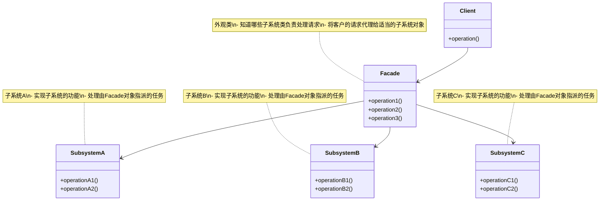
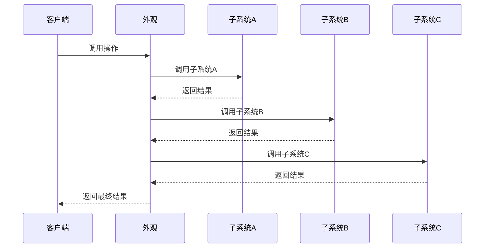
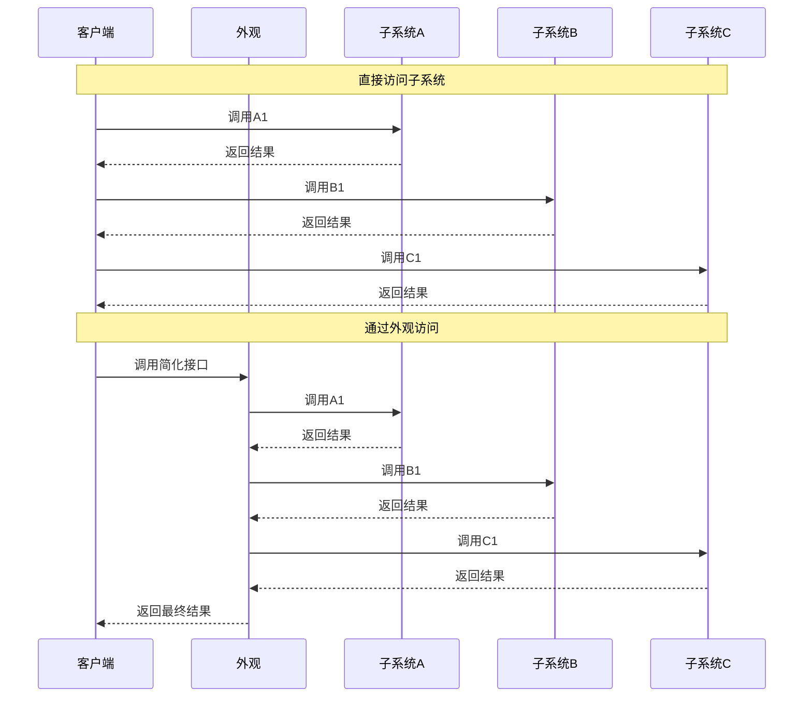
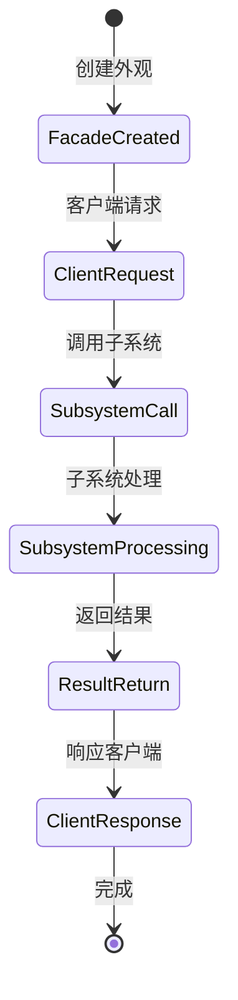

# 外观模式 (Facade Pattern) 详解

## 1. 模式定义

外观模式是一种结构型设计模式，它为子系统中的一组接口提供一个统一的高层接口，使得子系统更容易使用。外观模式定义了一个高层接口，这个接口使得这一子系统更加容易使用。

## 2. 模式动机

在软件开发中，我们经常遇到以下情况：

1. **复杂子系统**：系统包含多个复杂的子系统，客户端直接使用这些子系统会很困难
2. **紧耦合问题**：客户端与多个子系统紧密耦合，难以维护和修改
3. **学习成本高**：客户端需要了解多个子系统的接口和交互方式
4. **重复代码**：多个客户端可能需要执行相同的子系统调用序列

外观模式通过提供一个简单的接口来隐藏子系统的复杂性，解决了这些问题。

## 3. UML 类图



## 4. 角色分析

1. **Facade（外观）**：知道哪些子系统类负责处理请求，将客户的请求代理给适当的子系统对象
2. **Subsystem Classes（子系统类）**：实现子系统的功能，处理由Facade对象指派的任务，没有Facade的任何相关信息
3. **Client（客户端）**：通过Facade接口与子系统进行通信

## 5. 时序图

### 5.1 基本操作时序图



### 5.2 直接访问vs外观访问时序图



## 6. 实现方式

### 6.1 基本实现

```java
// 子系统A - CPU
public class CPU {
    public void freeze() {
        System.out.println("CPU: 冻结");
    }
    
    public void jump(long position) {
        System.out.println("CPU: 跳转到位置 " + position);
    }
    
    public void execute() {
        System.out.println("CPU: 执行指令");
    }
}

// 子系统B - 内存
public class Memory {
    public void load(long position, byte[] data) {
        System.out.println("内存: 在位置 " + position + " 加载数据");
    }
}

// 子系统C - 硬盘
public class HardDrive {
    public byte[] read(long lba, int size) {
        System.out.println("硬盘: 从LBA " + lba + " 读取 " + size + " 字节");
        return new byte[size];
    }
}

// 外观类 - 计算机启动器
public class ComputerFacade {
    private CPU cpu;
    private Memory memory;
    private HardDrive hardDrive;
    
    public ComputerFacade() {
        this.cpu = new CPU();
        this.memory = new Memory();
        this.hardDrive = new HardDrive();
    }
    
    public void start() {
        System.out.println("=== 启动计算机 ===");
        cpu.freeze();
        memory.load(0, hardDrive.read(0, 1024));
        cpu.jump(0);
        cpu.execute();
        System.out.println("=== 计算机启动完成 ===\n");
    }
    
    public void shutdown() {
        System.out.println("=== 关闭计算机 ===");
        // 简化实现
        System.out.println("计算机已关闭");
        System.out.println("=== 计算机关闭完成 ===\n");
    }
}
```

### 6.2 数据库访问系统实现

```java
// 子系统 - 连接管理
public class ConnectionManager {
    public void connect(String url, String username, String password) {
        System.out.println("连接到数据库: " + url + " 用户: " + username);
    }
    
    public void disconnect() {
        System.out.println("断开数据库连接");
    }
    
    public boolean isConnected() {
        // 简化实现
        return true;
    }
}

// 子系统 - SQL执行器
public class SQLExecutor {
    public void executeQuery(String sql) {
        System.out.println("执行查询: " + sql);
    }
    
    public void executeUpdate(String sql) {
        System.out.println("执行更新: " + sql);
    }
    
    public void executeBatch(String[] sqls) {
        System.out.println("执行批处理:");
        for (String sql : sqls) {
            System.out.println("  " + sql);
        }
    }
}

// 子系统 - 结果集处理器
public class ResultSetHandler {
    public void processResults() {
        System.out.println("处理查询结果");
    }
    
    public void closeResultSet() {
        System.out.println("关闭结果集");
    }
}

// 子系统 - 事务管理器
public class TransactionManager {
    public void beginTransaction() {
        System.out.println("开始事务");
    }
    
    public void commit() {
        System.out.println("提交事务");
    }
    
    public void rollback() {
        System.out.println("回滚事务");
    }
}

// 外观类 - 数据库访问门面
public class DatabaseFacade {
    private ConnectionManager connectionManager;
    private SQLExecutor sqlExecutor;
    private ResultSetHandler resultSetHandler;
    private TransactionManager transactionManager;
    
    public DatabaseFacade() {
        this.connectionManager = new ConnectionManager();
        this.sqlExecutor = new SQLExecutor();
        this.resultSetHandler = new ResultSetHandler();
        this.transactionManager = new TransactionManager();
    }
    
    public void connectToDatabase(String url, String username, String password) {
        System.out.println("=== 连接数据库 ===");
        connectionManager.connect(url, username, password);
        System.out.println("=== 数据库连接完成 ===\n");
    }
    
    public void executeSimpleQuery(String sql) {
        System.out.println("=== 执行简单查询 ===");
        if (connectionManager.isConnected()) {
            sqlExecutor.executeQuery(sql);
            resultSetHandler.processResults();
            resultSetHandler.closeResultSet();
        } else {
            System.out.println("错误: 数据库未连接");
        }
        System.out.println("=== 查询执行完成 ===\n");
    }
    
    public void executeTransaction(String[] sqls) {
        System.out.println("=== 执行事务 ===");
        if (connectionManager.isConnected()) {
            transactionManager.beginTransaction();
            sqlExecutor.executeBatch(sqls);
            transactionManager.commit();
        } else {
            System.out.println("错误: 数据库未连接");
        }
        System.out.println("=== 事务执行完成 ===\n");
    }
    
    public void disconnect() {
        System.out.println("=== 断开数据库连接 ===");
        connectionManager.disconnect();
        System.out.println("=== 连接已断开 ===\n");
    }
}
```

### 6.3 多媒体播放系统实现

```java
// 子系统 - 音频解码器
public class AudioDecoder {
    public void decodeAudio(String fileName) {
        System.out.println("音频解码器: 解码音频文件 " + fileName);
    }
    
    public void setVolume(int volume) {
        System.out.println("音频解码器: 设置音量为 " + volume + "%");
    }
    
    public void mute() {
        System.out.println("音频解码器: 静音");
    }
}

// 子系统 - 视频解码器
public class VideoDecoder {
    public void decodeVideo(String fileName) {
        System.out.println("视频解码器: 解码视频文件 " + fileName);
    }
    
    public void setResolution(int width, int height) {
        System.out.println("视频解码器: 设置分辨率 " + width + "x" + height);
    }
    
    public void fullscreen() {
        System.out.println("视频解码器: 全屏显示");
    }
}

// 子系统 - 字幕处理器
public class SubtitleProcessor {
    public void loadSubtitle(String subtitleFile) {
        System.out.println("字幕处理器: 加载字幕文件 " + subtitleFile);
    }
    
    public void showSubtitle(String text) {
        System.out.println("字幕处理器: 显示字幕: " + text);
    }
    
    public void hideSubtitle() {
        System.out.println("字幕处理器: 隐藏字幕");
    }
}

// 子系统 - 播放控制器
public class PlaybackController {
    public void play() {
        System.out.println("播放控制器: 开始播放");
    }
    
    public void pause() {
        System.out.println("播放控制器: 暂停播放");
    }
    
    public void stop() {
        System.out.println("播放控制器: 停止播放");
    }
    
    public void seek(int seconds) {
        System.out.println("播放控制器: 跳转到 " + seconds + " 秒");
    }
}

// 外观类 - 多媒体播放器
public class MediaPlayerFacade {
    private AudioDecoder audioDecoder;
    private VideoDecoder videoDecoder;
    private SubtitleProcessor subtitleProcessor;
    private PlaybackController playbackController;
    
    public MediaPlayerFacade() {
        this.audioDecoder = new AudioDecoder();
        this.videoDecoder = new VideoDecoder();
        this.subtitleProcessor = new SubtitleProcessor();
        this.playbackController = new PlaybackController();
    }
    
    public void playMovie(String videoFile, String audioFile, String subtitleFile) {
        System.out.println("=== 播放电影 ===");
        videoDecoder.decodeVideo(videoFile);
        audioDecoder.decodeAudio(audioFile);
        if (subtitleFile != null && !subtitleFile.isEmpty()) {
            subtitleProcessor.loadSubtitle(subtitleFile);
        }
        playbackController.play();
        System.out.println("=== 电影播放开始 ===\n");
    }
    
    public void pauseMovie() {
        System.out.println("=== 暂停电影 ===");
        playbackController.pause();
        System.out.println("=== 电影已暂停 ===\n");
    }
    
    public void resumeMovie() {
        System.out.println("=== 继续播放电影 ===");
        playbackController.play();
        System.out.println("=== 电影继续播放 ===\n");
    }
    
    public void stopMovie() {
        System.out.println("=== 停止播放电影 ===");
        playbackController.stop();
        subtitleProcessor.hideSubtitle();
        System.out.println("=== 电影播放停止 ===\n");
    }
    
    public void setVolume(int volume) {
        System.out.println("=== 设置音量 ===");
        audioDecoder.setVolume(volume);
        System.out.println("=== 音量设置完成 ===\n");
    }
    
    public void mute() {
        System.out.println("=== 静音 ===");
        audioDecoder.mute();
        System.out.println("=== 已静音 ===\n");
    }
    
    public void fullscreen() {
        System.out.println("=== 全屏 ===");
        videoDecoder.fullscreen();
        System.out.println("=== 已全屏 ===\n");
    }
}
```

## 7. 状态图



## 8. 实际应用场景

1. **API网关**：为微服务提供统一的入口点
2. **数据库访问**：简化复杂的数据库操作
3. **多媒体播放**：统一管理音频、视频、字幕等子系统
4. **操作系统**：提供简化的系统调用接口
5. **Web框架**：为复杂的Web应用提供简化的接口
6. **支付系统**：统一处理不同支付渠道的接口
7. **日志系统**：简化日志记录的复杂操作
8. **配置管理**：提供统一的配置访问接口

## 9. 常见问题及解决方案

### 9.1 外观类过于庞大

**问题**：外观类可能变得过于庞大，承担过多职责

**解决方案**：
1. 将外观类分解为多个专门的外观类
2. 使用抽象工厂模式创建相关的外观对象
3. 遵循单一职责原则

### 9.2 灵活性降低

**问题**：外观模式可能降低系统的灵活性

**解决方案**：
1. 提供直接访问子系统的接口
2. 在外观类中提供细粒度的方法
3. 允许客户端选择使用外观或直接访问子系统

### 9.3 性能问题

**问题**：外观模式可能引入额外的间接调用开销

**解决方案**：
1. 优化外观类的实现
2. 缓存常用的子系统对象
3. 在性能关键路径上避免不必要的外观调用

### 9.4 维护困难

**问题**：外观类可能难以维护和扩展

**解决方案**：
1. 保持外观类的简洁性
2. 提供清晰的文档说明
3. 定期重构和优化外观实现

## 10. 与其他模式的关系

1. **与适配器模式**：外观模式简化接口，适配器模式转换接口
2. **与装饰模式**：外观模式简化接口，装饰模式扩展功能
3. **与单例模式**：外观类通常使用单例模式实现
4. **与抽象工厂模式**：外观模式可以与抽象工厂模式结合使用

## 11. 优缺点分析

### 11.1 优点

1. **简化客户端代码**：客户端不需要了解子系统的复杂性
2. **松耦合**：客户端与子系统解耦
3. **更好的可移植性**：子系统的改变不会影响客户端
4. **更容易维护**：子系统的改变只影响外观类

### 11.2 缺点

1. **增加复杂性**：引入了额外的外观类
2. **性能开销**：可能引入额外的间接调用
3. **灵活性降低**：可能限制了客户端对子系统的直接访问

## 12. 最佳实践

1. **合理使用**：仅在子系统复杂且需要简化接口时使用外观模式
2. **保持简单**：外观类应该尽量简单，避免承担过多职责
3. **文档说明**：清楚地说明外观类的作用和使用方法
4. **提供选择**：允许客户端选择使用外观或直接访问子系统

## 13. 代码示例场景

以一个智能家居控制系统为例，说明外观模式的使用：

```java
// 子系统 - 灯光控制系统
public class LightSystem {
    public void turnOnAllLights() {
        System.out.println("灯光系统: 打开所有灯光");
    }
    
    public void turnOffAllLights() {
        System.out.println("灯光系统: 关闭所有灯光");
    }
    
    public void setBrightness(int level) {
        System.out.println("灯光系统: 设置亮度为 " + level + "%");
    }
    
    public void createAmbientLighting() {
        System.out.println("灯光系统: 创建环境照明");
    }
}

// 子系统 - 空调控制系统
public class AirConditioningSystem {
    public void turnOn() {
        System.out.println("空调系统: 开启空调");
    }
    
    public void turnOff() {
        System.out.println("空调系统: 关闭空调");
    }
    
    public void setTemperature(int temperature) {
        System.out.println("空调系统: 设置温度为 " + temperature + "°C");
    }
    
    public void setMode(String mode) {
        System.out.println("空调系统: 设置模式为 " + mode);
    }
}

// 子系统 - 安全系统
public class SecuritySystem {
    public void arm() {
        System.out.println("安全系统: 启动安全模式");
    }
    
    public void disarm() {
        System.out.println("安全系统: 解除安全模式");
    }
    
    public void activateCameras() {
        System.out.println("安全系统: 激活摄像头");
    }
    
    public void triggerAlarm() {
        System.out.println("安全系统: 触发警报");
    }
}

// 子系统 - 娱乐系统
public class EntertainmentSystem {
    public void turnOnTV() {
        System.out.println("娱乐系统: 打开电视");
    }
    
    public void turnOffTV() {
        System.out.println("娱乐系统: 关闭电视");
    }
    
    public void setVolume(int volume) {
        System.out.println("娱乐系统: 设置音量为 " + volume + "%");
    }
    
    public void playMusic(String genre) {
        System.out.println("娱乐系统: 播放 " + genre + " 音乐");
    }
}

// 子系统 - 窗帘控制系统
public class CurtainSystem {
    public void openAllCurtains() {
        System.out.println("窗帘系统: 打开所有窗帘");
    }
    
    public void closeAllCurtains() {
        System.out.println("窗帘系统: 关闭所有窗帘");
    }
    
    public void openCurtain(String room) {
        System.out.println("窗帘系统: 打开 " + room + " 的窗帘");
    }
    
    public void closeCurtain(String room) {
        System.out.println("窗帘系统: 关闭 " + room + " 的窗帘");
    }
}

// 外观类 - 智能家居控制器
public class SmartHomeFacade {
    private LightSystem lightSystem;
    private AirConditioningSystem acSystem;
    private SecuritySystem securitySystem;
    private EntertainmentSystem entertainmentSystem;
    private CurtainSystem curtainSystem;
    
    public SmartHomeFacade() {
        this.lightSystem = new LightSystem();
        this.acSystem = new AirConditioningSystem();
        this.securitySystem = new SecuritySystem();
        this.entertainmentSystem = new EntertainmentSystem();
        this.curtainSystem = new CurtainSystem();
    }
    
    // 一键回家模式
    public void activateHomeMode() {
        System.out.println("=== 激活回家模式 ===");
        lightSystem.turnOnAllLights();
        acSystem.turnOn();
        acSystem.setTemperature(22);
        curtainSystem.openAllCurtains();
        entertainmentSystem.turnOnTV();
        entertainmentSystem.setVolume(30);
        securitySystem.disarm();
        System.out.println("=== 回家模式激活完成 ===\n");
    }
    
    // 一键离家模式
    public void activateAwayMode() {
        System.out.println("=== 激活离家模式 ===");
        lightSystem.turnOffAllLights();
        acSystem.turnOff();
        curtainSystem.closeAllCurtains();
        entertainmentSystem.turnOffTV();
        securitySystem.arm();
        securitySystem.activateCameras();
        System.out.println("=== 离家模式激活完成 ===\n");
    }
    
    // 一键睡眠模式
    public void activateSleepMode() {
        System.out.println("=== 激活睡眠模式 ===");
        lightSystem.setBrightness(10);
        acSystem.setTemperature(18);
        curtainSystem.closeAllCurtains();
        entertainmentSystem.setVolume(10);
        System.out.println("=== 睡眠模式激活完成 ===\n");
    }
    
    // 一键娱乐模式
    public void activateEntertainmentMode() {
        System.out.println("=== 激活娱乐模式 ===");
        lightSystem.createAmbientLighting();
        acSystem.setMode("静音");
        curtainSystem.closeAllCurtains();
        entertainmentSystem.turnOnTV();
        entertainmentSystem.setVolume(50);
        entertainmentSystem.playMusic("流行");
        System.out.println("=== 娱乐模式激活完成 ===\n");
    }
    
    // 单独控制系统
    public void controlLights(String action) {
        switch (action.toLowerCase()) {
            case "on":
                lightSystem.turnOnAllLights();
                break;
            case "off":
                lightSystem.turnOffAllLights();
                break;
            case "dim":
                lightSystem.setBrightness(50);
                break;
            default:
                System.out.println("未知的灯光控制命令");
        }
    }
    
    public void controlAC(String action, int temperature) {
        switch (action.toLowerCase()) {
            case "on":
                acSystem.turnOn();
                acSystem.setTemperature(temperature);
                break;
            case "off":
                acSystem.turnOff();
                break;
            case "set":
                acSystem.setTemperature(temperature);
                break;
            default:
                System.out.println("未知的空调控制命令");
        }
    }
    
    public void controlSecurity(String action) {
        switch (action.toLowerCase()) {
            case "arm":
                securitySystem.arm();
                break;
            case "disarm":
                securitySystem.disarm();
                break;
            case "alarm":
                securitySystem.triggerAlarm();
                break;
            default:
                System.out.println("未知的安全控制命令");
        }
    }
}

// 客户端使用示例
public class SmartHomeDemo {
    public static void main(String[] args) {
        System.out.println("=== 智能家居系统演示 ===\n");
        
        SmartHomeFacade smartHome = new SmartHomeFacade();
        
        // 1. 激活回家模式
        System.out.println("1. 激活回家模式:");
        smartHome.activateHomeMode();
        
        // 2. 激活娱乐模式
        System.out.println("2. 激活娱乐模式:");
        smartHome.activateEntertainmentMode();
        
        // 3. 激活睡眠模式
        System.out.println("3. 激活睡眠模式:");
        smartHome.activateSleepMode();
        
        // 4. 激活离家模式
        System.out.println("4. 激活离家模式:");
        smartHome.activateAwayMode();
        
        // 5. 单独控制系统
        System.out.println("5. 单独控制系统:");
        smartHome.controlLights("on");
        smartHome.controlAC("set", 25);
        smartHome.controlSecurity("arm");
    }
}
```

## 14. 总结

外观模式是一种非常实用的结构型设计模式，它通过提供一个统一的高层接口来简化复杂子系统的使用。虽然会增加系统的复杂性，但在需要隐藏子系统复杂性并提供简化接口的场景下，外观模式提供了优雅的解决方案。

在实际应用中，应该根据具体需求合理使用外观模式，注意避免外观类过于庞大和复杂。外观模式特别适用于以下场景：

1. 需要为复杂的子系统提供简单的接口
2. 需要将客户端与子系统解耦
3. 需要分层架构的设计
4. 需要为遗留代码提供新的接口

通过合理使用外观模式，可以提高系统的可维护性和可扩展性，同时保持代码的清晰性和易用性。