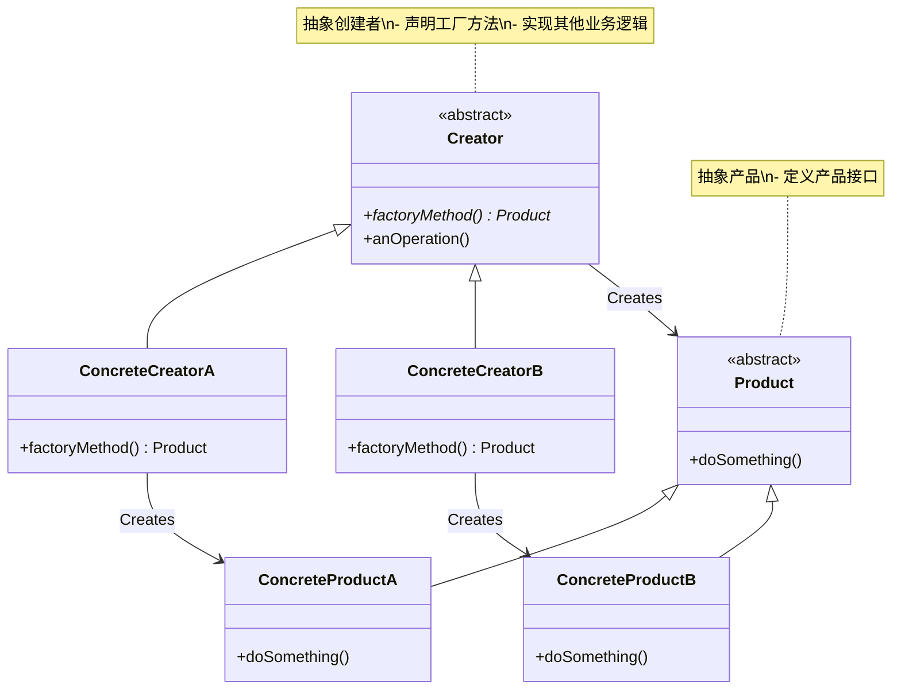
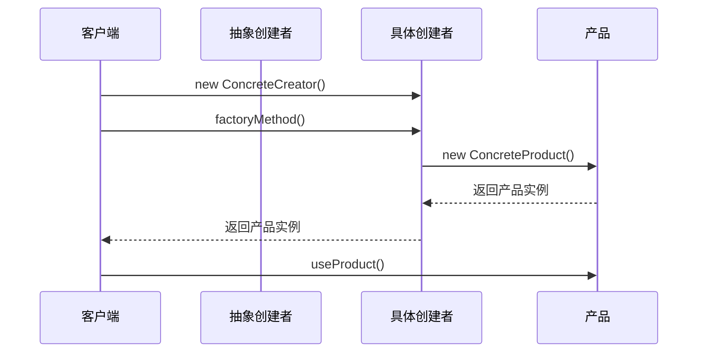
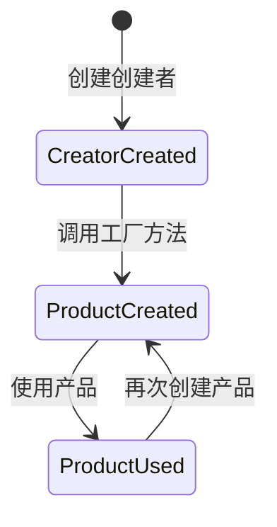

# 工厂方法模式 (Factory Method Pattern) 详解

## 1. 模式定义

工厂方法模式是一种创建型设计模式，它定义了一个创建对象的接口，但让子类决定实例化哪个类。工厂方法让类的实例化推迟到子类。

## 2. 模式动机

在面向对象编程中，创建对象是一个常见的操作。但有时候创建对象的过程比较复杂，或者需要根据不同的条件创建不同的对象。如果直接在代码中使用new关键字创建对象，会导致代码耦合度高，难以扩展和维护。

工厂方法模式通过定义一个创建对象的接口，让子类决定实例化哪个类，从而将对象的创建过程延迟到子类中，实现了创建者和具体产品之间的解耦。

## 3. UML 类图



## 4. 角色分析

1. **Product（抽象产品）**：定义产品的接口
2. **ConcreteProduct（具体产品）**：实现抽象产品接口的具体产品类
3. **Creator（抽象创建者）**：声明工厂方法，返回Product类型对象
4. **ConcreteCreator（具体创建者）**：重写工厂方法，返回具体产品实例

## 5. 时序图

### 5.1 基本时序图



## 6. 实现方式

### 6.1 基本实现

```java
// 抽象产品
public abstract class Product {
    public abstract void use();
}

// 具体产品A
public class ConcreteProductA extends Product {
    @Override
    public void use() {
        System.out.println("使用产品A");
    }
}

// 具体产品B
public class ConcreteProductB extends Product {
    @Override
    public void use() {
        System.out.println("使用产品B");
    }
}

// 抽象创建者
public abstract class Creator {
    // 工厂方法
    public abstract Product factoryMethod();
    
    // 业务方法
    public void anOperation() {
        Product product = factoryMethod();
        product.use();
    }
}

// 具体创建者A
public class ConcreteCreatorA extends Creator {
    @Override
    public Product factoryMethod() {
        return new ConcreteProductA();
    }
}

// 具体创建者B
public class ConcreteCreatorB extends Creator {
    @Override
    public Product factoryMethod() {
        return new ConcreteProductB();
    }
}
```

### 6.2 参数化工厂方法

```java
// 带参数的工厂方法
public abstract class ParameterizedCreator {
    public abstract Product factoryMethod(String type);
    
    public Product createProduct(String type) {
        Product product = factoryMethod(type);
        // 可以添加一些通用的初始化逻辑
        return product;
    }
}

public class ConcreteParameterizedCreator extends ParameterizedCreator {
    @Override
    public Product factoryMethod(String type) {
        switch (type) {
            case "A":
                return new ConcreteProductA();
            case "B":
                return new ConcreteProductB();
            default:
                throw new IllegalArgumentException("未知的产品类型: " + type);
        }
    }
}
```

### 6.3 静态工厂方法

```java
public class StaticFactory {
    public static Product createProduct(String type) {
        switch (type) {
            case "A":
                return new ConcreteProductA();
            case "B":
                return new ConcreteProductB();
            default:
                throw new IllegalArgumentException("未知的产品类型: " + type);
        }
    }
}
```

## 7. 状态图



## 8. 实际应用场景

1. **日志框架**：根据配置创建不同的日志记录器（文件日志、数据库日志、网络日志等）
2. **数据库连接**：根据配置创建不同类型的数据库连接（MySQL、PostgreSQL、Oracle等）
3. **UI组件库**：根据不同操作系统创建不同的UI组件（Windows按钮、Mac按钮等）
4. **游戏开发**：根据游戏类型创建不同的敌人或道具
5. **支付系统**：根据支付方式创建不同的支付处理器（支付宝、微信、银行卡等）

## 9. 常见问题及解决方案

### 9.1 过多的子类

**问题**：每增加一个产品就需要增加一个创建者子类，导致类数量爆炸性增长

**解决方案**：
1. 使用参数化工厂方法
2. 结合其他创建型模式（如抽象工厂模式）

### 9.2 客户端需要知道具体的创建者类

**问题**：客户端需要知道具体使用哪个创建者类

**解决方案**：
1. 使用配置文件或环境变量决定使用哪个创建者
2. 使用简单工厂模式作为补充

### 9.3 违反开闭原则

**问题**：增加新产品时需要修改现有代码

**解决方案**：
1. 使用反射机制动态创建对象
2. 使用配置文件指定类名

## 10. 与其他模式的关系

1. **与抽象工厂模式**：工厂方法模式是抽象工厂模式的基础
2. **与模板方法模式**：工厂方法模式是模板方法模式的一种特殊应用
3. **与单例模式**：工厂方法可以返回单例对象

## 11. 优缺点分析

### 11.1 优点

1. **符合开闭原则**：增加新产品时，无需修改现有代码
2. **符合单一职责原则**：创建者只负责创建产品，产品只负责实现业务逻辑
3. **良好的封装性**：客户端不需要知道具体产品的创建细节
4. **良好的扩展性**：增加新产品只需增加相应的创建者和产品类

### 11.2 缺点

1. **类数量增加**：每增加一个产品就需要增加对应的创建者类
2. **增加了系统的复杂度**：引入了抽象层，增加了理解难度
3. **客户端需要知道具体的创建者类**：客户端需要知道使用哪个具体的创建者

## 12. 最佳实践

1. **合理使用**：只有在创建对象的过程比较复杂或需要根据条件创建不同对象时才使用
2. **结合其他模式**：可以与其他创建型模式结合使用
3. **考虑使用静态工厂**：如果不需要继承，可以考虑使用静态工厂方法
4. **使用配置文件**：通过配置文件决定使用哪个具体创建者
5. **异常处理**：在工厂方法中添加适当的异常处理

## 13. 代码示例场景

以一个游戏场景为例，不同类型的敌人需要不同的创建方式：

```java
// 敌人接口
public interface Enemy {
    void attack();
    void move();
}

// 具体敌人类型
public class Goblin implements Enemy {
    @Override
    public void attack() {
        System.out.println("哥布林攻击！");
    }
    
    @Override
    public void move() {
        System.out.println("哥布林移动");
    }
}

public class Orc implements Enemy {
    @Override
    public void attack() {
        System.out.println("兽人攻击！");
    }
    
    @Override
    public void move() {
        System.out.println("兽人移动");
    }
}

// 抽象敌人工厂
public abstract class EnemyFactory {
    public abstract Enemy createEnemy();
    
    public void spawnEnemy() {
        Enemy enemy = createEnemy();
        enemy.move();
        enemy.attack();
    }
}

// 具体敌人工厂
public class GoblinFactory extends EnemyFactory {
    @Override
    public Enemy createEnemy() {
        return new Goblin();
    }
}

public class OrcFactory extends EnemyFactory {
    @Override
    public Enemy createEnemy() {
        return new Orc();
    }
}
```

## 14. 总结

工厂方法模式是一种非常实用的创建型设计模式，它通过将对象的创建过程延迟到子类中，实现了创建者和具体产品之间的解耦。虽然会增加类的数量，但在需要创建复杂对象或根据条件创建不同对象的场景下，工厂方法模式是一个很好的选择。

在实际应用中，应该根据具体需求选择合适的实现方式，可以结合其他设计模式一起使用，以达到更好的设计效果。