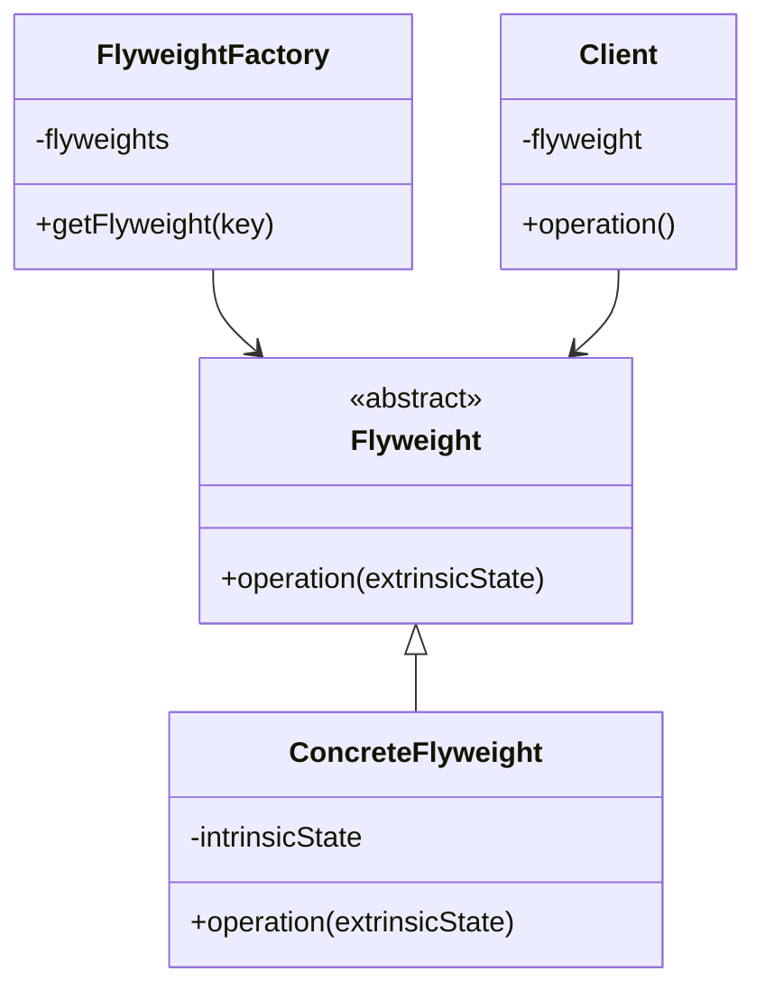
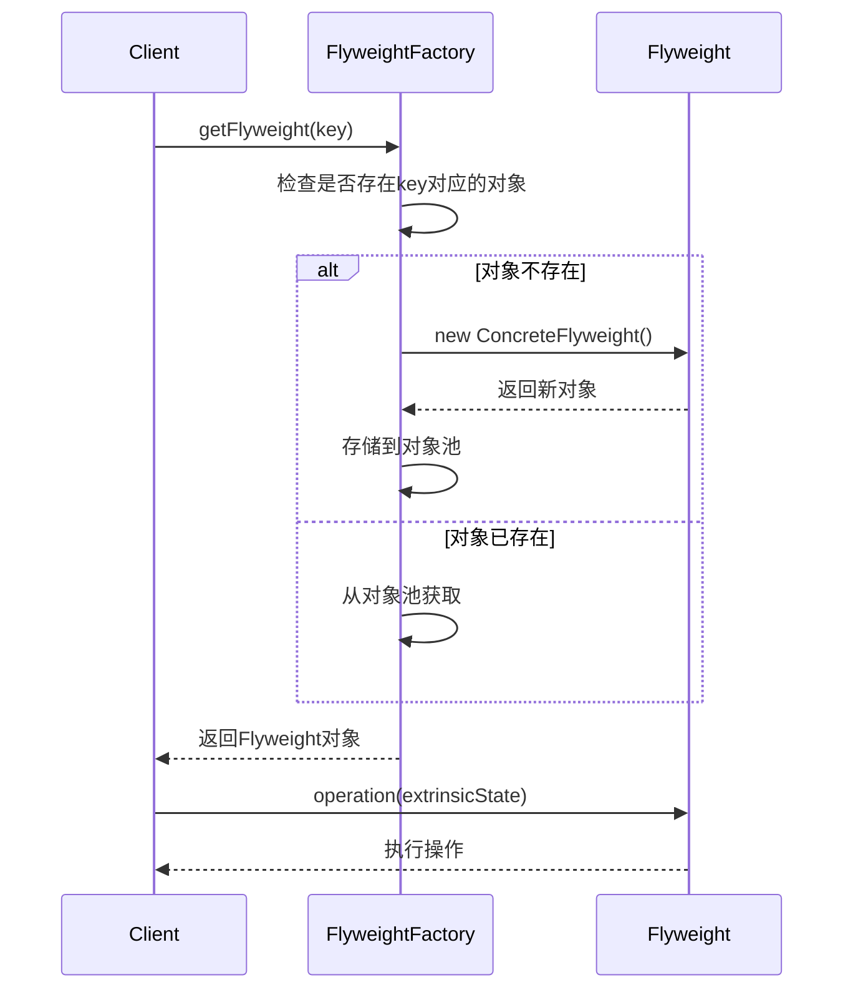
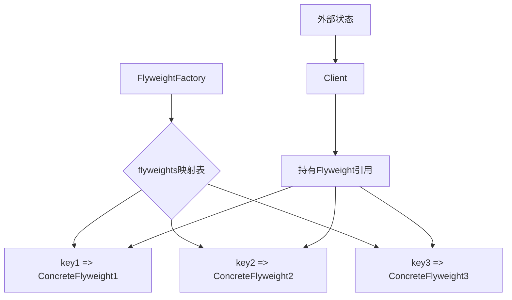
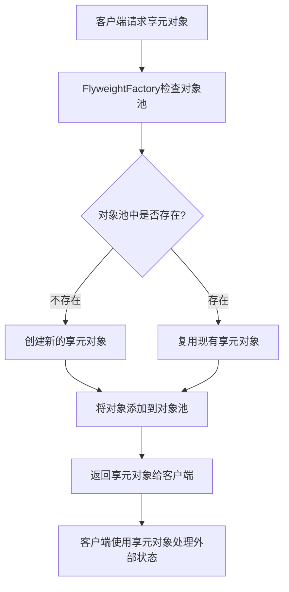

# 享元模式 (Flyweight Pattern)

## 1. 模式定义

享元模式是一种结构型设计模式，它通过共享多个对象的相同部分来最小化内存使用或计算开销。当系统中存在大量相似对象时，可以通过享元模式有效地减少对象数量，从而降低内存消耗。

## 2. 核心思想

享元模式的核心思想是将对象的状态分为：
- **内部状态（Intrinsic State）**：存储在享元对象内部，通常不会改变，可以被多个对象共享
- **外部状态（Extrinsic State）**：由客户端管理，随环境改变而改变，不可共享

通过分离这两种状态，享元模式可以在适当的时候复用对象，从而减少系统中对象的数量。

## 3. 适用场景

- 系统中存在大量相似对象
- 对象的大部分状态都可以外部化
- 使用对象的大部分状态都相同或可以分组
- 需要缓冲池的场景
- 内存使用是关键因素的场景

## 4. 优缺点

### 优点
- 大大减少对象的创建，降低系统的内存占用
- 提高系统性能，特别是在频繁创建和销毁对象的场景中
- 提高内存使用效率

### 缺点
- 提高了系统的复杂性，需要分离内部状态和外部状态
- 外部状态具有固有的不稳定性，可能影响系统性能
- 需要维护享元工厂和享元对象的管理机制

## 5. UML类图

## 6. 模式结构

### 6.1 主要角色

1. **Flyweight（抽象享元类）**
   - 定义一个接口，通过这个接口flyweight可以接受并作用于外部状态

2. **ConcreteFlyweight（具体享元类）**
   - 实现Flyweight接口
   - 为内部状态增加存储空间
   - 必须是可共享的，所存储的状态必须是内部的，即不随环境变化而变化

3. **UnsharedConcreteFlyweight（非共享具体享元类）**
   - 并非所有Flyweight的子类都需要被共享
   - Flyweight接口使共享成为可能，但并不强制共享

4. **FlyweightFactory（享元工厂类）**
   - 负责创建和管理享元对象
   - 确保合理地共享Flyweight，当用户请求一个Flyweight时，FlyweightFactory对象提供一个已经创建的实例或者创建一个新实例

5. **Client（客户端）**
   - 维持一个对Flyweight的引用
   - 计算或存储一个Flyweight的外部状态

## 7. 时序图

## 8. 数据结构图

## 9. 工作流程图

## 10. 实际应用示例

### 10.1 文本编辑器中的字符格式化

在文本编辑器中，字符的格式信息（如字体、大小、颜色）通常是有限的几种组合，而文档中可能包含成千上万个字符。通过享元模式，我们可以将这些格式信息作为内部状态共享，而将字符内容和位置作为外部状态传递。

### 10.2 游戏中的粒子系统

在游戏开发中，可能会有大量相似的粒子效果（如爆炸、烟雾等）。这些粒子的纹理和基本行为可以作为内部状态共享，而位置、速度等实时变化的数据作为外部状态处理。

### 10.3 数据库连接池

数据库连接的配置信息是固定的，可以作为内部状态共享，而具体的连接状态和事务信息作为外部状态处理。

## 11. 与其他模式的关系

- **与单例模式**：FlyweightFactory通常以单例模式实现，确保整个系统只有一个享元工厂实例
- **与工厂方法模式**：FlyweightFactory使用工厂方法来创建享元对象
- **与组合模式**：享元对象可以作为组合模式中的叶子节点

## 12. 常见问题和解决方案

### 12.1 线程安全问题

在多线程环境中，享元对象的共享可能导致线程安全问题。

**解决方案**：
1. 确保享元对象的内部状态是不可变的
2. 使用同步机制保护共享资源
3. 采用ThreadLocal为每个线程维护独立的外部状态

### 12.2 对象池管理问题

随着系统运行，对象池可能不断增长，占用过多内存。

**解决方案**：
1. 实现对象池大小限制机制
2. 使用LRU等策略淘汰不常用的对象
3. 提供清理接口定期清理对象池

### 12.3 外部状态管理复杂性

外部状态的管理和传递可能增加系统复杂性。

**解决方案**：
1. 封装外部状态到上下文对象中
2. 使用工厂模式创建包含外部状态的对象
3. 采用策略模式处理不同的外部状态组合

## 13. 最佳实践

1. **正确识别内部状态和外部状态**
   - 内部状态应该是不可变的、可共享的
   - 外部状态应该是可变的、不可共享的

2. **合理设计享元工厂**
   - 使用合适的键值策略来标识不同的享元对象
   - 考虑对象池的大小限制和清理机制

3. **注意线程安全**
   - 确保享元对象的线程安全性
   - 正确管理外部状态的并发访问

4. **性能监控**
   - 监控对象池的大小和使用情况
   - 分析享元模式对系统性能的影响

## 14. 总结

享元模式通过共享技术有效地支持大量细粒度的对象，从而降低系统内存消耗。它特别适用于以下情况：
- 系统中存在大量相似对象
- 对象的大部分状态都可以外部化
- 使用共享对象可以显著减少内存占用

在使用享元模式时，需要仔细区分内部状态和外部状态，合理设计享元工厂，并注意处理线程安全和对象池管理等问题。