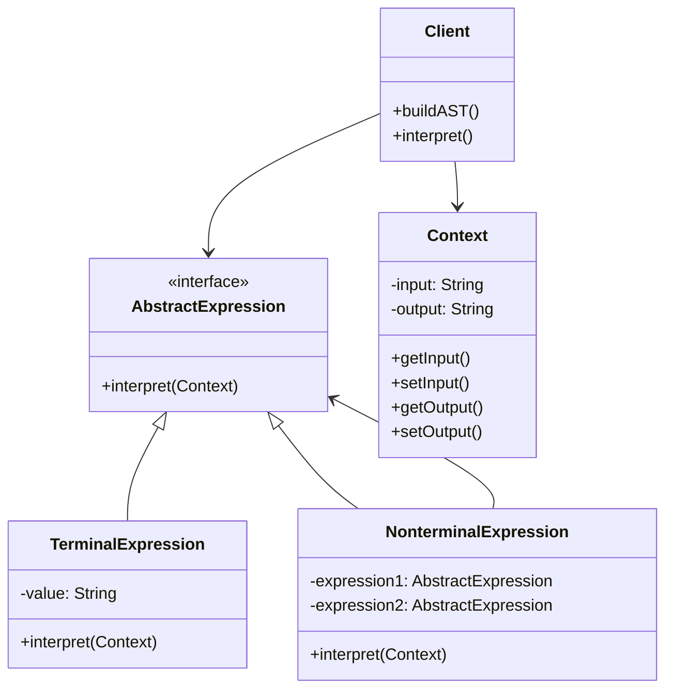
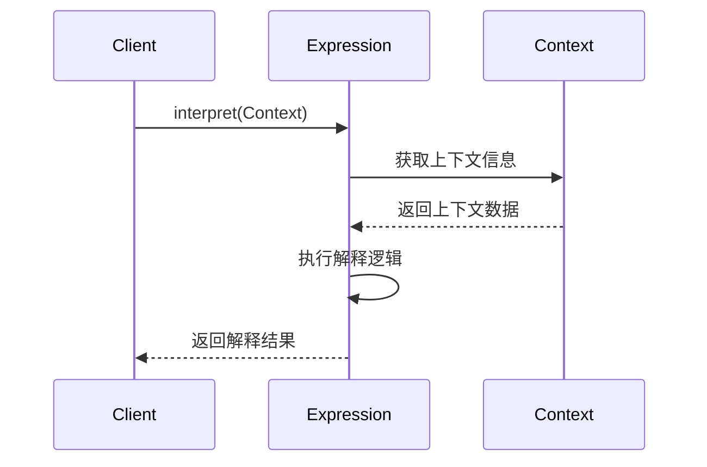
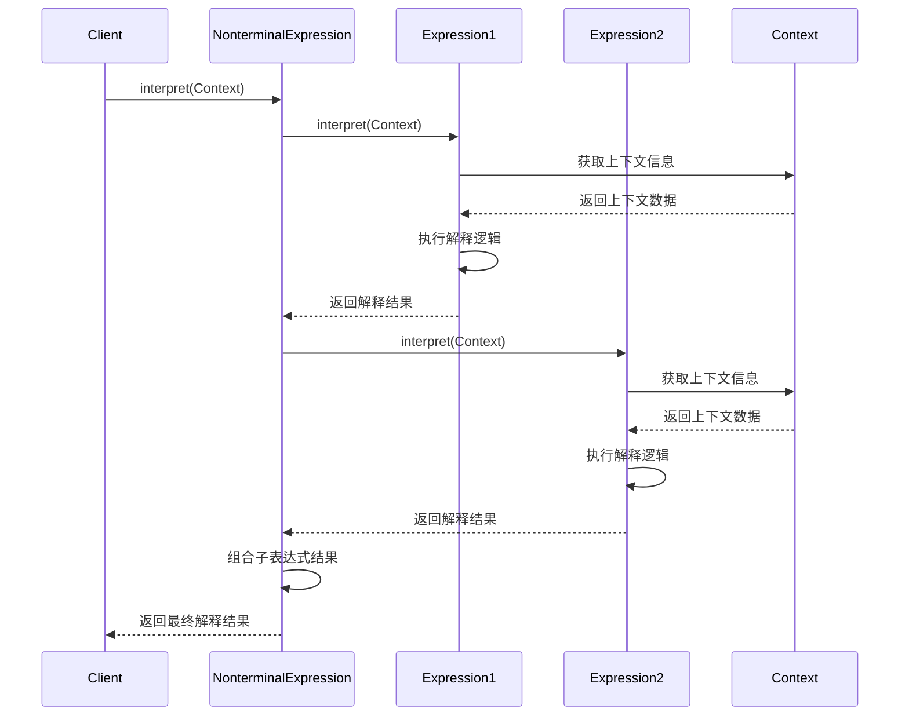
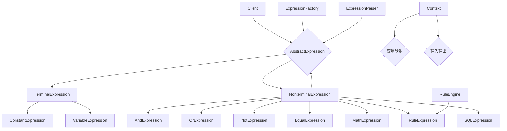
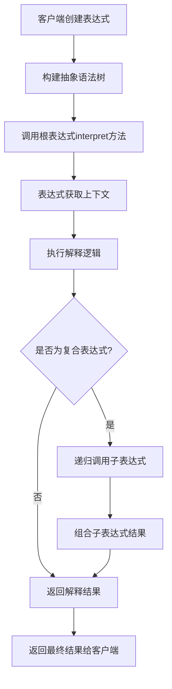
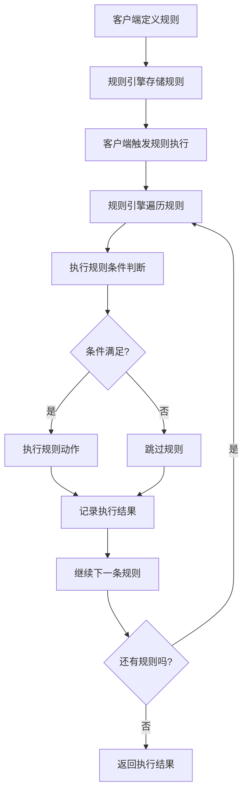

# 解释器模式 (Interpreter Pattern)

## 1. 模式定义

解释器模式是一种行为型设计模式，它给定一个语言，定义它的文法的一种表示，并定义一个解释器，这个解释器使用该表示来解释语言中的句子。解释器模式主要用于处理具有特定文法结构的语言或表达式。

## 2. 核心思想

解释器模式的核心思想是将一个语言的文法表示为一个抽象语法树，并为该语法树提供一个解释器。解释器模式通过递归地遍历抽象语法树来解释和执行语言中的句子。

## 3. 适用场景

- **简单的语言解释**：需要解释执行特定语言或表达式的场景
- **规则引擎**：需要动态定义和执行业务规则的系统
- **配置文件解析**：解析具有特定语法的配置文件
- **数学表达式计算**：计算数学表达式或公式
- **SQL解析**：解析和执行简单的SQL查询
- **模板引擎**：解析和渲染模板语言
- **DSL（领域特定语言）**：实现特定领域的语言解释器

## 4. 优缺点

### 优点
- **易于扩展**：可以很容易地添加新的表达式类型
- **易于实现**：对于简单的文法，实现起来相对简单
- **灵活性**：可以在运行时动态地组合和解释表达式
- **符合开闭原则**：添加新的解释表达式时不需要修改现有代码

### 缺点
- **类膨胀**：每个语法规则都需要一个类，可能导致类的数量急剧增加
- **性能问题**：对于复杂的文法，解释执行的性能可能不如编译执行
- **调试困难**：递归解释过程可能难以调试和理解
- **文法限制**：对于复杂的文法，使用解释器模式可能不太合适

## 5. UML类图



## 6. 模式结构

### 6.1 主要角色

1. **AbstractExpression（抽象表达式）**
   - 声明一个抽象的解释操作
   - 这个接口为抽象语法树中所有的节点所共享

2. **TerminalExpression（终结符表达式）**
   - 实现与文法中的终结符相关的解释操作
   - 句子中的每个终结符都需要该类的一个实例

3. **NonterminalExpression（非终结符表达式）**
   - 实现与文法中的非终结符相关的解释操作
   - 每个非终结符都需要一个类来实现
   - 维护抽象语法树中子节点的引用

4. **Context（上下文）**
   - 包含解释器之外的一些全局信息
   - 通常用来存储需要解释的表达式和解释结果

5. **Client（客户端）**
   - 构建表示文法定义的语言中一个特定句子的抽象语法树
   - 调用解释操作

### 6.2 解释器模式变体

1. **简单解释器**：只处理简单的表达式和规则
2. **复合解释器**：处理复杂的嵌套表达式
3. **上下文敏感解释器**：根据上下文环境进行不同的解释
4. **缓存解释器**：缓存解释结果以提高性能

## 7. 时序图

### 7.1 基本解释过程时序图



### 7.2 复合表达式解释时序图



## 8. 数据结构图



## 9. 工作流程图

### 9.1 表达式解释工作流程



### 9.2 规则引擎执行工作流程



## 10. 实际应用示例

### 10.1 正则表达式引擎

```java
// 正则表达式解释器示例
public class RegexExpression implements Expression {
    private Pattern pattern;
    
    public RegexExpression(String regex) {
        this.pattern = Pattern.compile(regex);
    }
    
    @Override
    public boolean interpret(Context context) {
        String input = context.getInput();
        return pattern.matcher(input).matches();
    }
}
```

### 10.2 配置文件解析

```java
// 配置表达式解释器示例
public class ConfigExpression implements Expression {
    private String key;
    private String expectedValue;
    
    public ConfigExpression(String key, String expectedValue) {
        this.key = key;
        this.expectedValue = expectedValue;
    }
    
    @Override
    public boolean interpret(Context context) {
        String actualValue = (String) context.getVariable(key);
        return expectedValue.equals(actualValue);
    }
}
```

### 10.3 权限控制系统

```java
// 权限表达式解释器示例
public class PermissionExpression implements Expression {
    private String permission;
    
    public PermissionExpression(String permission) {
        this.permission = permission;
    }
    
    @Override
    public boolean interpret(Context context) {
        Set<String> userPermissions = (Set<String>) context.getVariable("permissions");
        return userPermissions.contains(permission);
    }
}
```

## 11. 与其他模式的关系

- **与组合模式**：解释器模式通常使用组合模式来表示语法树，非终结符表达式包含其他表达式作为子节点
- **与享元模式**：对于大量重复的终结符表达式，可以使用享元模式来共享表达式对象
- **与访问者模式**：可以使用访问者模式来遍历和操作抽象语法树
- **与工厂模式**：表达式工厂用于创建不同类型的表达式对象
- **与策略模式**：不同的解释算法可以作为不同的策略来实现

## 12. 常见问题和解决方案

### 12.1 类膨胀问题

**问题**：每个语法规则都需要一个类，可能导致类的数量急剧增加

**解决方案**：
1. 使用泛型表达式类减少重复代码
2. 通过参数化配置来减少具体表达式类的数量
3. 使用函数式接口和Lambda表达式简化实现

### 12.2 性能问题

**问题**：对于复杂的文法，解释执行的性能可能不如编译执行

**解决方案**：
1. 实现表达式缓存机制
2. 使用编译技术将表达式编译为字节码
3. 对频繁使用的表达式进行预编译

### 12.3 调试困难

**问题**：递归解释过程可能难以调试和理解

**解决方案**：
1. 实现详细的日志记录机制
2. 提供表达式树的可视化功能
3. 实现表达式执行的跟踪功能

## 13. 最佳实践

1. **合理设计文法**
   - 保持文法简单清晰
   - 避免过于复杂的嵌套结构
   - 考虑文法的可扩展性

2. **使用工厂模式创建表达式**
   - 提供统一的表达式创建接口
   - 简化客户端代码
   - 便于表达式的管理和扩展

3. **实现上下文管理**
   - 提供灵活的上下文机制
   - 支持变量的动态绑定
   - 实现上下文的隔离和共享

4. **考虑性能优化**
   - 实现表达式缓存
   - 提供编译优化选项
   - 支持表达式的预处理

5. **提供良好的错误处理**
   - 实现详细的错误信息
   - 提供友好的错误提示
   - 支持错误恢复机制

## 14. 总结

解释器模式是一种强大的行为型设计模式，它为特定语言或表达式的解释执行提供了一种优雅的解决方案。它特别适用于以下情况：
- 需要解释执行具有特定文法结构的语言
- 需要动态定义和执行业务规则
- 需要解析和计算数学表达式
- 需要实现简单的查询语言或模板语言

在使用解释器模式时，需要注意文法的复杂性、类的数量控制以及性能优化等问题。通过合理的设计和实现，解释器模式可以为语言处理和表达式计算提供灵活而强大的支持。