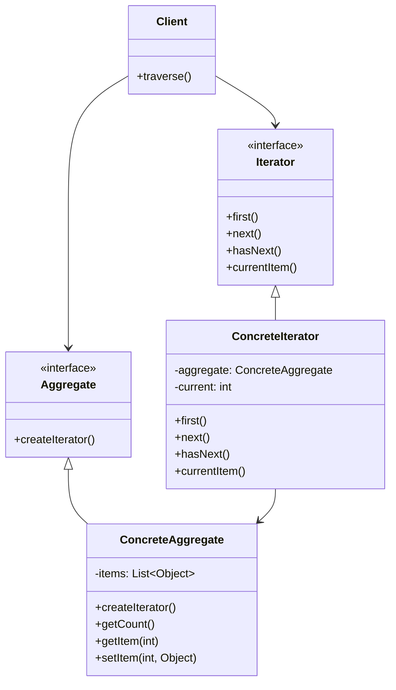
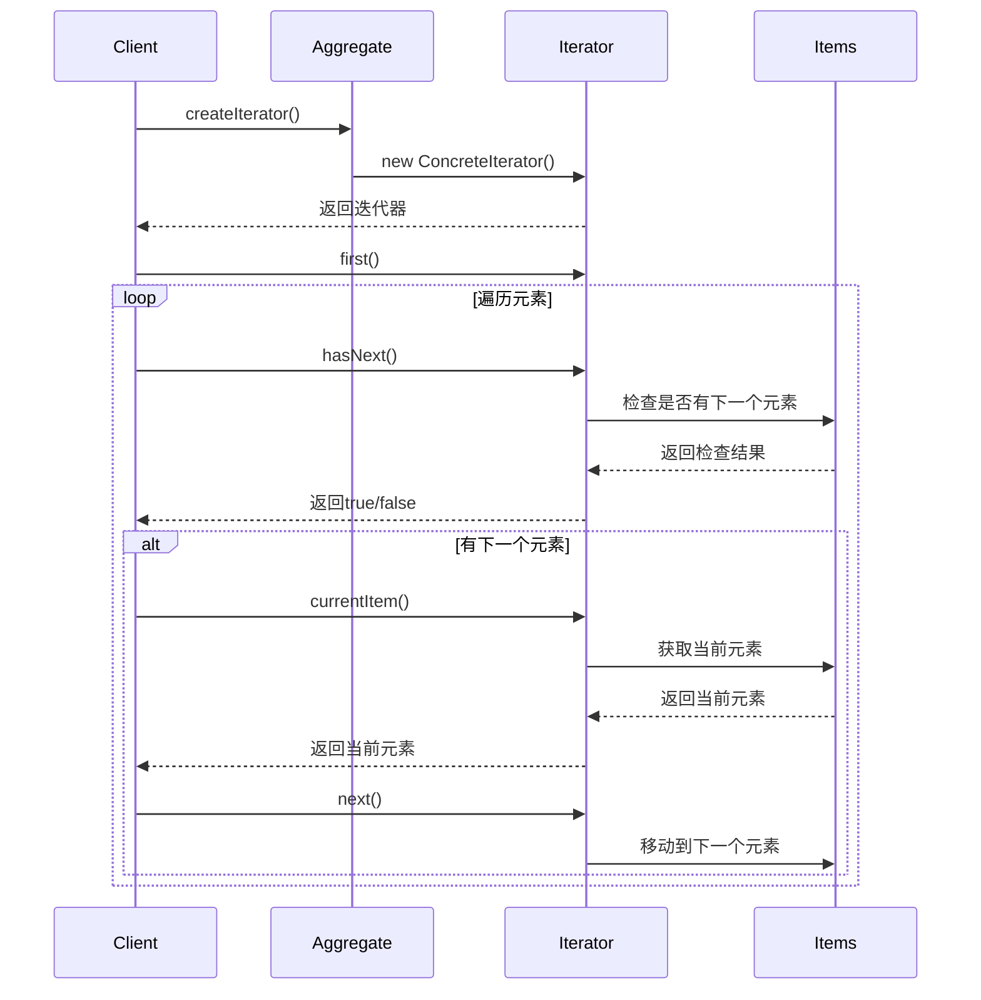
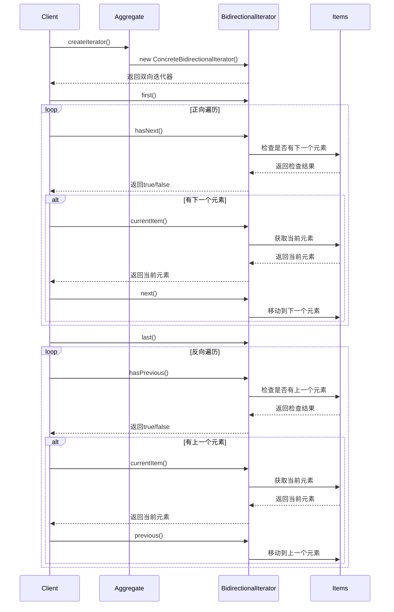
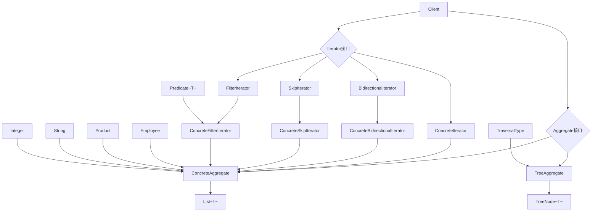
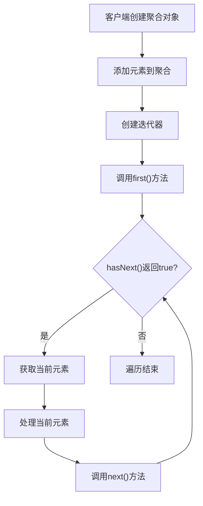
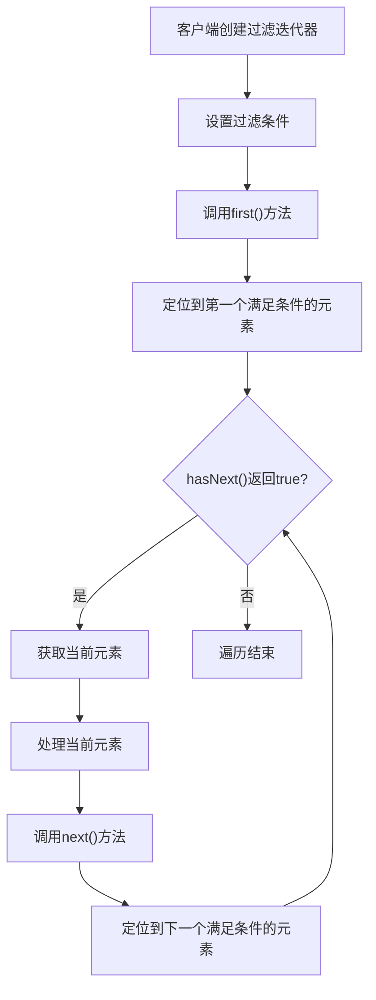

# 迭代器模式 (Iterator Pattern)

## 1. 模式定义

迭代器模式是一种行为型设计模式，它提供一种方法顺序访问一个聚合对象中的各个元素，而又不暴露该对象的内部表示。迭代器模式将聚合对象的遍历行为从聚合对象中分离出来，使得聚合对象的接口变得简洁，同时也使得遍历算法更加灵活。

## 2. 核心思想

迭代器模式的核心思想是将数据的遍历操作与数据的存储结构分离，提供一个统一的接口来访问不同的聚合结构（如列表、树、图等）中的元素。这样客户端可以使用相同的接口遍历不同的聚合对象，而不需要了解聚合对象的内部结构。

## 3. 适用场景

- **集合遍历**：需要遍历不同类型的集合对象
- **统一接口**：希望为不同的聚合结构提供统一的遍历接口
- **多种遍历方式**：需要支持多种遍历算法（正向、反向、层次遍历等）
- **隐藏内部结构**：不希望客户端了解聚合对象的内部实现细节
- **并发访问**：需要支持多个迭代器同时遍历同一个聚合对象
- **快照遍历**：需要在遍历过程中保持聚合对象的一致性状态

## 4. 优缺点

### 优点
- **简化聚合接口**：聚合对象不需要提供遍历接口，接口更加简洁
- **支持多种遍历**：可以为同一个聚合对象提供多种不同的迭代器
- **隐藏内部结构**：客户端不需要了解聚合对象的内部实现
- **统一访问接口**：提供统一的遍历接口，客户端代码更加简洁
- **易于扩展**：可以很容易地增加新的聚合对象和迭代器

### 缺点
- **增加复杂性**：对于简单的遍历操作，可能会增加系统的复杂性
- **性能开销**：创建迭代器对象会带来一定的内存开销
- **间接访问**：通过迭代器访问元素比直接访问元素稍慢

## 5. UML类图



## 6. 模式结构

### 6.1 主要角色

1. **Iterator（迭代器接口）**
   - 定义访问和遍历元素的接口
   - 声明了用于遍历数据元素的方法

2. **ConcreteIterator（具体迭代器）**
   - 实现迭代器接口
   - 负责对聚合对象的遍历
   - 跟踪当前遍历的位置

3. **Aggregate（聚合接口）**
   - 定义创建相应迭代器对象的接口
   - 声明一个createIterator()方法

4. **ConcreteAggregate（具体聚合）**
   - 实现聚合接口
   - 返回一个具体迭代器的实例
   - 持有聚合对象的数据

5. **Client（客户端）**
   - 使用迭代器访问聚合对象中的元素
   - 不需要了解聚合对象的内部结构

### 6.2 迭代器模式变体

1. **内部迭代器**：迭代器由聚合对象内部管理
2. **外部迭代器**：迭代器由客户端创建和控制
3. **快照迭代器**：基于聚合对象某个时刻的快照进行遍历
4. **双向迭代器**：支持正向和反向遍历
5. **层次迭代器**：用于遍历树形结构

## 7. 时序图

### 7.1 基本迭代器时序图



### 7.2 双向迭代器时序图



## 8. 数据结构图



## 9. 工作流程图

### 9.1 迭代器遍历工作流程



### 9.2 过滤迭代器工作流程



## 10. 实际应用示例

### 10.1 集合框架中的迭代器

```java
// Java集合框架中的迭代器使用示例
List<String> list = new ArrayList<>();
list.add("元素1");
list.add("元素2");
list.add("元素3");

// 使用迭代器遍历
Iterator<String> iterator = list.iterator();
while (iterator.hasNext()) {
    String element = iterator.next();
    System.out.println(element);
}

// 使用增强for循环（内部使用迭代器）
for (String element : list) {
    System.out.println(element);
}
```

### 10.2 数据库查询结果遍历

```java
// 数据库查询结果迭代器示例
public class DatabaseResultSetIterator implements Iterator<Record> {
    private ResultSet resultSet;
    private boolean hasNext;
    
    public DatabaseResultSetIterator(ResultSet resultSet) {
        this.resultSet = resultSet;
        try {
            this.hasNext = resultSet.next();
        } catch (SQLException e) {
            this.hasNext = false;
        }
    }
    
    @Override
    public boolean hasNext() {
        return hasNext;
    }
    
    @Override
    public Record next() {
        if (!hasNext) {
            throw new NoSuchElementException();
        }
        
        try {
            Record record = convertResultSetToRecord(resultSet);
            hasNext = resultSet.next();
            return record;
        } catch (SQLException e) {
            throw new RuntimeException(e);
        }
    }
    
    private Record convertResultSetToRecord(ResultSet rs) throws SQLException {
        // 转换逻辑
        return new Record(/* ... */);
    }
}
```

### 10.3 文件系统遍历

```java
// 文件系统遍历迭代器示例
public class FileSystemIterator implements Iterator<File> {
    private Queue<File> fileQueue;
    private File currentFile;
    
    public FileSystemIterator(File rootDir) {
        this.fileQueue = new LinkedList<>();
        this.fileQueue.offer(rootDir);
    }
    
    @Override
    public boolean hasNext() {
        return !fileQueue.isEmpty();
    }
    
    @Override
    public File next() {
        if (!hasNext()) {
            throw new NoSuchElementException();
        }
        
        currentFile = fileQueue.poll();
        
        // 如果是目录，添加其子文件到队列
        if (currentFile.isDirectory()) {
            File[] children = currentFile.listFiles();
            if (children != null) {
                for (File child : children) {
                    fileQueue.offer(child);
                }
            }
        }
        
        return currentFile;
    }
}
```

## 11. 与其他模式的关系

- **与组合模式**：迭代器模式经常与组合模式一起使用，用于遍历组合对象结构
- **与工厂模式**：聚合对象使用工厂模式创建相应的迭代器对象
- **与策略模式**：不同的迭代器实现可以看作是不同的遍历策略
- **与观察者模式**：迭代器可以用于遍历观察者列表
- **与装饰器模式**：可以使用装饰器模式为迭代器添加额外的功能

## 12. 常见问题和解决方案

### 12.1 并发修改异常

**问题**：在遍历过程中修改聚合对象可能导致ConcurrentModificationException

**解决方案**：
1. 使用同步机制保护聚合对象
2. 创建迭代器的快照副本
3. 使用fail-fast机制及时检测修改

### 12.2 性能问题

**问题**：对于大型集合，创建迭代器可能带来性能开销

**解决方案**：
1. 使用对象池管理迭代器对象
2. 对于简单遍历，考虑使用索引直接访问
3. 实现懒加载机制

### 12.3 内存泄漏

**问题**：迭代器持有对聚合对象的强引用可能导致内存泄漏

**解决方案**：
1. 使用弱引用来持有聚合对象
2. 及时释放不再使用的迭代器
3. 实现finalize方法进行资源清理

## 13. 最佳实践

1. **优先使用现有的迭代器实现**
   - 大多数情况下，使用Java集合框架提供的迭代器就足够了
   - 避免重复造轮子

2. **正确处理边界条件**
   - 确保迭代器能正确处理空集合
   - 处理迭代过程中的异常情况

3. **提供统一的遍历接口**
   - 为不同的聚合对象提供统一的迭代器接口
   - 简化客户端代码

4. **支持多种遍历方式**
   - 根据需求提供不同的迭代器实现
   - 支持正向、反向、跳过、过滤等遍历方式

5. **考虑线程安全性**
   - 在多线程环境中正确同步迭代器
   - 考虑使用不可变的快照迭代器

## 14. 总结

迭代器模式是一种非常实用的行为型设计模式，它将集合对象的遍历行为从集合对象中分离出来，使得集合对象的接口变得简洁，同时也使得遍历算法更加灵活。迭代器模式特别适用于以下情况：

- 需要为不同的聚合结构提供统一的遍历接口
- 需要支持多种遍历算法
- 不希望客户端了解聚合对象的内部实现细节
- 需要支持多个迭代器同时遍历同一个聚合对象

在现代Java开发中，迭代器模式已经被广泛应用，从Java集合框架到各种第三方库，都可以看到迭代器模式的身影。正确理解和使用迭代器模式，对于编写高质量的Java代码具有重要意义。