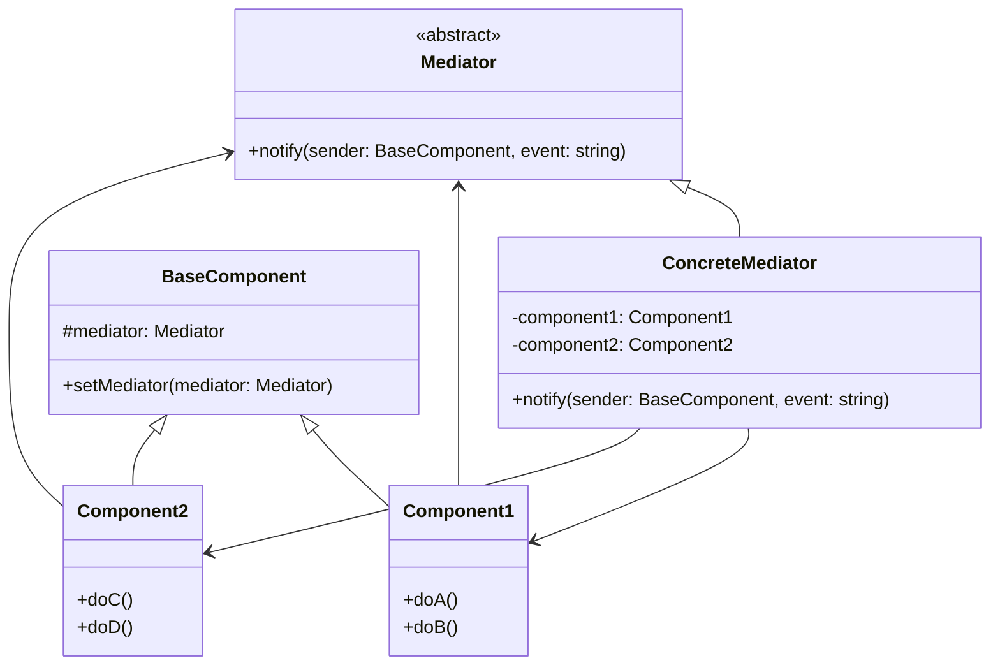

# 中介者模式 (Mediator Pattern)

## 1. 模式定义

中介者模式是一种行为设计模式，它能减少对象之间的直接通信，迫使它们通过一个中介对象进行合作，从而降低对象之间的耦合度。

## 2. 解决的问题

在复杂的系统中，多个对象之间可能存在复杂的引用关系，导致系统结构混乱且难以维护。中介者模式通过引入一个中介者对象来封装一系列对象之间的交互，使得各个对象不需要显式地相互引用，从而降低系统的耦合度。

## 3. UML 类图

## 4. 适用场景

1. 系统中对象之间存在复杂的引用关系，导致结构混乱且难以理解
2. 一个对象由于引用了其他很多对象并且直接与这些对象通信，导致难以复用该对象
3. 想要通过一个中间类来封装多个类中的行为，而又不想生成太多的子类

## 5. 优缺点

### 优点
- 降低了系统中对象之间的耦合性
- 提高了系统的可维护性和可扩展性
- 简化了对象之间的交互
- 将多个对象间复杂的协作方法抽离到中介者中，使各个对象关注自身的功能

### 缺点
- 中介者类可能会变得非常复杂，难以维护
- 中介者类集中了所有的协作逻辑，一旦中介者类出现问题，整个系统都会受到影响

## 6. 实际应用场景

1. **聊天室系统**：用户之间不直接通信，而是通过聊天室（中介者）转发消息
2. **机场管制系统**：飞机不直接与其他飞机通信，而是通过塔台（中介者）协调
3. **GUI组件交互**：按钮、文本框等组件通过窗体（中介者）进行交互
4. **MVC架构**：控制器作为视图和模型之间的中介者

## 7. 与其他模式的关系

- **观察者模式**：中介者模式可以通过观察者模式来实现各个组件与中介者之间的通信
- **外观模式**：外观模式为子系统提供一个简化的接口，而中介者模式则是对组件间复杂关系的解耦
- **命令模式**：可以结合使用，中介者使用命令对象来封装请求

## 8. 实现要点

1. 明确哪些对象之间存在复杂的交互关系
2. 设计中介者接口，定义需要处理的事件类型
3. 实现具体中介者类，处理各个组件之间的协作逻辑
4. 修改原有组件，使其持有中介者引用并通过中介者进行通信
5. 确保组件之间的直接依赖关系被移除，转而通过中介者交互

## 9. 注意事项

1. 避免中介者类变得过于庞大和复杂
2. 注意中介者与组件之间的职责划分
3. 考虑使用观察者模式来实现组件与中介者之间的松耦合通信
4. 在系统设计初期就要考虑是否需要引入中介者模式