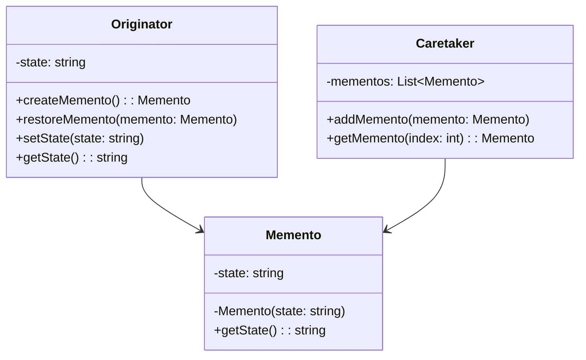

# 备忘录模式 (Memento Pattern)

## 1. 模式定义

备忘录模式是一种行为设计模式，它允许在不破坏封装性的前提下，捕获一个对象的内部状态，并在该对象之外保存这个状态，以便日后可以将该对象恢复到原先保存的状态。

## 2. 解决的问题

在某些应用中，我们需要提供撤销操作或者状态恢复功能。如果直接暴露对象的内部状态，会破坏对象的封装性。备忘录模式通过引入一个备忘录对象来存储原发器对象的内部状态，从而解决了这个问题。

## 3. UML 类图

## 4. 角色说明

1. **Originator（原发器）**：需要保存和恢复状态的对象，创建备忘录和从备忘录恢复状态
2. **Memento（备忘录）**：存储原发器内部状态的对象，防止原发器以外的其他对象访问这些状态
3. **Caretaker（负责人）**：负责保存备忘录，但不能对备忘录的内容进行操作或检查

## 5. 适用场景

1. **撤销操作**：需要实现撤销功能的应用程序
2. **状态恢复**：需要在某个时刻恢复对象状态的场景
3. **事务回滚**：数据库事务回滚机制
4. **游戏存档**：游戏中保存和加载进度功能
5. **编辑器历史**：文本编辑器的撤销/重做功能
6. **浏览器历史**：网页浏览器的后退功能

## 6. 优缺点

### 优点
- 保护对象封装性：备忘录对象可以防止Originator以外的其他对象访问内部状态
- 简化Originator类：Originator不需要保存历史状态的逻辑
- 提供状态恢复机制：可以方便地实现撤销操作

### 缺点
- 消耗资源：如果需要保存大量状态信息，可能会消耗大量内存
- 可能违反封装原则：在某些实现中，需要原发器暴露内部状态给备忘录
- 管理复杂：需要管理备忘录的生命周期

## 7. 实际应用场景

1. **文本编辑器**：Ctrl+Z撤销功能
2. **游戏存档**：保存游戏进度，随时可以加载之前的存档
3. **数据库事务**：事务回滚机制
4. **IDE调试器**：断点恢复功能
5. **浏览器历史**：页面后退功能
6. **绘图软件**：撤销绘制操作

## 8. 与其他模式的关系

- **命令模式**：可以结合使用，命令对象可以存储备忘录以实现撤销操作
- **原型模式**：备忘录可以使用原型模式来创建原发器状态的快照
- **状态模式**：可以与状态模式结合使用，每个状态都可以保存为备忘录

## 9. 实现要点

1. **状态封装**：备忘录对象应该封装原发器的内部状态
2. **访问控制**：只有原发器可以访问备忘录中的状态
3. **生命周期管理**：合理管理备忘录对象的创建和销毁
4. **性能考虑**：对于大型对象，考虑使用增量备份或状态压缩

## 10. 注意事项

1. **内存管理**：避免保存过多的备忘录对象导致内存泄漏
2. **状态一致性**：确保备忘录保存的状态是一致的
3. **线程安全**：在多线程环境中使用时要考虑线程安全问题
4. **序列化**：考虑备忘录对象的序列化和持久化存储