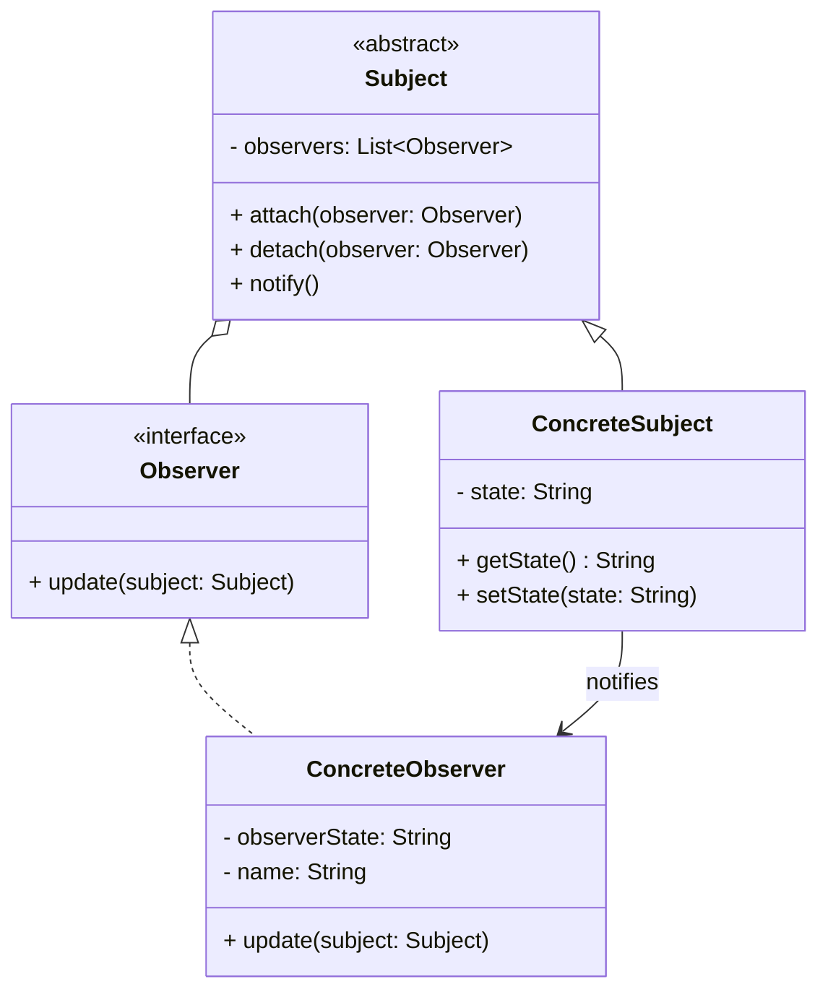
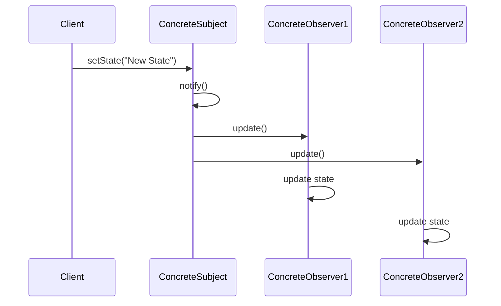
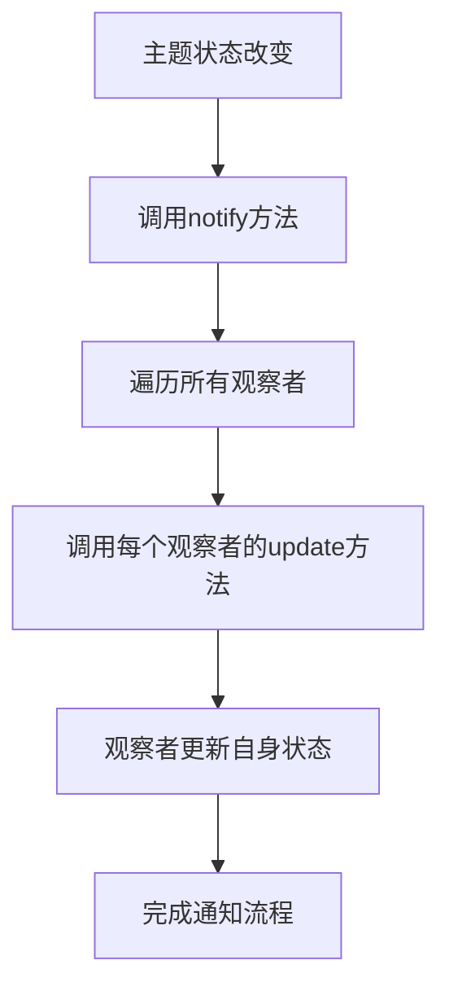
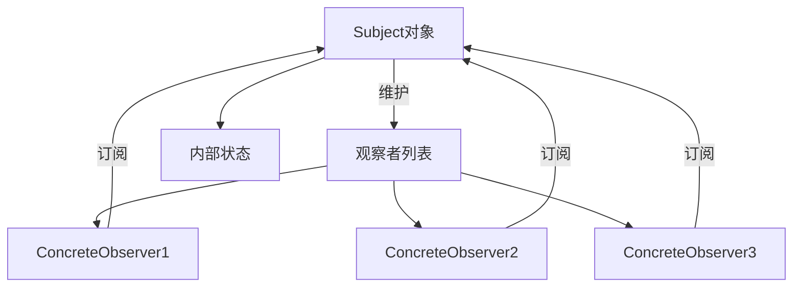
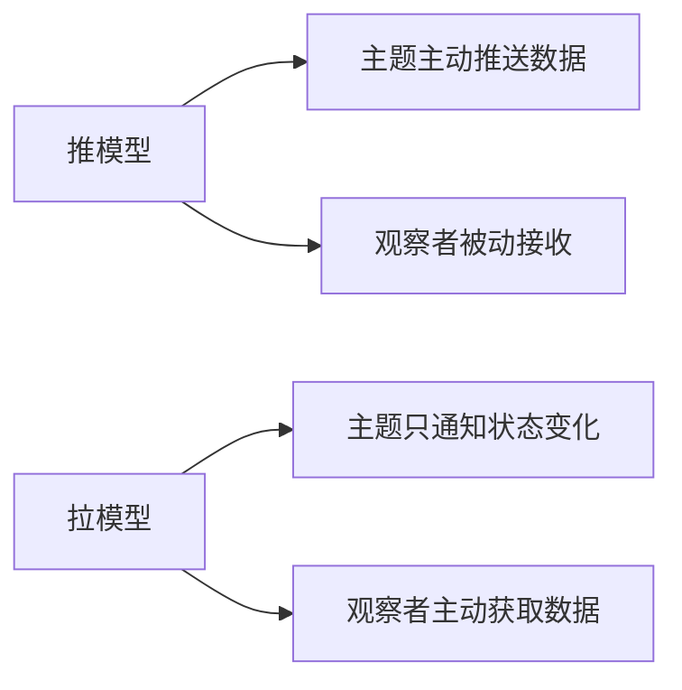
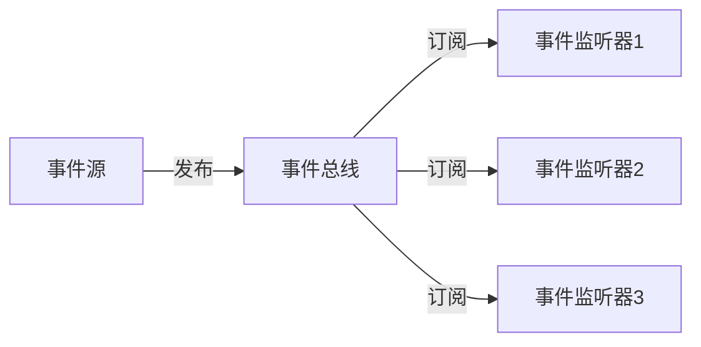

## 6. UML类图

```mermaid
classDiagram
    class Subject {
        <<abstract>>
        - observers: List~Observer~
        + attach(observer: Observer)
        + detach(observer: Observer)
        + notify()
    }
    
    class Observer {
        <<interface>>
        + update(subject: Subject)
    }
    
    class ConcreteSubject {
        - state: String
        + getState() String
        + setState(state: String)
    }
    
    class ConcreteObserver {
        - observerState: String
        - name: String
        + update(subject: Subject)
    }
    
    Subject <|-- ConcreteSubject
    Subject o-- Observer
    Observer <|.. ConcreteObserver
    ConcreteSubject --> ConcreteObserver : notifies
```

## 7. 时序图

```mermaid
sequenceDiagram
    participant C as Client
    participant CS as ConcreteSubject
    participant CO1 as ConcreteObserver1
    participant CO2 as ConcreteObserver2
    
    C->>CS: setState("New State")
    CS->>CS: notify()
    CS->>CO1: update()
    CS->>CO2: update()
    CO1->>CO1: update state
    CO2->>CO2: update state
```

## 8. 状态变化流程图

```mermaid
flowchart TD
    A[主题状态改变] --> B[调用notify方法]
    B --> C[遍历所有观察者]
    C --> D[调用每个观察者的update方法]
    D --> E[观察者更新自身状态]
    E --> F[完成通知流程]
```

## 9. 数据结构图

```mermaid
graph TD
    Subject[Subject对象] -->|维护| ObserverList[观察者列表]
    ObserverList --> Observer1[ConcreteObserver1]
    ObserverList --> Observer2[ConcreteObserver2]
    ObserverList --> Observer3[ConcreteObserver3]
    
    Subject --> State[内部状态]
    
    Observer1 -->|订阅| Subject
    Observer2 -->|订阅| Subject
    Observer3 -->|订阅| Subject
```

## 10. 观察者模式变体

### 10.1 推模型 vs 拉模型

```mermaid
graph LR
    A[推模型] --> B[主题主动推送数据]
    A --> C[观察者被动接收]
    
    D[拉模型] --> E[主题只通知状态变化]
    D --> F[观察者主动获取数据]
```

### 10.2 事件驱动架构

```mermaid
graph LR
    Event[事件源] -->|发布| EventBus[事件总线]
    EventBus -->|订阅| Listener1[事件监听器1]
    EventBus -->|订阅| Listener2[事件监听器2]
    EventBus -->|订阅| Listener3[事件监听器3]
```