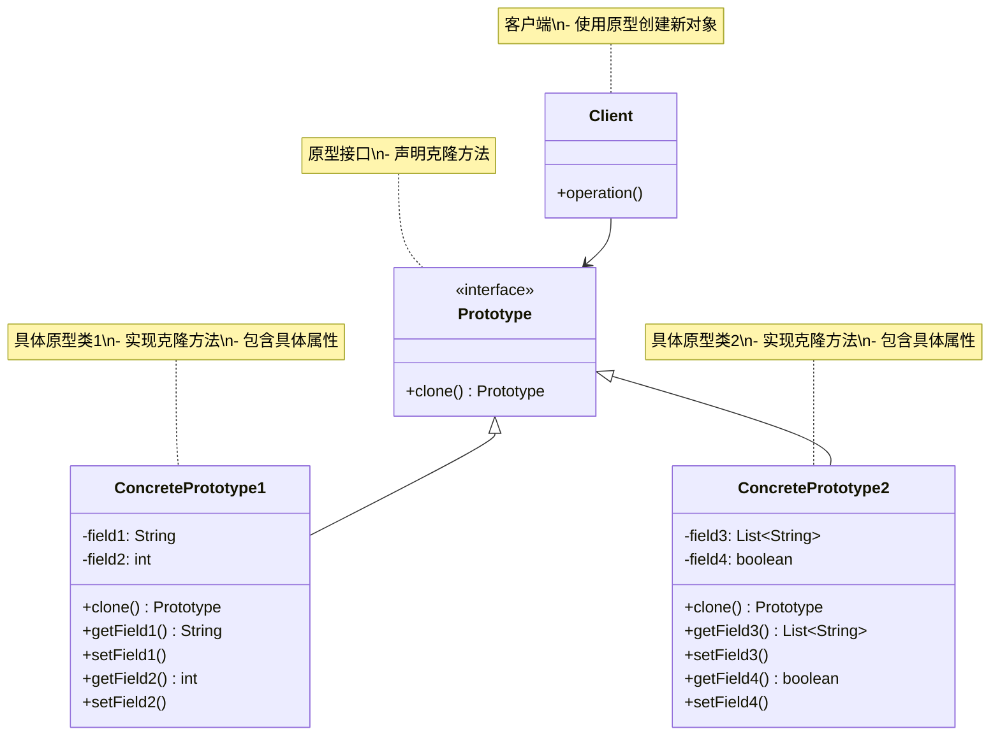
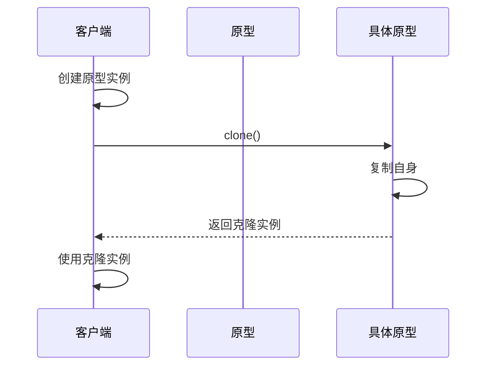
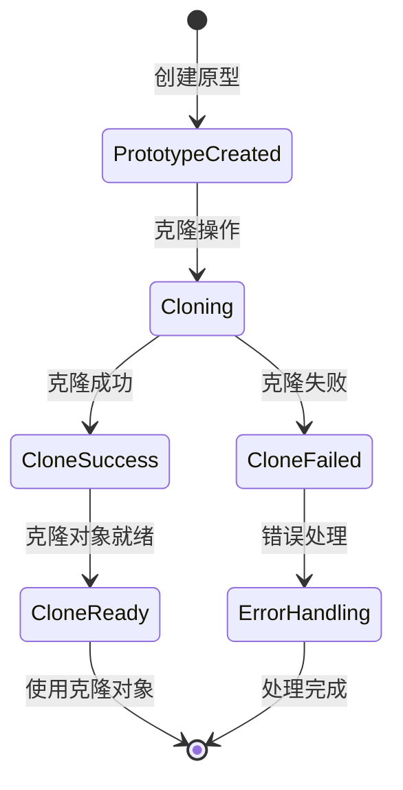

# 原型模式 (Prototype Pattern) 详解

## 1. 模式定义

原型模式是一种创建型设计模式，它允许通过复制现有实例来创建新的实例，而无需知道其具体类。原型模式通过指定要创建的对象类型实例，然后通过复制该原型来创建新的对象。

## 2. 模式动机

在软件开发中，我们经常需要创建对象。通常使用构造函数或工厂方法来创建对象，但在某些情况下，这种方式可能不够灵活或效率低下：

1. **创建成本高**：某些对象的创建过程非常复杂或耗时，比如需要进行数据库查询、网络请求或大量计算
2. **类结构复杂**：对象的创建需要动态决定类型，而这些类型在编译时无法确定
3. **避免子类化**：当需要创建的对象类型较多时，使用工厂方法会产生大量子类
4. **简化对象创建**：希望简化对象的创建过程，避免复杂的初始化逻辑

原型模式通过复制现有对象来创建新对象，避免了复杂的创建过程，提高了性能。

## 3. UML 类图



## 4. 角色分析

1. **Prototype（原型）**：声明一个克隆自身的接口
2. **ConcretePrototype（具体原型）**：实现克隆自身的操作
3. **Client（客户端）**：让一个原型克隆自身从而创建一个新的对象

## 5. 时序图

### 5.1 基本时序图



## 6. 实现方式

### 6.1 基本实现 (浅克隆)

```java
// 原型接口
public interface Prototype {
    Prototype clone();
}

// 具体原型类 - 浅克隆
public class ConcretePrototype implements Prototype, Cloneable {
    private String field1;
    private int field2;
    
    public ConcretePrototype(String field1, int field2) {
        this.field1 = field1;
        this.field2 = field2;
    }
    
    @Override
    public Prototype clone() {
        try {
            return (ConcretePrototype) super.clone();
        } catch (CloneNotSupportedException e) {
            throw new RuntimeException("克隆失败", e);
        }
    }
    
    // getter和setter方法
    public String getField1() {
        return field1;
    }
    
    public void setField1(String field1) {
        this.field1 = field1;
    }
    
    public int getField2() {
        return field2;
    }
    
    public void setField2(int field2) {
        this.field2 = field2;
    }
    
    @Override
    public String toString() {
        return "ConcretePrototype{field1='" + field1 + "', field2=" + field2 + "}";
    }
}
```

### 6.2 深克隆实现

```java
import java.util.ArrayList;
import java.util.List;

// 具体原型类 - 深克隆
public class DeepClonePrototype implements Prototype, Cloneable {
    private String name;
    private List<String> tags;
    private Address address;
    
    public DeepClonePrototype(String name, List<String> tags, Address address) {
        this.name = name;
        this.tags = new ArrayList<>(tags);
        this.address = address;
    }
    
    @Override
    public Prototype clone() {
        try {
            // 浅克隆
            DeepClonePrototype cloned = (DeepClonePrototype) super.clone();
            
            // 深克隆 - 复制可变对象
            cloned.tags = new ArrayList<>(this.tags);
            
            // 深克隆 - 复制引用对象
            if (this.address != null) {
                cloned.address = this.address.clone();
            }
            
            return cloned;
        } catch (CloneNotSupportedException e) {
            throw new RuntimeException("深克隆失败", e);
        }
    }
    
    // getter和setter方法
    public String getName() {
        return name;
    }
    
    public void setName(String name) {
        this.name = name;
    }
    
    public List<String> getTags() {
        return tags;
    }
    
    public void setTags(List<String> tags) {
        this.tags = tags;
    }
    
    public Address getAddress() {
        return address;
    }
    
    public void setAddress(Address address) {
        this.address = address;
    }
    
    @Override
    public String toString() {
        return "DeepClonePrototype{name='" + name + "', tags=" + tags + ", address=" + address + "}";
    }
}

// 地址类 - 可克隆
public class Address implements Cloneable {
    private String street;
    private String city;
    
    public Address(String street, String city) {
        this.street = street;
        this.city = city;
    }
    
    public Address clone() {
        try {
            return (Address) super.clone();
        } catch (CloneNotSupportedException e) {
            throw new RuntimeException("地址克隆失败", e);
        }
    }
    
    // getter和setter方法
    public String getStreet() {
        return street;
    }
    
    public void setStreet(String street) {
        this.street = street;
    }
    
    public String getCity() {
        return city;
    }
    
    public void setCity(String city) {
        this.city = city;
    }
    
    @Override
    public String toString() {
        return "Address{street='" + street + "', city='" + city + "'}";
    }
}
```

### 6.3 序列化实现深克隆

```java
import java.io.*;

// 使用序列化实现深克隆
public class SerializationPrototype implements Serializable {
    private static final long serialVersionUID = 1L;
    
    private String name;
    private List<String> tags;
    private Address address;
    
    public SerializationPrototype(String name, List<String> tags, Address address) {
        this.name = name;
        this.tags = new ArrayList<>(tags);
        this.address = address;
    }
    
    // 通过序列化实现深克隆
    public SerializationPrototype deepClone() {
        try {
            // 序列化
            ByteArrayOutputStream bos = new ByteArrayOutputStream();
            ObjectOutputStream oos = new ObjectOutputStream(bos);
            oos.writeObject(this);
            
            // 反序列化
            ByteArrayInputStream bis = new ByteArrayInputStream(bos.toByteArray());
            ObjectInputStream ois = new ObjectInputStream(bis);
            return (SerializationPrototype) ois.readObject();
        } catch (IOException | ClassNotFoundException e) {
            throw new RuntimeException("序列化克隆失败", e);
        }
    }
    
    // getter和setter方法
    public String getName() {
        return name;
    }
    
    public void setName(String name) {
        this.name = name;
    }
    
    public List<String> getTags() {
        return tags;
    }
    
    public void setTags(List<String> tags) {
        this.tags = tags;
    }
    
    public Address getAddress() {
        return address;
    }
    
    public void setAddress(Address address) {
        this.address = address;
    }
    
    @Override
    public String toString() {
        return "SerializationPrototype{name='" + name + "', tags=" + tags + ", address=" + address + "}";
    }
}
```

### 6.4 注册表实现

```java
import java.util.HashMap;
import java.util.Map;

// 原型管理器
public class PrototypeManager {
    private static Map<String, Prototype> prototypes = new HashMap<>();
    
    // 注册原型
    public static void registerPrototype(String key, Prototype prototype) {
        prototypes.put(key, prototype);
    }
    
    // 获取原型
    public static Prototype getPrototype(String key) {
        return prototypes.get(key).clone();
    }
    
    // 移除原型
    public static void removePrototype(String key) {
        prototypes.remove(key);
    }
    
    // 获取所有原型键
    public static String[] getKeys() {
        return prototypes.keySet().toArray(new String[0]);
    }
}
```

## 7. 状态图



## 8. 实际应用场景

1. **对象创建成本高**：需要频繁创建相似对象，且创建过程复杂耗时
2. **图形编辑器**：复制图形对象，如复制粘贴功能
3. **游戏开发**：复制游戏对象，如敌人、道具等
4. **文档编辑器**：复制文档模板或样式
5. **缓存系统**：通过克隆缓存对象来提高性能
6. **配置管理**：复制配置对象并进行个性化调整
7. **数据库记录复制**：复制数据库记录对象
8. **测试数据生成**：通过克隆基础测试数据生成不同的测试用例

## 9. 常见问题及解决方案

### 9.1 浅克隆 vs 深克隆

**问题**：浅克隆只复制对象本身，不复制引用对象，可能导致数据共享问题

**解决方案**：
1. 根据实际需求选择浅克隆或深克隆
2. 对于包含可变对象的类，使用深克隆
3. 可以通过序列化方式实现深克隆

### 9.2 克隆NotSupportedException

**问题**：调用clone()方法时抛出CloneNotSupportedException异常

**解决方案**：
1. 确保类实现了Cloneable接口
2. 正确处理异常，提供友好的错误信息
3. 考虑使用其他克隆方式，如序列化或构造函数

### 9.3 循环引用问题

**问题**：对象之间存在循环引用，导致克隆时出现无限递归

**解决方案**：
1. 使用序列化方式进行克隆
2. 实现自定义的克隆逻辑，处理循环引用
3. 使用专门的克隆库，如Apache Commons Lang的SerializationUtils

### 9.4 性能问题

**问题**：深克隆操作性能较差，影响系统性能

**解决方案**：
1. 评估是否真的需要深克隆
2. 对于频繁克隆的对象，考虑使用对象池
3. 优化克隆逻辑，避免不必要的复制操作

## 10. 与其他模式的关系

1. **与工厂方法模式**：原型模式可以作为工厂方法模式的替代方案，用于创建对象
2. **与单例模式**：原型模式通常与单例模式相反，用于创建多个实例
3. **与组合模式**：在组合模式中，可以使用原型模式来复制复杂的树形结构
4. **与装饰器模式**：原型模式可以与装饰器模式结合使用，复制装饰后的对象

## 11. 优缺点分析

### 11.1 优点

1. **性能提升**：对于创建复杂对象，原型模式通常比直接new一个新对象更高效
2. **简化对象创建**：隐藏了对象创建的复杂细节，客户端只需知道原型
3. **动态配置**：可以在运行时动态增加或减少产品类，便于扩展
4. **避免复杂的构造函数**：不需要记住复杂的初始化参数，通过复制现有对象即可

### 11.2 缺点

1. **深克隆复杂**：实现深克隆需要编写复杂的代码，特别是处理循环引用时
2. **违背开闭原则**：需要修改原有类的实现，违反了开闭原则
3. **需要Cloneable接口**：Java中需要实现Cloneable接口，增加了类的复杂性
4. **可能隐藏设计问题**：过度使用原型模式可能掩盖了类设计中的问题

## 12. 最佳实践

1. **合理选择克隆方式**：根据对象结构选择浅克隆或深克隆
2. **正确实现Cloneable接口**：确保类正确实现Cloneable接口和clone()方法
3. **处理异常情况**：妥善处理CloneNotSupportedException等异常
4. **考虑性能影响**：评估克隆操作对系统性能的影响
5. **使用注册表管理**：对于多个原型对象，使用注册表进行统一管理
6. **文档说明**：明确说明原型的使用方式和注意事项

## 13. 代码示例场景

以一个文档编辑器中的样式模板系统为例，说明原型模式的使用：

```java
import java.util.*;

// 文档样式原型
public class DocumentStyle implements Prototype, Cloneable {
    private String fontFamily;
    private int fontSize;
    private String color;
    private List<String> effects;
    
    public DocumentStyle(String fontFamily, int fontSize, String color) {
        this.fontFamily = fontFamily;
        this.fontSize = fontSize;
        this.color = color;
        this.effects = new ArrayList<>();
    }
    
    @Override
    public Prototype clone() {
        try {
            DocumentStyle cloned = (DocumentStyle) super.clone();
            cloned.effects = new ArrayList<>(this.effects);
            return cloned;
        } catch (CloneNotSupportedException e) {
            throw new RuntimeException("样式克隆失败", e);
        }
    }
    
    // 添加特效
    public DocumentStyle addEffect(String effect) {
        this.effects.add(effect);
        return this;
    }
    
    // getter和setter方法
    public String getFontFamily() {
        return fontFamily;
    }
    
    public void setFontFamily(String fontFamily) {
        this.fontFamily = fontFamily;
    }
    
    public int getFontSize() {
        return fontSize;
    }
    
    public void setFontSize(int fontSize) {
        this.fontSize = fontSize;
    }
    
    public String getColor() {
        return color;
    }
    
    public void setColor(String color) {
        this.color = color;
    }
    
    public List<String> getEffects() {
        return effects;
    }
    
    public void setEffects(List<String> effects) {
        this.effects = effects;
    }
    
    @Override
    public String toString() {
        return "DocumentStyle{fontFamily='" + fontFamily + "', fontSize=" + fontSize + 
               ", color='" + color + "', effects=" + effects + "}";
    }
}

// 样式管理器
public class StyleManager {
    private static Map<String, DocumentStyle> styles = new HashMap<>();
    
    static {
        // 初始化默认样式
        styles.put("default", new DocumentStyle("Arial", 12, "black"));
        styles.put("heading", new DocumentStyle("Times New Roman", 18, "blue").addEffect("bold"));
        styles.put("emphasis", new DocumentStyle("Arial", 12, "red").addEffect("italic"));
    }
    
    // 获取样式克隆
    public static DocumentStyle getStyle(String name) {
        DocumentStyle style = styles.get(name);
        return style != null ? (DocumentStyle) style.clone() : null;
    }
    
    // 注册新样式
    public static void registerStyle(String name, DocumentStyle style) {
        styles.put(name, style);
    }
    
    // 获取所有样式名称
    public static Set<String> getStyleNames() {
        return styles.keySet();
    }
}

// 客户端使用示例
public class DocumentEditor {
    public static void main(String[] args) {
        // 使用默认样式
        DocumentStyle headingStyle = StyleManager.getStyle("heading");
        headingStyle.setFontSize(24); // 个性化调整
        System.out.println("标题样式: " + headingStyle);
        
        // 使用强调样式
        DocumentStyle emphasisStyle = StyleManager.getStyle("emphasis");
        emphasisStyle.addEffect("underline"); // 添加下划线效果
        System.out.println("强调样式: " + emphasisStyle);
        
        // 创建新样式并注册
        DocumentStyle codeStyle = StyleManager.getStyle("default");
        codeStyle.setFontFamily("Courier New");
        codeStyle.setColor("green");
        codeStyle.addEffect("monospace");
        StyleManager.registerStyle("code", codeStyle);
        
        // 使用新注册的样式
        DocumentStyle newCodeStyle = StyleManager.getStyle("code");
        System.out.println("代码样式: " + newCodeStyle);
    }
}
```

## 14. 总结

原型模式是一种非常实用的创建型设计模式，它通过复制现有对象来创建新对象，避免了复杂的创建过程。虽然实现深克隆需要编写复杂的代码，但在需要频繁创建相似对象的场景下，原型模式能显著提高性能。

在实际应用中，应该根据具体需求选择合适的克隆方式，并妥善处理克隆过程中可能出现的问题。原型模式特别适用于以下场景：

1. 需要创建大量相似对象，且创建过程复杂耗时
2. 对象的创建需要动态决定类型
3. 需要简化对象创建过程，隐藏复杂的初始化逻辑
4. 需要通过复制现有对象来获得新的实例

通过合理使用原型模式，可以提高系统的性能和可维护性，同时降低对象创建的复杂性。