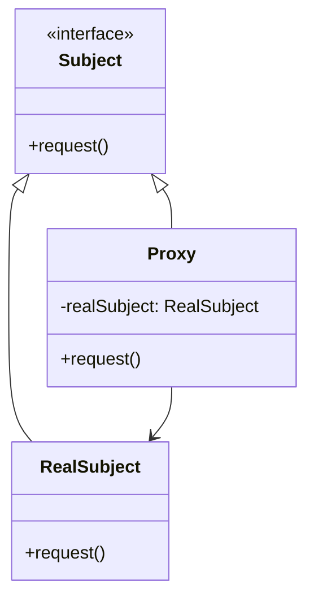
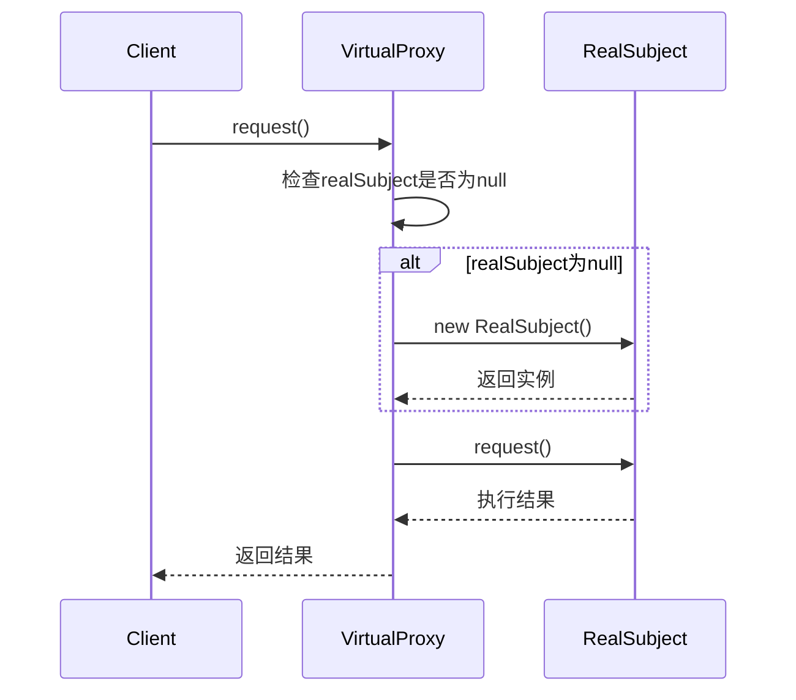
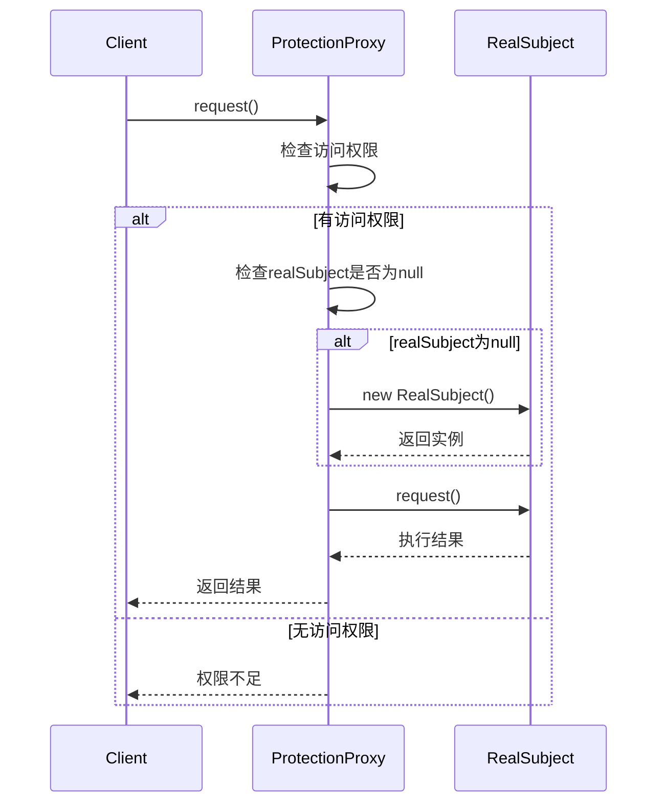
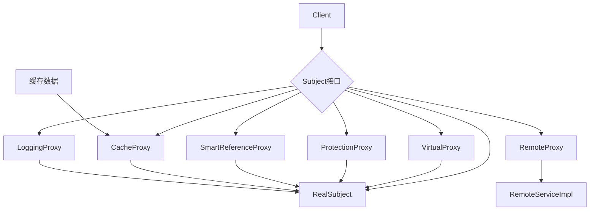
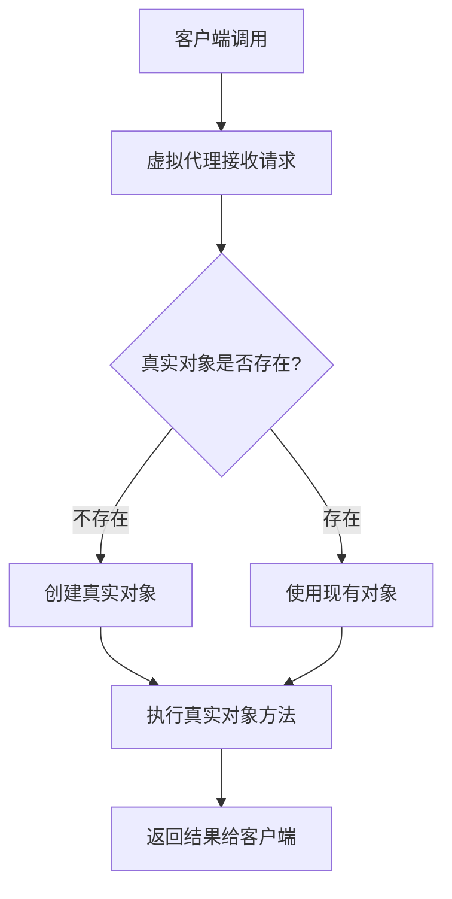
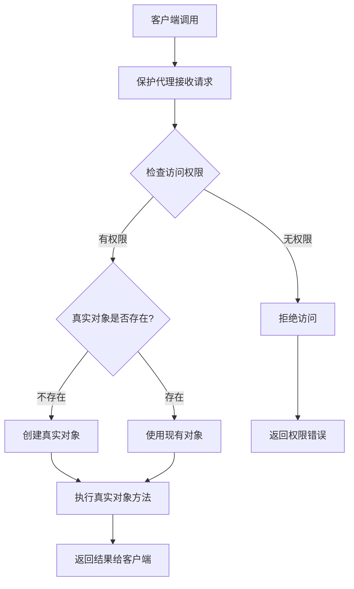

# 代理模式 (Proxy Pattern)

## 1. 模式定义

代理模式是一种结构型设计模式，它为其他对象提供一个代理以控制对这个对象的访问。代理模式可以在客户端和目标对象之间起到中介作用，并在不改变原有对象的情况下增加额外的功能操作。

## 2. 核心思想

代理模式的核心思想是使用一个代理对象来控制对真实对象的访问。代理对象通常会实现与真实对象相同的接口，客户端通过代理对象间接访问真实对象。代理可以在将请求传递给真实对象之前或之后执行一些额外的操作。

## 3. 适用场景

- **远程代理**：为一个位于不同地址空间的对象提供本地代表
- **虚拟代理**：根据需要创建开销很大的对象
- **保护代理**：控制对原始对象的访问，用于对象应该有不同的访问权限时
- **智能引用代理**：在访问对象时执行一些附加操作，如引用计数、延迟加载等
- **防火墙代理**：保护目标对象不被恶意访问
- **同步代理**：在多线程环境中为对象提供同步控制
- **复杂隐藏代理**：隐藏复杂对象的复杂性，为客户端提供简单的接口

## 4. 优缺点

### 优点
- **透明性**：客户端可以像使用真实对象一样使用代理对象
- **增强功能**：可以在不修改原始对象的情况下增加额外功能
- **延迟加载**：可以实现懒加载，提高系统性能
- **访问控制**：可以控制对真实对象的访问权限
- **解耦合**：降低了客户端与真实对象之间的耦合度

### 缺点
- **复杂性**：增加了系统的复杂性，需要额外的代理类
- **性能开销**：可能会增加系统的响应时间
- **难以调试**：代理模式可能会使系统调试变得困难

## 5. UML类图

## 6. 模式结构

### 6.1 主要角色

1. **Subject（抽象主题）**
   - 定义了RealSubject和Proxy的共同接口
   - 客户端通常使用这个接口来访问真实对象

2. **RealSubject（真实主题）**
   - 定义了代理对象所代表的真实对象
   - 是最终要访问的对象

3. **Proxy（代理类）**
   - 持有对真实主题的引用
   - 实现与真实主题相同的接口
   - 控制对真实主题的访问，并可能负责创建和删除真实主题

### 6.2 代理模式类型

1. **虚拟代理（Virtual Proxy）**
   - 根据需要创建开销很大的对象
   - 通过代理延迟对象的创建

2. **远程代理（Remote Proxy）**
   - 为一个位于不同地址空间的对象提供本地代表
   - 客户端可以像访问本地对象一样访问远程对象

3. **保护代理（Protection Proxy）**
   - 控制对原始对象的访问
   - 用于对象应该有不同的访问权限时

4. **智能引用代理（Smart Reference Proxy）**
   - 在访问对象时执行一些附加操作
   - 如引用计数、延迟加载等

## 7. 时序图

### 7.1 虚拟代理时序图

### 7.2 保护代理时序图

## 8. 数据结构图

## 9. 工作流程图

### 9.1 虚拟代理工作流程

### 9.2 保护代理工作流程

## 10. 实际应用示例

### 10.1 Java中的代理模式应用

1. **Java RMI（远程方法调用）**
   - 使用远程代理来访问远程对象
   - 客户端通过代理访问远程服务

2. **Java动态代理**
   - `java.lang.reflect.Proxy`类提供了动态代理功能
   - 可以在运行时创建代理类

3. **Spring AOP**
   - Spring框架广泛使用代理模式实现面向切面编程
   - 通过代理添加日志、事务等横切关注点

4. **Hibernate延迟加载**
   - 使用虚拟代理实现延迟加载
   - 只在需要时才加载数据

### 10.2 Web开发中的代理模式

1. **CDN（内容分发网络）**
   - CDN作为Web服务器的代理
   - 缓存静态资源，提高访问速度

2. **反向代理**
   - Nginx、Apache等作为反向代理服务器
   - 负载均衡、SSL终止、缓存等功能

3. **API网关**
   - 作为微服务的代理
   - 提供认证、限流、监控等功能

## 11. 与其他模式的关系

- **与适配器模式**：代理模式与适配器模式在结构上相似，但目的不同。适配器模式用于改变接口，而代理模式用于控制访问
- **与装饰器模式**：代理模式与装饰器模式都持有对真实对象的引用，但装饰器模式用于添加功能，而代理模式用于控制访问
- **与外观模式**：代理模式可以与外观模式结合使用，为复杂的子系统提供简化的访问接口

## 12. 常见问题和解决方案

### 12.1 性能问题

**问题**：代理模式可能引入额外的性能开销

**解决方案**：
1. 合理设计代理逻辑，避免不必要的操作
2. 使用缓存减少重复计算
3. 在性能关键路径上谨慎使用代理

### 12.2 复杂性问题

**问题**：过度使用代理模式会增加系统复杂性

**解决方案**：
1. 只在必要时使用代理模式
2. 保持代理类的职责单一
3. 提供清晰的文档说明代理的作用

### 12.3 调试困难

**问题**：代理模式可能使调试变得困难

**解决方案**：
1. 提供详细的日志记录
2. 使用调试工具跟踪代理调用链
3. 设计可配置的代理行为

## 13. 最佳实践

1. **明确代理的目的**
   - 虚拟代理：延迟初始化
   - 保护代理：访问控制
   - 远程代理：远程访问
   - 智能引用代理：附加操作

2. **保持接口一致性**
   - 代理类应该实现与真实对象相同的接口
   - 客户端不应该感知到代理的存在

3. **合理管理资源**
   - 及时释放不需要的资源
   - 避免内存泄漏

4. **考虑线程安全**
   - 在多线程环境中正确同步代理对象
   - 避免竞态条件

## 14. 总结

代理模式是一种强大的设计模式，它通过引入代理对象来控制对真实对象的访问。它特别适用于以下情况：
- 需要延迟创建开销很大的对象
- 需要控制对对象的访问权限
- 需要在访问对象时执行附加操作
- 需要为远程对象提供本地代表

在使用代理模式时，需要注意保持接口的一致性，合理设计代理逻辑，并考虑性能和复杂性之间的平衡。