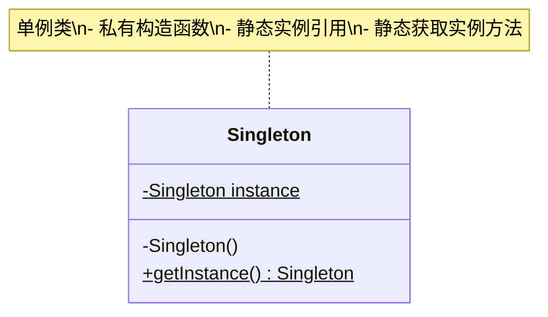
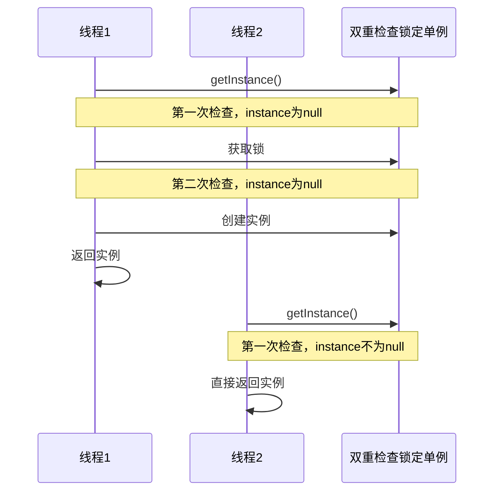
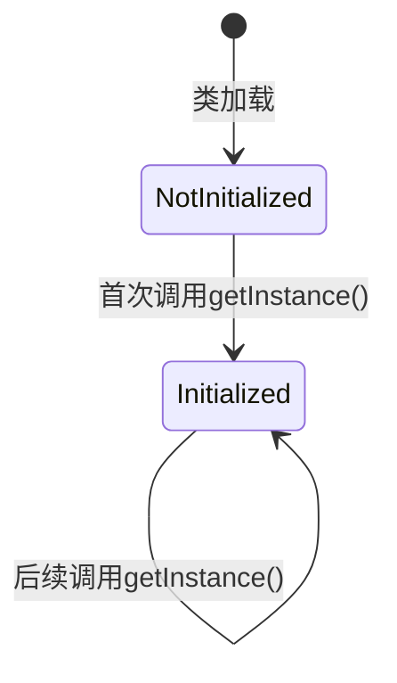

# 单例模式 (Singleton Pattern) 详解

## 1. 模式定义

单例模式是一种创建型设计模式，它保证一个类只有一个实例，并提供一个全局访问点来访问这个实例。

## 2. 模式动机

在软件系统中，经常有这样一些特殊的类，必须保证它们在系统中只存在一个实例，才能确保它们的逻辑正确性。例如：
- 配置管理器
- 日志记录器
- 数据库连接池
- 缓存管理器
- 线程池

## 3. UML 类图



## 4. 实现方式

### 4.1 饿汉式（线程安全）

```java
public class EagerSingleton {
    // 在类加载时就创建实例
    private static final EagerSingleton INSTANCE = new EagerSingleton();
    
    // 私有构造函数，防止外部实例化
    private EagerSingleton() {}
    
    // 提供全局访问点
    public static EagerSingleton getInstance() {
        return INSTANCE;
    }
}
```

**优点**：
- 线程安全，无需加锁
- 实现简单

**缺点**：
- 类加载时就创建实例，可能造成资源浪费
- 如果从未使用该实例，会造成内存浪费

### 4.2 懒汉式（线程不安全）

```java
public class LazySingleton {
    private static LazySingleton instance;
    
    private LazySingleton() {}
    
    public static LazySingleton getInstance() {
        if (instance == null) {
            instance = new LazySingleton();
        }
        return instance;
    }
}
```

**优点**：
- 延迟加载，节省资源

**缺点**：
- 线程不安全，在多线程环境下可能创建多个实例

### 4.3 懒汉式（线程安全，同步方法）

```java
public class ThreadSafeLazySingleton {
    private static ThreadSafeLazySingleton instance;
    
    private ThreadSafeLazySingleton() {}
    
    public static synchronized ThreadSafeLazySingleton getInstance() {
        if (instance == null) {
            instance = new ThreadSafeLazySingleton();
        }
        return instance;
    }
}
```

**优点**：
- 线程安全
- 延迟加载

**缺点**：
- 性能较差，每次调用getInstance()都需要获取锁

### 4.4 双重检查锁定（推荐）

```java
public class DoubleCheckedLockingSingleton {
    // volatile关键字确保多线程环境下的可见性
    private static volatile DoubleCheckedLockingSingleton instance;
    
    private DoubleCheckedLockingSingleton() {}
    
    public static DoubleCheckedLockingSingleton getInstance() {
        // 第一次检查，避免不必要的同步
        if (instance == null) {
            synchronized (DoubleCheckedLockingSingleton.class) {
                // 第二次检查，确保只创建一个实例
                if (instance == null) {
                    instance = new DoubleCheckedLockingSingleton();
                }
            }
        }
        return instance;
    }
}
```

**优点**：
- 线程安全
- 延迟加载
- 性能较好，只在第一次创建实例时加锁

**缺点**：
- 实现相对复杂

### 4.5 静态内部类（推荐）

```java
public class StaticInnerClassSingleton {
    
    private StaticInnerClassSingleton() {}
    
    // 静态内部类
    private static class SingletonHolder {
        private static final StaticInnerClassSingleton INSTANCE = new StaticInnerClassSingleton();
    }
    
    public static StaticInnerClassSingleton getInstance() {
        return SingletonHolder.INSTANCE;
    }
}
```

**优点**：
- 线程安全
- 延迟加载
- 实现简单
- 利用JVM类加载机制保证线程安全

**缺点**：
- 无明显缺点

### 4.6 枚举实现（最安全）

```java
public enum EnumSingleton {
    INSTANCE;
    
    public void doSomething() {
        System.out.println("枚举单例执行业务逻辑");
    }
}
```

**优点**：
- 线程安全
- 防止反射攻击
- 防止序列化破坏单例
- 实现简单

**缺点**：
- 无法延迟加载

## 5. 时序图

### 5.1 双重检查锁定时序图



## 6. 状态图



## 7. 常见问题及解决方案

### 7.1 反射攻击

**问题**：通过反射可以破坏单例模式

```java
// 反射攻击示例
Singleton instance1 = Singleton.getInstance();
Constructor<Singleton> constructor = Singleton.class.getDeclaredConstructor();
constructor.setAccessible(true);
Singleton instance2 = constructor.newInstance();
// instance1 != instance2，破坏了单例
```

**解决方案**：在构造函数中添加检查

```java
public class SafeSingleton {
    private static volatile SafeSingleton instance;
    
    private SafeSingleton() {
        // 防止反射攻击
        if (instance != null) {
            throw new RuntimeException("不能通过反射创建实例！");
        }
    }
    
    public static SafeSingleton getInstance() {
        if (instance == null) {
            synchronized (SafeSingleton.class) {
                if (instance == null) {
                    instance = new SafeSingleton();
                }
            }
        }
        return instance;
    }
}
```

### 7.2 序列化破坏单例

**问题**：序列化和反序列化会破坏单例

```java
// 序列化破坏示例
Singleton instance1 = Singleton.getInstance();
// 序列化
ObjectOutputStream oos = new ObjectOutputStream(new FileOutputStream("singleton.ser"));
oos.writeObject(instance1);
oos.close();

// 反序列化
ObjectInputStream ois = new ObjectInputStream(new FileInputStream("singleton.ser"));
Singleton instance2 = (Singleton) ois.readObject();
ois.close();
// instance1 != instance2，破坏了单例
```

**解决方案**：添加readResolve方法

```java
public class SerializableSingleton implements Serializable {
    private static final SerializableSingleton INSTANCE = new SerializableSingleton();
    
    private SerializableSingleton() {}
    
    public static SerializableSingleton getInstance() {
        return INSTANCE;
    }
    
    // 防止序列化破坏单例
    private Object readResolve() {
        return INSTANCE;
    }
}
```

## 8. 实际应用场景

1. **日志记录器**：整个应用程序只需要一个日志记录器实例
2. **配置管理器**：应用程序的配置信息只需要一个管理器
3. **数据库连接池**：管理数据库连接，避免频繁创建和销毁连接
4. **缓存管理器**：提供全局缓存访问点
5. **线程池**：管理线程资源
6. **应用程序计数器**：统计应用程序的访问次数等

## 9. 优缺点分析

### 9.1 优点

1. **控制实例数量**：确保一个类只有一个实例
2. **节约系统资源**：避免频繁创建和销毁对象
3. **全局访问点**：提供一个全局访问点来访问实例
4. **延迟初始化**：可以实现延迟加载，节省资源

### 9.2 缺点

1. **违反单一职责原则**：既负责创建实例，又负责业务逻辑
2. **隐藏类之间的依赖关系**：使用者不知道他们正在使用一个单例
3. **难以进行单元测试**：单例通常难以模拟和替换
4. **多线程环境下的复杂性**：需要考虑线程安全问题

## 10. 最佳实践

1. **优先使用静态内部类实现**：线程安全、延迟加载、性能好
2. **考虑使用枚举实现**：最安全，防止反射和序列化攻击
3. **注意线程安全**：在多线程环境下确保单例的正确性
4. **防止反射攻击**：在构造函数中添加检查
5. **防止序列化破坏**：添加readResolve方法
6. **合理使用**：不要为了使用单例而使用单例，确保确实需要全局唯一实例

## 11. 总结

单例模式是最简单的设计模式之一，但在实际应用中需要注意很多细节。选择合适的实现方式对于保证单例的正确性和性能至关重要。在现代Java开发中，推荐使用静态内部类或枚举实现单例模式。