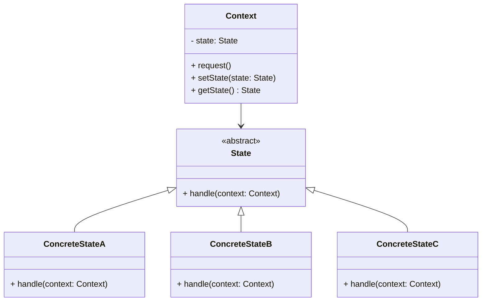
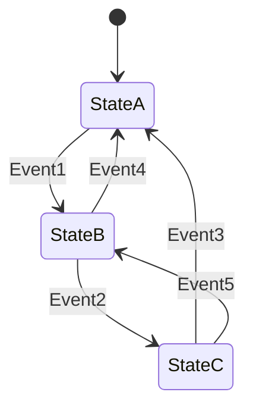
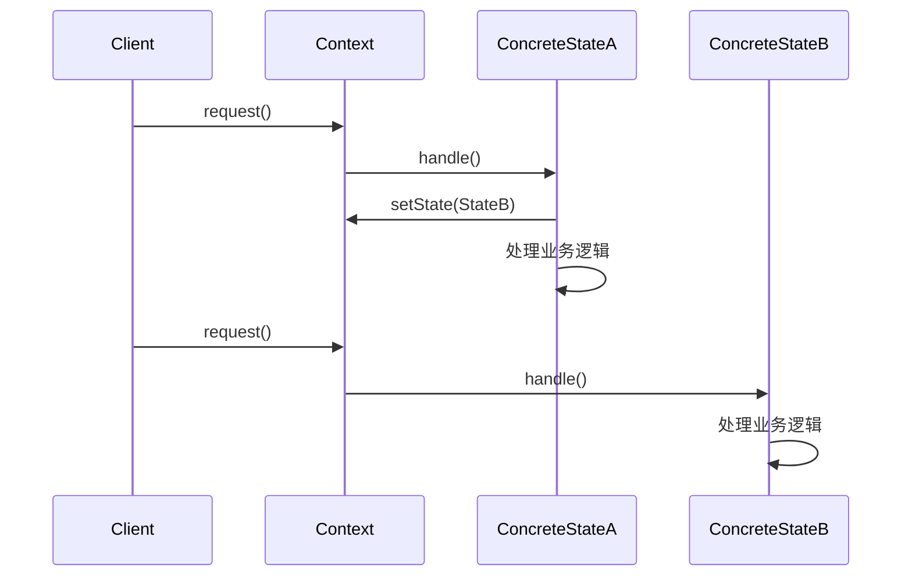
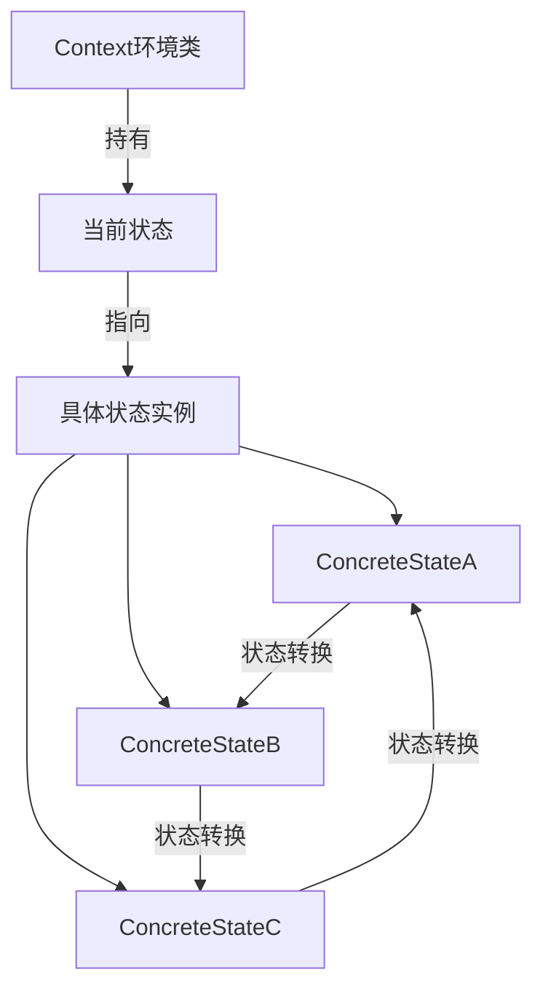
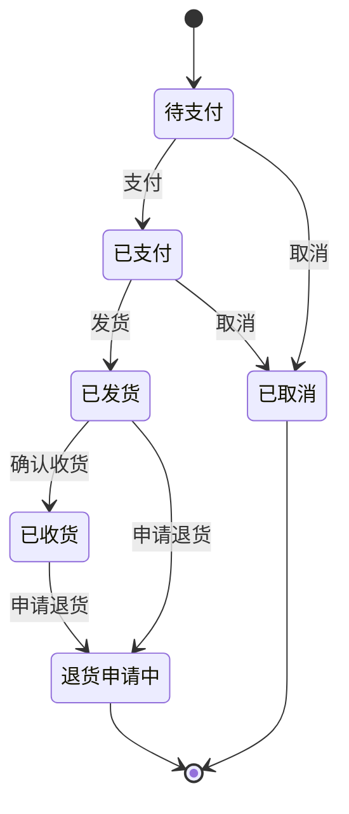
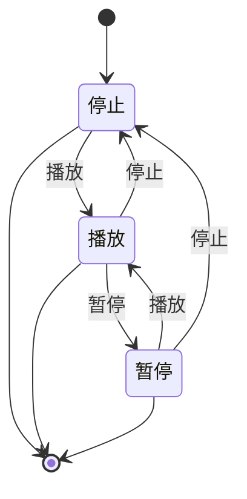

## 6. UML类图

```mermaid
classDiagram
    class Context {
        - state: State
        + request()
        + setState(state: State)
        + getState() State
    }
    
    class State {
        <<abstract>>
        + handle(context: Context)
    }
    
    class ConcreteStateA {
        + handle(context: Context)
    }
    
    class ConcreteStateB {
        + handle(context: Context)
    }
    
    class ConcreteStateC {
        + handle(context: Context)
    }
    
    Context --> State
    State <|-- ConcreteStateA
    State <|-- ConcreteStateB
    State <|-- ConcreteStateC
```

## 7. 状态转换图

```mermaid
stateDiagram-v2
    [*] --> StateA
    StateA --> StateB: Event1
    StateB --> StateC: Event2
    StateC --> StateA: Event3
    StateB --> StateA: Event4
    StateC --> StateB: Event5
```

## 8. 时序图

```mermaid
sequenceDiagram
    participant C as Client
    participant Context as Context
    participant StateA as ConcreteStateA
    participant StateB as ConcreteStateB
    
    C->>Context: request()
    Context->>StateA: handle()
    StateA->>Context: setState(StateB)
    StateA->>StateA: 处理业务逻辑
    C->>Context: request()
    Context->>StateB: handle()
    StateB->>StateB: 处理业务逻辑
```

## 9. 数据结构图

```mermaid
graph TD
    Context[Context环境类] -->|持有| CurrentState[当前状态]
    CurrentState -->|指向| StateInstance[具体状态实例]
    
    StateInstance --> StateA[ConcreteStateA]
    StateInstance --> StateB[ConcreteStateB]
    StateInstance --> StateC[ConcreteStateC]
    
    StateA -->|状态转换| StateB
    StateB -->|状态转换| StateC
    StateC -->|状态转换| StateA
```

## 10. 订单状态转换图

```mermaid
stateDiagram-v2
    [*] --> 待支付
    待支付 --> 已支付: 支付
    待支付 --> 已取消: 取消
    已支付 --> 已发货: 发货
    已支付 --> 已取消: 取消
    已发货 --> 已收货: 确认收货
    已发货 --> 退货申请中: 申请退货
    已收货 --> 退货申请中: 申请退货
    退货申请中 --> [*]
    已取消 --> [*]
```

## 11. 播放器状态转换图

```mermaid
stateDiagram-v2
    [*] --> 停止
    停止 --> 播放: 播放
    播放 --> 暂停: 暂停
    播放 --> 停止: 停止
    暂停 --> 播放: 播放
    暂停 --> 停止: 停止
    停止 --> [*]
    播放 --> [*]
    暂停 --> [*]
```