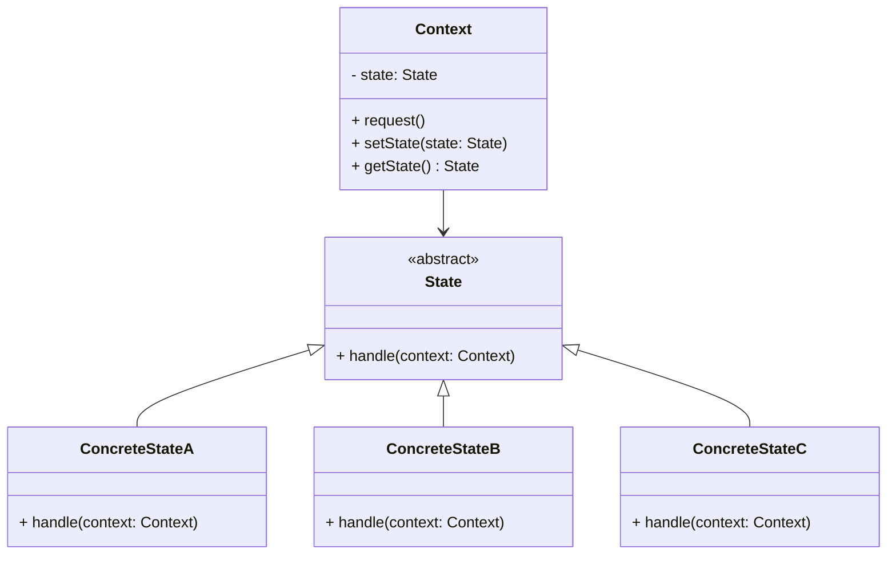
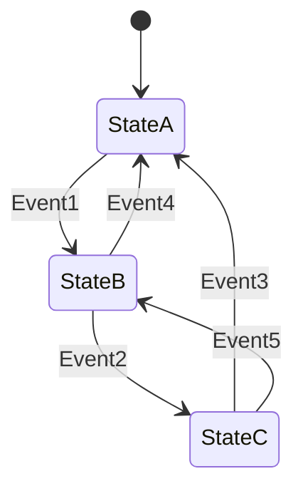
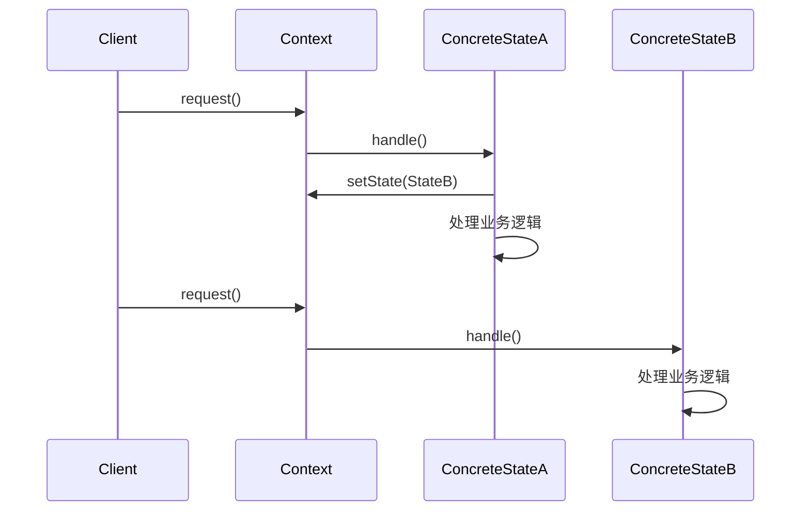
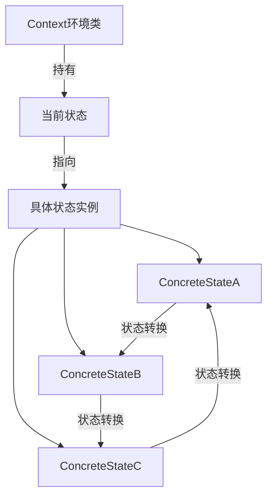
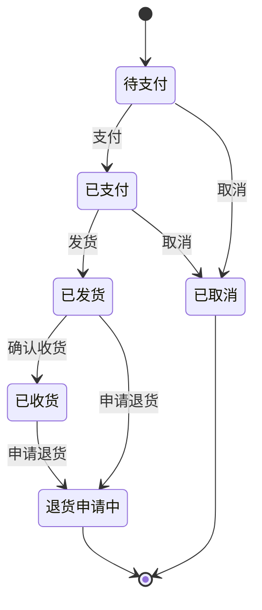
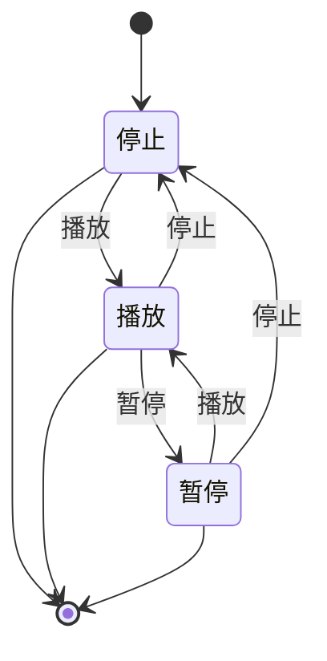

# 状态模式 (State Pattern)

## 1. 模式简介

状态模式是一种行为设计模式，它允许对象在其内部状态改变时改变其行为。对象看起来似乎修改了它的类。

### 1.1 别名
- 状态对象模式 (State Object Pattern)

### 1.2 意图
允许一个对象在其内部状态改变时改变它的行为，对象看起来似乎修改了它的类。

### 1.3 核心思想
- 将对象的状态封装成独立的类
- 将不同状态的行为分散到不同的状态类中
- 允许对象在运行时动态地改变其行为

## 2. 适用场景

- 一个对象的行为取决于它的状态，并且它必须在运行时刻根据状态改变它的行为
- 代码中包含大量与对象状态有关的条件语句
- 需要避免使用庞大的条件语句来处理复杂的业务逻辑
- 对象的行为随着状态的改变而改变，且状态数量较多

## 3. 结构说明

### 3.1 主要角色

1. **Context（环境类）**
   - 定义客户感兴趣的接口
   - 维护一个ConcreteState子类的实例，这个实例定义当前状态

2. **State（抽象状态类）**
   - 定义一个接口以封装与Context的一个特定状态相关的行为

3. **ConcreteState（具体状态类）**
   - 每一个子类实现一个与Context的一个状态相关的行为

## 4. 优缺点

### 4.1 优点
- **消除庞大的条件分支语句**：将各种状态的处理逻辑分散到不同的状态类中
- **易于增加新的状态**：增加新的状态只需增加新的子类
- **符合开闭原则**：增加新的状态和转换非常容易
- **使状态转换显式化**：状态转换通过不同状态类的转换来实现
- **状态类可以被共享**：状态对象可以没有内部状态，因此可以被共享

### 4.2 缺点
- **状态模式的使用必然会增加系统类和对象的个数**
- **结构相对复杂**：使用状态模式必然引入大量的类和对象
- **状态转换逻辑分散**：状态转换逻辑分布在各个状态类中，难以集中管理

## 5. 实际应用场景

1. **工作流系统**：订单状态、审批流程等
2. **游戏开发**：游戏角色状态、游戏状态机
3. **网络编程**：TCP连接状态管理
4. **多媒体播放器**：播放、暂停、停止等状态
5. **电梯控制系统**：电梯的运行状态
6. **银行账户系统**：账户的状态管理

## 6. 常见问题与解决方案

### 6.1 状态转换逻辑分散问题
- **问题**：状态转换逻辑分布在各个状态类中，难以集中管理
- **解决方案**：
  1. 使用状态转换表集中管理状态转换
  2. 创建状态管理器类统一处理转换逻辑
  3. 使用配置文件定义状态转换规则

### 6.2 类数量膨胀问题
- **问题**：状态模式会创建大量的状态类
- **解决方案**：
  1. 合理划分状态，避免过度细化
  2. 使用继承和组合减少重复代码
  3. 对于简单状态，可以考虑使用枚举

### 6.3 状态间通信问题
- **问题**：状态对象间需要通信时处理复杂
- **解决方案**：
  1. 通过Context对象进行状态间通信
  2. 使用观察者模式处理状态变化通知
  3. 引入中介者模式管理复杂的状态交互

### 6.4 状态持久化问题
- **问题**：需要保存和恢复对象状态
- **解决方案**：
  1. 结合备忘录模式保存状态
  2. 使用序列化技术持久化状态
  3. 在数据库中保存状态信息

## 7. 状态模式与其他模式的结合

### 7.1 与策略模式的区别
- **状态模式**：对象的状态改变会导致行为改变，状态转换是自动的
- **策略模式**：算法可以自由切换，但不会因算法改变而改变对象状态

### 7.2 与单例模式的结合
- 状态对象如果没有内部状态，可以使用单例模式共享实例
- 减少对象创建开销，提高性能

### 7.3 与工厂模式的结合
- 使用工厂模式创建状态对象
- 集中管理状态对象的创建逻辑

## 8. 现代应用

### 8.1 Spring状态机
Spring提供了专门的状态机框架，可以更方便地实现复杂的状态管理。

### 8.2 有限状态机库
使用现成的有限状态机库，如：
1. **Akka FSM**：用于Actor模型的状态管理
2. **StatefulJ**：Java的有限状态机框架
3. **Squirrel Foundation**：轻量级状态机框架

### 8.3 函数式状态管理
在函数式编程中，可以使用状态Monad来管理状态转换。

## 9. 增强特性实现

### 9.1 状态转换表
通过集中式状态转换表管理状态转换逻辑，解决状态转换逻辑分散的问题。

### 9.2 枚举状态
对于简单的状态管理，可以使用枚举来减少类的数量，避免类膨胀问题。

### 9.3 状态管理器
引入状态管理器模式，统一处理复杂的状态转换逻辑。

## 10. UML类图

## 11. 状态转换图

## 12. 时序图

## 13. 数据结构图

## 14. 订单状态转换图

## 15. 播放器状态转换图

## 16. 总结

状态模式是处理对象状态变化的有效设计模式，通过将状态封装为对象，可以避免复杂的条件判断语句，使代码更加清晰和易于维护。在实际应用中，我们需要根据业务复杂度选择合适的实现方式，并注意处理好状态转换逻辑的管理、类数量的控制和状态间通信等问题。