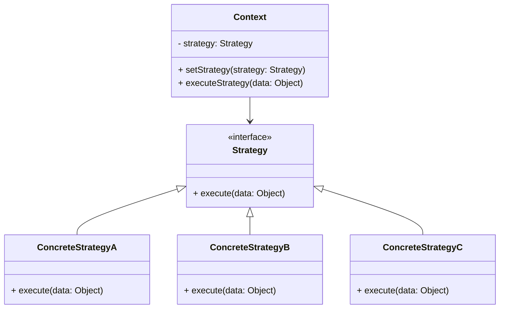
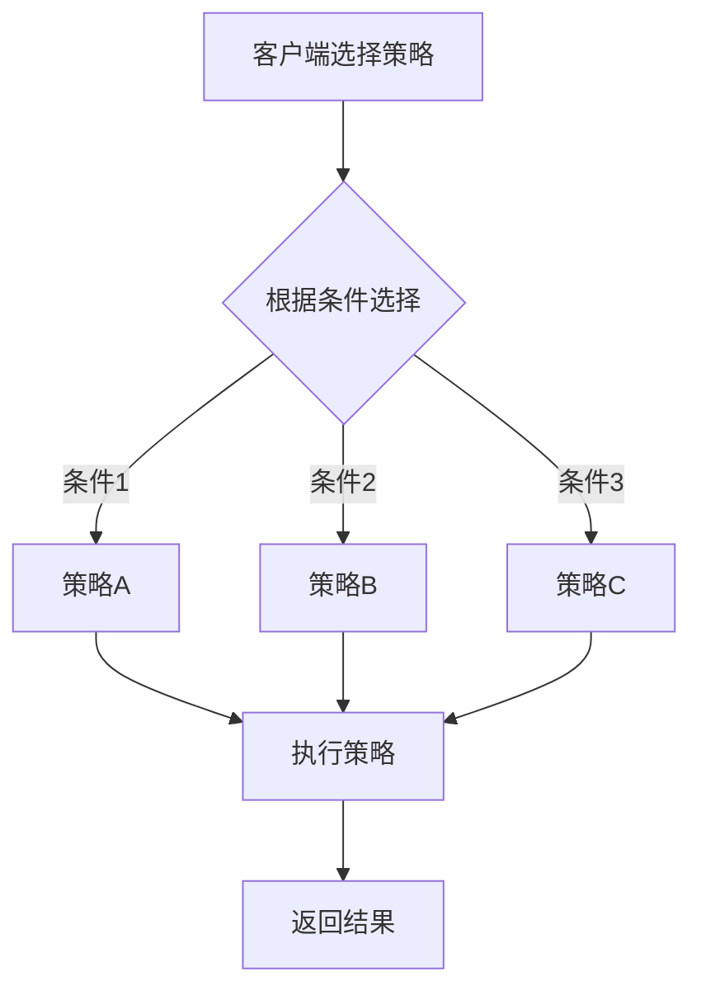
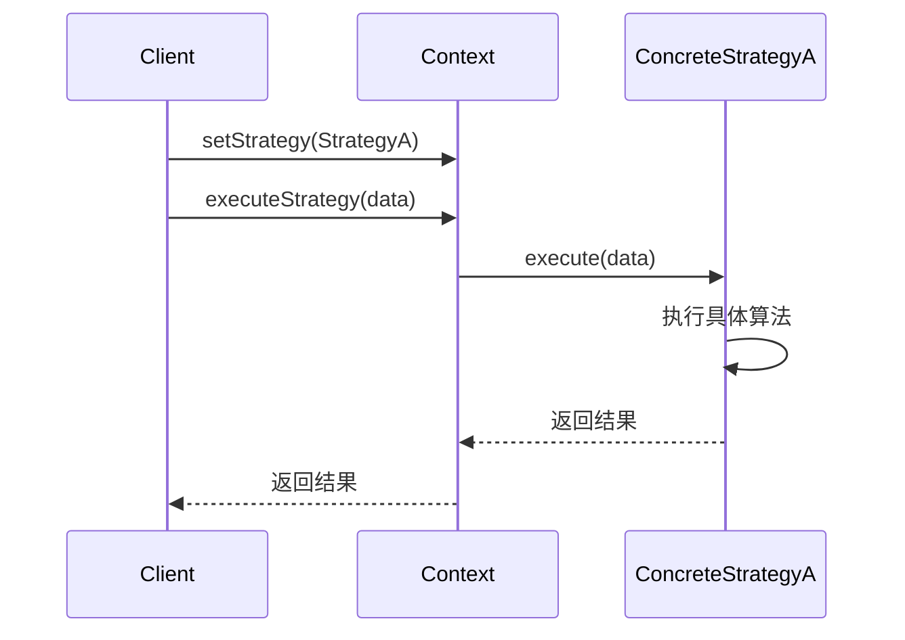
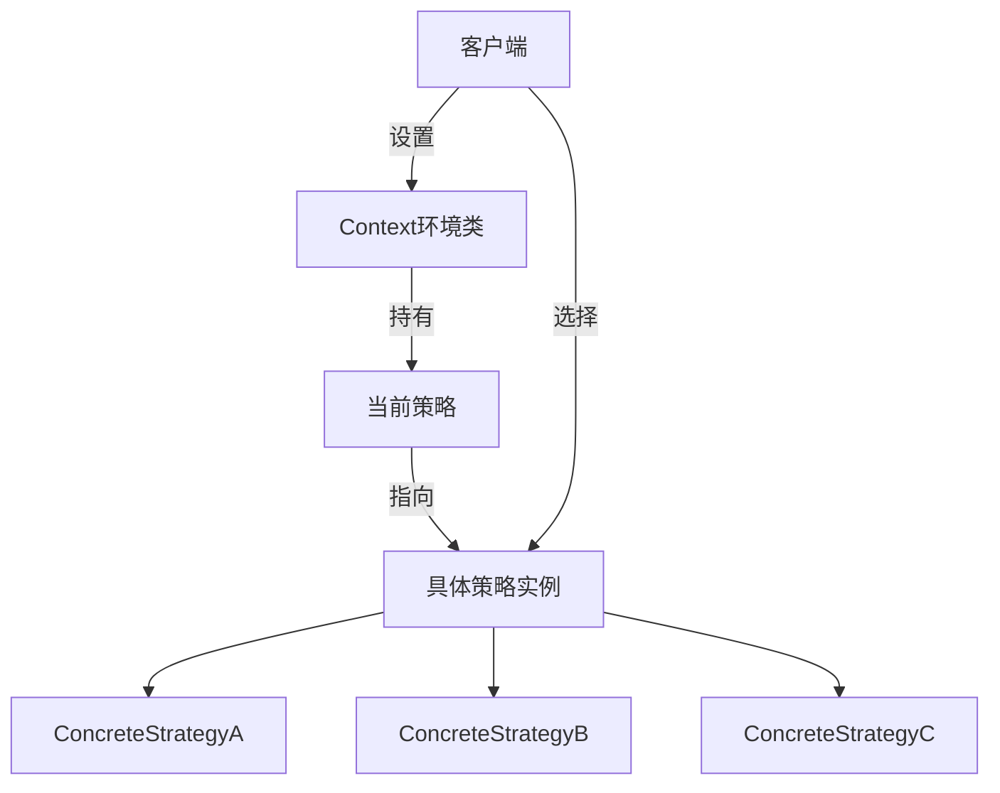
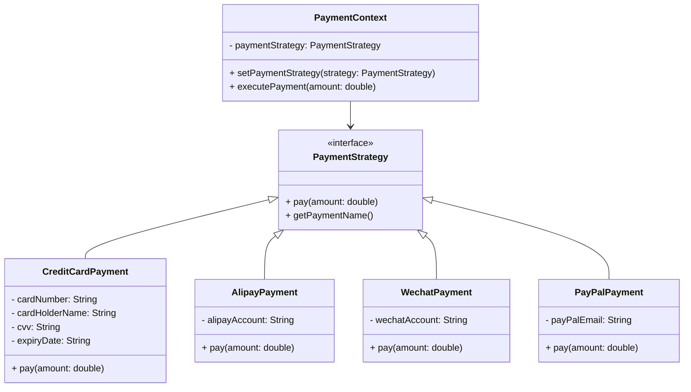
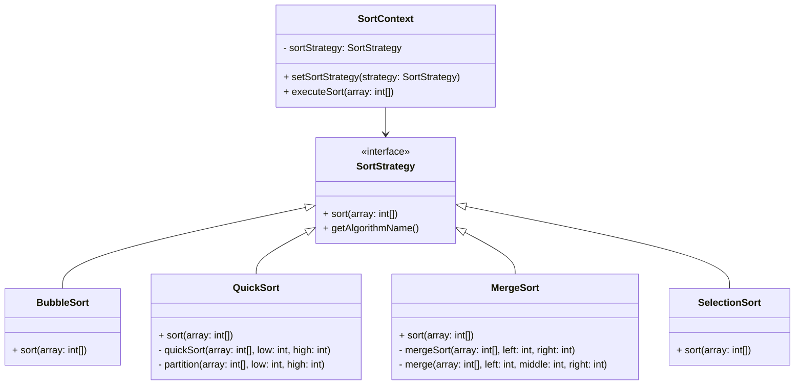
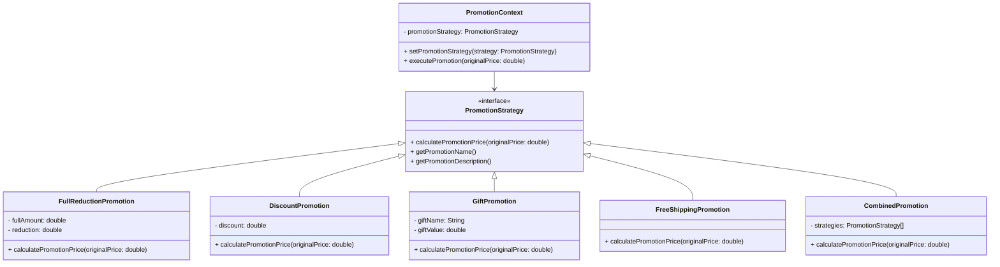

## 6. UML类图

```mermaid
classDiagram
    class Context {
        - strategy: Strategy
        + setStrategy(strategy: Strategy)
        + executeStrategy(data: Object)
    }
    
    class Strategy {
        <<interface>>
        + execute(data: Object)
    }
    
    class ConcreteStrategyA {
        + execute(data: Object)
    }
    
    class ConcreteStrategyB {
        + execute(data: Object)
    }
    
    class ConcreteStrategyC {
        + execute(data: Object)
    }
    
    Context --> Strategy
    Strategy <|-- ConcreteStrategyA
    Strategy <|-- ConcreteStrategyB
    Strategy <|-- ConcreteStrategyC
```

## 7. 策略选择流程图

```mermaid
flowchart TD
    A[客户端选择策略] --> B{根据条件选择}
    B -->|条件1| C[策略A]
    B -->|条件2| D[策略B]
    B -->|条件3| E[策略C]
    C --> F[执行策略]
    D --> F
    E --> F
    F --> G[返回结果]
```

## 8. 时序图

```mermaid
sequenceDiagram
    participant C as Client
    participant Context as Context
    participant StrategyA as ConcreteStrategyA
    
    C->>Context: setStrategy(StrategyA)
    C->>Context: executeStrategy(data)
    Context->>StrategyA: execute(data)
    StrategyA->>StrategyA: 执行具体算法
    StrategyA-->>Context: 返回结果
    Context-->>C: 返回结果
```

## 9. 数据结构图

```mermaid
graph TD
    Context[Context环境类] -->|持有| CurrentStrategy[当前策略]
    CurrentStrategy -->|指向| StrategyInstance[具体策略实例]
    
    StrategyInstance --> StrategyA[ConcreteStrategyA]
    StrategyInstance --> StrategyB[ConcreteStrategyB]
    StrategyInstance --> StrategyC[ConcreteStrategyC]
    
    Client[客户端] -->|设置| Context
    Client -->|选择| StrategyInstance
```

## 10. 支付策略结构图

```mermaid
classDiagram
    class PaymentContext {
        - paymentStrategy: PaymentStrategy
        + setPaymentStrategy(strategy: PaymentStrategy)
        + executePayment(amount: double)
    }
    
    class PaymentStrategy {
        <<interface>>
        + pay(amount: double)
        + getPaymentName()
    }
    
    class CreditCardPayment {
        - cardNumber: String
        - cardHolderName: String
        - cvv: String
        - expiryDate: String
        + pay(amount: double)
    }
    
    class AlipayPayment {
        - alipayAccount: String
        + pay(amount: double)
    }
    
    class WechatPayment {
        - wechatAccount: String
        + pay(amount: double)
    }
    
    class PayPalPayment {
        - payPalEmail: String
        + pay(amount: double)
    }
    
    PaymentContext --> PaymentStrategy
    PaymentStrategy <|-- CreditCardPayment
    PaymentStrategy <|-- AlipayPayment
    PaymentStrategy <|-- WechatPayment
    PaymentStrategy <|-- PayPalPayment
```

## 11. 排序策略结构图

```mermaid
classDiagram
    class SortContext {
        - sortStrategy: SortStrategy
        + setSortStrategy(strategy: SortStrategy)
        + executeSort(array: int[])
    }
    
    class SortStrategy {
        <<interface>>
        + sort(array: int[])
        + getAlgorithmName()
    }
    
    class BubbleSort {
        + sort(array: int[])
    }
    
    class QuickSort {
        + sort(array: int[])
        - quickSort(array: int[], low: int, high: int)
        - partition(array: int[], low: int, high: int)
    }
    
    class MergeSort {
        + sort(array: int[])
        - mergeSort(array: int[], left: int, right: int)
        - merge(array: int[], left: int, middle: int, right: int)
    }
    
    class SelectionSort {
        + sort(array: int[])
    }
    
    SortContext --> SortStrategy
    SortStrategy <|-- BubbleSort
    SortStrategy <|-- QuickSort
    SortStrategy <|-- MergeSort
    SortStrategy <|-- SelectionSort
```

## 12. 促销策略结构图

```mermaid
classDiagram
    class PromotionContext {
        - promotionStrategy: PromotionStrategy
        + setPromotionStrategy(strategy: PromotionStrategy)
        + executePromotion(originalPrice: double)
    }
    
    class PromotionStrategy {
        <<interface>>
        + calculatePromotionPrice(originalPrice: double)
        + getPromotionName()
        + getPromotionDescription()
    }
    
    class FullReductionPromotion {
        - fullAmount: double
        - reduction: double
        + calculatePromotionPrice(originalPrice: double)
    }
    
    class DiscountPromotion {
        - discount: double
        + calculatePromotionPrice(originalPrice: double)
    }
    
    class GiftPromotion {
        - giftName: String
        - giftValue: double
        + calculatePromotionPrice(originalPrice: double)
    }
    
    class FreeShippingPromotion {
        + calculatePromotionPrice(originalPrice: double)
    }
    
    class CombinedPromotion {
        - strategies: PromotionStrategy[]
        + calculatePromotionPrice(originalPrice: double)
    }
    
    PromotionContext --> PromotionStrategy
    PromotionStrategy <|-- FullReductionPromotion
    PromotionStrategy <|-- DiscountPromotion
    PromotionStrategy <|-- GiftPromotion
    PromotionStrategy <|-- FreeShippingPromotion
    PromotionStrategy <|-- CombinedPromotion
```