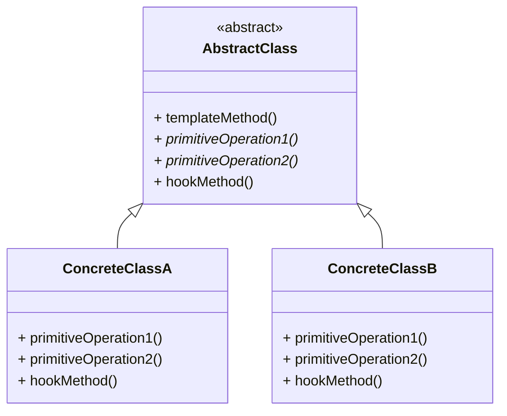
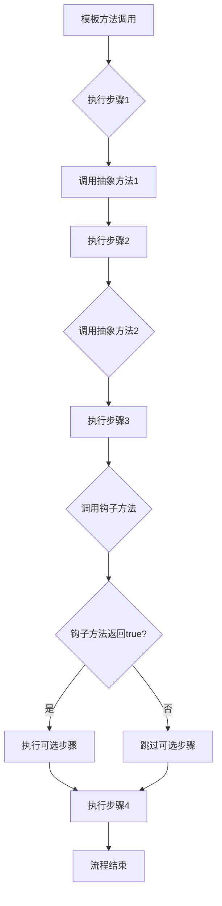
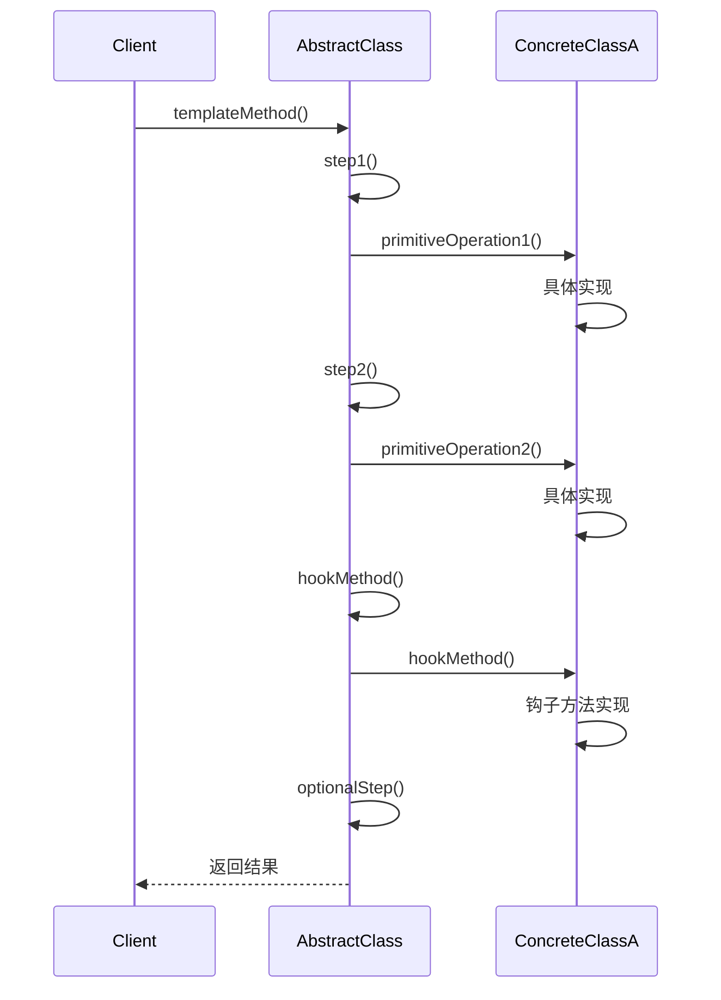
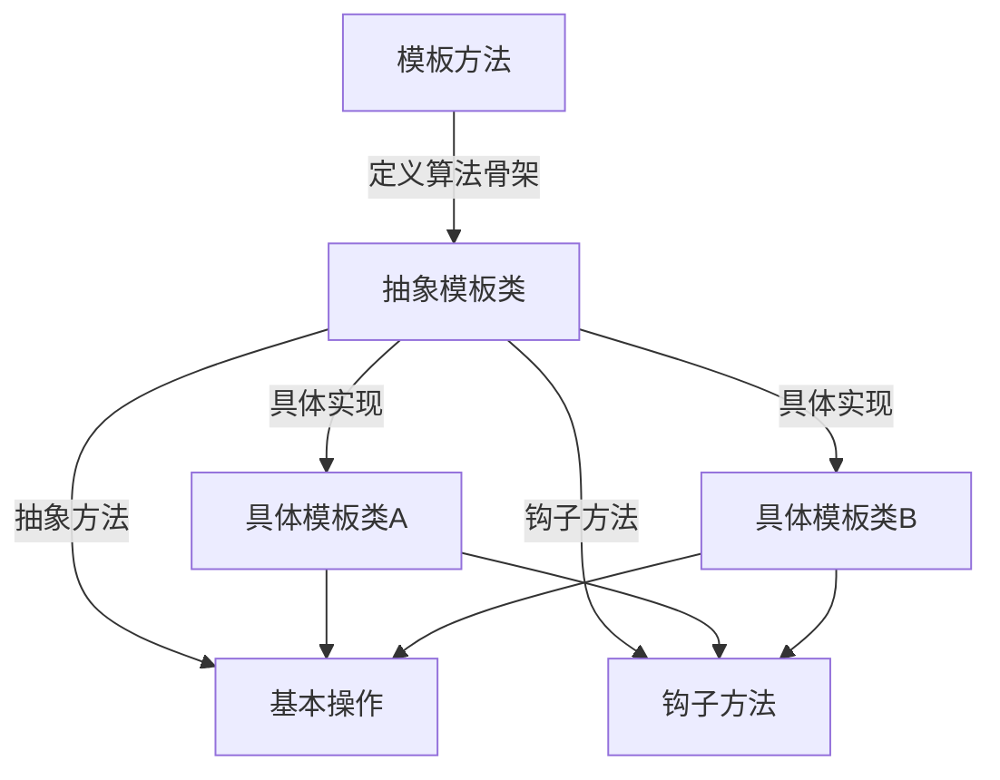
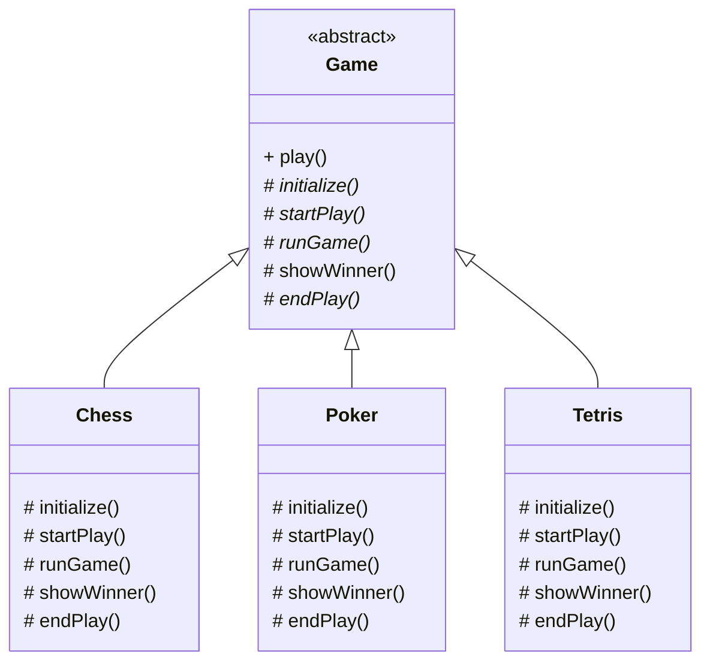
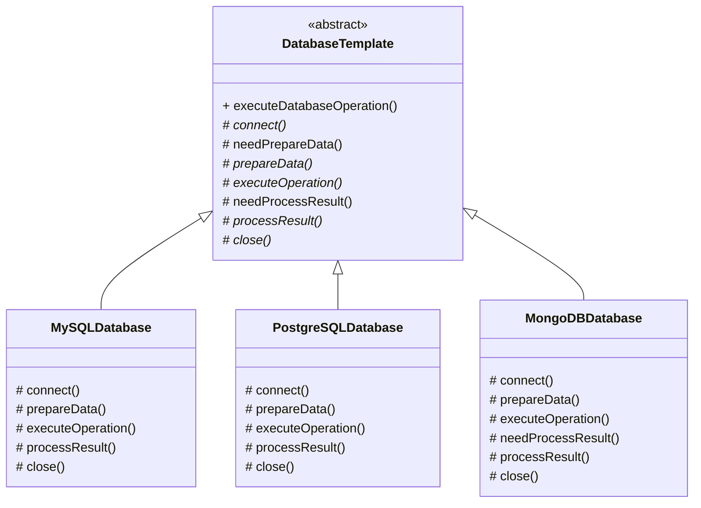
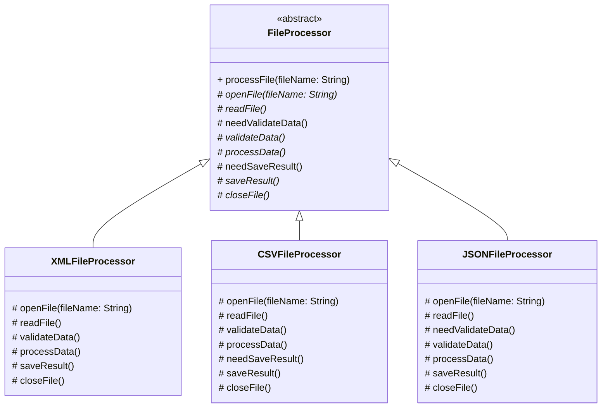

## 6. UML类图

```mermaid
classDiagram
    class AbstractClass {
        <<abstract>>
        + templateMethod()
        + primitiveOperation1()*
        + primitiveOperation2()*
        + hookMethod()
    }
    
    class ConcreteClassA {
        + primitiveOperation1()
        + primitiveOperation2()
        + hookMethod()
    }
    
    class ConcreteClassB {
        + primitiveOperation1()
        + primitiveOperation2()
        + hookMethod()
    }
    
    AbstractClass <|-- ConcreteClassA
    AbstractClass <|-- ConcreteClassB
```

## 7. 模板方法执行流程图

```mermaid
flowchart TD
    A[模板方法调用] --> B{执行步骤1}
    B --> C[调用抽象方法1]
    C --> D[执行步骤2]
    D --> E{调用抽象方法2}
    E --> F[执行步骤3]
    F --> G{调用钩子方法}
    G --> H{钩子方法返回true?}
    H -->|是| I[执行可选步骤]
    H -->|否| J[跳过可选步骤]
    I --> K[执行步骤4]
    J --> K
    K --> L[流程结束]
```

## 8. 时序图

```mermaid
sequenceDiagram
    participant C as Client
    participant Abstract as AbstractClass
    participant ConcreteA as ConcreteClassA
    
    C->>Abstract: templateMethod()
    Abstract->>Abstract: step1()
    Abstract->>ConcreteA: primitiveOperation1()
    ConcreteA->>ConcreteA: 具体实现
    Abstract->>Abstract: step2()
    Abstract->>ConcreteA: primitiveOperation2()
    ConcreteA->>ConcreteA: 具体实现
    Abstract->>Abstract: hookMethod()
    Abstract->>ConcreteA: hookMethod()
    ConcreteA->>ConcreteA: 钩子方法实现
    Abstract->>Abstract: optionalStep()
    Abstract-->>C: 返回结果
```

## 9. 数据结构图

```mermaid
graph TD
    TemplateMethod[模板方法] -->|定义算法骨架| AbstractClass[抽象模板类]
    AbstractClass -->|抽象方法| PrimitiveOperations[基本操作]
    AbstractClass -->|钩子方法| HookMethods[钩子方法]
    AbstractClass -->|具体实现| ConcreteClassA[具体模板类A]
    AbstractClass -->|具体实现| ConcreteClassB[具体模板类B]
    
    ConcreteClassA --> PrimitiveOperations
    ConcreteClassB --> PrimitiveOperations
    ConcreteClassA --> HookMethods
    ConcreteClassB --> HookMethods
```

## 10. 游戏模板结构图

```mermaid
classDiagram
    class Game {
        <<abstract>>
        + play()
        # initialize()*
        # startPlay()*
        # runGame()*
        # showWinner()
        # endPlay()*
    }
    
    class Chess {
        # initialize()
        # startPlay()
        # runGame()
        # showWinner()
        # endPlay()
    }
    
    class Poker {
        # initialize()
        # startPlay()
        # runGame()
        # showWinner()
        # endPlay()
    }
    
    class Tetris {
        # initialize()
        # startPlay()
        # runGame()
        # showWinner()
        # endPlay()
    }
    
    Game <|-- Chess
    Game <|-- Poker
    Game <|-- Tetris
```

## 11. 数据库操作模板结构图

```mermaid
classDiagram
    class DatabaseTemplate {
        <<abstract>>
        + executeDatabaseOperation()
        # connect()*
        # needPrepareData()
        # prepareData()*
        # executeOperation()*
        # needProcessResult()
        # processResult()*
        # close()*
    }
    
    class MySQLDatabase {
        # connect()
        # prepareData()
        # executeOperation()
        # processResult()
        # close()
    }
    
    class PostgreSQLDatabase {
        # connect()
        # prepareData()
        # executeOperation()
        # processResult()
        # close()
    }
    
    class MongoDBDatabase {
        # connect()
        # prepareData()
        # executeOperation()
        # needProcessResult()
        # processResult()
        # close()
    }
    
    DatabaseTemplate <|-- MySQLDatabase
    DatabaseTemplate <|-- PostgreSQLDatabase
    DatabaseTemplate <|-- MongoDBDatabase
```

## 12. 文件处理模板结构图

```mermaid
classDiagram
    class FileProcessor {
        <<abstract>>
        + processFile(fileName: String)
        # openFile(fileName: String)*
        # readFile()*
        # needValidateData()
        # validateData()*
        # processData()*
        # needSaveResult()
        # saveResult()*
        # closeFile()*
    }
    
    class XMLFileProcessor {
        # openFile(fileName: String)
        # readFile()
        # validateData()
        # processData()
        # saveResult()
        # closeFile()
    }
    
    class CSVFileProcessor {
        # openFile(fileName: String)
        # readFile()
        # validateData()
        # processData()
        # needSaveResult()
        # saveResult()
        # closeFile()
    }
    
    class JSONFileProcessor {
        # openFile(fileName: String)
        # readFile()
        # needValidateData()
        # validateData()
        # processData()
        # saveResult()
        # closeFile()
    }
    
    FileProcessor <|-- XMLFileProcessor
    FileProcessor <|-- CSVFileProcessor
    FileProcessor <|-- JSONFileProcessor
```