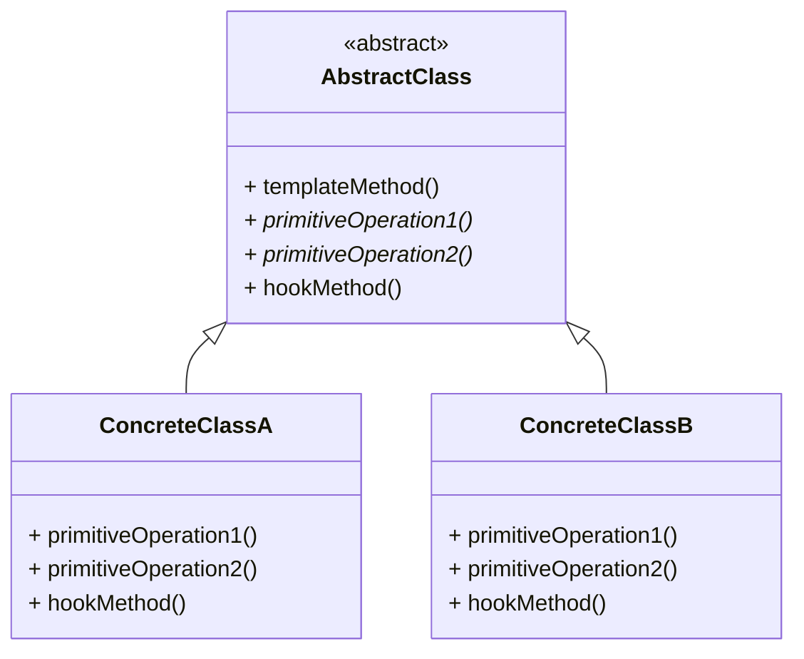
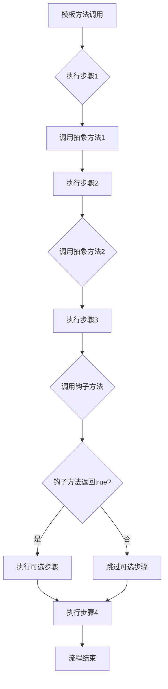
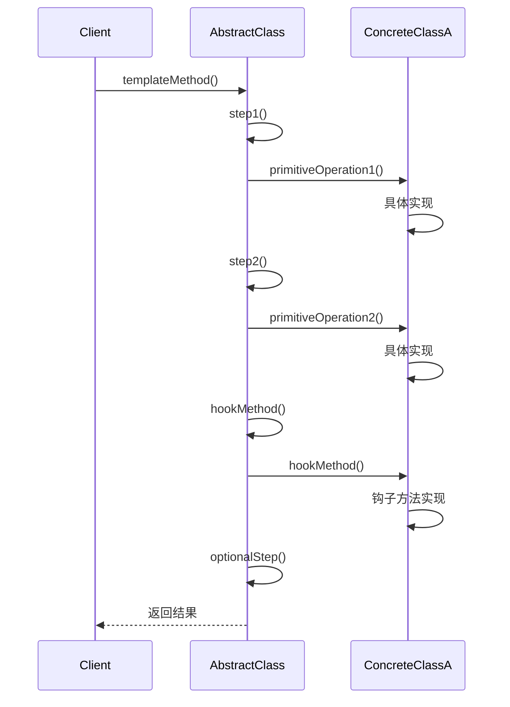
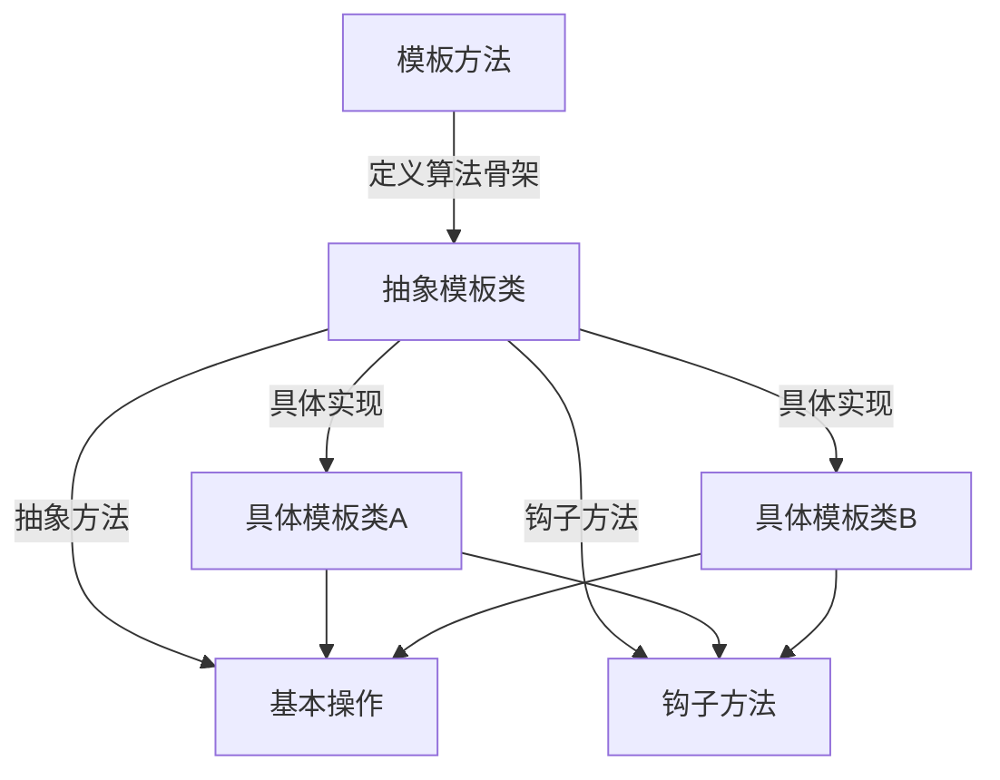
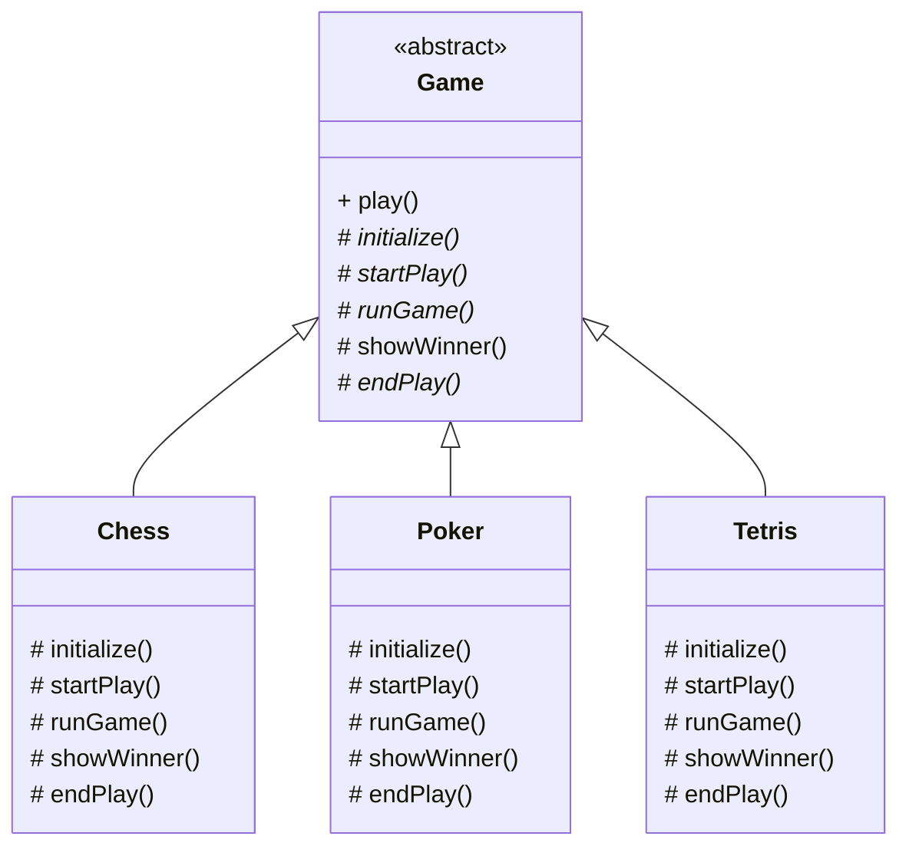
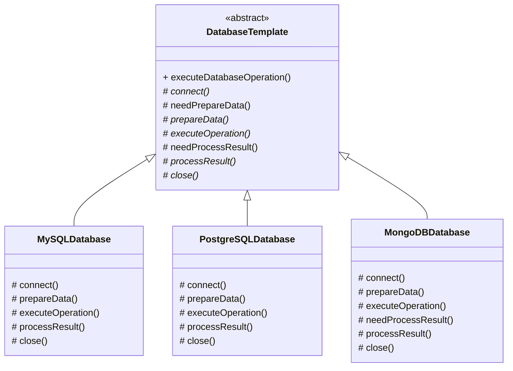
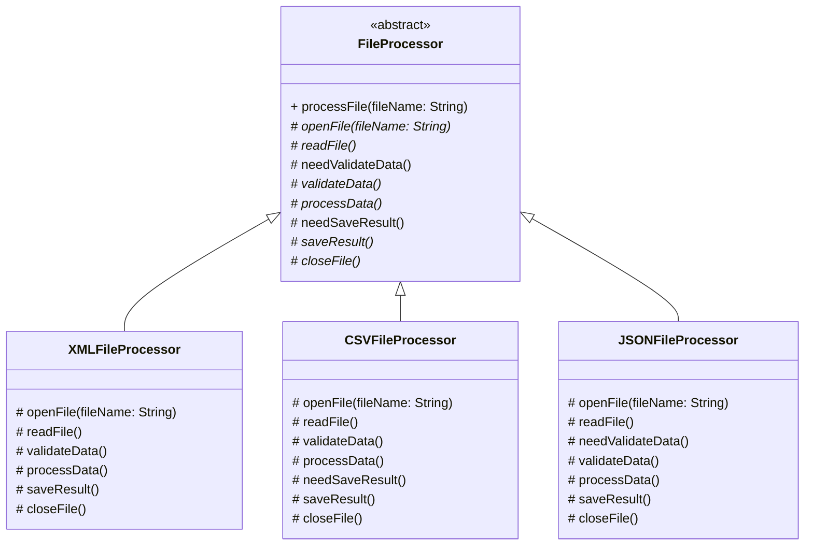

# 模板方法模式 (Template Method Pattern)

## 1. 模式简介

模板方法模式是一种行为设计模式，它定义了一个算法的骨架，而将一些步骤延迟到子类中实现。模板方法使得子类可以在不改变算法结构的情况下，重新定义算法的某些特定步骤。

### 1.1 别名
- 算法模板模式 (Algorithm Template Pattern)

### 1.2 意图
定义一个操作中的算法骨架，而将一些步骤延迟到子类中。模板方法使得子类可以在不改变算法结构的情况下，重新定义算法的某些特定步骤。

### 1.3 核心思想
- 定义算法的骨架结构
- 将可变部分延迟到子类实现
- 通过钩子方法控制流程

## 2. 适用场景

- 一次性实现一个算法的不变部分，将可变的行为留给子类来实现
- 各子类中公共的行为应被提取出来并集中到一个公共父类中以避免代码重复
- 控制子类的扩展，通过模板方法只允许子类通过特定的钩子方法进行扩展

## 3. 结构说明

### 3.1 主要角色

1. **AbstractClass（抽象模板类）**
   - 定义并实现一个模板方法，这个模板方法定义了算法的骨架
   - 定义抽象基本操作，由子类实现
   - 定义并实现一个或多个钩子方法，供子类实现

2. **ConcreteClass（具体模板类）**
   - 实现父类所定义的一个或多个抽象方法
   - 每一个AbstractClass的子类都可以给出这些步骤的不同实现

## 4. 优缺点

### 4.1 优点
- **封装不变部分，扩展可变部分**：将算法的骨架封装在父类中，将可变部分延迟到子类实现
- **提取公共代码，便于维护**：将公共行为提取到父类中，避免代码重复
- **行为由父类控制，子类实现**：通过模板方法控制行为流程，子类只负责具体实现
- **符合开闭原则**：增加新的具体模板类无需修改现有代码

### 4.2 缺点
- **每个不同的实现都需要一个子类来实现**：导致类的个数增加
- **类数量增加，系统更加庞大**：增加了系统的复杂度
- **违反里氏替换原则**：子类可能需要不同的父类行为

## 5. 实际应用场景

1. **框架设计**：Servlet、JUnit等框架大量使用模板方法模式
2. **数据库操作**：连接、查询、关闭等标准流程
3. **文件处理**：打开、读取、处理、关闭等标准流程
4. **游戏开发**：游戏初始化、运行、结束等标准流程
5. **报表生成**：数据收集、处理、格式化、输出等标准流程
6. **编译器设计**：词法分析、语法分析、语义分析、代码生成等标准流程
7. **Web开发**：HTTP请求处理、过滤器链等标准流程
8. **测试框架**：测试用例执行、结果验证等标准流程
9. **日志处理**：日志收集、格式化、输出等标准流程
10. **网络编程**：连接建立、数据传输、连接关闭等标准流程

## 6. UML类图

## 7. 模板方法执行流程图

## 8. 时序图

## 9. 数据结构图

## 10. 常见问题与解决方案

### 10.1 子类数量膨胀问题
- **问题**：每个不同的实现都需要一个子类，导致类的数量增加
- **解决方案**：
  1. 合理设计抽象类，提取更多的公共行为
  2. 使用组合模式减少子类数量
  3. 对于简单的变体，可以考虑使用策略模式

### 10.2 算法步骤僵化问题
- **问题**：模板方法定义了固定的算法步骤，难以灵活调整
- **解决方案**：
  1. 使用更多的钩子方法提供灵活性
  2. 引入回调机制增强可配置性
  3. 使用配置文件或注解控制流程

### 10.3 违反里氏替换原则问题
- **问题**：子类可能需要不同的父类行为，违反里氏替换原则
- **解决方案**：
  1. 合理设计抽象类和钩子方法
  2. 使用接口隔离原则
  3. 提供默认实现减少子类负担

### 10.4 测试困难问题
- **问题**：抽象类中的模板方法难以测试
- **解决方案**：
  1. 使用依赖注入便于测试
  2. 提供测试专用的子类
  3. 使用Mock框架模拟具体实现

## 11. 模板方法模式与其他模式的结合

### 11.1 与策略模式的结合
- 模板方法定义算法骨架，策略模式定义具体算法实现
- 可以在模板方法中使用策略对象

### 11.2 与工厂模式的结合
- 使用工厂模式创建具体的模板类实例
- 集中管理模板类的创建逻辑

### 11.3 与装饰器模式的结合
- 使用装饰器模式扩展模板方法的功能
- 在不修改原有代码的情况下增加新功能

## 12. 现代应用

### 12.1 Java SDK中的模板方法模式
Java SDK中大量使用了模板方法模式：
1. **Servlet API**：HttpServlet类定义了service方法模板
2. **JUnit框架**：Test类定义了测试执行模板
3. **IO流**：InputStream类定义了read方法模板

### 12.2 Spring框架中的模板方法模式
Spring框架广泛使用模板方法模式：
1. **JdbcTemplate**：数据库操作模板
2. **RestTemplate**：REST请求模板
3. **TransactionTemplate**：事务处理模板

### 12.3 函数式编程中的模板方法模式
在函数式编程中，可以使用高阶函数实现模板方法模式：
1. **回调函数**：替代抽象方法
2. **函数组合**：构建算法骨架
3. **柯里化**：参数化算法步骤

## 13. 增强特性实现

### 13.1 回调机制
通过回调接口和Lambda表达式，减少子类数量，提高灵活性。

### 13.2 配置驱动
使用配置参数控制模板方法的执行流程，解决算法步骤僵化问题。

### 13.3 函数式模板
使用函数式接口和高阶函数实现模板方法，避免传统继承方式的限制。

## 14. 游戏模板结构图

## 15. 数据库操作模板结构图

## 16. 文件处理模板结构图

## 17. 总结

模板方法模式是定义算法骨架的有效设计模式，通过将可变部分延迟到子类实现，可以避免代码重复并提高可维护性。在实际应用中，我们需要根据业务复杂度选择合适的实现方式，并注意处理好子类数量控制、算法步骤灵活性等问题。现代Java开发中，结合回调机制、配置驱动以及函数式编程特性，可以让模板方法模式发挥更大的作用。