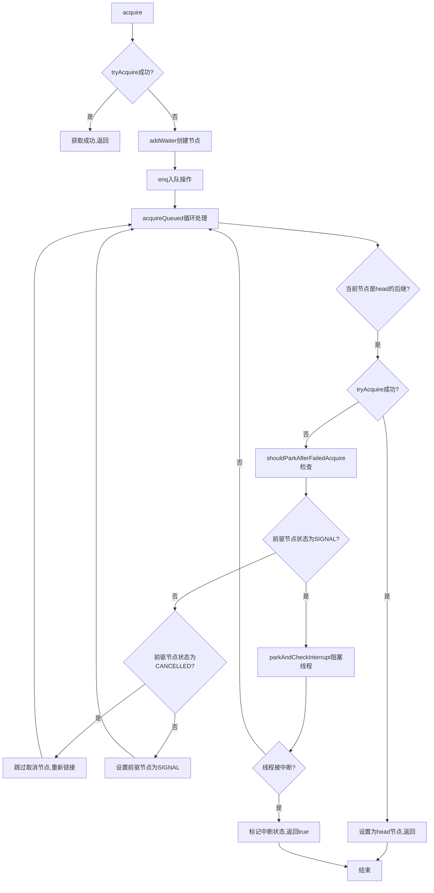
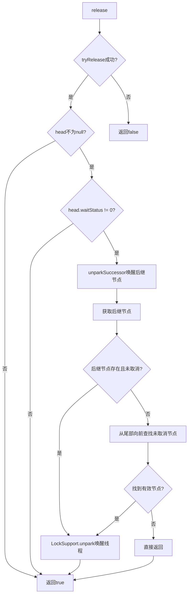
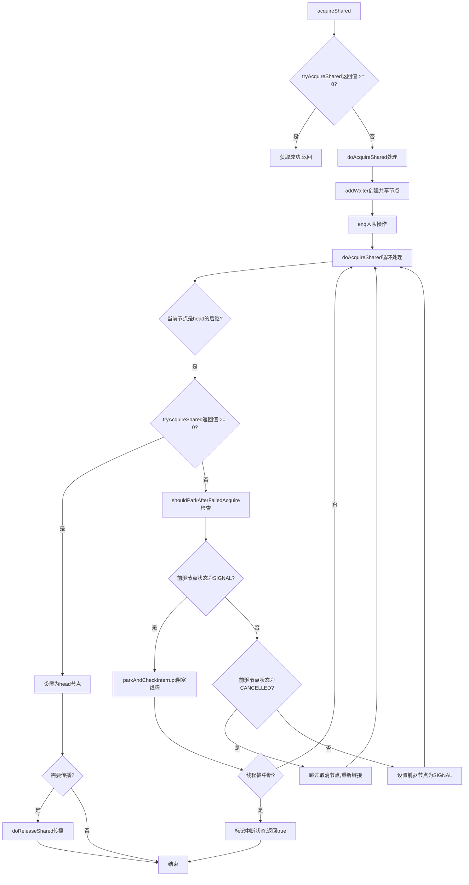
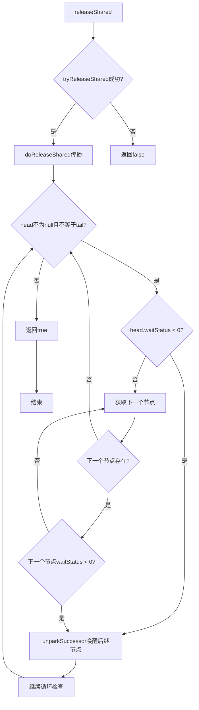
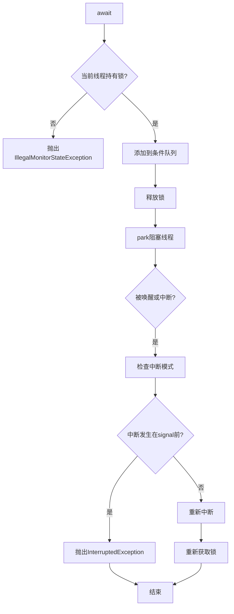
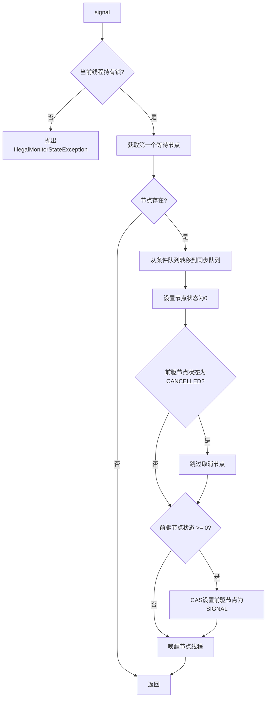
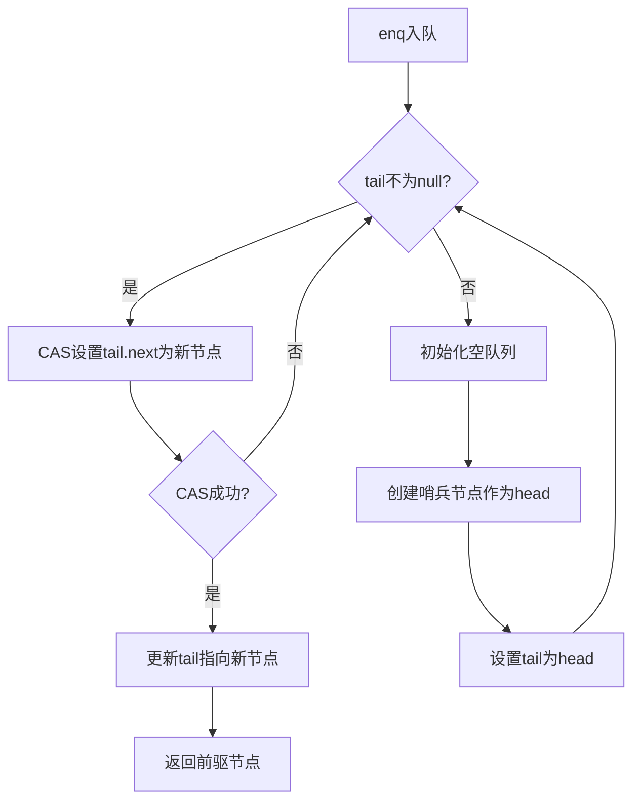
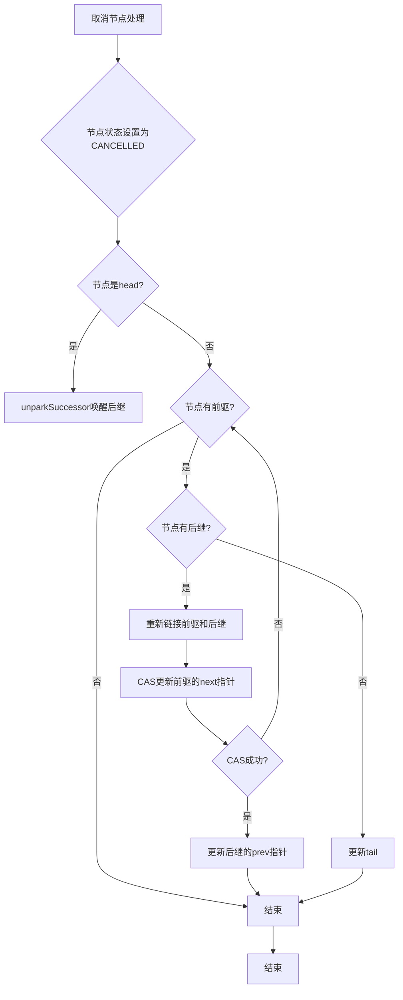

# AbstractQueuedSynchronizer (AQS) 全面解析指南

## 1. 概述

AbstractQueuedSynchronizer（简称AQS）是Java并发包中的核心框架类，为实现依赖于先进先出（FIFO）等待队列的阻塞锁和相关同步器（信号量、事件等）提供了一个框架。

此类的设计目标是为大多数依赖单个原子int值来表示状态的同步器提供基础。子类通过实现保护方法来改变这个状态的含义，以及定义哪些状态变化会使得线程可以获取或释放同步器。AQS使用CLH队列锁的一个变体来管理线程排队，并采用了模板方法设计模式。

## 2. 核心设计思想

### 2.1 CLH队列锁变体
AQS使用CLH（Craig, Landin, and Hagersten）队列锁的一个变体来管理线程排队。CLH锁通常用于自旋锁，而AQS将其改为阻塞同步器，线程在等待时不会消耗CPU。

### 2.2 模板方法模式
AQS采用了模板方法设计模式，定义了同步器的骨架方法，而将具体的状态控制逻辑交给子类实现。

### 2.3 状态管理
AQS使用一个volatile int类型的state字段来表示同步状态，通过CAS操作保证状态变更的原子性。

## 3. 核心组件

### 3.1 Node节点类
Node是AQS中的内部类，用于构建同步队列和条件队列的节点。

节点状态说明：
- **SIGNAL(-1)**：后继节点正在等待，当前节点释放或取消时必须唤醒后继节点
- **CANCELLED(1)**：当前节点已取消，由于超时或中断
- **CONDITION(-2)**：当前节点在条件队列中等待
- **PROPAGATE(-3)**：共享模式下的释放传播
- **0**：初始状态或以上状态均不适用

### 3.2 同步队列
使用双向链表组织等待线程，支持高效的入队和出队操作。

### 3.3 数据结构
Node是AQS中的内部类，用于构建同步队列和条件队列的节点。

## 4. 核心方法

### 4.1 acquire(int arg)
获取独占锁的核心方法，包含获取失败时的入队逻辑。

### 4.2 release(int arg)
释放独占锁的核心方法，包含唤醒后继节点的逻辑。

### 4.3 acquireShared(int arg)
获取共享锁的核心方法。

### 4.4 releaseShared(int arg)
释放共享锁的核心方法。

## 5. 核心机制详解

### 5.1 独占模式获取锁机制

独占模式获取锁的详细流程图：

主要步骤：
1. 调用tryAcquire尝试直接获取锁
2. 如果失败，创建Node节点并加入等待队列
3. 通过自旋和park/unpark机制实现线程阻塞和唤醒
4. 当被唤醒后重新尝试获取锁

### 5.2 独占模式释放锁机制

独占模式释放锁的详细流程图：

主要步骤：
1. 调用tryRelease释放锁
2. 如果释放成功且有等待线程，则调用unparkSuccessor唤醒后继节点
3. 后继节点被唤醒后重新尝试获取锁

### 5.3 共享模式获取锁机制

共享模式获取锁的流程图：

主要步骤：
1. 调用tryAcquireShared尝试获取共享锁
2. 如果失败，创建共享模式Node节点并加入等待队列
3. 支持锁的传播机制，允许多个线程同时获取共享锁

### 5.4 共享模式释放锁机制

共享模式释放锁的流程图：

主要步骤：
1. 调用tryReleaseShared释放共享锁
2. 如果释放成功，调用doReleaseShared进行传播
3. 唤醒多个等待线程以支持共享访问

### 5.5 条件队列机制

条件队列的await和signal流程图：

#### 条件等待(await)流程图

#### 条件唤醒(signal)流程图

主要步骤：
1. 调用await将线程加入条件队列并释放锁
2. 线程在条件队列中等待直到被signal唤醒
3. 调用signal将线程从条件队列转移到同步队列
4. 被唤醒的线程重新竞争获取锁

### 5.6 Node节点入队和出队机制

Node节点的入队和出队过程：

#### 入队过程(enq)流程图

#### 出队过程(取消节点)流程图

主要特点：
1. 使用CAS操作保证入队的原子性
2. 采用自旋方式重试入队操作
3. 支持节点取消和清理机制

### 5.7 中断处理机制

AQS提供多种中断处理方式：
1. acquireInterruptibly：响应中断并抛出InterruptedException
2. acquire：不响应中断，但记录中断状态
3. 支持线程在等待过程中被中断的处理

### 5.8 超时机制

AQS提供超时获取锁的支持：
1. tryAcquireNanos：支持超时的独占模式获取
2. tryAcquireSharedNanos：支持超时的共享模式获取
3. 使用parkNanos实现带超时的阻塞等待

## 6. 设计模式应用

### 6.1 模板方法模式
AQS定义了同步器的骨架方法，而将具体的状态控制逻辑交给子类实现。

需要子类实现的方法：
- tryAcquire(int arg) - 独占式获取同步状态
- tryRelease(int arg) - 独占式释放同步状态
- tryAcquireShared(int arg) - 共享式获取同步状态
- tryReleaseShared(int arg) - 共享式释放同步状态
- isHeldExclusively() - 当前同步器是否在独占模式下被线程占用

### 6.2 观察者模式
通过ConditionObject内部类实现观察者模式，支持线程的条件等待和通知。

### 6.3 CAS无锁编程模式
大量使用CAS操作实现无锁化的并发控制，提高性能。

## 7. 最佳实践

1. 合理设计state字段的含义
2. 使用CAS操作保证状态变更的原子性
3. 尽量减少线程阻塞和唤醒的次数
4. 在try方法中避免进行耗时操作
5. 正确处理中断和超时情况
6. 确保异常情况下状态的一致性

## 8. 总结

AQS作为Java并发包的核心框架，通过精巧的设计实现了高效的同步机制。其核心思想是使用CLH队列变体管理等待线程，结合CAS操作实现无锁化状态管理，并通过模板方法模式将具体实现交给子类。理解AQS的工作原理对于深入掌握Java并发编程具有重要意义。