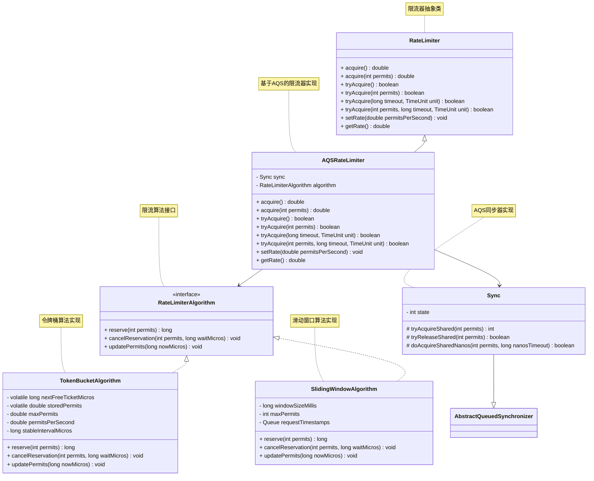
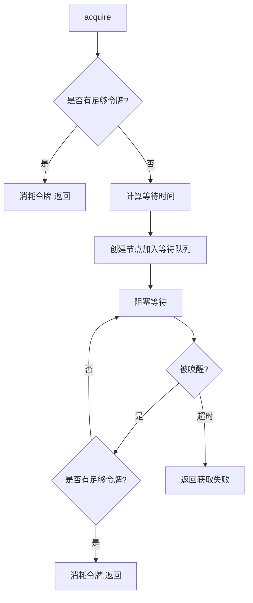
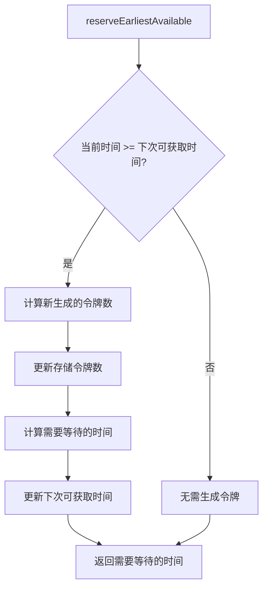
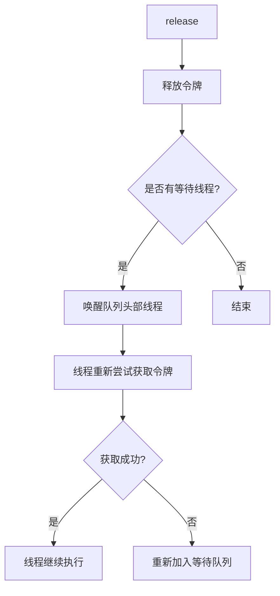
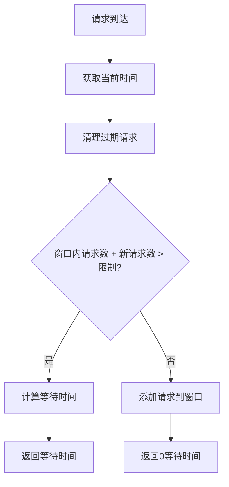
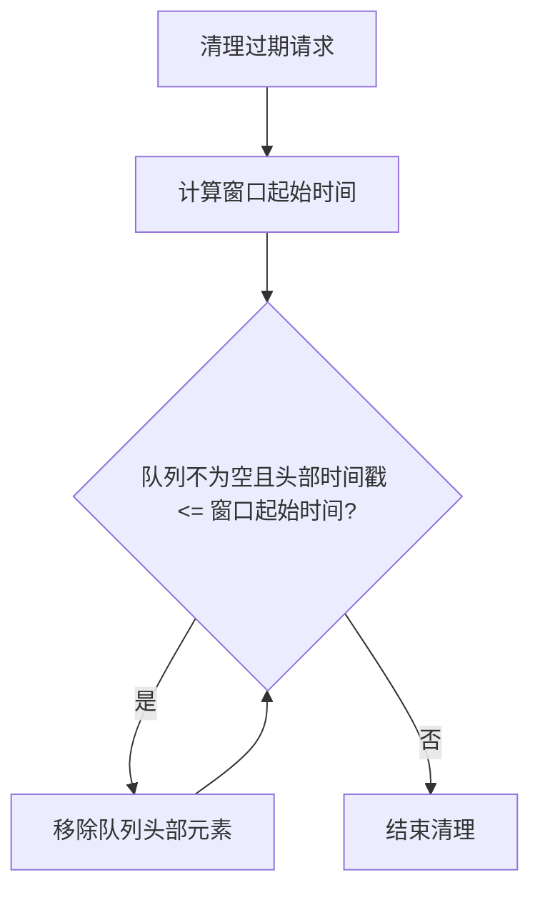
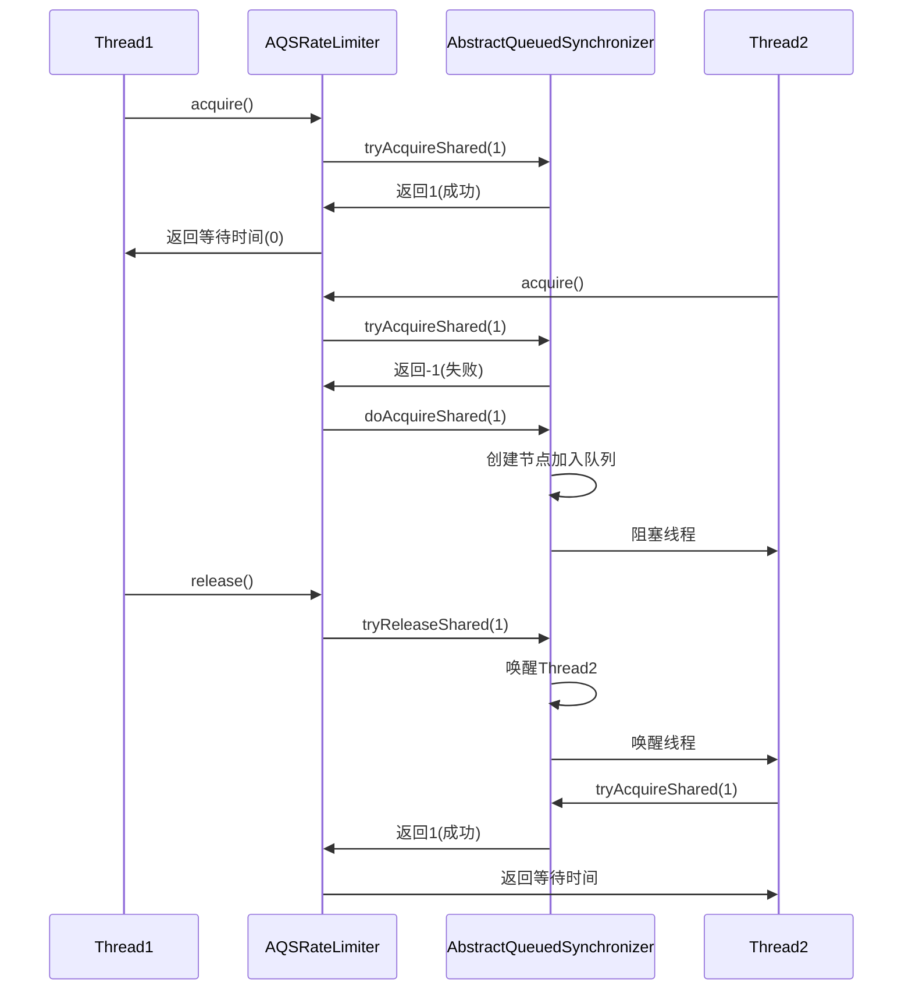
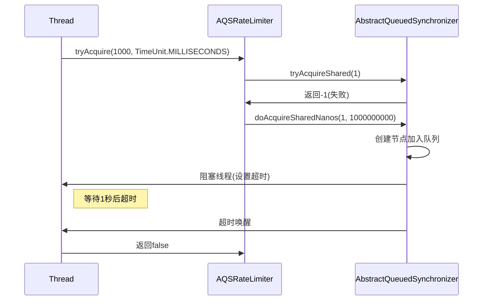
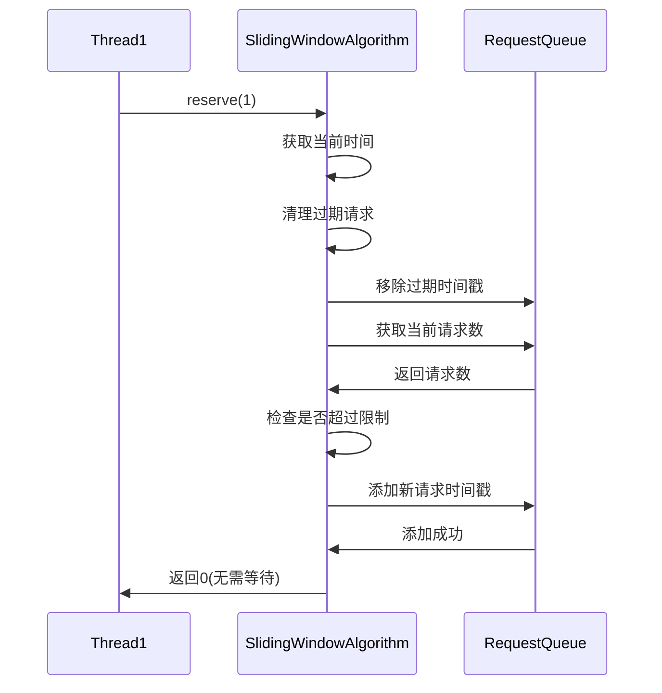

# 基于AQS的高并发限流器设计文档

## 1. 概述

本文档详细描述了一个基于AQS(AbstractQueuedSynchronizer)实现的高并发限流器设计。该限流器支持多种限流算法（令牌桶算法、滑动窗口算法等），能够在高并发场景下有效控制资源访问频率，保护系统免受流量冲击。

## 2. 设计目标

1. **高并发支持**：能够在高并发场景下稳定运行，保证线程安全
2. **低延迟**：尽量减少获取许可的等待时间
3. **灵活配置**：支持动态调整限流参数
4. **多种获取模式**：支持阻塞、非阻塞和超时获取模式
5. **资源回收**：自动清理过期的等待线程
6. **算法可扩展**：支持多种限流算法，易于扩展新算法

## 3. 核心设计思想

### 3.1 令牌桶算法
- 以固定速率向桶中添加令牌
- 请求到来时消耗相应数量的令牌
- 桶中有足够令牌时允许请求通过
- 桶中令牌不足时拒绝或等待请求

### 3.2 滑动窗口算法
- 将时间划分为固定大小的窗口
- 在每个窗口内统计请求次数
- 通过滑动窗口计算最近一段时间内的请求速率
- 超过阈值时拒绝请求

### 3.3 AQS应用
- 利用AQS的同步队列管理等待线程
- 通过AQS的状态字段表示可用许可数
- 使用AQS提供的模板方法实现获取和释放逻辑

## 4. 类结构设计

### 4.1 核心类图



### 4.2 类职责说明

#### RateLimiter
- 定义限流器的核心接口
- 提供多种获取令牌的方法
- 作为所有限流器实现的基类

#### RateLimiterAlgorithm (接口)
- 定义限流算法的通用接口
- 提供算法相关的抽象方法

#### TokenBucketAlgorithm
- 实现令牌桶算法
- 管理令牌生成和消耗逻辑
- 计算请求需要等待的时间

#### SlidingWindowAlgorithm
- 实现滑动窗口算法
- 维护请求时间窗口
- 计算请求是否超过限制

#### AQSRateLimiter
- 基于AQS的具体实现
- 利用AQS管理线程排队和唤醒
- 组合具体的限流算法实现

#### Sync (继承自AbstractQueuedSynchronizer)
- 实现AQS的模板方法
- 管理同步状态（可用许可数）
- 处理线程的阻塞和唤醒

## 5. 核心流程

### 5.1 获取令牌流程图



### 5.2 令牌生成流程图



### 5.3 线程唤醒流程图



### 5.4 滑动窗口请求处理流程图



### 5.5 滑动窗口清理流程图



## 6. 时序图

### 6.1 成功获取令牌时序图



### 6.2 超时获取令牌时序图



### 6.3 滑动窗口算法时序图



## 7. 核心算法实现

### 7.1 令牌桶算法

#### 令牌生成算法
```
nextFreeTicketMicros: 下次可以获取令牌的时间(微秒)
storedPermits: 当前存储的令牌数
maxPermits: 最大存储令牌数
permitsPerSecond: 每秒生成令牌数
stableIntervalMicros: 每个令牌生成间隔(微秒) = 1秒/permitsPerSecond
```

#### 令牌消耗算法
```
当前时间 >= nextFreeTicketMicros 时:
  1. 计算这段时间内生成的令牌数
  2. 更新 storedPermits = min(storedPermits + 新生成令牌数, maxPermits)
  3. 更新 nextFreeTicketMicros = 当前时间
  
需要消耗N个令牌时:
  1. 如果 storedPermits >= N:
       - 直接消耗N个令牌
       - 等待时间为0
  2. 如果 storedPermits < N:
       - 消耗所有storedPermits
       - 剩余需要的令牌数 = N - storedPermits
       - 计算需要等待的时间 = 剩余令牌数 * stableIntervalMicros
       - 更新 nextFreeTicketMicros += 等待时间
```

### 7.2 滑动窗口算法

#### 窗口管理算法
```
windowSizeMillis: 窗口大小(毫秒)
maxPermits: 窗口内最大请求数
requestTimestamps: 请求时间戳队列(存储毫秒时间戳)
```

#### 请求处理算法
```
当有请求到来时:
  1. 获取当前时间 now
  2. 清理过期请求:
     - 计算窗口起始时间 windowStart = now - windowSizeMillis
     - 移除所有时间戳 <= windowStart 的请求
  3. 检查是否超过限制:
     - 如果 requestTimestamps.size() + permits > maxPermits:
         * 计算等待时间 waitTime = oldestTimestamp + windowSizeMillis - now
         * 返回需要等待的时间
     - 否则:
         * 将当前请求时间戳添加到队列中
         * 返回0(不需要等待)
```

#### 过期请求清理算法
```
cleanupExpiredRequests(long now):
  1. 计算窗口起始时间 windowStart = now - windowSizeMillis
  2. 循环移除队列头部过期的请求:
     - 当队列不为空且头部时间戳 <= windowStart 时:
         * 移除队列头部元素
  3. 结束清理
```

## 8. AQS状态管理

### 8.1 状态字段设计
- 使用AQS的state字段表示可用令牌数
- 由于令牌可能是小数，需要特殊处理
- 可以使用高位表示整数部分，低位表示小数部分

### 8.2 模板方法实现
```java
// 获取共享锁的尝试
protected int tryAcquireShared(int permits) {
    // 检查是否有足够令牌
    // 如果有，更新状态并返回1
    // 如果没有，返回-1
}

// 释放共享锁的尝试
protected boolean tryReleaseShared(int permits) {
    // 增加令牌数
    // 如果有等待线程，唤醒它们
    // 返回是否需要传播
}
```

## 9. 并发控制机制

### 9.1 线程安全保证
- 使用volatile变量保证可见性
- 利用AQS的CAS操作保证原子性
- 通过同步队列管理线程排队

### 9.2 性能优化
- 减少不必要的线程阻塞
- 使用高效的令牌计算算法
- 避免频繁的状态更新

## 10. 异常处理

### 10.1 中断处理
- 支持可中断和不可中断的获取模式
- 正确处理线程中断状态

### 10.2 超时处理
- 精确控制超时时间
- 及时清理超时的等待线程

## 11. 实际代码实现

### 11.1 RateLimiter抽象类
```java
public abstract class RateLimiter {
    // 主要方法
    public double acquire() throws InterruptedException { /* ... */ }
    public double acquire(int permits) throws InterruptedException { /* ... */ }
    public boolean tryAcquire() { /* ... */ }
    public boolean tryAcquire(int permits, long timeout, TimeUnit unit) { /* ... */ }
}
```

### 11.2 RateLimiterAlgorithm接口
```java
public interface RateLimiterAlgorithm {
    long reserve(int permits);
    void cancelReservation(int permits, long waitMicros);
    void updatePermits(long nowMicros);
}
```

### 11.3 TokenBucketAlgorithm实现类
```java
public class TokenBucketAlgorithm implements RateLimiterAlgorithm {
    // 核心状态字段
    private volatile long nextFreeTicketMicros = 0L;
    private volatile double storedPermits = 0.0;
    private double maxPermits = 0.0;
    private double permitsPerSecond = 0.0;
    private long stableIntervalMicros = 0L;
    
    public TokenBucketAlgorithm(double permitsPerSecond) {
        setRate(permitsPerSecond);
    }
    
    public void setRate(double permitsPerSecond) {
        // 实现设置速率逻辑
    }
    
    @Override
    public long reserve(int permits) {
        // 实现令牌预留逻辑
    }
    
    @Override
    public void cancelReservation(int permits, long waitMicros) {
        // 实现取消预留逻辑
    }
    
    @Override
    public void updatePermits(long nowMicros) {
        // 实现令牌更新逻辑
    }
}
```

### 11.4 SlidingWindowAlgorithm实现类
```java
public class SlidingWindowAlgorithm implements RateLimiterAlgorithm {
    // 核心状态字段
    private long windowSizeMillis;
    private int maxPermits;
    private Queue<Long> requestTimestamps;
    
    public SlidingWindowAlgorithm(int maxPermits, long windowSizeMillis) {
        this.maxPermits = maxPermits;
        this.windowSizeMillis = windowSizeMillis;
        this.requestTimestamps = new ConcurrentLinkedQueue<>();
    }
    
    @Override
    public long reserve(int permits) {
        // 实现滑动窗口算法逻辑
    }
    
    @Override
    public void cancelReservation(int permits, long waitMicros) {
        // 实现取消预留逻辑
    }
    
    @Override
    public void updatePermits(long nowMicros) {
        // 实现窗口更新逻辑
    }
}
```

### 11.5 AQSRateLimiter实现类
```java
public class AQSRateLimiter extends RateLimiter {
    private final Sync sync;
    private final RateLimiterAlgorithm algorithm;
    
    public AQSRateLimiter(RateLimiterAlgorithm algorithm) {
        this.sync = new Sync();
        this.algorithm = algorithm;
    }
    
    private static class Sync extends AbstractQueuedSynchronizer {
        @Override
        protected int tryAcquireShared(int permits) {
            return 1; // 简化实现
        }
        
        @Override
        protected boolean tryReleaseShared(int permits) {
            return true; // 简化实现
        }
    }
}
```

### 11.6 关键实现点
1. **算法抽象**：通过RateLimiterAlgorithm接口抽象不同限流算法
2. **算法实现**：TokenBucketAlgorithm和SlidingWindowAlgorithm分别实现具体算法
3. **组合模式**：AQSRateLimiter通过组合使用具体算法实现
4. **线程排队**：使用AQS的同步队列管理等待线程
5. **状态同步**：通过synchronized关键字保证算法计算的原子性
6. **线程唤醒**：利用AQS的传播机制唤醒等待线程

### 11.7 滑动窗口算法特点
1. **时间窗口管理**：维护一个时间窗口内的请求记录
2. **过期请求清理**：自动清理窗口外的过期请求记录
3. **精确限流控制**：基于时间窗口内的请求数量进行精确控制
4. **内存优化**：使用队列结构高效管理请求时间戳

## 12. 测试策略

### 12.1 单元测试
- 测试基本的获取和释放功能
- 验证限流算法的正确性
- 测试边界条件

### 12.2 并发测试
- 多线程并发获取令牌
- 验证线程安全性
- 测试高负载下的性能

### 12.3 压力测试
- 大量请求下的稳定性测试
- 长时间运行的可靠性测试

## 13. 使用示例

### 13.1 令牌桶算法
```java
// 创建令牌桶限流器，每秒允许10个请求
RateLimiter rateLimiter = RateLimiter.create(10.0);

// 获取一个令牌，可能会阻塞
double waitTime = rateLimiter.acquire();

// 尝试获取一个令牌，不阻塞
boolean acquired = rateLimiter.tryAcquire();

// 尝试在指定时间内获取令牌
boolean acquired = rateLimiter.tryAcquire(1000, TimeUnit.MILLISECONDS);
```

### 13.2 滑动窗口算法
```java
// 创建滑动窗口限流器，10秒内最多允许50个请求
RateLimiter rateLimiter = RateLimiter.createSlidingWindow(50, 10000);

// 获取一个令牌，可能会阻塞
double waitTime = rateLimiter.acquire();

// 尝试获取一个令牌，不阻塞
boolean acquired = rateLimiter.tryAcquire();

// 尝试在指定时间内获取令牌
boolean acquired = rateLimiter.tryAcquire(1000, TimeUnit.MILLISECONDS);
```

## 14. 总结

基于AQS实现的限流器充分利用了AQS提供的同步机制，能够有效管理高并发场景下的线程排队和唤醒。通过支持多种限流算法（令牌桶算法和滑动窗口算法），实现了灵活且高效的限流控制。该设计具有良好的扩展性和稳定性，适用于各种需要流量控制的场景。

关键优势：
1. **高并发支持**：利用AQS的高效同步队列管理大量等待线程
2. **多种算法支持**：支持令牌桶和滑动窗口两种主流限流算法
3. **灵活配置**：可根据不同场景选择合适的算法和参数
4. **多种模式**：支持阻塞、非阻塞和超时获取模式
5. **线程安全**：通过AQS和同步机制保证线程安全
6. **易于扩展**：通过接口抽象，便于添加新的限流算法