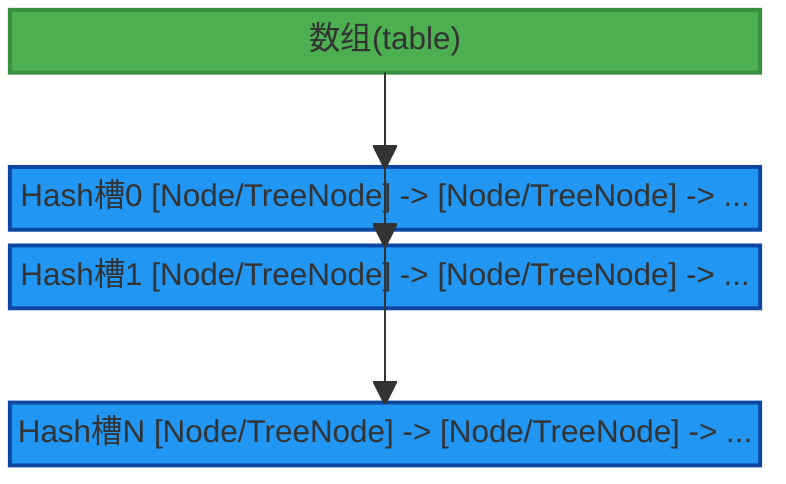
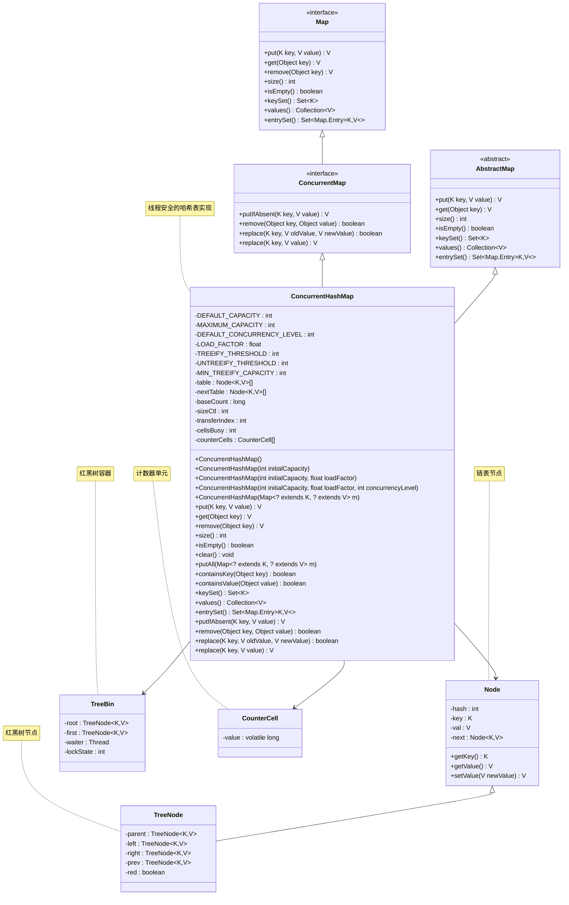
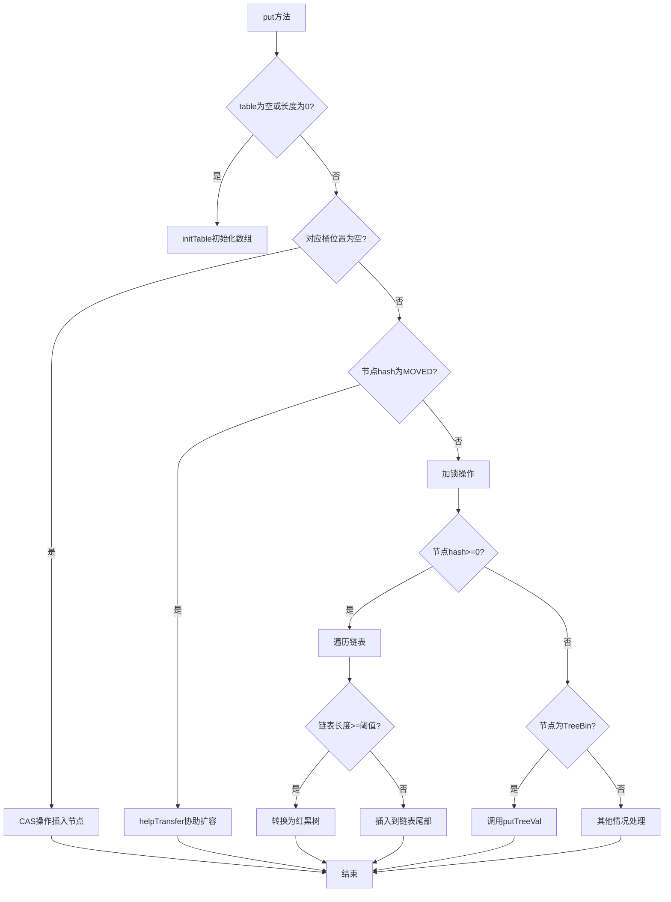
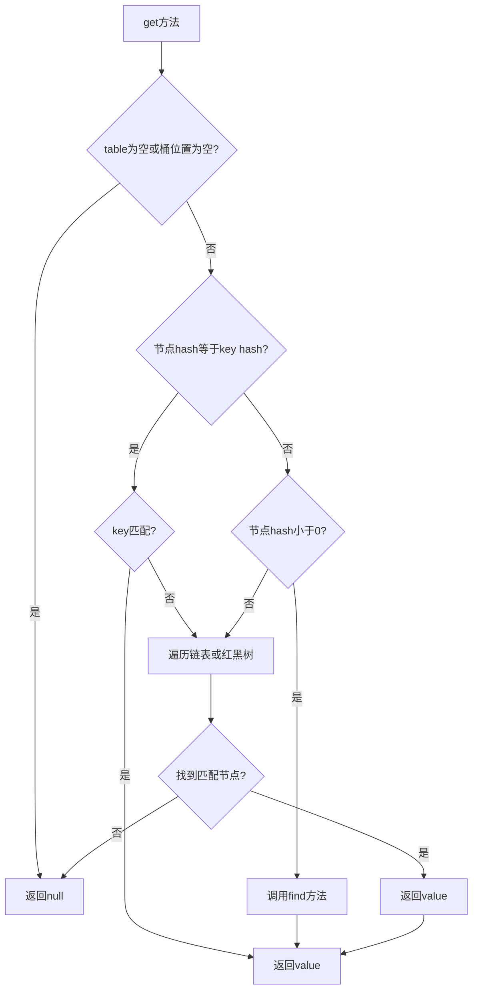
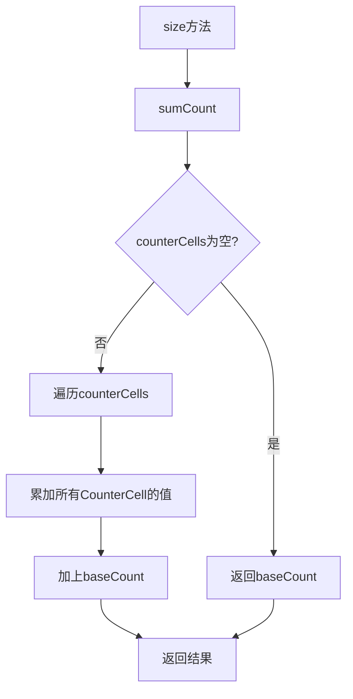
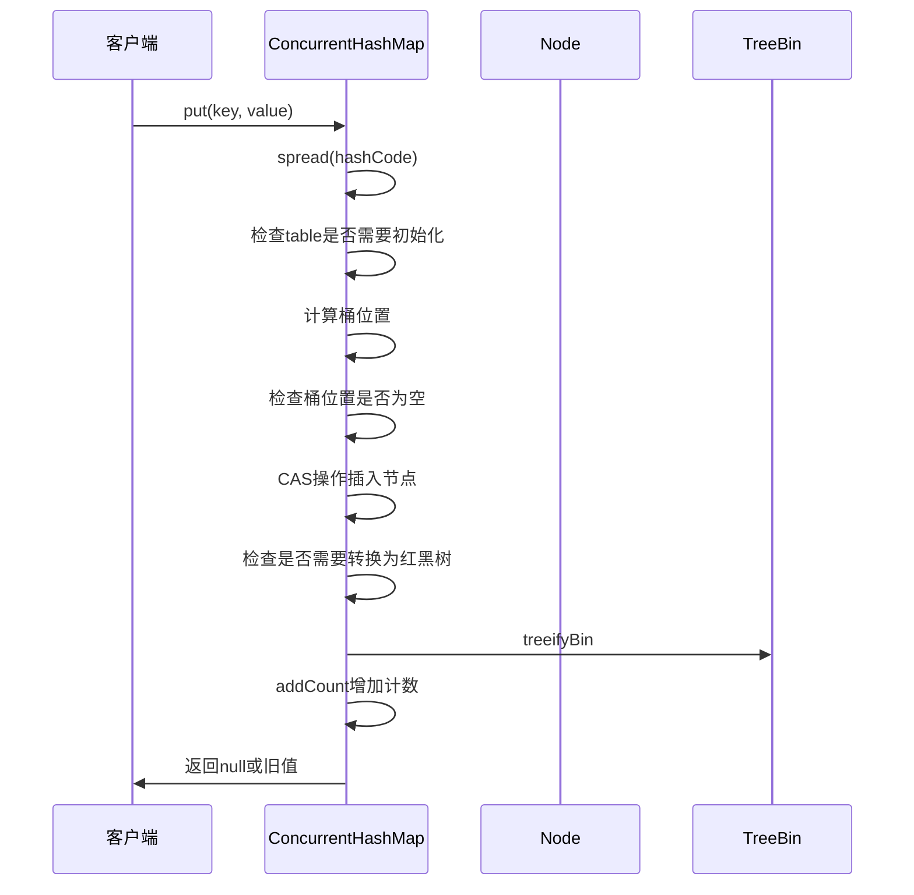
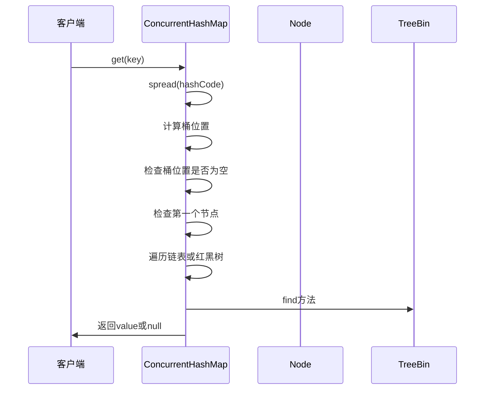

# ConcurrentHashMap 全面解析指南

## 1. 概述

ConcurrentHashMap是Java并发包(java.util.concurrent)中的重要组成部分，它是HashMap的线程安全版本。在多线程环境中，ConcurrentHashMap提供了比Hashtable更好的性能，同时保证了线程安全性。

ConcurrentHashMap的设计目标是：
1. **高并发性**：允许多个线程同时读写而不发生阻塞
2. **线程安全**：保证在多线程环境下的数据一致性
3. **高性能**：通过分段锁等技术减少锁竞争，提高并发性能
4. **弱一致性**：在迭代过程中不抛出ConcurrentModificationException

ConcurrentHashMap继承自AbstractMap类，实现了ConcurrentMap接口，是Java并发编程中最重要的集合类之一。它在JDK 1.5中首次引入，并在JDK 1.8中进行了重大重构，以提供更好的并发性能。

## 2. 数据结构

### 2.1 核心数据结构

ConcurrentHashMap的核心数据结构在不同JDK版本中有不同的实现：

**JDK 1.7及之前版本**：
- **Segment数组**：采用分段锁机制，将数据分成多个段(Segment)，每个段独立加锁
- **HashEntry数组**：每个Segment内部维护一个HashEntry数组
- **链表**：解决哈希冲突的结构

**JDK 1.8及之后版本**：
- **Node数组**：直接使用Node数组存储数据，摒弃了分段锁机制
- **链表**：解决哈希冲突的结构
- **红黑树**：当链表长度超过一定阈值时转换为红黑树，提高查找效率
- **CAS操作**：使用无锁化技术提高并发性能

### 2.2 数组结构

ConcurrentHashMap内部使用一个Node数组来存储数据，每个Node代表一个键值对：

```java
transient volatile Node<K,V>[] table;
```

数组的每个位置称为一个Hash槽(slot)，用于存储具有相同哈希值的元素。

### 2.3 链表结构

当发生哈希冲突时，ConcurrentHashMap使用链表来存储具有相同哈希值的元素。链表的每个节点都是一个Node对象：

```java
static class Node<K,V> implements Map.Entry<K,V> {
    final int hash;
    final K key;
    volatile V val;
    volatile Node<K,V> next;
    // ...
}
```

### 2.4 红黑树结构

当链表长度超过一定阈值(默认为8)时，链表会转换为红黑树，以提高查找效率：

```java
static final class TreeNode<K,V> extends Node<K,V> {
    TreeNode<K,V> parent;  // red-black tree links
    TreeNode<K,V> left;
    TreeNode<K,V> right;
    TreeNode<K,V> prev;    // needed to unlink next upon deletion
    boolean red;
    // ...
}
```

### 2.5 ConcurrentHashMap整体数据结构图



## 3. 源码设计分析

### 3.1 核心字段

```java
// 默认初始容量
private static final int DEFAULT_CAPACITY = 16;

// 最大容量
private static final int MAXIMUM_CAPACITY = 1 << 30;

// 默认并发级别
private static final int DEFAULT_CONCURRENCY_LEVEL = 16;

// 默认负载因子
private static final float LOAD_FACTOR = 0.75f;

// 链表转红黑树阈值
static final int TREEIFY_THRESHOLD = 8;

// 红黑树转链表阈值
static final int UNTREEIFY_THRESHOLD = 6;

// 最小树化容量
static final int MIN_TREEIFY_CAPACITY = 64;

// 存储数据的数组
transient volatile Node<K,V>[] table;

// 扩容时使用的新数组
private transient volatile Node<K,V>[] nextTable;

// 键值对数量计数器
private transient volatile long baseCount;

// 扩容相关标志位
private transient volatile int sizeCtl;

// 扩容时的转移索引
private transient volatile int transferIndex;

// 计数器戳记
private transient volatile int cellsBusy;

// 计数器单元数组
private transient volatile CounterCell[] counterCells;
```

### 3.2 构造方法

ConcurrentHashMap提供了多个构造方法：

```java
// 默认构造方法
public ConcurrentHashMap() {
}

// 指定初始容量
public ConcurrentHashMap(int initialCapacity) {
    if (initialCapacity < 0)
        throw new IllegalArgumentException();
    int cap = ((initialCapacity >= (MAXIMUM_CAPACITY >>> 1)) ?
               MAXIMUM_CAPACITY :
               tableSizeFor(initialCapacity + (initialCapacity >>> 1) + 1));
    this.sizeCtl = cap;
}

// 指定初始容量和负载因子
public ConcurrentHashMap(int initialCapacity, float loadFactor) {
    this(initialCapacity, loadFactor, 1);
}

// 指定初始容量、负载因子和并发级别
public ConcurrentHashMap(int initialCapacity,
                         float loadFactor, int concurrencyLevel) {
    if (!(loadFactor > 0.0f) || initialCapacity < 0 || concurrencyLevel <= 0)
        throw new IllegalArgumentException();
    if (initialCapacity < concurrencyLevel) {
        initialCapacity = concurrencyLevel;
    }
    long size = (long)(1.0 + (long)initialCapacity / loadFactor);
    int cap = (size >= (long)MAXIMUM_CAPACITY) ?
        MAXIMUM_CAPACITY : tableSizeFor((int)size);
    this.sizeCtl = cap;
}

// 从其他Map构造
public ConcurrentHashMap(Map<? extends K, ? extends V> m) {
    this.sizeCtl = DEFAULT_CAPACITY;
    putMapEntries(m, false);
}
```

### 3.3 核心方法实现

#### put方法

```java
public V put(K key, V value) {
    return putVal(key, value, false);
}

final V putVal(K key, V value, boolean onlyIfAbsent) {
    if (key == null || value == null) throw new NullPointerException();
    int hash = spread(key.hashCode());
    int binCount = 0;
    for (Node<K,V>[] tab = table;;) {
        Node<K,V> f; int n, i, fh;
        if (tab == null || (n = tab.length) == 0)
            tab = initTable();
        else if ((f = tabAt(tab, i = (n - 1) & hash)) == null) {
            if (casTabAt(tab, i, null,
                         new Node<K,V>(hash, key, value, null)))
                break;                   // no lock when adding to empty bin
        }
        else if ((fh = f.hash) == MOVED)
            tab = helpTransfer(tab, f);
        else {
            V oldVal = null;
            synchronized (f) {
                if (tabAt(tab, i) == f) {
                    if (fh >= 0) {
                        binCount = 1;
                        for (Node<K,V> e = f;; ++binCount) {
                            K ek;
                            if (e.hash == hash &&
                                ((ek = e.key) == key ||
                                 (ek != null && key.equals(ek)))) {
                                oldVal = e.val;
                                if (!onlyIfAbsent)
                                    e.val = value;
                                break;
                            }
                            Node<K,V> pred = e;
                            if ((e = e.next) == null) {
                                pred.next = new Node<K,V>(hash, key,
                                                          value, null);
                                break;
                            }
                        }
                    }
                    else if (f instanceof TreeBin) {
                        Node<K,V> p;
                        binCount = 2;
                        if ((p = ((TreeBin<K,V>)f).putTreeVal(hash, key,
                                                              value)) != null) {
                            oldVal = p.val;
                            if (!onlyIfAbsent)
                                p.val = value;
                        }
                    }
                }
            }
            if (binCount != 0) {
                if (binCount >= TREEIFY_THRESHOLD)
                    treeifyBin(tab, i);
                if (oldVal != null)
                    return oldVal;
                break;
            }
        }
    }
    addCount(1L, binCount);
    return null;
}
```

#### get方法

```java
public V get(Object key) {
    Node<K,V>[] tab; Node<K,V> e, p; int n, eh; K ek;
    int h = spread(key.hashCode());
    if ((tab = table) != null && (n = tab.length) > 0 &&
        (e = tabAt(tab, (n - 1) & h)) != null) {
        if ((eh = e.hash) == h) {
            if ((ek = e.key) == key || (ek != null && key.equals(ek)))
                return e.val;
        }
        else if (eh < 0)
            return (p = e.find(h, key)) != null ? p.val : null;
        while ((e = e.next) != null) {
            if (e.hash == h &&
                ((ek = e.key) == key || (ek != null && key.equals(ek))))
                return e.val;
        }
    }
    return null;
}
```

#### size方法

```java
public int size() {
    long n = sumCount();
    return ((n < 0L) ? 0 :
            (n > (long)Integer.MAX_VALUE) ? Integer.MAX_VALUE :
            (int)n);
}

final long sumCount() {
    CounterCell[] as = counterCells; CounterCell a;
    long sum = baseCount;
    if (as != null) {
        for (int i = 0; i < as.length; ++i) {
            if ((a = as[i]) != null)
                sum += a.value;
        }
    }
    return sum;
}
```

## 4. 设计模式应用

### 4.1 模板方法模式

ConcurrentHashMap通过继承AbstractMap类，利用了模板方法模式。AbstractMap定义了Map接口的骨架实现，而ConcurrentHashMap提供了具体的并发安全实现。

### 4.2 迭代器模式

ConcurrentHashMap提供了多种迭代器实现，用于遍历集合中的元素。与HashMap不同，ConcurrentHashMap的迭代器具有弱一致性，不会抛出ConcurrentModificationException：

```java
// Key迭代器
final class KeyIterator extends BaseIterator
    implements Iterator<K>, Enumeration<K> {
    public final K next() { return nextNode().key; }
}

// Value迭代器
final class ValueIterator extends BaseIterator
    implements Iterator<V>, Enumeration<V> {
    public final V next() { return nextNode().val; }
}

// Entry迭代器
final class EntryIterator extends BaseIterator
    implements Iterator<Map.Entry<K,V>> {
    public final Map.Entry<K,V> next() { return nextNode(); }
}
```

### 4.3 适配器模式

ConcurrentHashMap通过内部类EntrySet、KeySet和Values将内部结构适配为标准的Set和Collection接口：

```java
public Set<Map.Entry<K,V>> entrySet() {
    Set<Map.Entry<K,V>> es;
    return (es = entrySet) == null ? (entrySet = new EntrySet()) : es;
}

final class EntrySet extends AbstractSet<Map.Entry<K,V>> {
    public final int size() { return map.size(); }
    public final void clear() { map.clear(); }
    public final Iterator<Map.Entry<K,V>> iterator() {
        return new EntryIterator();
    }
    // ...
}
```

### 4.4 工厂方法模式

ConcurrentHashMap通过不同的构造方法提供了创建对象的工厂方法，可以根据不同的参数创建ConcurrentHashMap实例。

### 4.5 CAS操作模式

ConcurrentHashMap大量使用了CAS（Compare-And-Swap）操作来实现无锁化的并发控制：

```java
// CAS操作设置数组元素
static final <K,V> boolean casTabAt(Node<K,V>[] tab, int i,
                                    Node<K,V> c, Node<K,V> v) {
    return U.compareAndSwapObject(tab, ((long)i << ASHIFT) + ABASE, c, v);
}

// CAS操作增加计数器
private final boolean casBaseCount(long cmp, long val) {
    return U.compareAndSwapLong(this, BASECOUNT, cmp, val);
}
```

## 5. 核心机制详解

### 5.1 分段锁机制

在JDK 1.7及之前版本中，ConcurrentHashMap采用分段锁机制来实现并发控制。整个数组被分为多个段(Segment)，每个段独立加锁，从而提高并发性能。

### 5.2 CAS操作

ConcurrentHashMap大量使用CAS（Compare-And-Swap）操作来实现无锁化的并发控制，减少了线程阻塞和上下文切换的开销。

### 5.3 Volatile语义

ConcurrentHashMap使用volatile关键字来保证内存可见性，确保多线程环境下的数据一致性。

### 5.4 扩容机制

ConcurrentHashMap的扩容机制支持多线程并发扩容，提高了扩容效率。

## 6. 类图设计



## 7. 核心流程图

### 7.1 put操作流程图



### 7.2 get操作流程图



### 7.3 size操作流程图



## 8. 时序图

### 8.1 put操作时序图



### 8.2 get操作时序图



## 9. 使用介绍

### 9.1 基本使用

```java
// 创建ConcurrentHashMap实例
ConcurrentHashMap<String, Integer> map = new ConcurrentHashMap<>();

// 添加元素
map.put("key1", 1);
map.put("key2", 2);

// 获取元素
Integer value = map.get("key1");

// 删除元素
map.remove("key2");

// 原子操作
map.putIfAbsent("key3", 3);
map.replace("key1", 1, 10);
```

### 9.2 线程安全示例

```java
// 多线程环境下安全使用ConcurrentHashMap
ConcurrentHashMap<String, Integer> map = new ConcurrentHashMap<>();

// 线程1
new Thread(() -> {
    for (int i = 0; i < 1000; i++) {
        map.put("key" + i, i);
    }
}).start();

// 线程2
new Thread(() -> {
    for (int i = 0; i < 1000; i++) {
        Integer value = map.get("key" + i);
        System.out.println("Value: " + value);
    }
}).start();
```

### 9.3 性能优化建议

1. **合理设置初始容量**：根据实际数据量设置合适的初始容量，避免频繁扩容
2. **理解负载因子**：默认负载因子0.75在时间和空间成本上提供了很好的平衡
3. **避免过度同步**：ConcurrentHashMap已经提供了良好的并发性能，避免不必要的外部同步

## 10. 最佳实践

1. **选择合适的并发级别**：根据实际并发访问情况设置合适的并发级别
2. **注意弱一致性**：理解ConcurrentHashMap的弱一致性特点，在需要强一致性时考虑其他方案
3. **合理使用原子操作**：充分利用ConcurrentHashMap提供的原子操作方法
4. **避免在迭代过程中修改**：虽然不会抛出ConcurrentModificationException，但在迭代过程中修改可能导致不一致的结果

## 11. 总结

ConcurrentHashMap作为Java并发包中的重要组成部分，通过巧妙的设计提供了高效的线程安全操作。它摒弃了传统的重量级锁机制，采用了CAS操作、volatile语义和局部锁定等技术，在保证线程安全的同时提供了优秀的并发性能。理解ConcurrentHashMap的内部实现原理，有助于我们更好地使用它，并在遇到并发问题时能够进行针对性优化。