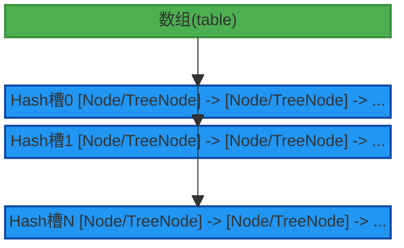
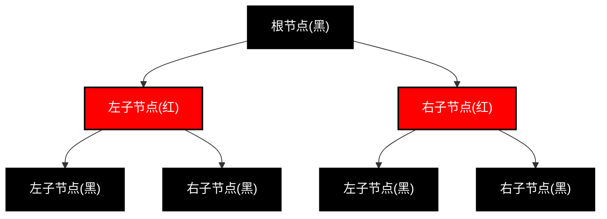
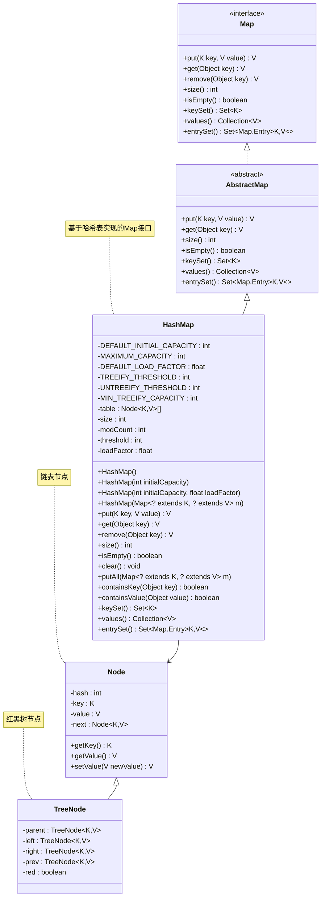
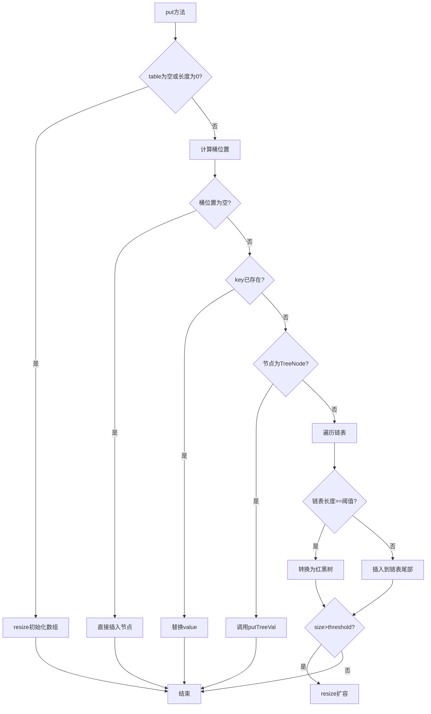
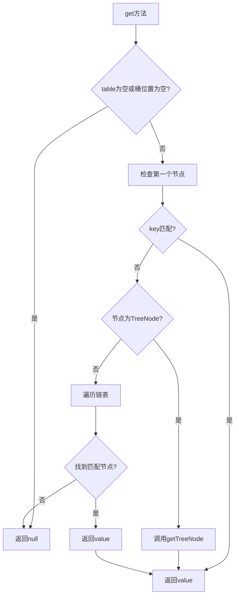
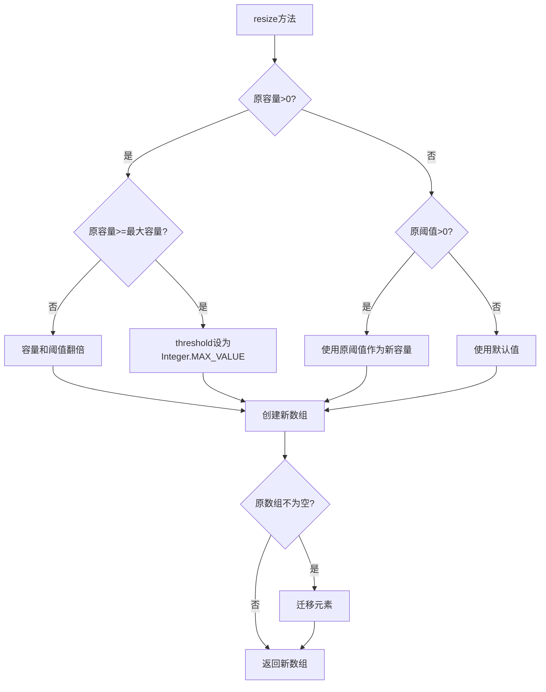
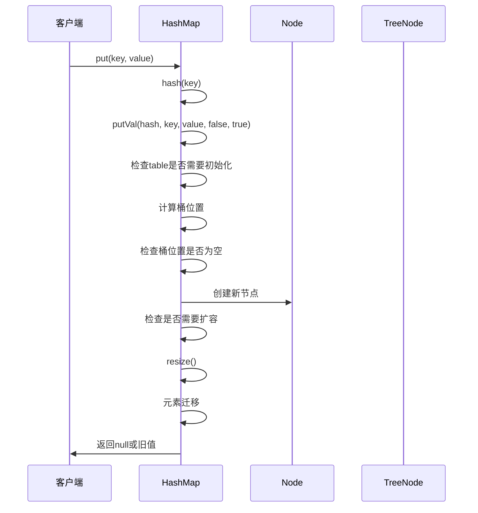
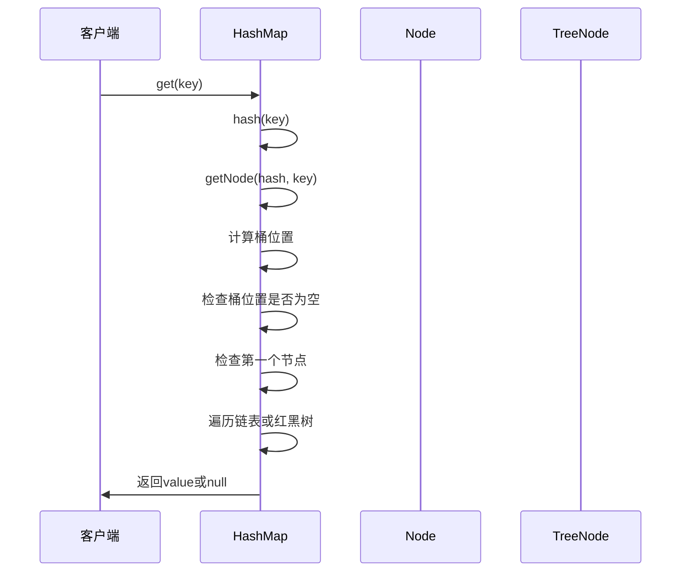

# HashMap 全面解析指南

## 1. 概述

HashMap是Java集合框架中最重要的数据结构之一，它基于哈希表实现，用于存储键值对(key-value pairs)。HashMap允许使用null值和一个null键，不保证映射的顺序，特别是它不保证该顺序恒久不变。

HashMap继承自AbstractMap类，实现了Map接口，是Java中最常用的集合类之一。它提供了快速的查找、插入和删除操作，平均时间复杂度为O(1)。

## 2. 数据结构

### 2.1 核心数据结构

HashMap的核心数据结构包括：
1. **数组**：存储元素的主结构
2. **链表**：解决哈希冲突的结构
3. **红黑树**：JDK 1.8后引入，优化链表过长时的性能
4. **Hash槽**：数组中的每个位置称为一个Hash槽(slot)

### 2.2 数组结构

HashMap内部使用一个Node数组来存储数据，每个Node代表一个键值对：

```java
transient Node<K,V>[] table;
```

数组的每个位置称为一个Hash槽(slot)，用于存储具有相同哈希值的元素。

### 2.3 链表结构

当发生哈希冲突时，HashMap使用链表来存储具有相同哈希值的元素。链表的每个节点都是一个Node对象：

```java
static class Node<K,V> implements Map.Entry<K,V> {
    final int hash;
    final K key;
    V value;
    Node<K,V> next;
    // ...
}
```

### 2.4 红黑树结构

当链表长度超过一定阈值(默认为8)时，链表会转换为红黑树，以提高查找效率：

```java
static final class TreeNode<K,V> extends LinkedHashMap.Entry<K,V> {
    TreeNode<K,V> parent;  // red-black tree links
    TreeNode<K,V> left;
    TreeNode<K,V> right;
    TreeNode<K,V> prev;    // needed to unlink next upon deletion
    boolean red;
    // ...
}
```

### 2.5 HashMap整体数据结构图



### 2.6 红黑树结构详解

红黑树是一种自平衡的二叉搜索树，具有以下特性：
1. 每个节点要么是红色，要么是黑色
2. 根节点是黑色
3. 每个叶子节点(NIL节点)是黑色
4. 如果一个节点是红色，则它的两个子节点都是黑色
5. 从任一节点到其每个叶子的所有路径都包含相同数目的黑色节点



## 3. 源码设计分析

### 3.1 核心字段

```java
// 默认初始容量
static final int DEFAULT_INITIAL_CAPACITY = 1 << 4; // aka 16

// 最大容量
static final int MAXIMUM_CAPACITY = 1 << 30;

// 默认负载因子
static final float DEFAULT_LOAD_FACTOR = 0.75f;

// 链表转红黑树阈值
static final int TREEIFY_THRESHOLD = 8;

// 红黑树转链表阈值
static final int UNTREEIFY_THRESHOLD = 6;

// 最小树化容量
static final int MIN_TREEIFY_CAPACITY = 64;

// 存储数据的数组
transient Node<K,V>[] table;

// 键值对数量
transient int size;

// 修改次数
transient int modCount;

// 阈值(容量*负载因子)
int threshold;

// 负载因子
final float loadFactor;
```

### 3.2 构造方法

HashMap提供了多个构造方法：

```java
// 默认构造方法
public HashMap() {
    this.loadFactor = DEFAULT_LOAD_FACTOR; // all other fields defaulted
}

// 指定初始容量
public HashMap(int initialCapacity) {
    this(initialCapacity, DEFAULT_LOAD_FACTOR);
}

// 指定初始容量和负载因子
public HashMap(int initialCapacity, float loadFactor) {
    if (initialCapacity < 0)
        throw new IllegalArgumentException("Illegal initial capacity: " +
                                           initialCapacity);
    if (initialCapacity > MAXIMUM_CAPACITY)
        initialCapacity = MAXIMUM_CAPACITY;
    if (loadFactor <= 0 || Float.isNaN(loadFactor))
        throw new IllegalArgumentException("Illegal load factor: " +
                                           loadFactor);
    this.loadFactor = loadFactor;
    this.threshold = tableSizeFor(initialCapacity);
}

// 从其他Map构造
public HashMap(Map<? extends K, ? extends V> m) {
    this.loadFactor = DEFAULT_LOAD_FACTOR;
    putMapEntries(m, false);
}
```

### 3.3 核心方法实现

#### put方法

```java
public V put(K key, V value) {
    return putVal(hash(key), key, value, false, true);
}

final V putVal(int hash, K key, V value, boolean onlyIfAbsent,
               boolean evict) {
    Node<K,V>[] tab; Node<K,V> p; int n, i;
    // 如果table为空或长度为0，则进行初始化
    if ((tab = table) == null || (n = tab.length) == 0)
        n = (tab = resize()).length;
    // 如果桶位置没有元素，直接插入
    if ((p = tab[i = (n - 1) & hash]) == null)
        tab[i] = newNode(hash, key, value, null);
    else {
        Node<K,V> e; K k;
        // 如果key已存在，直接替换value
        if (p.hash == hash &&
            ((k = p.key) == key || (key != null && key.equals(k))))
            e = p;
        // 如果是红黑树节点
        else if (p instanceof TreeNode)
            e = ((TreeNode<K,V>)p).putTreeVal(this, tab, hash, key, value);
        // 如果是链表节点
        else {
            for (int binCount = 0; ; ++binCount) {
                if ((e = p.next) == null) {
                    // 插入到链表尾部
                    p.next = newNode(hash, key, value, null);
                    // 如果链表长度超过阈值，转换为红黑树
                    if (binCount >= TREEIFY_THRESHOLD - 1) // -1 for 1st
                        treeifyBin(tab, hash);
                    break;
                }
                // 如果key已存在，跳出循环
                if (e.hash == hash &&
                    ((k = e.key) == key || (key != null && key.equals(k))))
                    break;
                p = e;
            }
        }
        // 如果key已存在，替换value
        if (e != null) { // existing mapping for key
            V oldValue = e.value;
            if (!onlyIfAbsent || oldValue == null)
                e.value = value;
            afterNodeAccess(e);
            return oldValue;
        }
    }
    ++modCount;
    // 如果元素数量超过阈值，进行扩容
    if (++size > threshold)
        resize();
    afterNodeInsertion(evict);
    return null;
}
```

#### get方法

```java
public V get(Object key) {
    Node<K,V> e;
    return (e = getNode(hash(key), key)) == null ? null : e.value;
}

final Node<K,V> getNode(int hash, Object key) {
    Node<K,V>[] tab; Node<K,V> first, e; int n; K k;
    // 如果table不为空且对应桶位置有元素
    if ((tab = table) != null && (n = tab.length) > 0 &&
        (first = tab[(n - 1) & hash]) != null) {
        // 检查第一个节点
        if (first.hash == hash && // always check first node
            ((k = first.key) == key || (key != null && key.equals(k))))
            return first;
        // 检查后续节点
        if ((e = first.next) != null) {
            // 如果是红黑树节点
            if (first instanceof TreeNode)
                return ((TreeNode<K,V>)first).getTreeNode(hash, key);
            // 如果是链表节点
            do {
                if (e.hash == hash &&
                    ((k = e.key) == key || (key != null && key.equals(k))))
                    return e;
            } while ((e = e.next) != null);
        }
    }
    return null;
}
```

#### hash方法

```java
static final int hash(Object key) {
    int h;
    return (key == null) ? 0 : (h = key.hashCode()) ^ (h >>> 16);
}
```

#### resize方法

```java
final Node<K,V>[] resize() {
    Node<K,V>[] oldTab = table;
    int oldCap = (oldTab == null) ? 0 : oldTab.length;
    int oldThr = threshold;
    int newCap, newThr = 0;
    // 如果原容量大于0
    if (oldCap > 0) {
        // 如果原容量已达到最大值，不再扩容
        if (oldCap >= MAXIMUM_CAPACITY) {
            threshold = Integer.MAX_VALUE;
            return oldTab;
        }
        // 否则容量和阈值都翻倍
        else if ((newCap = oldCap << 1) < MAXIMUM_CAPACITY &&
                 oldCap >= DEFAULT_INITIAL_CAPACITY)
            newThr = oldThr << 1; // double threshold
    }
    // 如果原阈值大于0，使用原阈值作为新容量
    else if (oldThr > 0) // initial capacity was placed in threshold
        newCap = oldThr;
    // 使用默认值
    else {               // zero initial threshold signifies using defaults
        newCap = DEFAULT_INITIAL_CAPACITY;
        newThr = (int)(DEFAULT_LOAD_FACTOR * DEFAULT_INITIAL_CAPACITY);
    }
    // 如果新阈值为0，重新计算
    if (newThr == 0) {
        float ft = (float)newCap * loadFactor;
        newThr = (newCap < MAXIMUM_CAPACITY && ft < (float)MAXIMUM_CAPACITY ?
                  (int)ft : Integer.MAX_VALUE);
    }
    threshold = newThr;
    // 创建新数组
    @SuppressWarnings({"rawtypes","unchecked"})
    Node<K,V>[] newTab = (Node<K,V>[])new Node[newCap];
    table = newTab;
    // 如果原数组不为空，进行元素迁移
    if (oldTab != null) {
        for (int j = 0; j < oldCap; ++j) {
            Node<K,V> e;
            if ((e = oldTab[j]) != null) {
                oldTab[j] = null;
                // 如果只有一个节点，直接迁移
                if (e.next == null)
                    newTab[e.hash & (newCap - 1)] = e;
                // 如果是红黑树节点
                else if (e instanceof TreeNode)
                    ((TreeNode<K,V>)e).split(this, newTab, j, oldCap);
                // 如果是链表节点
                else { // preserve order
                    Node<K,V> loHead = null, loTail = null;
                    Node<K,V> hiHead = null, hiTail = null;
                    Node<K,V> next;
                    do {
                        next = e.next;
                        // 根据hash值决定元素在新数组中的位置
                        if ((e.hash & oldCap) == 0) {
                            if (loTail == null)
                                loHead = e;
                            else
                                loTail.next = e;
                            loTail = e;
                        }
                        else {
                            if (hiTail == null)
                                hiHead = e;
                            else
                                hiTail.next = e;
                            hiTail = e;
                        }
                    } while ((e = next) != null);
                    // 将低位链表放入新数组
                    if (loTail != null) {
                        loTail.next = null;
                        newTab[j] = loHead;
                    }
                    // 将高位链表放入新数组
                    if (hiTail != null) {
                        hiTail.next = null;
                        newTab[j + oldCap] = hiHead;
                    }
                }
            }
        }
    }
    return newTab;
}
```

## 4. 设计模式应用

### 4.1 模板方法模式

HashMap通过继承AbstractMap类，利用了模板方法模式。AbstractMap定义了Map接口的骨架实现，而HashMap提供了具体的实现。

### 4.2 迭代器模式

HashMap提供了多种迭代器实现，用于遍历集合中的元素：

```java
// Key迭代器
final class KeyIterator extends HashIterator
    implements Iterator<K> {
    public final K next() { return nextNode().key; }
}

// Value迭代器
final class ValueIterator extends HashIterator
    implements Iterator<V> {
    public final V next() { return nextNode().value; }
}

// Entry迭代器
final class EntryIterator extends HashIterator
    implements Iterator<Map.Entry<K,V>> {
    public final Map.Entry<K,V> next() { return nextNode(); }
}
```

### 4.3 适配器模式

HashMap通过内部类EntrySet、KeySet和Values将内部结构适配为标准的Set和Collection接口：

```java
public Set<Map.Entry<K,V>> entrySet() {
    Set<Map.Entry<K,V>> es;
    return (es = entrySet) == null ? (entrySet = new EntrySet()) : es;
}

final class EntrySet extends AbstractSet<Map.Entry<K,V>> {
    public final int size()                 { return size; }
    public final void clear()               { HashMap.this.clear(); }
    public final Iterator<Map.Entry<K,V>> iterator() {
        return new EntryIterator();
    }
    // ...
}
```

### 4.4 工厂方法模式

HashMap通过不同的构造方法提供了创建对象的工厂方法，可以根据不同的参数创建HashMap实例。

## 5. 核心机制详解

### 5.1 哈希算法

HashMap使用hash()方法来计算key的哈希值，通过将key的hashCode()与高16位异或，使得哈希值更加分散，减少哈希冲突：

```java
static final int hash(Object key) {
    int h;
    return (key == null) ? 0 : (h = key.hashCode()) ^ (h >>> 16);
}
```

### 5.2 扩容机制

当HashMap中的元素数量超过阈值(threshold)时，会触发扩容机制。扩容时容量翻倍，并重新计算每个元素的位置。

### 5.3 链表转红黑树

当链表长度超过TREEIFY_THRESHOLD(默认为8)且数组长度不小于MIN_TREEIFY_CAPACITY(默认为64)时，链表会转换为红黑树，以提高查找效率。

### 5.4 线程安全性

HashMap不是线程安全的，在多线程环境下可能会出现数据不一致的问题。如果需要线程安全，可以使用Collections.synchronizedMap()方法包装HashMap，或者使用ConcurrentHashMap。

## 6. 类图设计



## 7. 核心流程图

### 7.1 put操作流程图



### 7.2 get操作流程图



### 7.3 resize扩容流程图



## 8. 时序图

### 8.1 put操作时序图



### 8.2 get操作时序图



## 9. 最佳实践

1. **合理设置初始容量**：根据实际数据量设置合适的初始容量，避免频繁扩容。
2. **理解负载因子**：默认负载因子0.75在时间和空间成本上提供了很好的平衡。
3. **注意线程安全**：HashMap不是线程安全的，在多线程环境下应使用ConcurrentHashMap。
4. **避免使用可变对象作为key**：key对象的hashCode()和equals()方法在对象状态改变后应保持一致。
5. **重写hashCode和equals方法**：自定义key类时应同时重写hashCode()和equals()方法。

## 10. 总结

HashMap作为Java中最常用的数据结构之一，其设计精巧，性能优秀。通过数组、链表和红黑树的组合使用，HashMap在保证查找效率的同时，也解决了哈希冲突问题。理解HashMap的内部实现原理，有助于我们更好地使用它，并在遇到性能问题时能够进行针对性优化。