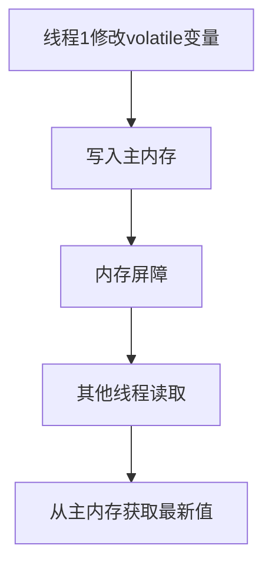
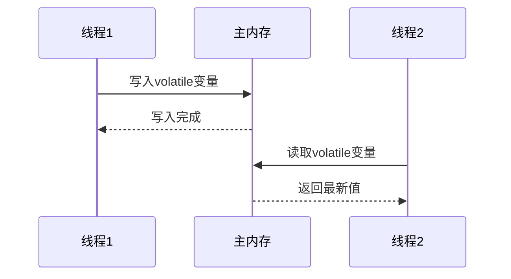

# volatile 关键字详解

## 1. 基本概念

`volatile` 是 Java 中的一个关键字，用于修饰变量，确保变量的可见性、有序性和防止指令重排序。

### 1.1 可见性
- 当一个线程修改了 volatile 变量的值，新值对其他线程来说是立即可见的
- volatile 变量不会被线程缓存在寄存器或其他地方，而是直接从主内存中读取和写入

### 1.2 有序性
- volatile 变量的读写操作不会被重排序
- 对 volatile 变量的写操作会插入内存屏障，确保写操作之前的指令不会被重排序到写操作之后，写操作之后的指令不会被重排序到写操作之前

### 1.3 防止指令重排序
- volatile 变量的写操作之前的所有指令不会被重排序到写操作之后
- volatile 变量的读操作之后的所有指令不会被重排序到读操作之前
- 这确保了代码执行的有序性，防止因编译器优化或处理器优化导致的指令重排序问题

### 1.4 原子性
- volatile 不能保证复合操作的原子性（如 i++）
- 对于基本类型的读写操作，volatile 可以保证原子性

## 2. 内存语义

### 2.1 happens-before 规则
- 对于 volatile 变量的写操作，happens-before 后续对同一变量的读操作
- 这确保了 volatile 变量的修改对其他线程是可见的

### 2.2 内存屏障
- 在 volatile 写操作后插入 StoreStore 和 StoreLoad 屏障
- 在 volatile 读操作前插入 LoadLoad 和 LoadStore 屏障

## 3. volatile 与 synchronized 的区别

| 特性 | volatile | synchronized |
|------|----------|--------------|
| 可见性 | ✅ | ✅ |
| 有序性 | ✅ | ✅ |
| 原子性 | ❌ | ✅ |
| 阻塞 | ❌ | ✅ |
| 性能 | 较高 | 较低 |

## 4. 使用场景

### 4.1 状态标志
```java
public class ShutdownFlag {
    private volatile boolean shutdown = false;
    
    public void shutdown() {
        shutdown = true;
    }
    
    public void doWork() {
        while (!shutdown) {
            // 执行工作
        }
    }
}
```

### 4.2 单次检查
```java
public class Singleton {
    private static volatile Singleton instance;
    
    public static Singleton getInstance() {
        if (instance == null) {
            synchronized (Singleton.class) {
                if (instance == null) {
                    instance = new Singleton();
                }
            }
        }
        return instance;
    }
}
```

## 5. 工作原理



## 6. 时序图



## 7. 注意事项和最佳实践

### 7.1 注意事项
- volatile 不能替代 synchronized，不能保证复合操作的原子性
- volatile 变量的读写操作仍然需要消耗性能
- 过度使用 volatile 可能导致性能问题

### 7.2 最佳实践
- 只在需要可见性的场景下使用 volatile
- 对于复合操作，使用 synchronized 或其他同步机制
- 考虑使用 java.util.concurrent 包中的原子类