# Redis分布式锁详细设计文档

## 1. 概述

本文档详细描述了基于Lettuce客户端和AQS(AbstractQueuedSynchronizer)框架实现的Redis分布式锁系统的设计方案。该分布式锁系统提供了高可用、可重入、支持自动续期和Watchdog监控的企业级分布式锁解决方案。

## 2. 设计目标

- **高可用性**: 基于Redis的分布式特性，确保在分布式环境中的可用性
- **可重入性**: 支持同一线程多次获取同一把锁
- **自动续期**: 支持锁的自动续期，防止业务执行时间过长导致锁失效
- **Watchdog监控**: 提供全面的监控和自动恢复机制
- **公平性**: 支持公平锁和非公平锁两种模式
- **高性能**: 基于Lettuce的异步特性，提供高性能的锁操作
- **容错性**: 完善的异常处理机制，确保系统稳定性

## 3. 系统架构

### 3.1 整体架构

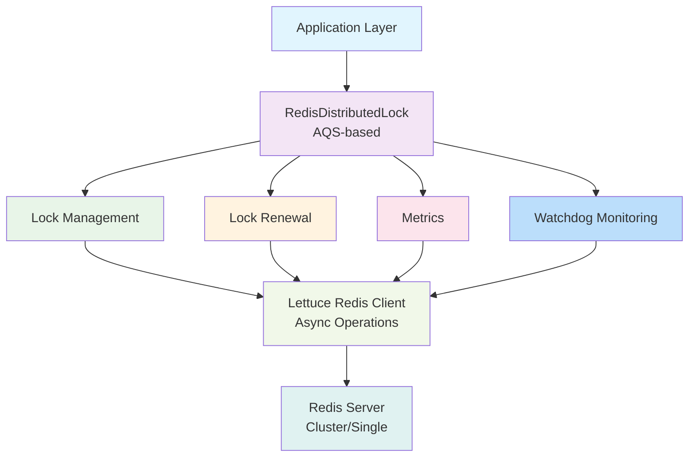

### 3.2 核心组件

1. **RedisDistributedLock**: 核心锁实现类，继承自AQS
2. **LockManager**: 锁管理器，负责锁的创建、销毁和生命周期管理
3. **RenewalManager**: 自动续期管理器，负责锁的自动续期
4. **LettuceClient**: 基于Lettuce的Redis客户端封装
5. **MetricsCollector**: 性能指标收集器
6. **Watchdog**: 监控和自动恢复组件，提供5大核心功能

## 4. 核心类设计

### 4.1 类结构图

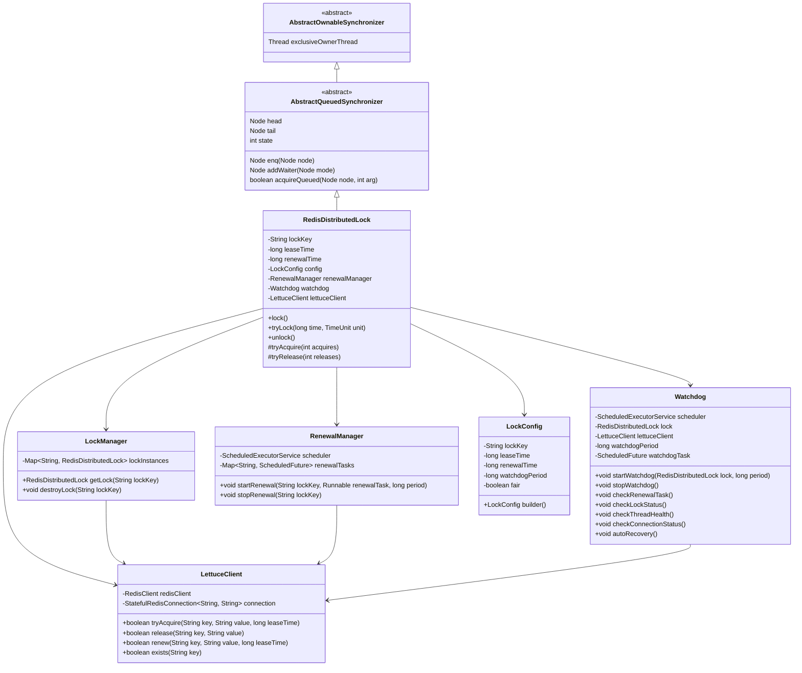

### 4.2 核心接口和类

#### 4.2.1 RedisDistributedLock (核心锁类)
- 继承自AQS，实现Lock接口
- 负责锁的获取、释放等核心操作
- 管理锁的可重入性和Watchdog监控

#### 4.2.2 LockManager (锁管理器)
- 负责锁实例的创建和管理
- 维护锁的元数据信息
- 提供锁的获取和释放接口

#### 4.2.3 RenewalManager (续期管理器)
- 负责锁的自动续期
- 管理续期任务的调度
- 处理续期失败的情况

#### 4.2.4 Watchdog (监控组件)
- 负责监控锁的健康状态
- 提供自动恢复机制
- 实现5大核心监控功能

#### 4.2.5 LettuceClient (Redis客户端封装)
- 封装Lettuce的异步操作
- 提供统一的Redis命令接口
- 处理连接管理和异常恢复

#### 4.2.6 LockConfig (配置类)
- 管理锁的相关配置参数
- 提供配置的默认值和验证

## 4.3 Watchdog核心功能设计

### 4.3.1 续期任务监控
监控RenewalManager的续期任务是否正常执行，当检测到续期失败时触发恢复机制。

### 4.3.2 锁状态监控
定期检查Redis中锁的状态，确保锁没有异常失效或被误删，当发现异常时执行恢复操作。

### 4.3.3 线程健康监控
监控持有锁的线程是否正常运行，防止线程死锁或阻塞，当检测到线程异常时进行处理。

### 4.3.4 连接状态监控
监控与Redis的连接状态，当连接异常时触发自动重连机制，确保系统可用性。

### 4.3.5 自动恢复机制
当检测到任何异常情况时，自动执行恢复操作，包括重新获取锁、释放锁或重启相关组件。

## 5. AQS集成方案

### 5.1 AQS状态设计

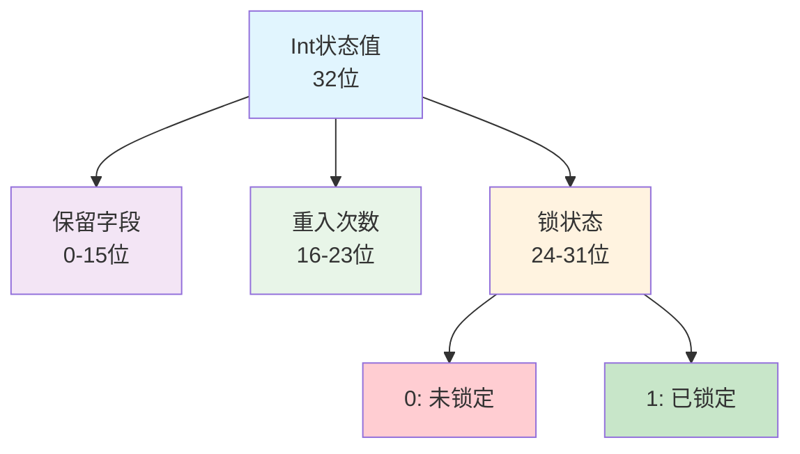

状态字段详细说明：
- **保留字段 (0-15位)**: 用于扩展功能的保留位
- **重入次数 (16-23位)**: 记录同一线程重入锁的次数
- **锁状态 (24-31位)**: 记录锁的占用状态，0表示未锁定，1表示已锁定

### 5.2 Redis发布/订阅通知机制

为了提高分布式锁的响应速度，引入Redis的发布/订阅机制：

1. **锁释放通知**：当锁被释放时，向特定频道发布通知消息
2. **监听等待**：等待锁的线程订阅相应频道，收到通知后立即尝试获取锁
3. **减少轮询**：避免线程频繁轮询Redis检查锁状态


### 5.3 AQS队列节点设计

每个等待获取锁的线程都会在AQS的同步队列中创建一个节点：
- 节点包含线程信息
- 节点包含等待状态
- 支持公平和非公平获取模式

### 5.4 锁获取流程

1. 线程调用lock()方法
2. RedisDistributedLock尝试通过Redis原子操作获取锁
3. 获取成功：更新AQS状态，记录持有线程，启动Watchdog监控
4. 获取失败：创建AQS节点，加入等待队列，并订阅锁释放通知频道
5. 前驱节点释放锁时，通过Redis发布通知唤醒后继节点

## 6. 锁特性设计

### 6.1 可重入性

- 通过AQS的exclusiveOwnerThread属性记录锁持有线程
- 通过state字段的高位部分记录重入次数
- 同一线程多次获取锁时，重入次数递增
- 释放锁时，重入次数递减，为0时真正释放锁

### 6.2 自动续期

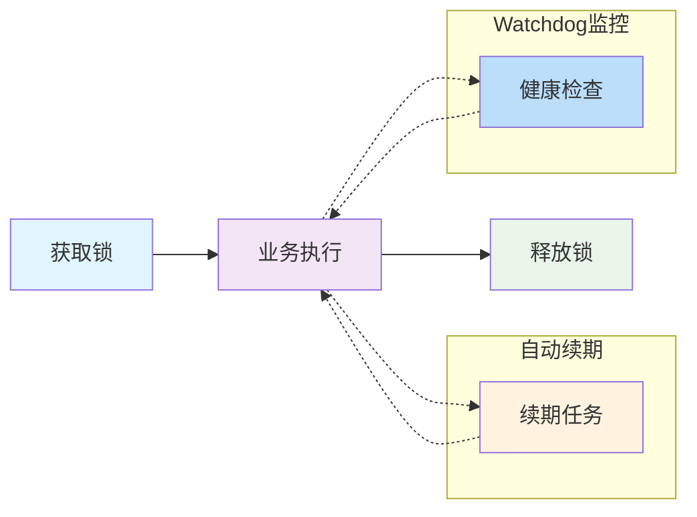

- 获取锁成功后启动续期任务和Watchdog监控
- 续期任务定期更新锁的过期时间
- Watchdog监控锁的健康状态
- 业务执行完成时取消续期任务和Watchdog监控
- 续期失败或监控发现异常时主动释放锁

### 6.3 公平性

- 支持公平锁和非公平锁两种模式
- 公平锁：严格按照AQS队列顺序获取锁
- 非公平锁：允许插队获取锁，提高吞吐量

### 6.4 容错性

- 网络异常时的重试机制
- Redis节点故障时的故障转移
- 锁状态不一致时的修复机制
- Watchdog自动恢复机制

## 7. Redis命令使用策略

### 7.1 加锁命令

使用Lua脚本保证原子性：
```lua
if redis.call('exists', KEYS[1]) == 0 then
    redis.call('hset', KEYS[1], ARGV[2], 1)
    redis.call('pexpire', KEYS[1], ARGV[1])
    return 1
else
    if redis.call('hexists', KEYS[1], ARGV[2]) == 1 then
        redis.call('hincrby', KEYS[1], ARGV[2], 1)
        redis.call('pexpire', KEYS[1], ARGV[1])
        return 1
    else
        return 0
    end
end
```

### 7.2 解锁命令

使用Lua脚本保证原子性：
```lua
if redis.call('hexists', KEYS[1], ARGV[2]) == 0 then
    return 0
else
    local counter = redis.call('hincrby', KEYS[1], ARGV[2], -1)
    if counter > 0 then
        redis.call('pexpire', KEYS[1], ARGV[1])
        return 1
    else
        redis.call('del', KEYS[1])
        return 1
    end
end
```

### 7.3 续期命令

```lua
if redis.call('hexists', KEYS[1], ARGV[2]) == 1 then
    redis.call('pexpire', KEYS[1], ARGV[1])
    return 1
else
    return 0
end
```

### 7.4 锁状态检查命令

```lua
if redis.call('hexists', KEYS[1], ARGV[2]) == 1 then
    return 1
else
    return 0
end
```

## 8. 异常处理机制

### 8.1 网络异常处理

- 连接超时时的重试机制
- 网络抖动时的自动恢复
- 连接池管理避免连接泄漏
- Watchdog监控网络状态

### 8.2 Redis异常处理

- Redis节点故障时的故障转移
- 集群模式下的节点切换
- 数据不一致时的修复机制
- Watchdog监控Redis状态

### 8.3 业务异常处理

- 业务执行异常时的锁释放
- 续期任务异常时的处理
- 线程中断时的资源清理
- Watchdog自动恢复机制

## 9. 性能优化考虑

### 9.1 连接优化

- 使用Lettuce的连接池
- 异步操作减少线程阻塞
- 连接复用提高效率
- Watchdog监控连接健康

### 9.2 命令优化

- 使用Lua脚本减少网络往返
- Pipeline批量操作
- 合理设置超时时间
- Watchdog优化策略

### 9.3 内存优化

- 对象复用减少GC压力
- 合理设置缓存大小
- 及时释放不用资源
- Watchdog内存监控

## 10. 详细流程图

### 10.1 锁获取流程图

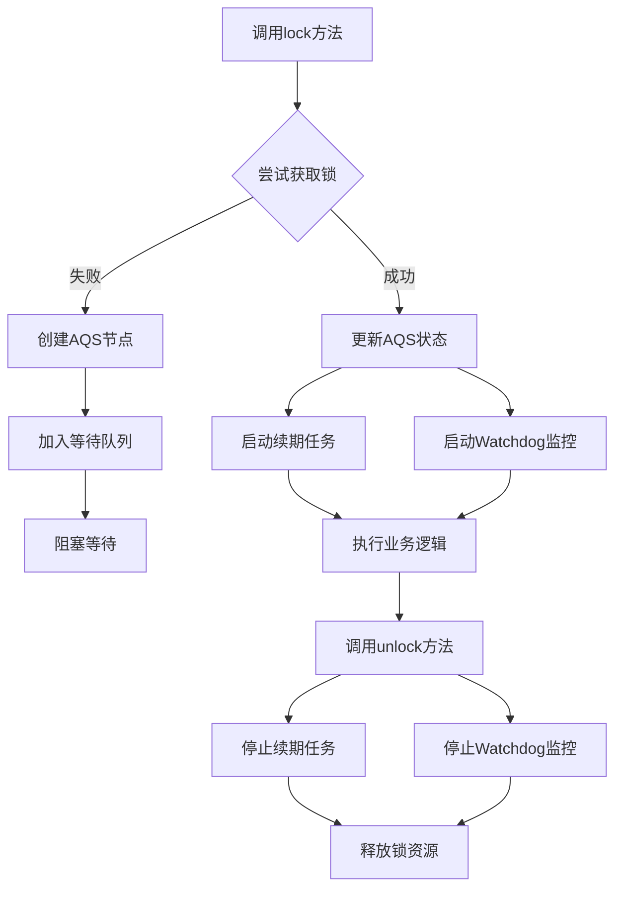

### 10.2 锁释放流程图

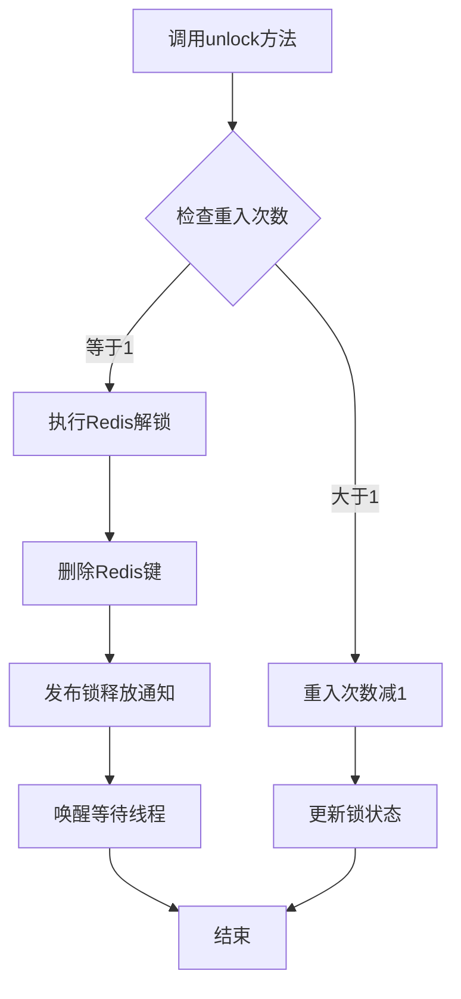

### 10.3 自动续期流程图

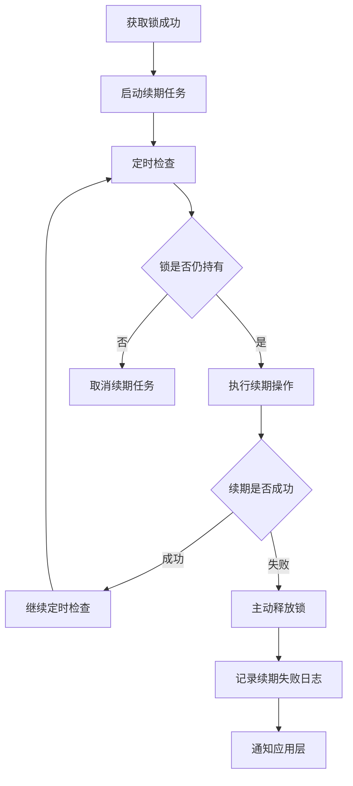

### 10.4 Watchdog监控流程图

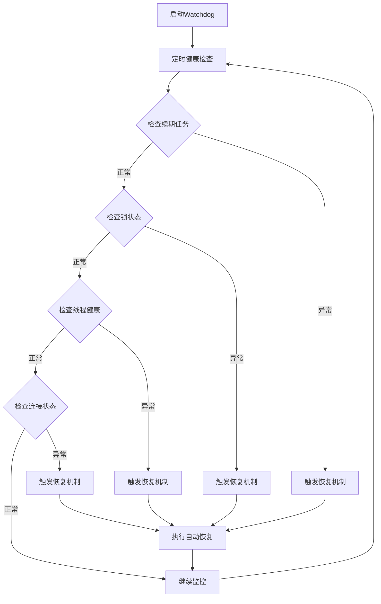

### 10.5 Redis发布/订阅机制设计

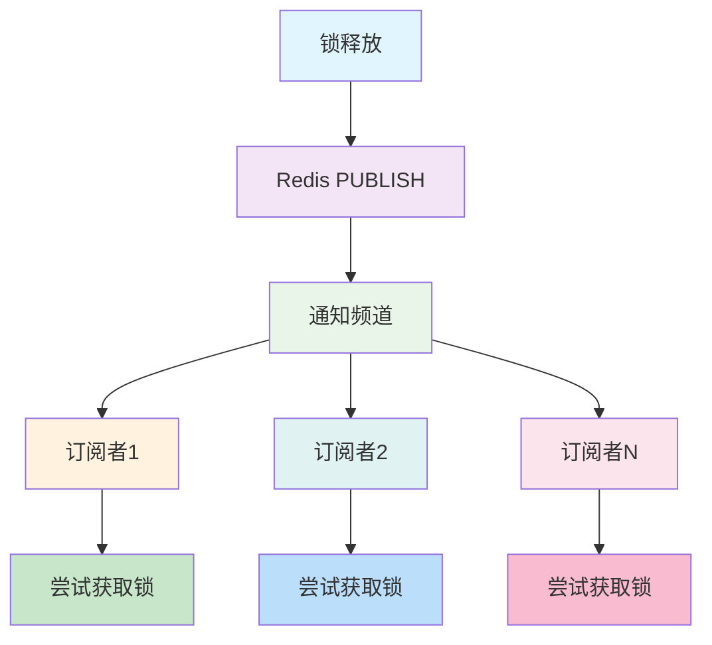

#### 10.5.1 通知频道命名规则

- **锁释放通知频道**：`lock:release:{lockKey}`
- **示例**：`lock:release:user:profile:1001`

#### 10.5.2 消息格式设计

```json
{
  "lockKey": "user:profile:1001",
  "releaseTime": 1640995200000,
  "holder": "server1-thread-123"
}
```

## 11. 详细时序图

### 11.1 成功获取锁时序图

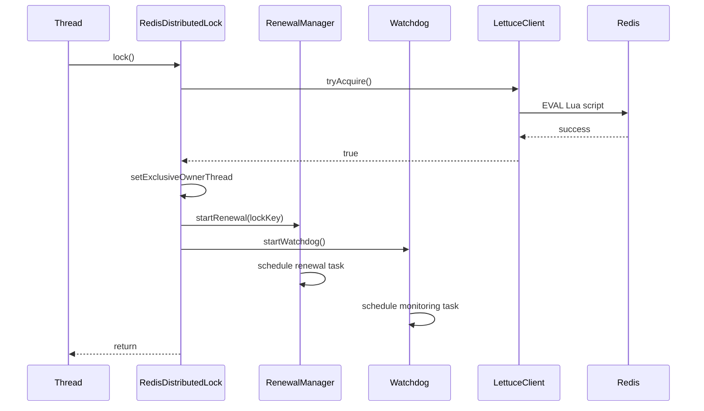

### 11.2 获取锁失败并等待时序图

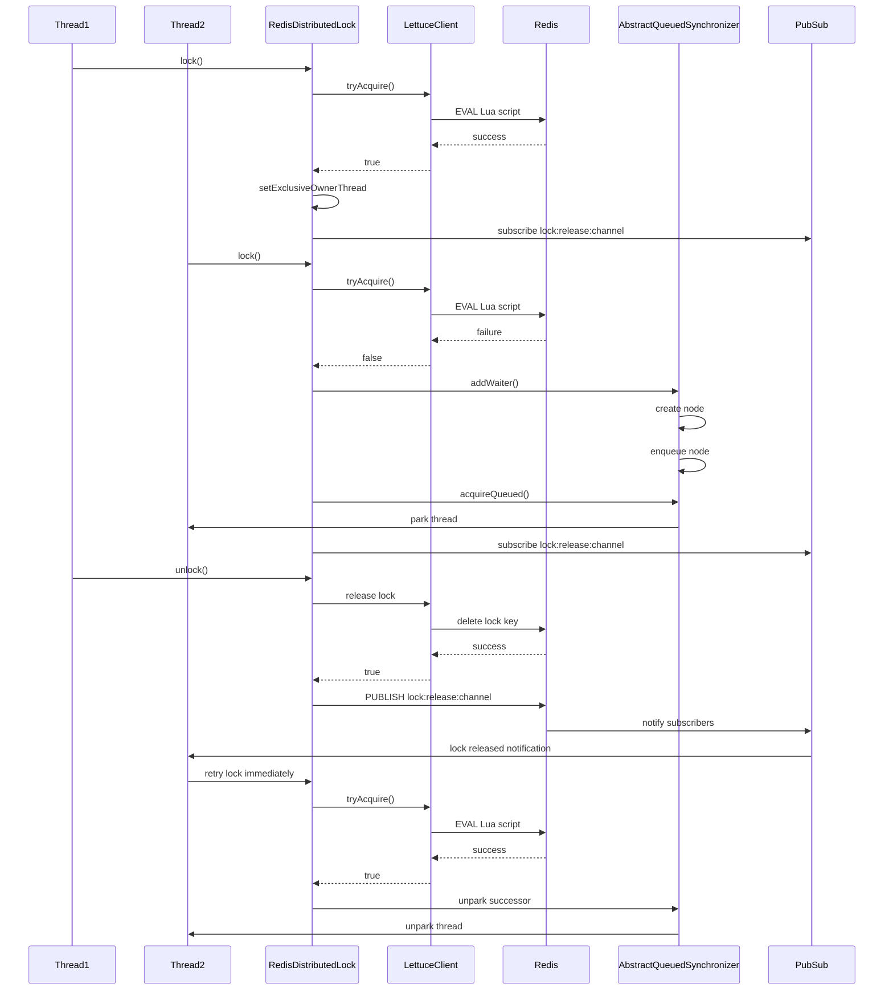

### 11.3 自动续期时序图

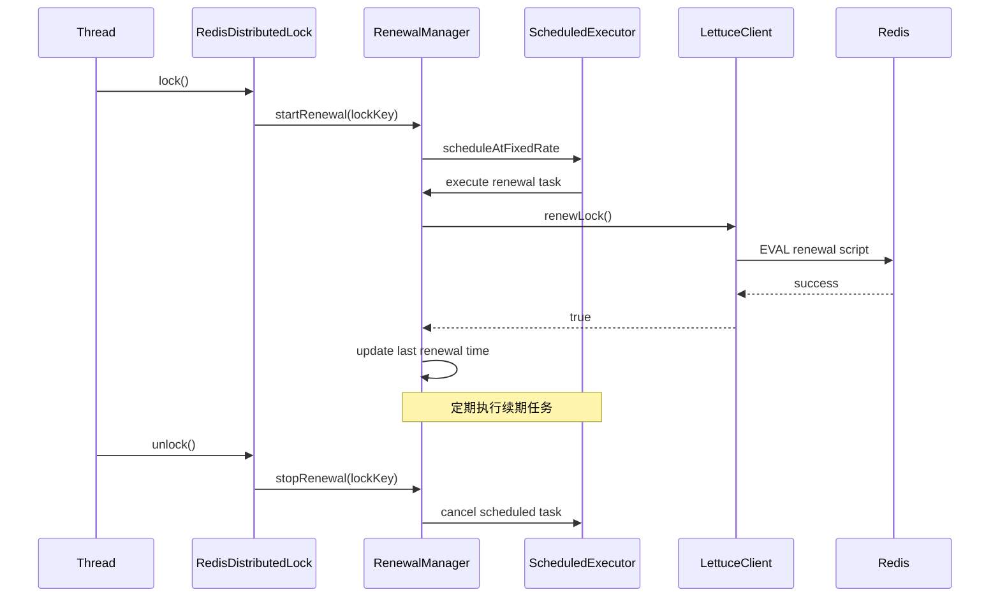

### 11.4 Watchdog监控时序图

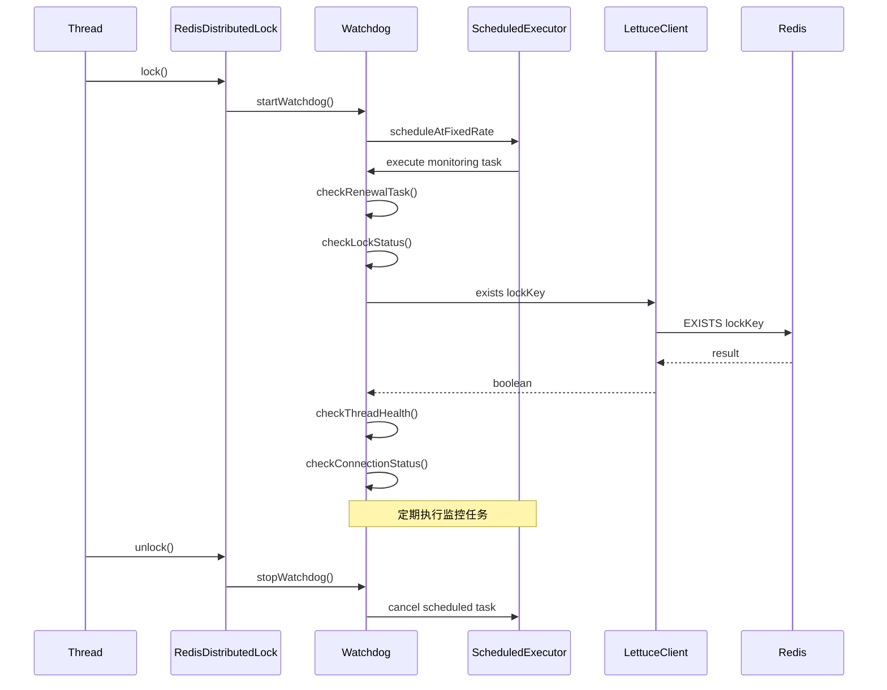

## 12. 使用示例

### 12.1 基本使用

```java
// 创建锁实例
RedisDistributedLock lock = new RedisDistributedLock("myLock");

// 获取锁
lock.lock();

try {
    // 执行业务逻辑
    doSomething();
} finally {
    // 释放锁
    lock.unlock();
}
```

### 12.2 带超时的锁获取

```java
RedisDistributedLock lock = new RedisDistributedLock("myLock");

if (lock.tryLock(5, TimeUnit.SECONDS)) {
    try {
        // 执行业务逻辑
        doSomething();
    } finally {
        lock.unlock();
    }
} else {
    // 获取锁失败处理
    handleLockFailure();
}
```

### 12.3 配置化使用

```java
LockConfig config = LockConfig.builder()
    .lockKey("myLock")
    .leaseTime(30)
    .renewalTime(10)
    .watchdogPeriod(5)
    .fair(true)
    .build();

RedisDistributedLock lock = new RedisDistributedLock(config);
```

## 13. Redis命令使用策略

### 13.1 加锁命令

使用Lua脚本保证原子性：
```lua
if redis.call('exists', KEYS[1]) == 0 then
    redis.call('hset', KEYS[1], ARGV[2], 1)
    redis.call('pexpire', KEYS[1], ARGV[1])
    return 1
else
    if redis.call('hexists', KEYS[1], ARGV[2]) == 1 then
        redis.call('hincrby', KEYS[1], ARGV[2], 1)
        redis.call('pexpire', KEYS[1], ARGV[1])
        return 1
    else
        return 0
    end
end
```

### 13.2 解锁命令

使用Lua脚本保证原子性：
```lua
if redis.call('hexists', KEYS[1], ARGV[2]) == 0 then
    return 0
else
    local counter = redis.call('hincrby', KEYS[1], ARGV[2], -1)
    if counter > 0 then
        redis.call('pexpire', KEYS[1], ARGV[1])
        return 1
    else
        redis.call('del', KEYS[1])
        return 1
    end
end
```

### 13.3 续期命令

```lua
if redis.call('hexists', KEYS[1], ARGV[2]) == 1 then
    redis.call('pexpire', KEYS[1], ARGV[1])
    return 1
else
    return 0
end
```

### 13.4 发布/订阅命令

#### 13.4.1 订阅命令
```bash
SUBSCRIBE lock:release:{lockKey}
```

#### 13.4.2 发布命令
```bash
PUBLISH lock:release:{lockKey} "{json_message}"
```

## 14. 监控和指标

### 14.1 性能指标

- 锁获取成功率
- 平均获取等待时间
- 锁持有时间分布
- 续期成功率
- Watchdog检测频率

### 14.2 健康指标

- Redis连接状态
- 异常发生频率
- 系统负载情况
- Watchdog监控状态

### 14.3 Watchdog监控指标

- 续期任务健康度
- 锁状态一致性
- 线程活跃度
- 连接稳定性
- 自动恢复成功率

## 15. 部署和运维

### 15.1 部署要求

- Redis版本要求（建议4.0+）
- 网络延迟要求
- 集群部署建议
- Watchdog配置要求

### 15.2 运维监控

- 日志监控
- 性能监控
- 异常告警
- Watchdog状态监控

## 16. Watchdog机制详解

### 16.1 设计理念

Watchdog机制是为了解决分布式锁在复杂环境下的稳定性和可靠性问题而设计的。它通过持续监控锁的各个方面，确保锁系统能够自我诊断和自我修复。

### 16.2 核心监控功能

#### 16.2.1 续期任务监控 (Renewal Task Monitoring)
- 监控RenewalManager的续期任务是否正常执行
- 检测续期任务的执行频率和成功率
- 当续期失败时，触发自动恢复机制

#### 16.2.2 锁状态监控 (Lock Status Monitoring)
- 定期检查Redis中锁的存在状态
- 验证锁的持有者信息是否一致
- 检测锁是否异常失效或被误删

#### 16.2.3 线程健康监控 (Thread Health Monitoring)
- 监控持有锁的线程是否存活
- 检测线程是否处于死锁或阻塞状态
- 当检测到线程异常时进行相应处理

#### 16.2.4 连接状态监控 (Connection Status Monitoring)
- 监控与Redis的连接状态
- 检测网络波动和连接中断
- 当连接异常时触发自动重连机制

#### 16.2.5 自动恢复机制 (Auto Recovery Mechanism)
- 当检测到任何异常情况时自动执行恢复操作
- 包括重新获取锁、释放锁或重启相关组件
- 记录恢复操作日志用于问题分析

### 16.3 工作原理

Watchdog作为一个独立的监控线程，以配置的周期定期执行健康检查。每次检查都会执行以下步骤：

1. 检查续期任务是否正常运行
2. 验证Redis中锁的状态是否正常
3. 检查持有锁的线程是否健康
4. 验证与Redis的连接是否稳定
5. 根据检查结果决定是否需要执行恢复操作

### 16.4 配置参数

- **watchdogPeriod**: Watchdog检查周期，默认5秒
- **recoveryStrategy**: 恢复策略配置
- **alertThreshold**: 告警阈值设置

## 17. 总结

本设计基于Lettuce和AQS实现了一个功能完整、性能优良的Redis分布式锁系统。通过合理的架构设计和实现方案，确保了系统的高可用性、可重入性、自动续期和Watchdog监控等企业级特性。Watchdog机制的引入进一步增强了系统的稳定性和自愈能力，使其能够在复杂的分布式环境中可靠运行。该设计可作为后续代码实现的详细参考。