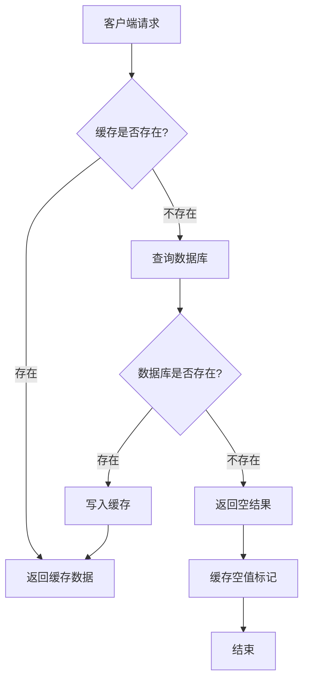
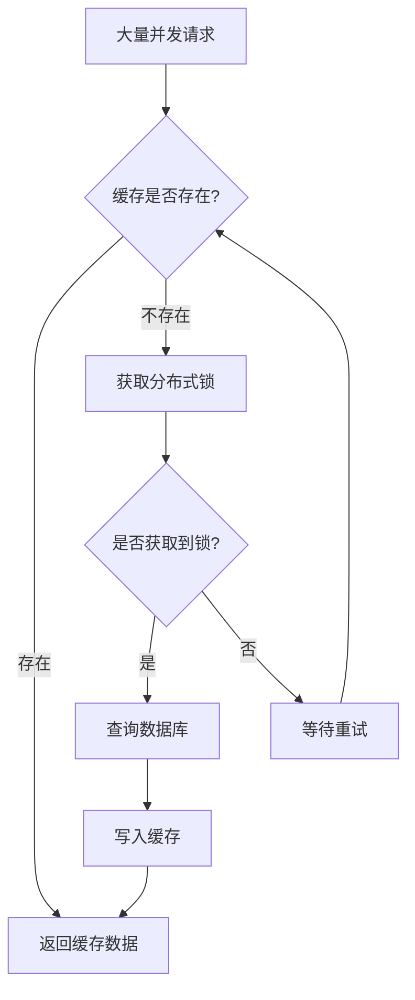
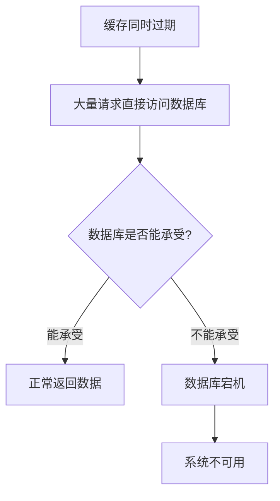

# Redis缓存穿透、击穿、雪崩问题详解

在使用Redis作为缓存时，我们经常会遇到三种典型问题：缓存穿透、缓存击穿和缓存雪崩。这些问题可能会对系统性能和稳定性造成严重影响。本文将详细介绍这三种问题的成因和解决方案。

## 目录

1. [缓存穿透](#缓存穿透)
2. [缓存击穿](#缓存击穿)
3. [缓存雪崩](#缓存雪崩)
4. [总结](#总结)

## 缓存穿透

### 什么是缓存穿透？

缓存穿透是指查询一个根本不存在的数据，缓存和数据库中都没有这个数据。由于缓存中没有命中，请求会穿透到数据库层。如果从数据库也查不到数据，则不会写入缓存，这将导致每次查询这个数据都会直接打到数据库。

### 缓存穿透的危害

- 大量请求直接访问数据库，增加数据库压力
- 可能被恶意攻击者利用，发起大量无效请求
- 降低系统整体性能

### 解决方案

#### 1. 布隆过滤器

布隆过滤器是一种概率型数据结构，可以判断一个元素是否存在于集合中。它的特点是：
- 空间效率高
- 查询时间短
- 存在一定的误判率（判断存在的数据可能实际不存在，但判断不存在的数据一定不存在）

```java
// 布隆过滤器示例代码
public class BloomFilterExample {
    private BloomFilter<String> bloomFilter;
    
    public BloomFilterExample() {
        // 创建布隆过滤器，预计插入10000个元素，误判率为0.01
        bloomFilter = BloomFilter.create(Funnels.stringFunnel(Charset.defaultCharset()), 10000, 0.01);
        
        // 添加已存在的数据到布隆过滤器
        bloomFilter.put("user_1001");
        bloomFilter.put("user_1002");
        // ...
    }
    
    public boolean mightContain(String key) {
        return bloomFilter.mightContain(key);
    }
}
```

#### 2. 缓存空值

对于查询结果为空的数据，也将其缓存起来，但设置较短的过期时间，避免占用过多内存。

```java
// 缓存空值示例代码
public String getUserById(String userId) {
    String key = "user:" + userId;
    
    // 先从缓存查询
    String cachedUser = redisTemplate.opsForValue().get(key);
    if (cachedUser != null) {
        // 如果是空值标记，则返回null
        if ("NULL".equals(cachedUser)) {
            return null;
        }
        return cachedUser;
    }
    
    // 缓存未命中，查询数据库
    String user = userDAO.findById(userId);
    
    if (user != null) {
        // 查询到数据，写入缓存
        redisTemplate.opsForValue().set(key, user, 3600, TimeUnit.SECONDS);
    } else {
        // 查询为空，缓存空值，设置较短过期时间
        redisTemplate.opsForValue().set(key, "NULL", 300, TimeUnit.SECONDS);
    }
    
    return user;
}
```

## 缓存击穿

### 什么是缓存击穿？

缓存击穿是指某个热点key在缓存中过期的瞬间，大量请求同时访问该key，导致这些请求全部穿透到数据库，造成数据库瞬时压力过大。

### 缓存击穿的特点

- 发生在热点数据过期的瞬间
- 通常是一个key的请求
- 瞬时大量请求打到数据库

### 解决方案

#### 1. 设置热点数据永不过期

对于一些热点数据，可以设置永不过期，避免因过期导致的击穿问题。

```java
// 设置热点数据永不过期
public void setHotData(String key, String value) {
    // 不设置过期时间，永不过期
    redisTemplate.opsForValue().set(key, value);
}
```

#### 2. 加互斥锁（分布式锁）

在缓存失效时，只让一个请求去数据库加载数据，其他请求等待。

```java
// 加互斥锁解决缓存击穿
public String getHotDataWithMutex(String key) {
    String value = redisTemplate.opsForValue().get(key);
    if (value != null) {
        return value;
    }
    
    // 获取分布式锁
    String lockKey = "lock:" + key;
    boolean lockAcquired = redisTemplate.opsForValue().setIfAbsent(lockKey, "1", 10, TimeUnit.SECONDS);
    
    if (lockAcquired) {
        try {
            // 再次检查缓存，防止其他线程已经加载了数据
            value = redisTemplate.opsForValue().get(key);
            if (value != null) {
                return value;
            }
            
            // 查询数据库
            value = getDataFromDB(key);
            
            // 写入缓存
            redisTemplate.opsForValue().set(key, value, 300, TimeUnit.SECONDS);
            
            return value;
        } finally {
            // 释放锁
            redisTemplate.delete(lockKey);
        }
    } else {
        // 获取锁失败，等待一段时间后重试
        try {
            Thread.sleep(100);
            return getHotDataWithMutex(key);
        } catch (InterruptedException e) {
            Thread.currentThread().interrupt();
            return null;
        }
    }
}
```

#### 3. 设置不同的过期时间

为不同的key设置随机的过期时间，避免大量key同时过期。

```java
// 设置随机过期时间
public void setDataWithRandomExpire(String key, String value) {
    // 设置随机过期时间，例如300-600秒之间
    int expireTime = 300 + new Random().nextInt(300);
    redisTemplate.opsForValue().set(key, value, expireTime, TimeUnit.SECONDS);
}
```

## 缓存雪崩

### 什么是缓存雪崩？

缓存雪崩是指在某一时间段内，缓存中的大量数据同时过期，导致大量请求直接访问数据库，造成数据库压力骤增，甚至可能宕机。

### 缓存雪崩的特点

- 大量数据同时过期
- 瞬时大量请求打到数据库
- 可能导致数据库宕机

### 解决方案

#### 1. 设置不同的过期时间

为不同的key设置随机的过期时间，避免大量key同时过期。

```java
// 设置随机过期时间防止雪崩
public void setCacheWithRandomExpire(String key, String value) {
    // 基础过期时间加上随机值
    int baseExpireTime = 3600; // 1小时
    int randomExpireTime = new Random().nextInt(3600); // 0-1小时随机值
    int expireTime = baseExpireTime + randomExpireTime;
    
    redisTemplate.opsForValue().set(key, value, expireTime, TimeUnit.SECONDS);
}
```

#### 2. 使用多级缓存

使用多级缓存架构，当一级缓存失效时，可以访问二级缓存。

```java
// 多级缓存示例
public String getDataWithMultiLevelCache(String key) {
    // 一级缓存（Redis）
    String value = redisTemplate.opsForValue().get(key);
    if (value != null) {
        return value;
    }
    
    // 二级缓存（本地缓存）
    value = localCache.get(key);
    if (value != null) {
        // 同步到一级缓存
        redisTemplate.opsForValue().set(key, value, 3600, TimeUnit.SECONDS);
        return value;
    }
    
    // 都未命中，查询数据库
    value = getDataFromDB(key);
    
    // 写入多级缓存
    if (value != null) {
        localCache.put(key, value);
        redisTemplate.opsForValue().set(key, value, 3600, TimeUnit.SECONDS);
    }
    
    return value;
}
```

#### 3. 缓存预热

在系统启动或特定时间点，提前加载热点数据到缓存中。

```java
// 缓存预热示例
@Component
public class CachePreheatService {
    
    @PostConstruct
    public void preheatCache() {
        // 预热热点数据
        List<String> hotKeys = getHotKeys();
        for (String key : hotKeys) {
            String value = getDataFromDB(key);
            if (value != null) {
                // 设置较长的过期时间
                redisTemplate.opsForValue().set(key, value, 3600 * 24, TimeUnit.SECONDS);
            }
        }
    }
    
    private List<String> getHotKeys() {
        // 获取热点数据key列表
        return Arrays.asList("hot_data_1", "hot_data_2", "hot_data_3");
    }
}
```

#### 4. 服务降级和熔断

当数据库压力过大时，可以采取服务降级策略，返回默认值或错误信息。

```java
// 服务降级示例
public String getDataWithFallback(String key) {
    try {
        String value = redisTemplate.opsForValue().get(key);
        if (value != null) {
            return value;
        }
        
        value = getDataFromDB(key);
        if (value != null) {
            redisTemplate.opsForValue().set(key, value, 3600, TimeUnit.SECONDS);
        }
        return value;
    } catch (Exception e) {
        // 数据库访问异常时，返回默认值或缓存旧数据
        log.error("Database access failed, using fallback", e);
        return getFallbackData(key);
    }
}

private String getFallbackData(String key) {
    // 返回默认值或缓存中的旧数据
    return "default_value";
}
```

## 总结

缓存穿透、击穿和雪崩是使用Redis时常见的三个问题，它们都会对系统造成不同程度的影响。通过合理的解决方案，我们可以有效避免这些问题：

1. **缓存穿透**：使用布隆过滤器或缓存空值
2. **缓存击穿**：使用互斥锁、设置热点数据永不过期或设置不同的过期时间
3. **缓存雪崩**：设置不同的过期时间、使用多级缓存、缓存预热和服务降级

合理设计缓存策略，可以大大提高系统的稳定性和性能。

## Mermaid图表

### 缓存穿透流程图



### 缓存击穿流程图



### 缓存雪崩流程图

