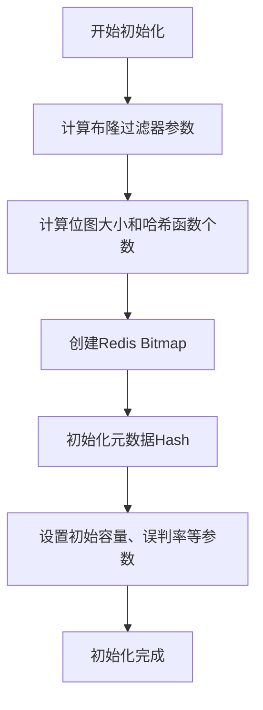
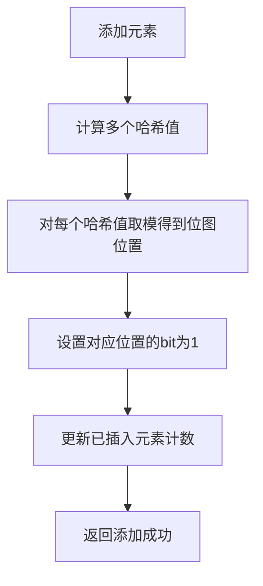
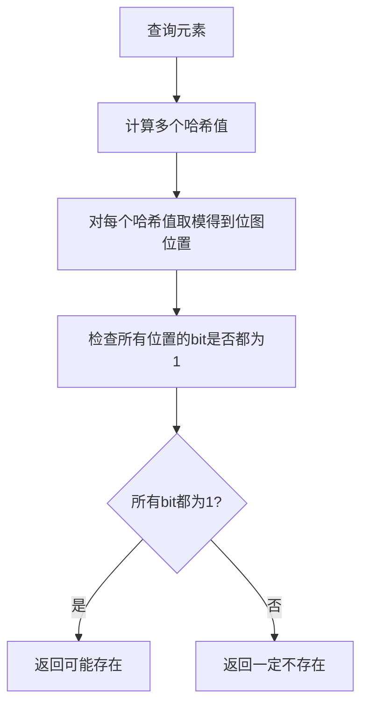
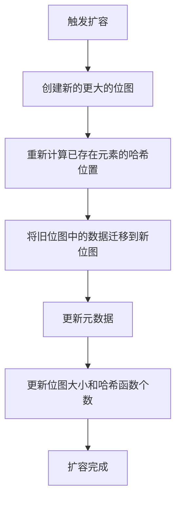
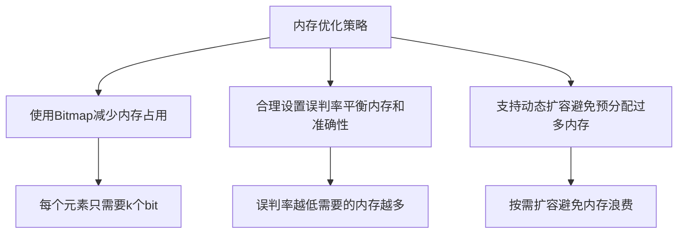
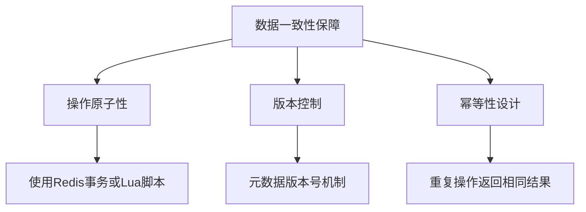
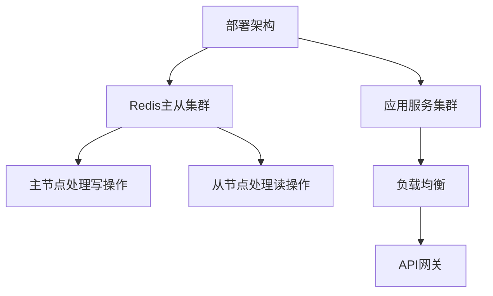

# Redis布隆过滤器详细设计文档

## 1. 概述

布隆过滤器是一种空间效率很高的概率型数据结构，用于判断一个元素是否在一个集合中。它可能会出现误判（即判断元素存在但实际不存在），但不会出现漏判（如果判断元素不存在则一定不存在）。

## 2. 设计目标

- 实现一个基于Redis的布隆过滤器
- 支持动态扩容
- 提供高效的添加和查询操作
- 控制误判率在可接受范围内
- 兼容Redis原生命令

## 3. 核心数据结构设计

### 3.1 位图存储结构

使用Redis的Bitmap作为底层存储结构，通过SETBIT和GETBIT命令操作位图：

```
key: bf:{filter_name}:bitmap
类型: STRING (Bitmap)
用途: 存储布隆过滤器的位图数据
```

### 3.2 元数据存储结构

使用Redis Hash结构存储布隆过滤器的元数据：

```
key: bf:{filter_name}:meta
类型: HASH
字段:
  - capacity: 预期容量
  - error_rate: 误判率
  - bitmap_size: 位图大小(位数)
  - hash_count: 哈希函数个数
  - inserted_count: 已插入元素数量
  - version: 版本号(用于扩容)
```

### 3.3 参数计算

布隆过滤器的核心参数通过以下公式计算：

- 位图大小 m = -(n * ln(p)) / (ln(2)^2)
- 哈希函数个数 k = (m/n) * ln(2)

其中 n 为预期元素数量，p 为误判率

## 4. 哈希函数设计

### 4.1 双重哈希法

使用双重哈希法生成多个哈希函数：

```
hash_i = (hash1 + i * hash2) % bitmap_size
```

其中 i 为第 i 个哈希函数(0 到 k-1)

### 4.2 哈希算法选择

使用 MurmurHash 算法作为基础哈希函数，具有以下优点：

- 分布均匀性好
- 计算速度快
- 对输入的微小变化敏感

## 5. 核心功能模块

### 5.1 初始化模块

```java
public class RedisBloomFilter {
    private String name;           // 过滤器名称
    private long capacity;         // 预期容量
    private double errorRate;      // 误判率
    private long bitmapSize;       // 位图大小
    private int hashCount;         // 哈希函数个数
    private RedisTemplate redisTemplate;
    
    // 初始化方法
    public void init() {
        // 计算参数
        calculateParameters();
        
        // 初始化元数据
        initMetadata();
    }
}
```

### 5.2 添加元素模块

```java
public boolean add(String item) {
    // 计算多个哈希值
    long[] hashes = hash(item);
    
    // 设置对应位置的bit为1
    for (long hash : hashes) {
        long position = hash % bitmapSize;
        redisTemplate.opsForValue().setBit(getBitmapKey(), position, true);
    }
    
    // 更新已插入元素数量
    updateInsertedCount();
    
    return true;
}
```

### 5.3 查询元素模块

```java
public boolean mightContain(String item) {
    // 计算多个哈希值
    long[] hashes = hash(item);
    
    // 检查所有位置的bit是否都为1
    for (long hash : hashes) {
        long position = hash % bitmapSize;
        if (!redisTemplate.opsForValue().getBit(getBitmapKey(), position)) {
            return false; // 只要有一个bit为0，则元素一定不存在
        }
    }
    
    return true; // 所有bit都为1，则元素可能存在于集合中
}
```

### 5.4 扩容模块

```java
public void expand() {
    // 创建新的更大的位图
    long newBitmapSize = bitmapSize * 2;
    int newHashCount = calculateHashCount(newBitmapSize, capacity);
    
    // 重新哈希已存在的元素
    rehashElements(newBitmapSize, newHashCount);
    
    // 更新元数据
    updateMetadata(newBitmapSize, newHashCount);
}
```

## 6. 交互流程设计

### 6.1 初始化流程



### 6.2 添加元素流程



### 6.3 查询元素流程



### 6.4 扩容流程



## 7. Redis命令设计

### 7.1 核心命令

```
# 创建布隆过滤器
BF.CREATE filter_name capacity error_rate

# 添加元素
BF.ADD filter_name item

# 批量添加元素
BF.MADD filter_name item1 item2 item3

# 查询元素
BF.EXISTS filter_name item

# 批量查询元素
BF.MEXISTS filter_name item1 item2 item3

# 获取过滤器信息
BF.INFO filter_name
```

### 7.2 命令实现示例

```java
// BF.ADD 命令实现
public class BFAddCommand {
    public Boolean execute(String filterName, String item) {
        // 获取布隆过滤器实例
        RedisBloomFilter filter = getBloomFilter(filterName);
        
        // 添加元素
        return filter.add(item);
    }
}

// BF.EXISTS 命令实现
public class BFExistsCommand {
    public Boolean execute(String filterName, String item) {
        // 获取布隆过滤器实例
        RedisBloomFilter filter = getBloomFilter(filterName);
        
        // 查询元素
        return filter.mightContain(item);
    }
}
```

## 8. 性能优化设计

### 8.1 内存优化



### 8.2 计算优化

1. 预计算哈希函数参数，避免重复计算
2. 使用位运算提高计算效率
3. 批量操作减少网络往返次数

```java
// 批量添加优化
public List<Boolean> multiAdd(String filterName, List<String> items) {
    List<Boolean> results = new ArrayList<>();
    
    // 批量计算哈希值
    List<long[]> hashesList = batchHash(items);
    
    // 批量设置bit
    batchSetBits(hashesList);
    
    // 批量更新计数
    updateInsertedCount(items.size());
    
    // 返回结果
    for (int i = 0; i < items.size(); i++) {
        results.add(true);
    }
    
    return results;
}
```

## 9. 错误处理与异常恢复

### 9.1 网络异常处理

```java
public boolean addWithRetry(String item, int maxRetries) {
    for (int i = 0; i < maxRetries; i++) {
        try {
            return add(item);
        } catch (RedisConnectionFailureException e) {
            // 网络异常，等待后重试
            try {
                Thread.sleep(100 * (i + 1)); // 指数退避
            } catch (InterruptedException ie) {
                Thread.currentThread().interrupt();
                return false;
            }
        }
    }
    
    return false; // 重试次数用完仍失败
}
```

### 9.2 数据一致性处理



## 10. 测试方案

### 10.1 功能测试

1. 基本添加和查询功能测试
2. 误判率验证测试
3. 边界条件测试（空元素、超长字符串等）

### 10.2 性能测试

1. 单次操作响应时间测试
2. 批量操作吞吐量测试
3. 不同数据量下的内存占用测试

### 10.3 压力测试

1. 高并发添加和查询测试
2. 大容量数据存储测试
3. 长时间运行稳定性测试

## 11. 部署与监控

### 11.1 部署方案



### 11.2 监控指标

1. 内存使用率
2. QPS（每秒查询率）
3. 误判率实际值
4. 响应时间分布