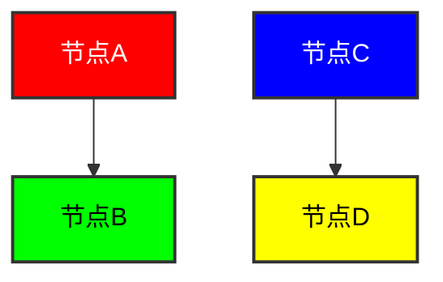
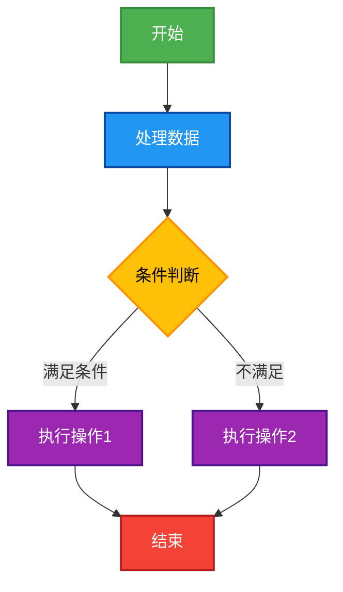

# Mermaid Flowchart 节点样式语法示例

## 基本语法

在Mermaid flowchart中，可以使用`style`命令来设置节点的样式属性：

## 样式属性说明

- `fill`: 节点的填充颜色，使用十六进制颜色码
- `stroke`: 节点边框的颜色，使用十六进制颜色码
- `stroke-width`: 节点边框的宽度
- `color`: 节点内文字的颜色，使用十六进制颜色码

## 使用classDef定义样式类

也可以使用`classDef`定义样式类，然后应用到节点上：

## 简单示例图表

下面是一个简单的示例图表，展示了不同样式的节点：

