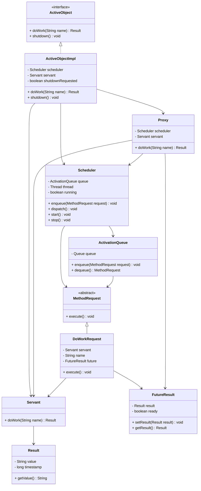
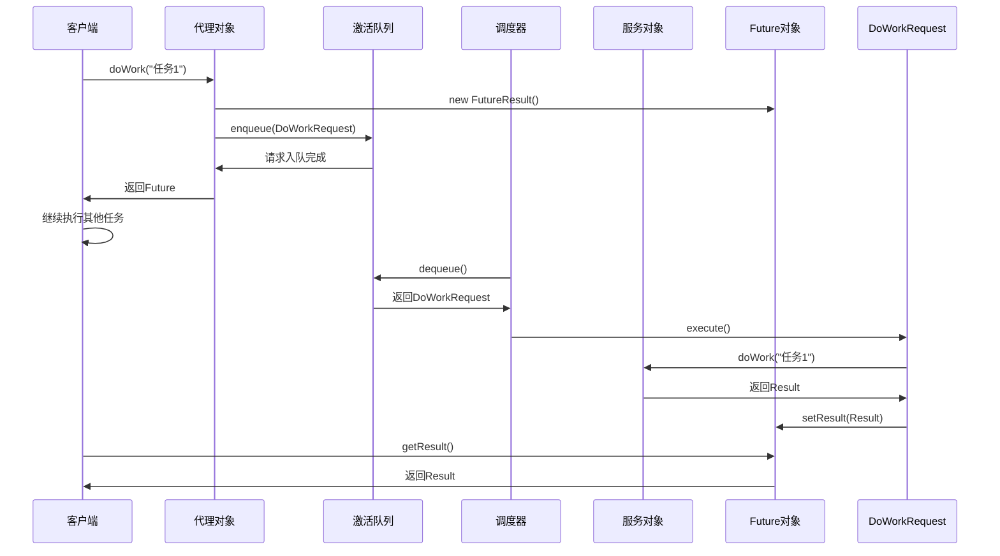
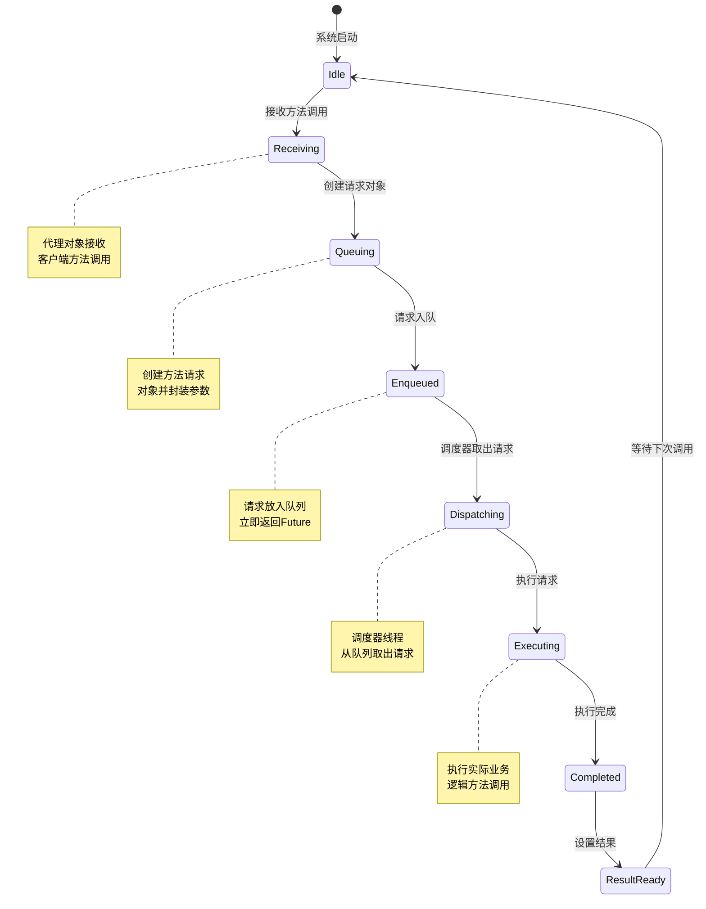

# Active Object 模式（主动对象模式）

## 1. 模式介绍

Active Object（主动对象）模式是一种并发设计模式，将方法调用与方法执行分离。该模式通过代理对象接收方法调用，将方法调用封装为请求对象放入队列中，由独立的工作线程从队列中取出请求并执行，从而实现异步方法调用和并发控制。

### 1.1 定义
Active Object模式通过将同步方法调用转换为异步消息传递，实现了方法调用与执行的解耦，提供了更好的并发控制和资源管理。

### 1.2 应用场景
- 异步方法调用
- 并发资源访问控制
- 任务队列处理
- 远程方法调用
- 数据库连接池
- 文件I/O操作
- 网络通信
- GUI事件处理

## 2. UML类图



## 3. 流程图

```mermaid
flowchart TD
    A[客户端调用方法] --> B[代理对象接收调用]
    B --> C[创建方法请求对象]
    C --> D[将请求放入激活队列]
    D --> E[立即返回Future]
    E --> F[客户端继续执行]
    
    G[调度器线程] --> H[从队列取出请求]
    H --> I[执行方法请求]
    I --> J[调用Servant方法]
    J --> K[执行实际业务逻辑]
    K --> L[设置Future结果]
    L --> M[方法执行完成]
    
    subgraph 客户端视角
        A --> B
        B --> C
        C --> D
        D --> E
        E --> F
    endgraph
    
    subgraph 服务端视角
        G --> H
        H --> I
        I --> J
        J --> K
        K --> L
        L --> M
    endgraph
```

## 4. 时序图



## 5. 状态图



## 6. 数据结构图

```mermaid
graph TD
    A[Active Object架构] --> B[代理层]
    A --> C[调度层]
    A --> D[执行层]
    
    B --> E[Proxy对象]
    B --> F[Future对象]
    
    C --> G[Scheduler]
    C --> H[ActivationQueue]
    C --> I[MethodRequest]
    
    D --> J[Servant对象]
    D --> K[实际业务逻辑]
    
    H --> L[队列数据结构]
    L --> M[请求对象1]
    L --> N[请求对象2]
    L --> O[请求对象N]
    
    subgraph 请求队列结构
        Queue[激活队列] --> Head[队列头部]
        Queue --> Tail[队列尾部]
        Queue --> Requests[方法请求对象]
    endgraph
    
    subgraph 线程结构
        Threads[线程管理] --> ClientThread[客户端线程]
        Threads --> SchedulerThread[调度器线程]
        Threads --> WorkerThreads[工作线程池]
    endgraph
```

## 7. 实现方式

### 7.1 经典实现
- 手动实现完整的Active Object模式
- 包含代理、调度器、激活队列等组件
- 提供完全的控制和定制能力

### 7.2 使用Java内置机制
- 使用ExecutorService和Future
- 利用Java并发包的高级特性
- 简化实现复杂度

### 7.3 使用第三方框架
- Akka Actor模型
- Spring异步方法
- 其他并发框架

## 8. 常见问题和解决方案

### 8.1 队列溢出问题
请求过多导致队列溢出。

**解决方案：**
- 实现队列大小限制
- 提供背压机制
- 实现请求拒绝策略

### 8.2 死锁问题
方法调用之间相互等待导致死锁。

**解决方案：**
- 避免在Active Object方法中调用其他Active Object
- 使用超时机制
- 实现无锁设计

### 8.3 性能问题
过多的线程切换影响性能。

**解决方案：**
- 优化调度器实现
- 使用批量处理
- 调整线程池大小

## 9. 与相关模式的区别

### 9.1 与Future模式
- Active Object：关注方法调用与执行的分离
- Future：关注异步计算结果的获取

### 9.2 与Worker Thread模式
- Active Object：为每个对象维护独立的执行线程
- Worker Thread：使用共享的工作线程池

### 9.3 与Command模式
- Active Object：强调并发执行和异步调用
- Command：强调命令的封装和参数化

## 10. 最佳实践

1. 合理设计方法接口
2. 实现适当的队列管理
3. 提供完善的错误处理机制
4. 考虑使用背压机制
5. 实现优雅的关闭机制
6. 监控系统性能和资源使用
7. 提供超时和取消功能
8. 考虑批量处理优化性能