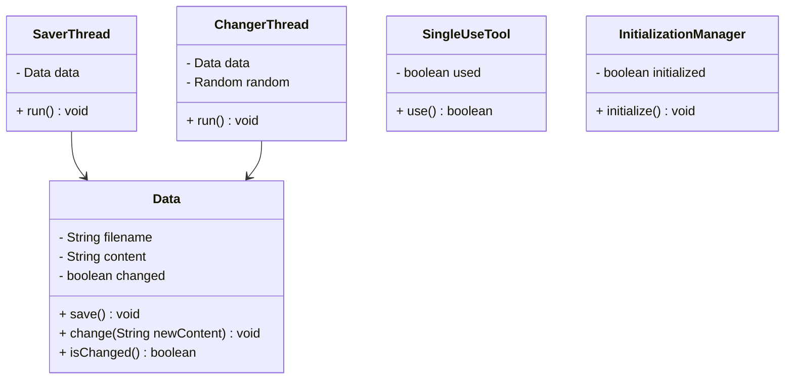
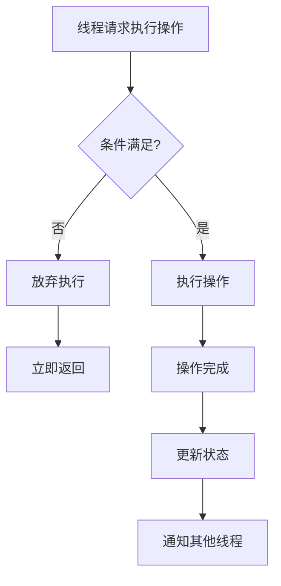
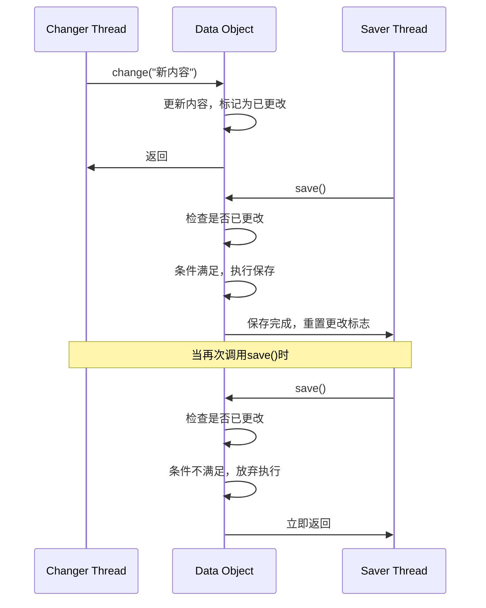
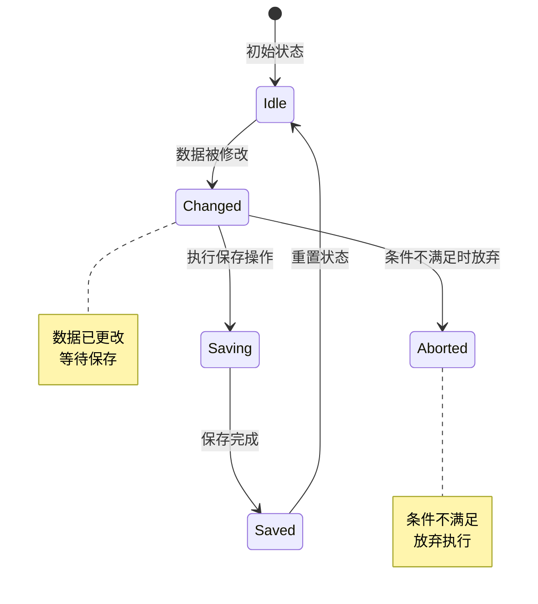

# Balking 模式（退缩模式）

## 1. 模式介绍

Balking（退缩）模式是一种简单的并发设计模式，当线程请求执行某个操作但条件不满足时，线程不会等待而是直接放弃执行。这种模式适用于那些"现在不做也没关系"的场景。

### 1.1 定义
Balking模式通过在条件不满足时立即返回或抛出异常，而不是等待条件满足，来避免线程阻塞。

### 1.2 应用场景
- 只执行一次的操作（如初始化）
- 自动保存功能
- 状态检查操作
- 心跳检测
- 日志记录（当缓冲区满时丢弃）

## 2. UML类图



## 3. 流程图



## 4. 时序图



## 5. 状态图



## 6. 数据结构图

```mermaid
graph TD
    A[Data Object] --> B[Content: String]
    A --> C[Filename: String]
    A --> D[Changed: boolean]
    A --> E[Saving: boolean]
    
    subgraph 状态字段
        D[Changed: false]
        E[Saving: false]
    endgraph
    
    subgraph 操作逻辑
        Check[检查Changed标志]
        Check -->|true| Execute[执行保存]
        Check -->|false| Return[立即返回]
        Execute --> Reset[重置Changed标志]
    endgraph
```

## 7. 实现方式

### 7.1 简单标志位检查
- 使用boolean字段标记状态
- 在方法开始时检查条件
- 条件不满足时直接返回

### 7.2 异常处理方式
- 条件不满足时抛出特定异常
- 调用方决定如何处理异常

### 7.3 返回值方式
- 方法返回boolean值表示是否执行
- 调用方根据返回值决定后续操作

## 8. 常见问题和解决方案

### 8.1 竞态条件问题
多个线程同时检查条件可能导致重复执行。

**解决方案：**
- 使用同步机制保护条件检查和状态更新
- 使用原子操作

### 8.2 状态不一致问题
对象状态在检查和执行之间可能发生变化。

**解决方案：**
- 在同步块中完成检查和执行
- 使用CAS操作

### 8.3 误判问题
条件检查可能不准确导致错误放弃。

**解决方案：**
- 确保条件检查的准确性
- 提供重试机制

## 9. 与相关模式的区别

### 9.1 与Guarded Suspension模式
- Guarded Suspension：条件不满足时等待
- Balking：条件不满足时放弃

### 9.2 与Singleton模式
- Balking可以用于实现线程安全的单例初始化
- 但通常Singleton使用双重检查锁定

### 9.3 与State模式
- Balking基于简单条件判断
- State模式基于复杂状态转换

## 10. 最佳实践

1. 明确标识适合使用Balking模式的场景
2. 确保条件检查的准确性
3. 使用适当的同步机制
4. 考虑异常处理策略
5. 提供清晰的文档说明行为
6. 避免在关键业务逻辑中使用
7. 考虑提供重试或替代方案