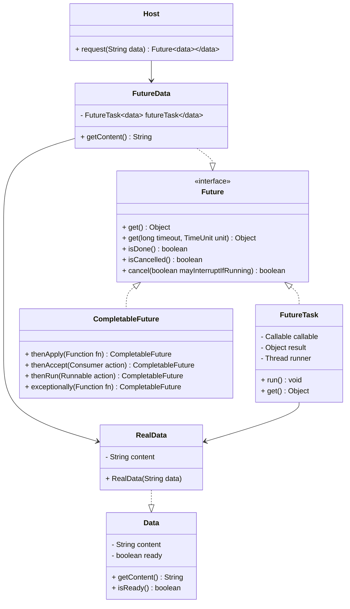
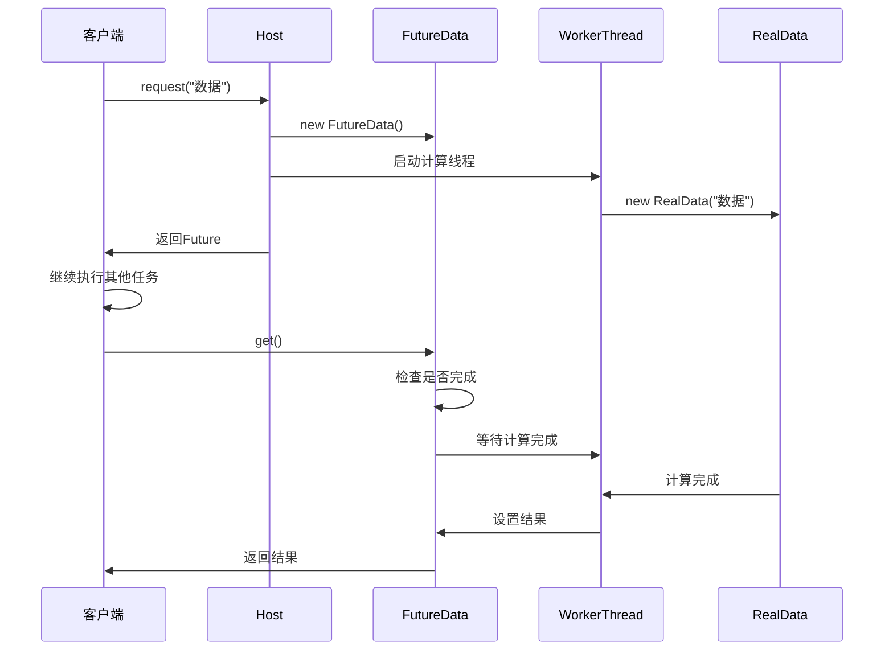
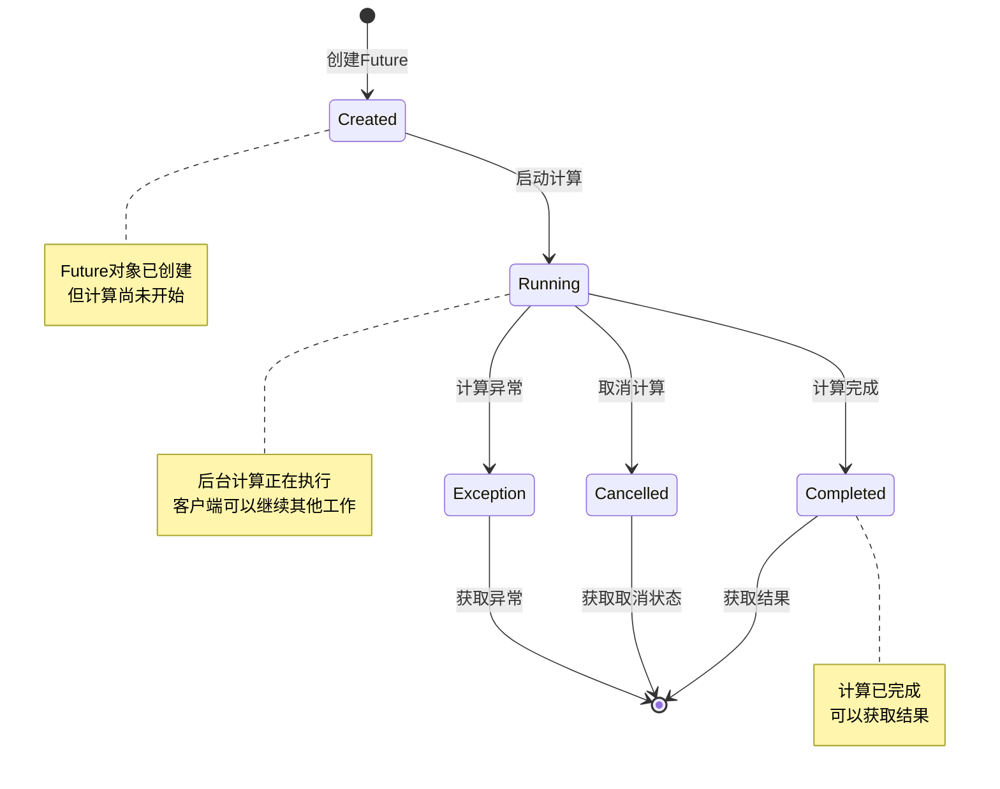

# Future 模式（未来模式）

## 1. 模式介绍

Future（未来）模式是一种并发设计模式，用于表示异步计算的结果。该模式将方法调用与方法执行分离，允许调用者在稍后获取异步计算的结果，从而提高系统的响应性和并发性能。

### 1.1 定义
Future模式通过将耗时的计算任务放在后台线程执行，立即返回一个Future对象作为占位符，调用者可以在需要时通过Future对象获取计算结果。

### 1.2 应用场景
- 异步计算和处理
- Web服务调用
- 数据库查询
- 文件I/O操作
- 图片处理
- 批量任务处理
- 微服务间通信

## 2. UML类图



## 3. 流程图

```mermaid
flowchart TD
    A[客户端发起请求] --> B[创建Future对象]
    B --> C[启动后台计算线程]
    C --> D[立即返回Future]
    D --> E[客户端继续执行其他任务]
    E --> F{需要结果?}
    F -->|否| E
    F -->|是| G[调用Future.get()]
    G --> H{计算完成?}
    H -->|是| I[返回结果]
    H -->|否| J[等待计算完成]
    J --> I
    C --> K[后台执行计算]
    K --> L[计算完成]
    L --> M[设置Future结果]
```

## 4. 时序图



## 5. 状态图



## 6. 数据结构图

```mermaid
graph TD
    A[Future架构] --> B[Future接口]
    A --> C[Future实现]
    A --> D[计算任务]
    
    B --> E[get()]
    B --> F[isDone()]
    B --> G[cancel()]
    B --> H[isCancelled()]
    
    C --> I[FutureTask]
    C --> J[CompletableFuture]
    C --> K[CustomFuture]
    
    D --> L[Callable]
    D --> M[Runnable]
    D --> N[AsyncTask]
    
    subgraph Future内部结构
        FutureImpl[Future实现] --> State[状态字段]
        FutureImpl --> Result[结果字段]
        FutureImpl --> Lock[同步锁]
        FutureImpl --> ThreadRef[执行线程引用]
    endgraph
    
    subgraph 状态管理
        StateMgmt[状态管理] --> Pending[等待中]
        StateMgmt --> Running[运行中]
        StateMgmt --> Done[已完成]
        StateMgmt --> Cancelled[已取消]
    endgraph
```

## 7. 实现方式

### 7.1 使用Future接口
- Java内置的Future接口
- 配合ExecutorService使用
- 基础的异步计算支持

### 7.2 使用CompletableFuture
- Java 8引入的增强Future
- 支持链式调用和组合
- 提供丰富的异步编程API

### 7.3 自定义Future实现
- 根据具体需求定制
- 实现特定的超时和取消逻辑
- 提供更好的错误处理机制

## 8. 常见问题和解决方案

### 8.1 阻塞等待问题
调用get()方法时可能长时间阻塞。

**解决方案：**
- 使用带超时的get()方法
- 实现非阻塞的结果检查
- 使用回调机制

### 8.2 异常处理问题
异步计算中的异常处理复杂。

**解决方案：**
- 使用exceptionally()方法处理异常
- 实现统一的异常处理策略
- 提供详细的错误信息

### 8.3 资源管理问题
Future对象未正确关闭导致资源泄漏。

**解决方案：**
- 实现适当的资源清理
- 使用try-with-resources语句
- 提供优雅的关闭机制

## 9. 与相关模式的区别

### 9.1 与Thread-Per-Message模式
- Future：关注异步计算结果的获取
- Thread-Per-Message：为每个消息创建独立线程处理

### 9.2 与Worker Thread模式
- Future：将计算委托给后台线程并获取结果
- Worker Thread：使用工作线程池处理任务队列

### 9.3 与Promise模式
- Future：被动获取结果
- Promise：主动设置结果

## 10. 最佳实践

1. 合理使用超时机制
2. 实现适当的异常处理
3. 避免长时间阻塞等待
4. 使用CompletableFuture进行链式调用
5. 监控Future的执行状态
6. 提供优雅的取消机制
7. 考虑使用回调替代轮询
8. 合理管理线程池资源