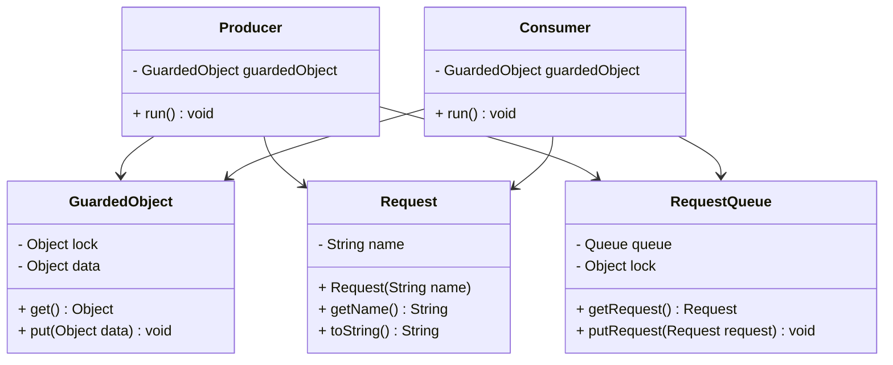
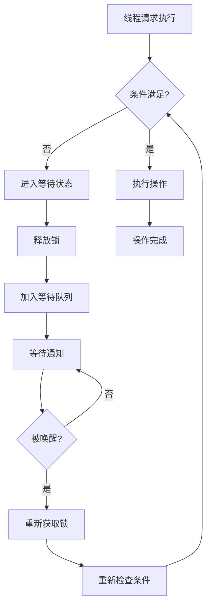
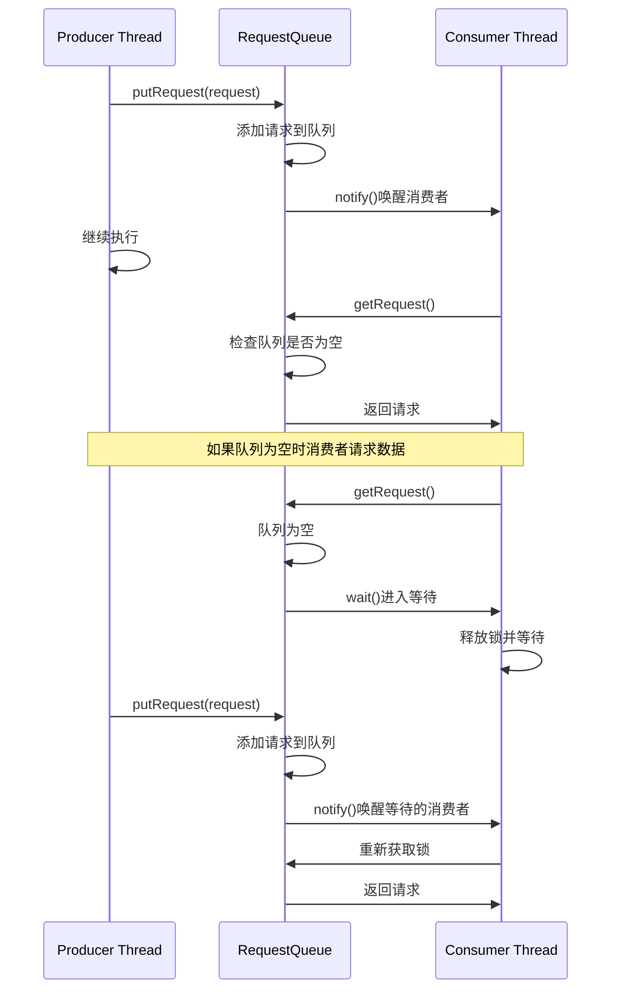
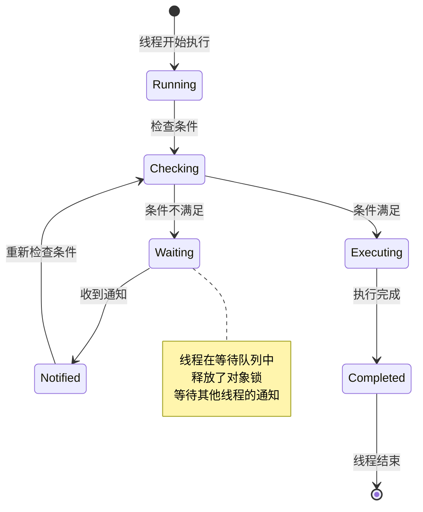

# Guarded Suspension 模式（保护性暂停模式）

## 1. 模式介绍

Guarded Suspension（保护性暂停）模式是一种重要的并发设计模式，用于处理线程间协调问题。当线程请求某个条件不满足时，该模式会让线程等待直到条件满足，而不是直接失败或抛出异常。

### 1.1 定义
Guarded Suspension模式通过在条件不满足时挂起线程，并在条件满足时唤醒线程，来实现线程间的协调和同步。

### 1.2 应用场景
- 生产者-消费者问题
- 线程间状态协调
- 条件等待和通知
- 异步任务处理
- 资源池管理

## 2. UML类图



## 3. 流程图



## 4. 时序图



## 5. 状态图



## 6. 数据结构图

```mermaid
graph TD
    A[Monitor/Object] --> B[Entry Set]
    A --> C[Wait Set]
    A --> D[Owner Thread]
    
    B --> B1[Blocked Thread 1]
    B --> B2[Blocked Thread 2]
    
    C --> C1[Waiting Thread 1]
    C --> C2[Waiting Thread 2]
    C --> C3[Waiting Thread 3]
    
    subgraph 等待机制
        WaitSet[Wait Set] --> WaitThread1[Thread A - wait()]
        WaitSet --> WaitThread2[Thread B - wait()]
        WaitSet --> WaitThread3[Thread C - wait()]
    endgraph
    
    subgraph 通知机制
        Notify[notify()/notifyAll()] --> WakeUp[唤醒等待线程]
        WakeUp --> MoveToEntry[移动到Entry Set]
    endgraph
```

## 7. 实现方式

### 7.1 使用wait/notify机制
- Object.wait()：使当前线程等待
- Object.notify()：唤醒一个等待线程
- Object.notifyAll()：唤醒所有等待线程

### 7.2 使用Condition接口
- ReentrantLock配合Condition
- 更灵活的等待和通知机制
- 支持多个条件队列

### 7.3 使用BlockingQueue
- 内置的阻塞队列实现
- 简化生产者-消费者模式实现

## 8. 常见问题和解决方案

### 8.1 虚假唤醒问题
线程可能在没有收到通知的情况下被唤醒。

**解决方案：**
- 总是在循环中检查条件
- 使用while循环而不是if语句

### 8.2 死锁问题
线程间相互等待导致死锁。

**解决方案：**
- 确保锁的获取顺序一致
- 使用超时机制
- 避免嵌套锁

### 8.3 性能问题
频繁的等待和唤醒影响性能。

**解决方案：**
- 减少锁的竞争
- 使用更高效的并发数据结构
- 合理设置等待超时

### 8.4 通知丢失问题
通知可能在等待之前发送，导致线程永远等待。

**解决方案：**
- 使用状态标志位
- 确保先等待后通知的顺序
- 使用超时机制

## 9. 最佳实践

1. 总是在循环中检查条件
2. 确保在同步块中调用wait/notify
3. 使用notifyAll()而不是notify()（除非确定只需要唤醒一个线程）
4. 避免在持有锁时执行长时间操作
5. 考虑使用java.util.concurrent包中的高级同步工具
6. 合理处理InterruptedException
7. 注意锁的粒度和范围