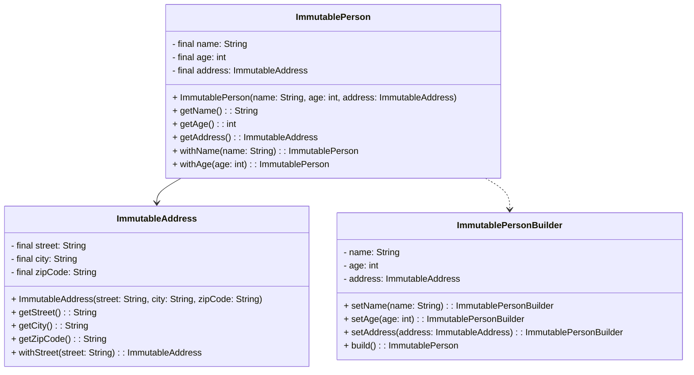
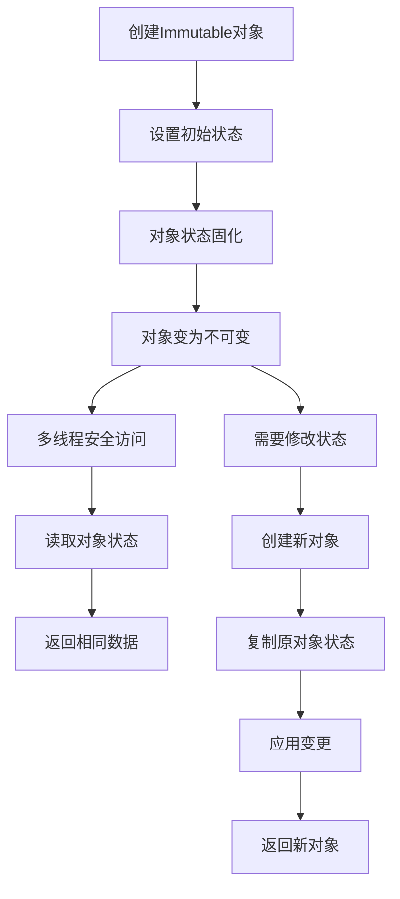
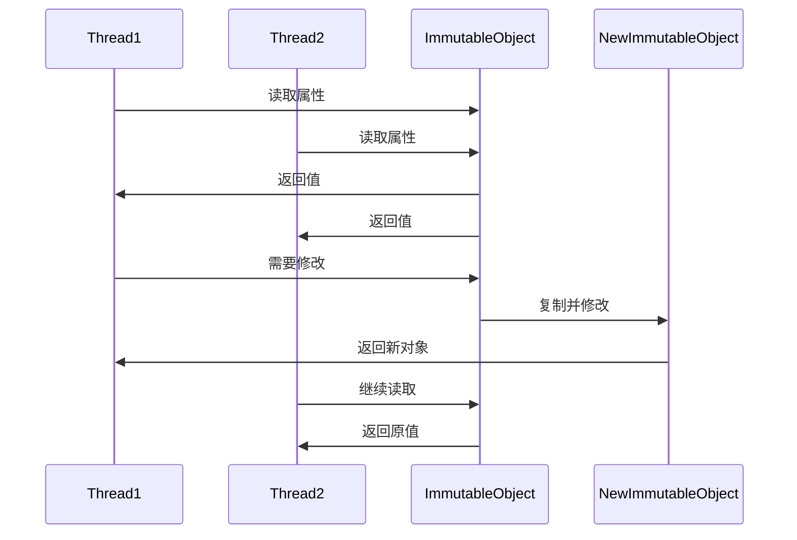
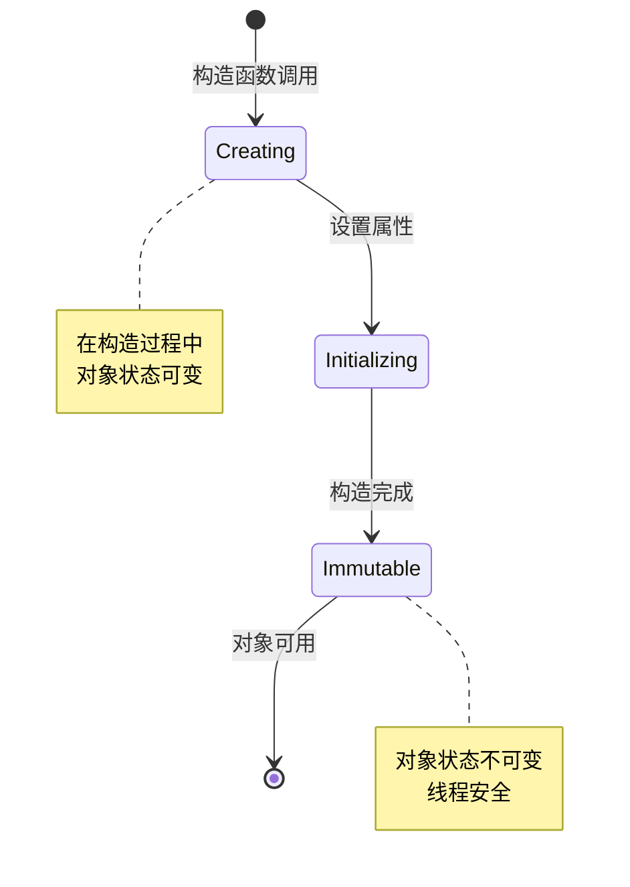

# Immutable 模式（不可变模式）

## 1. 模式介绍

Immutable（不可变）模式是一种重要的并发设计模式，通过创建不可变对象来避免线程安全问题。不可变对象一旦创建后，其状态就不能被修改，这使得它们在多线程环境中天然线程安全。

### 1.1 定义
Immutable模式通过确保对象状态不可变来实现线程安全，避免了同步机制的复杂性。

### 1.2 应用场景
- 共享配置信息
- 值对象（Value Objects）
- 缓存键值
- 消息传递对象
- 数学计算中的常量

## 2. UML类图



## 3. 流程图



## 4. 时序图



## 5. 状态图



## 6. 数据结构图

```mermaid
graph TD
    A[Immutable Object] --> B[Final Fields]
    A --> C[No Mutator Methods]
    A --> D[Defensive Copying]
    
    B --> B1[name: final String]
    B --> B2[age: final int]
    B --> B3[address: final Object]
    
    D --> D1[Constructor Parameters]
    D --> D2[Getter Return Values]
    D --> D3[Method Parameters]
    
    subgraph 内存布局
        E[Memory Block]
        E --> F[Header]
        E --> G[Final Fields]
        E --> H[No Mutable References]
    endgraph
```

## 7. 实现原则

### 7.1 不可变性规则
1. 类声明为final，防止被继承
2. 所有字段声明为final
3. 不提供任何修改对象状态的方法（setter）
4. 不允许this引用在构造过程中逸出
5. 对于可变对象字段，返回防御性拷贝

### 7.2 创建方式
1. 构造函数初始化
2. Builder模式
3. 工厂方法
4. 拷贝构造函数

## 8. 常见问题和解决方案

### 8.1 性能问题
创建大量对象可能导致内存和GC压力。

**解决方案：**
- 对象池化
- 享元模式
- 延迟初始化

### 8.2 可变组件问题
包含可变对象引用时，需要防御性拷贝。

**解决方案：**
- 构造函数中拷贝参数
- Getter方法中返回拷贝
- 使用不可变集合

### 8.3 循环引用问题
复杂的不可变对象图可能导致构造困难。

**解决方案：**
- 分步构建
- Builder模式
- 延迟初始化

## 9. 最佳实践

1. 尽可能使用不可变对象
2. 使用final关键字保护字段
3. 提供withXxx方法创建修改版本
4. 对可变组件进行防御性拷贝
5. 考虑使用不可变集合框架
6. 文档化不可变性保证