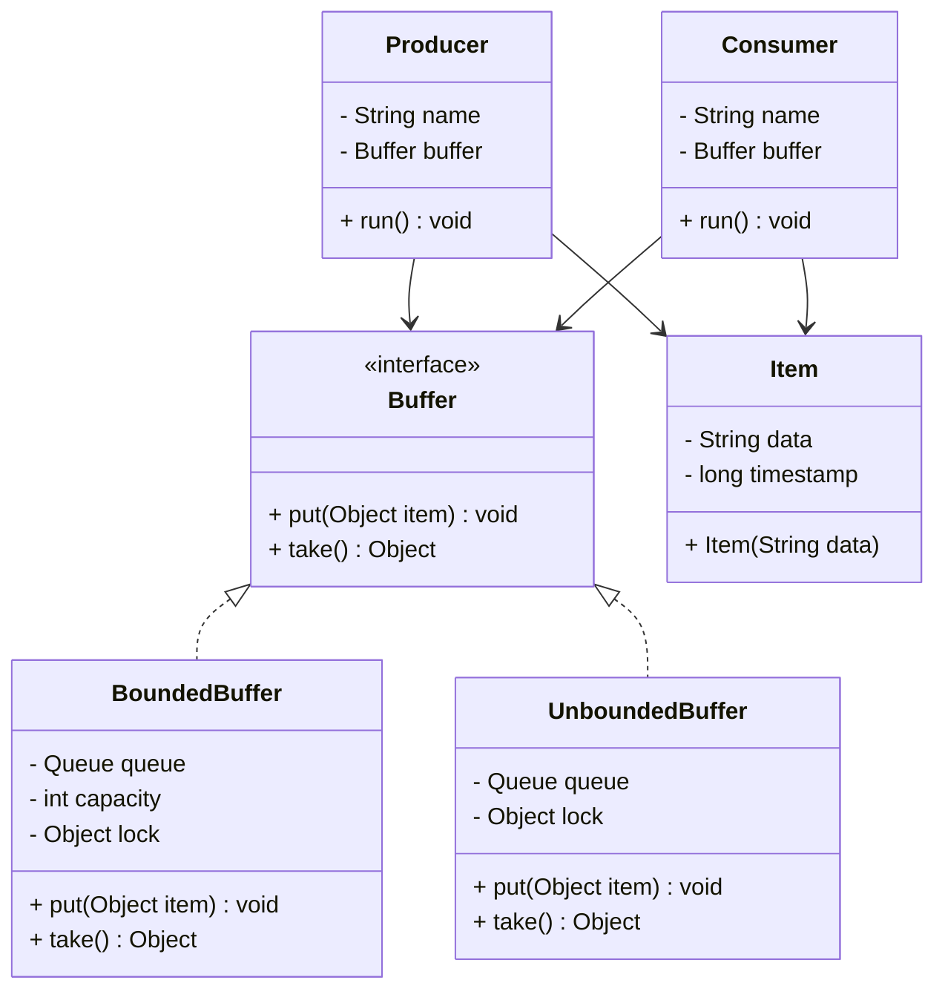
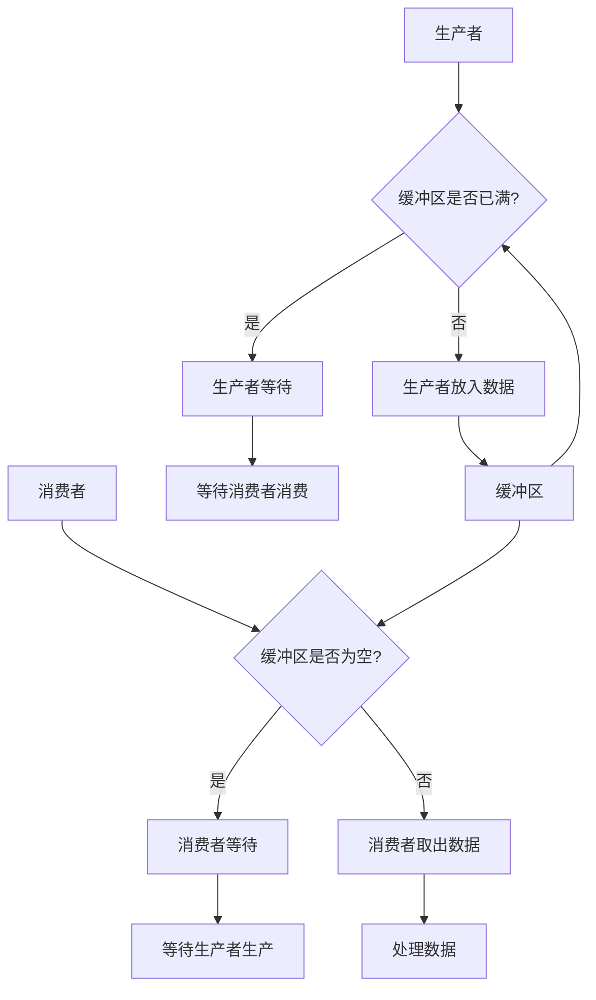
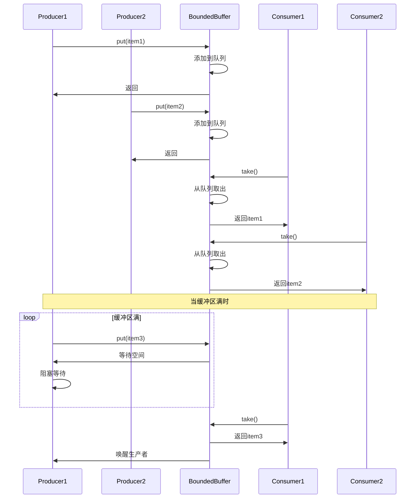
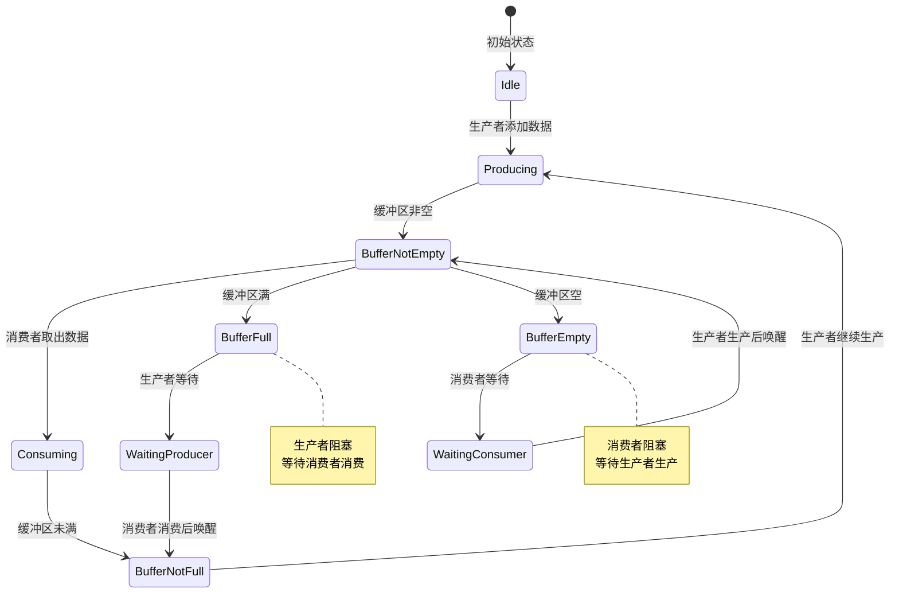

# Producer-Consumer 模式（生产者-消费者模式）

## 1. 模式介绍

Producer-Consumer（生产者-消费者）模式是一种经典的并发设计模式，用于解决生产数据和消费数据速率不匹配的问题。该模式通过引入缓冲区来解耦生产者和消费者，提高系统的整体效率和稳定性。

### 1.1 定义
Producer-Consumer模式使用缓冲区作为中介，生产者将数据放入缓冲区，消费者从缓冲区取出数据进行处理，从而实现生产者和消费者的异步操作。

### 1.2 应用场景
- 任务队列处理
- 数据流水线处理
- 消息队列系统
- Web服务器请求处理
- 日志处理系统
- 批处理作业

## 2. UML类图



## 3. 流程图



## 4. 时序图



## 5. 状态图



## 6. 数据结构图

```mermaid
graph TD
    A[Buffer Structure] --> B[Queue: LinkedList/Object[]]
    A --> C[Capacity: int]
    A --> D[Size: int]
    A --> E[Head: int]
    A --> F[Tail: int]
    A --> G[Lock: Object/ReentrantLock]
    A --> H[NotEmpty: Condition/Object]
    A --> I[NotFull: Condition/Object]
    
    subgraph 缓冲区内部结构
        Queue[Queue Structure] --> QueueElements[Elements Array]
        Queue --> HeadPointer[Head Pointer]
        Queue --> TailPointer[Tail Pointer]
        Queue --> Count[Element Count]
    endgraph
    
    subgraph 同步机制
        Sync[Sync Objects] --> LockObj[Lock Object]
        Sync --> NotEmptyCond[NotEmpty Condition]
        Sync --> NotFullCond[NotFull Condition]
    endgraph
```

## 7. 实现方式

### 7.1 使用wait/notify机制
- 基于synchronized关键字
- 使用Object的wait/notify方法
- 手动管理缓冲区状态

### 7.2 使用BlockingQueue
- Java内置的阻塞队列
- 多种实现（ArrayBlockingQueue、LinkedBlockingQueue等）
- 简化实现复杂度

### 7.3 使用Lock和Condition
- 更灵活的同步机制
- 支持多个条件队列
- 更好的性能控制

## 8. 常见问题和解决方案

### 8.1 死锁问题
生产者和消费者互相等待导致死锁。

**解决方案：**
- 确保锁的获取顺序一致
- 使用超时机制
- 避免嵌套锁

### 8.2 饥饿问题
某些线程长期得不到执行机会。

**解决方案：**
- 使用公平锁
- 避免长时间持有锁
- 合理设计缓冲区大小

### 8.3 性能问题
频繁的上下文切换影响性能。

**解决方案：**
- 批量处理
- 调整缓冲区大小
- 使用无锁数据结构

### 8.4 内存泄漏问题
未正确处理对象引用导致内存泄漏。

**解决方案：**
- 及时清理已处理的对象
- 使用弱引用
- 合理设置缓冲区大小

## 9. 与相关模式的区别

### 9.1 与Worker Thread模式
- Producer-Consumer：关注数据的生产和消费
- Worker Thread：关注任务的分发和执行

### 9.2 与Thread-Per-Message模式
- Producer-Consumer：使用缓冲区解耦生产者和消费者
- Thread-Per-Message：为每个消息创建新线程

### 9.3 与Future模式
- Producer-Consumer：同步处理数据流
- Future模式：异步获取计算结果

## 10. 最佳实践

1. 合理设置缓冲区大小
2. 使用适当的同步机制
3. 处理中断和异常情况
4. 避免缓冲区溢出
5. 考虑使用内置的BlockingQueue
6. 监控队列状态和性能指标
7. 提供优雅的关闭机制
8. 考虑批量处理提高效率