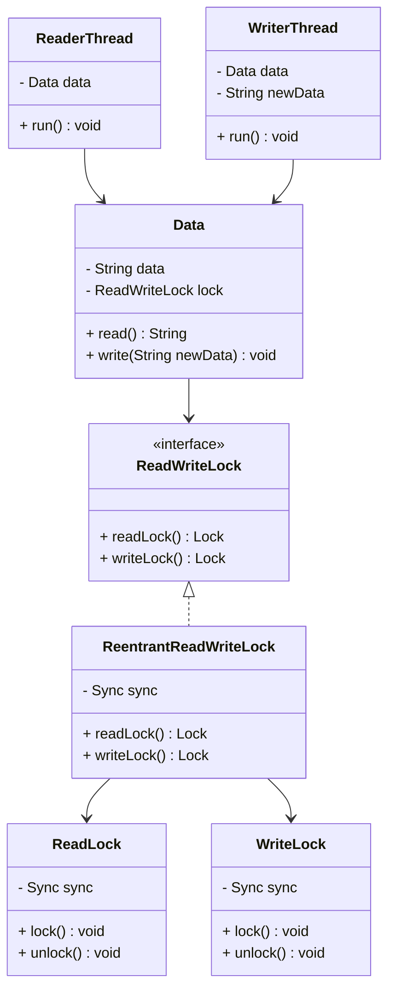
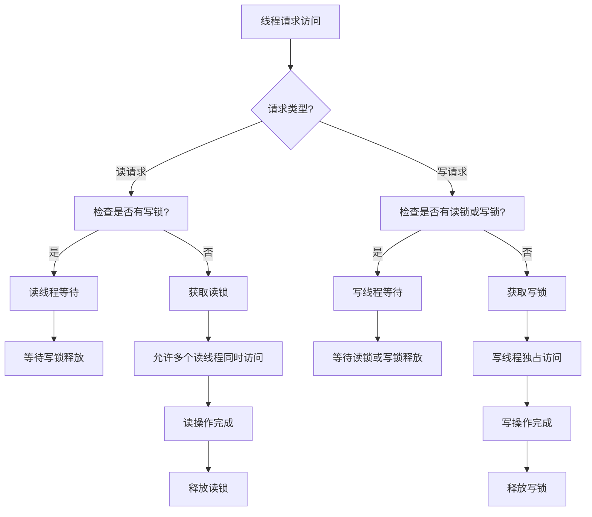
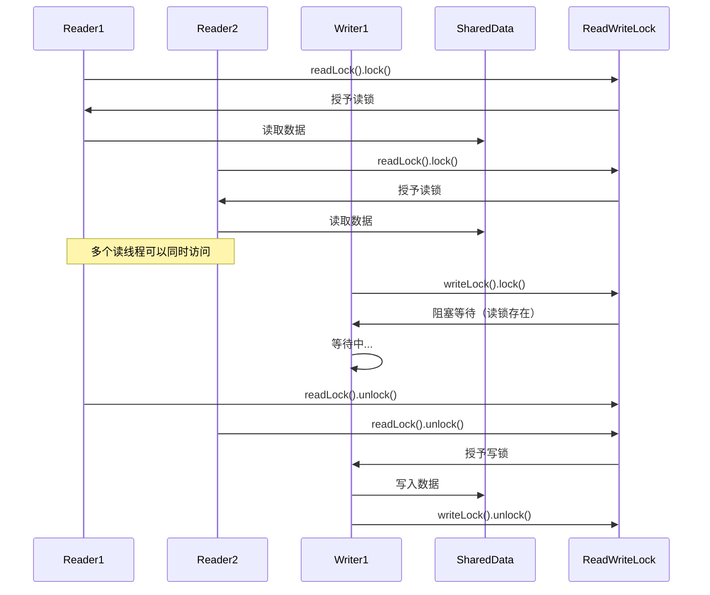
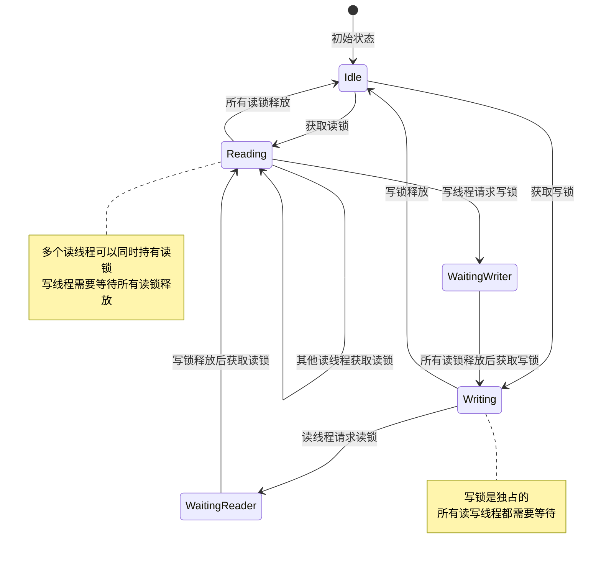

# Read-Write Lock 模式（读写锁模式）

## 1. 模式介绍

Read-Write Lock（读写锁）模式是一种并发设计模式，用于处理读多写少的场景。该模式允许多个读操作同时进行，但写操作需要独占锁，从而提高系统的并发性能。

### 1.1 定义
Read-Write Lock模式通过区分读锁和写锁，允许多个读者同时访问共享资源，但写者需要独占访问权限，读写操作互斥。

### 1.2 应用场景
- 数据库访问（读操作远多于写操作）
- 缓存系统
- 配置信息管理
- 日志系统
- 统计信息收集
- 文档编辑系统

## 2. UML类图



## 3. 流程图



## 4. 时序图



## 5. 状态图



## 6. 数据结构图

```mermaid
graph TD
    A[ReentrantReadWriteLock] --> B[Sync: AbstractQueuedSynchronizer]
    A --> C[ReadLock]
    A --> D[WriteLock]
    
    B --> E[State: int]
    B --> F[ReaderThreads: ThreadLocal]
    B --> G[WriteThread: Thread]
    B --> H[WaitQueue: CLH Queue]
    
    E --> I[高16位: 读锁计数]
    E --> J[低16位: 写锁计数]
    
    subgraph 锁状态管理
        State[State字段] --> HighBits[高16位读锁计数]
        State --> LowBits[低16位写锁计数]
    endgraph
    
    subgraph 等待队列
        WaitQueue[CLH等待队列] --> ReaderNode1[读线程节点]
        WaitQueue --> ReaderNode2[读线程节点]
        WaitQueue --> WriterNode[写线程节点]
    endgraph
```

## 7. 实现方式

### 7.1 使用ReentrantReadWriteLock
- Java内置的读写锁实现
- 支持重入
- 提供公平和非公平两种策略

### 7.2 自定义实现
- 基于synchronized或Lock接口
- 手动管理读写锁状态
- 灵活性更高但实现复杂

### 7.3 使用StampedLock
- Java 8引入的新读写锁
- 性能更好的乐观读锁
- 支持读锁转换为写锁

## 8. 常见问题和解决方案

### 8.1 写饥饿问题
读操作过多导致写操作长时间等待。

**解决方案：**
- 使用公平锁策略
- 限制并发读线程数
- 实现写优先策略

### 8.2 死锁问题
读写锁嵌套使用可能导致死锁。

**解决方案：**
- 避免锁的嵌套获取
- 确保锁的获取顺序一致
- 使用超时机制

### 8.3 性能问题
锁竞争激烈影响性能。

**解决方案：**
- 减少锁的粒度
- 使用乐观锁策略
- 考虑无锁数据结构

## 9. 与相关模式的区别

### 9.1 与Single Threaded Execution模式
- Read-Write Lock：区分读写操作，提高并发性
- Single Threaded Execution：所有操作都需要独占锁

### 9.2 与Immutable模式
- Read-Write Lock：数据可变，通过锁保护
- Immutable：数据不可变，天然线程安全

### 9.3 与Copy-On-Write模式
- Read-Write Lock：原地修改，需要锁保护
- Copy-On-Write：写时复制，读操作无锁

## 10. 最佳实践

1. 评估读写操作的比例
2. 选择合适的锁实现
3. 避免长时间持有锁
4. 处理锁的可重入性
5. 考虑使用乐观锁策略
6. 监控锁竞争情况
7. 合理设置锁的粒度
8. 提供优雅的超时机制