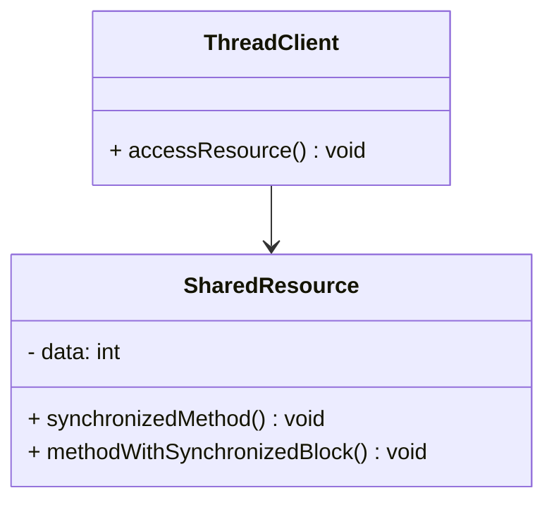
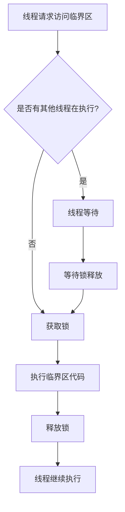
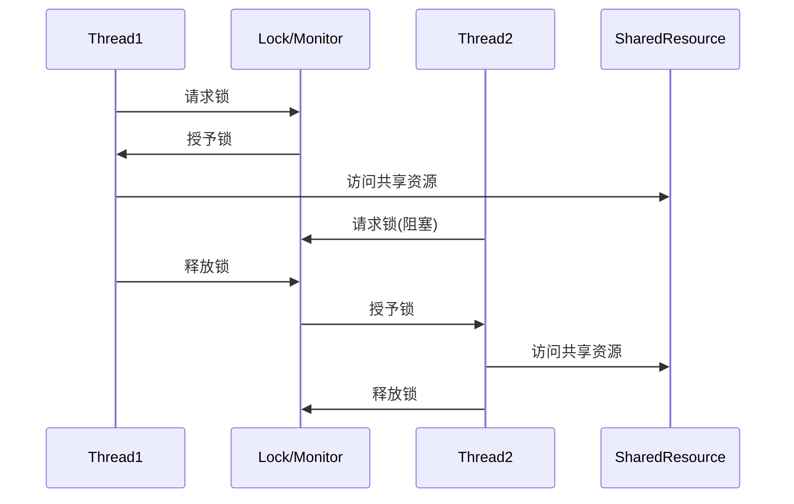
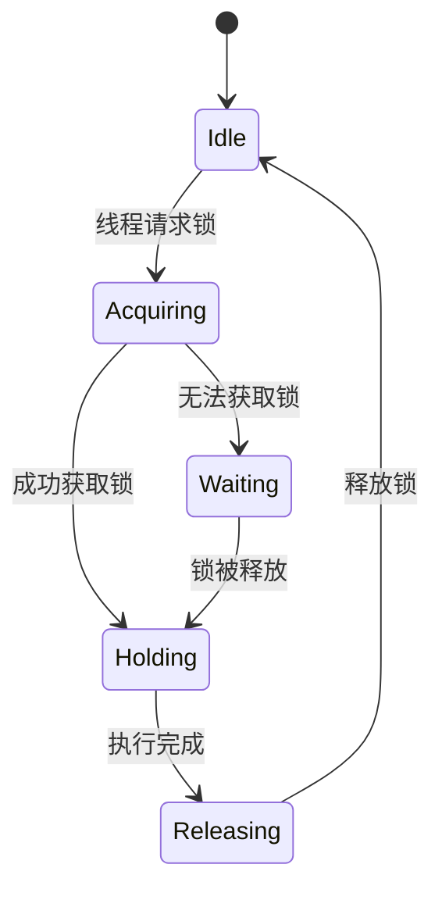
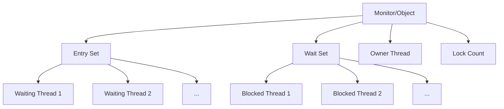

# Single Threaded Execution 模式

## 1. 模式介绍

Single Threaded Execution（单线程执行）模式是多线程设计模式中最基础也是最重要的模式之一。该模式确保在任何时刻，只有一个线程能够执行特定的代码区域，从而防止多个线程同时访问共享资源导致的数据不一致问题。

### 1.1 定义
Single Threaded Execution模式通过同步机制确保临界区（Critical Section）的代码在同一时刻只能被一个线程执行，避免竞态条件（Race Condition）的发生。

### 1.2 应用场景
- 保护共享资源的访问（如共享变量、文件、数据库连接等）
- 防止多个线程同时修改对象状态
- 实现线程安全的单例模式
- 保证操作的原子性

## 2. UML类图

## 3. 流程图

## 4. 时序图

## 5. 状态图

## 6. 数据结构图

## 7. 实现方式

### 7.1 synchronized关键字
- 方法级别同步
- 代码块级别同步

### 7.2 Lock接口
- ReentrantLock
- ReadWriteLock

### 7.3 volatile关键字
- 保证可见性
- 防止指令重排序

## 8. 常见问题和解决方案

### 8.1 死锁问题
多个线程互相等待对方持有的锁，导致所有线程都无法继续执行。

**解决方案：**
- 锁排序：按固定顺序获取锁
- 超时机制：使用tryLock设置超时时间
- 死锁检测：定期检查死锁情况

### 8.2 性能问题
过度同步会导致性能下降。

**解决方案：**
- 减少锁的粒度
- 使用读写锁分离读写操作
- 使用无锁数据结构

### 8.3 活锁问题
线程不断重复相同的工作，但无法取得进展。

**解决方案：**
- 引入随机性
- 使用队列机制

## 9. 最佳实践

1. 尽量减少临界区的范围
2. 避免在临界区内调用外部方法
3. 使用局部变量而非实例变量
4. 合理选择同步机制
5. 避免嵌套锁
6. 使用不可变对象减少同步需求