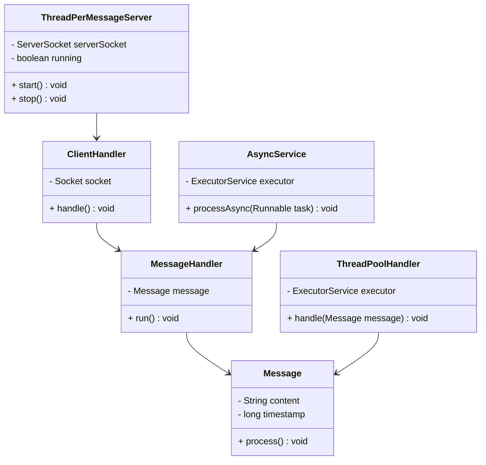
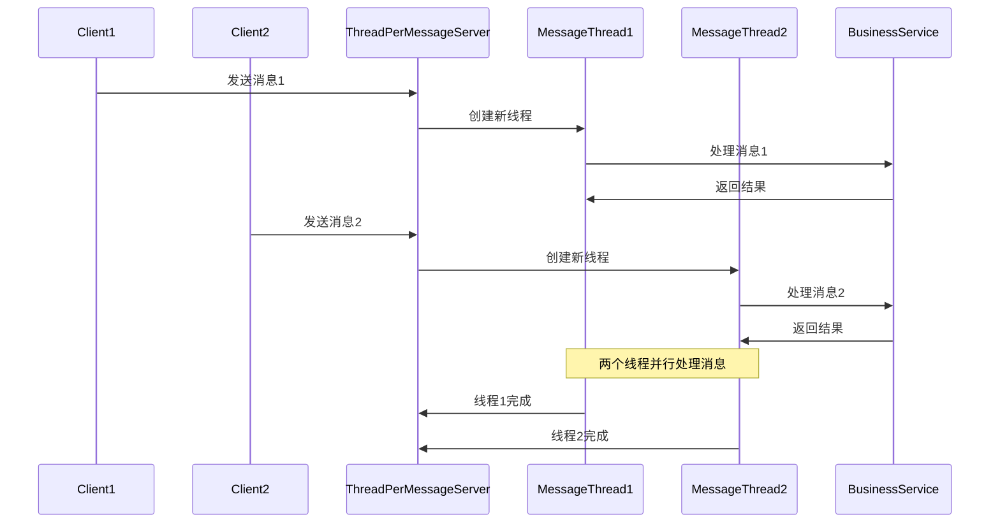
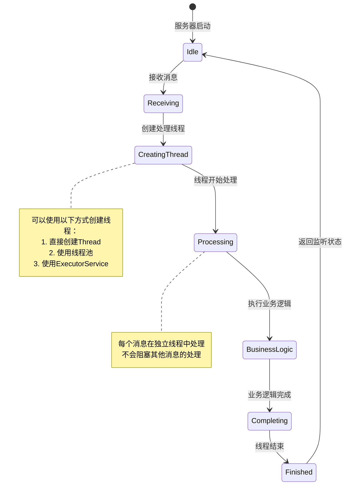

# Thread-Per-Message 模式（每消息一线程模式）

## 1. 模式介绍

Thread-Per-Message（每消息一线程）模式是一种并发设计模式，为每个请求或消息创建一个新线程来处理。这种模式可以提高系统的响应性，避免长时间运行的任务阻塞其他请求的处理。

### 1.1 定义
Thread-Per-Message模式通过为每个消息或请求创建独立的线程来实现并行处理，使得消息处理不会相互阻塞。

### 1.2 应用场景
- Web服务器请求处理
- GUI事件处理
- 网络通信服务器
- 邮件服务器
- 文件上传处理
- 异步任务处理

## 2. UML类图



## 3. 流程图

```mermaid
flowchart TD
    A[接收消息] --> B{创建线程?}
    B -->|是| C[创建新线程]
    B -->|使用线程池| D[从线程池获取线程]
    C --> E[在线程中处理消息]
    D --> E
    E --> F[执行业务逻辑]
    F --> G[处理完成]
    G --> H[线程结束/返回线程池]
    
    subgraph 线程创建方式
        B -->|直接创建| I[new Thread()]
        B -->|线程池| J[ExecutorService]
    endgraph
```

## 4. 时序图



## 5. 状态图



## 6. 数据结构图

```mermaid
graph TD
    A[Thread-Per-Message架构] --> B[消息队列/网络接口]
    A --> C[线程管理器]
    A --> D[业务处理器]
    
    C --> E[Thread Factory]
    C --> F[Thread Pool]
    C --> G[Thread Lifecycle Manager]
    
    F --> H[Active Threads]
    F --> I[Idle Threads]
    F --> J[Thread Queue]
    
    subgraph 线程池结构
        ThreadPool[线程池] --> Active[活跃线程列表]
        ThreadPool --> Idle[空闲线程列表]
        ThreadPool --> Queue[线程队列]
    endgraph
    
    subgraph 消息处理流程
        MessageFlow[消息处理] --> CreateThread[创建线程]
        CreateThread --> AssignTask[分配任务]
        AssignTask --> ExecuteTask[执行任务]
        ExecuteTask --> ReturnThread[返回线程]
    endgraph
```

## 7. 实现方式

### 7.1 直接创建线程
- 为每个消息直接创建新线程
- 简单直接但资源消耗大

### 7.2 使用线程池
- 预先创建线程池
- 重用线程，提高性能

### 7.3 使用ExecutorService
- Java内置的线程池框架
- 提供更丰富的线程管理功能

## 8. 常见问题和解决方案

### 8.1 线程过多问题
为每个消息创建线程可能导致系统资源耗尽。

**解决方案：**
- 使用线程池限制并发线程数
- 实现消息队列进行缓冲
- 使用异步处理机制

### 8.2 资源竞争问题
多个线程同时访问共享资源可能导致竞争。

**解决方案：**
- 使用同步机制保护共享资源
- 减少共享状态
- 使用线程安全的数据结构

### 8.3 线程泄漏问题
线程未正确结束可能导致线程泄漏。

**解决方案：**
- 确保线程任务正确完成
- 使用try-finally确保资源释放
- 实现优雅的关闭机制

## 9. 与相关模式的区别

### 9.1 与Worker Thread模式
- Thread-Per-Message：为每个消息创建新线程
- Worker Thread：使用固定数量的工作线程处理任务队列

### 9.2 与Producer-Consumer模式
- Thread-Per-Message：关注消息的并行处理
- Producer-Consumer：关注生产者和消费者之间的解耦

### 9.3 与Future模式
- Thread-Per-Message：不关注处理结果的返回
- Future模式：关注异步计算结果的获取

## 10. 最佳实践

1. 评估消息处理的复杂度和频率
2. 选择合适的线程创建方式
3. 实现适当的线程池管理
4. 处理线程异常和中断
5. 监控线程使用情况
6. 提供优雅的关闭机制
7. 考虑使用异步编程模型
8. 避免长时间运行的线程任务