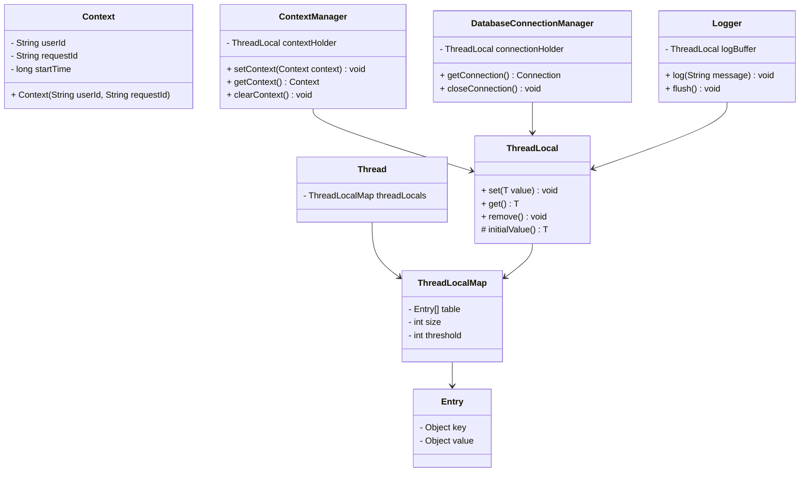
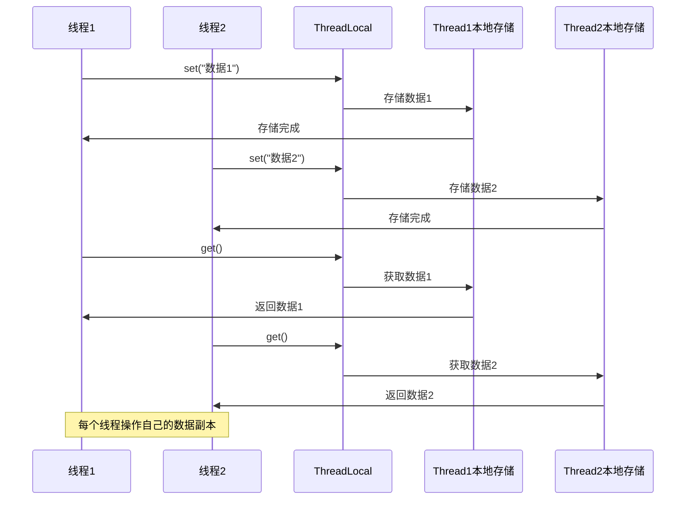
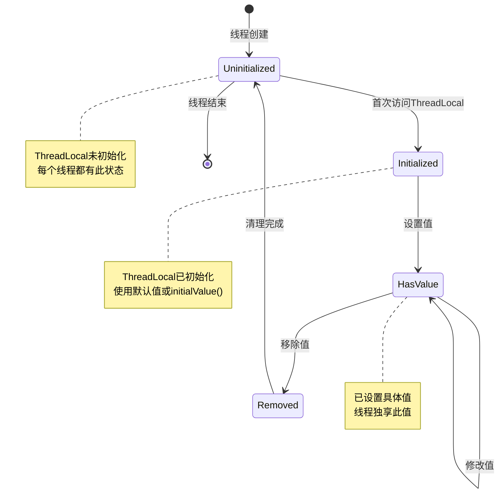

# Thread-Specific Storage 模式（线程特定存储模式）

## 1. 模式介绍

Thread-Specific Storage（线程特定存储）模式是一种并发设计模式，为每个线程提供独立的存储空间。该模式确保每个线程都有自己的数据副本，避免了线程间的竞争条件和同步问题。

### 1.1 定义
Thread-Specific Storage模式通过为每个线程维护独立的数据存储，实现线程间的数据隔离，使得每个线程都可以安全地访问和修改自己的数据副本。

### 1.2 应用场景
- 线程上下文信息管理
- 数据库连接池
- 会话管理
- 日志记录
- 事务上下文
- 用户身份信息
- 请求跟踪ID
- 性能监控

## 2. UML类图



## 3. 流程图

```mermaid
flowchart TD
    A[线程访问ThreadLocal] --> B{线程是否有数据?}
    B -->|是| C[返回现有数据]
    B -->|否| D[创建新数据]
    D --> E[存储到线程本地存储]
    E --> C
    
    subgraph 线程A
        A --> B
    endgraph
    
    subgraph 线程B
        F[线程B访问ThreadLocal] --> G{线程B是否有数据?}
        G -->|是| H[返回线程B的数据]
        G -->|否| I[创建线程B的新数据]
        I --> J[存储到线程B本地存储]
        J --> H
    endgraph
    
    subgraph 线程本地存储
        K[线程A数据]
        L[线程B数据]
        M[线程N数据]
    endgraph
```

## 4. 时序图



## 5. 状态图



## 6. 数据结构图

```mermaid
graph TD
    A[Thread对象] --> B[ThreadLocalMap]
    B --> C[Entry数组]
    C --> D[Entry0]
    C --> E[Entry1]
    C --> F[EntryN]
    
    D --> G[ThreadLocalKey1]
    D --> H[Value1]
    
    E --> I[ThreadLocalKey2]
    E --> J[Value2]
    
    subgraph ThreadLocalMap结构
        Map[ThreadLocalMap] --> Table[Entry[] table]
        Map --> Size[size]
        Map --> Threshold[threshold]
    endgraph
    
    subgraph Entry结构
        EntryObj[Entry] --> Key[key: ThreadLocal]
        EntryObj --> Val[value: Object]
    endgraph
    
    subgraph 多线程数据隔离
        Thread1Data[线程1数据] --> Thread1Map[线程1ThreadLocalMap]
        Thread2Data[线程2数据] --> Thread2Map[线程2ThreadLocalMap]
        ThreadNData[线程N数据] --> ThreadNMap[线程NThreadLocalMap]
    endgraph
```

## 7. 实现方式

### 7.1 使用ThreadLocal类
- Java内置的线程本地存储实现
- 自动为每个线程维护独立的变量副本
- 提供简单的API进行操作

### 7.2 自定义实现
- 手动管理线程到数据的映射
- 提供更灵活的存储策略
- 实现自定义的清理机制

### 7.3 使用InheritableThreadLocal
- 支持子线程继承父线程的值
- 适用于需要在线程间传递上下文的场景

## 8. 常见问题和解决方案

### 8.1 内存泄漏问题
ThreadLocal变量未正确清理可能导致内存泄漏。

**解决方案：**
- 使用try-finally确保remove()调用
- 实现适当的清理机制
- 使用弱引用避免循环引用

### 8.2 线程池复用问题
线程池中的线程被复用时，ThreadLocal值可能残留。

**解决方案：**
- 在任务执行前后清理ThreadLocal
- 实现线程池拦截器进行自动清理
- 使用InheritableThreadLocal传递必要信息

### 8.3 性能问题
频繁的ThreadLocal操作可能影响性能。

**解决方案：**
- 减少ThreadLocal的使用频率
- 缓存ThreadLocal引用
- 优化数据结构设计

## 9. 与相关模式的区别

### 9.1 与Singleton模式
- Thread-Specific Storage：每个线程有自己的实例
- Singleton：全局只有一个实例

### 9.2 与Immutable模式
- Thread-Specific Storage：数据可以修改，但每个线程独立
- Immutable：数据不可变，线程安全

### 9.3 与Thread-Per-Message模式
- Thread-Specific Storage：关注数据的线程隔离
- Thread-Per-Message：关注为每个消息创建线程

## 10. 最佳实践

1. 及时清理ThreadLocal变量
2. 使用静态ThreadLocal变量
3. 实现适当的initialValue()方法
4. 考虑使用弱引用避免内存泄漏
5. 在线程池环境中特别注意清理
6. 监控ThreadLocal的内存使用情况
7. 提供统一的上下文管理器
8. 考虑使用InheritableThreadLocal传递上下文