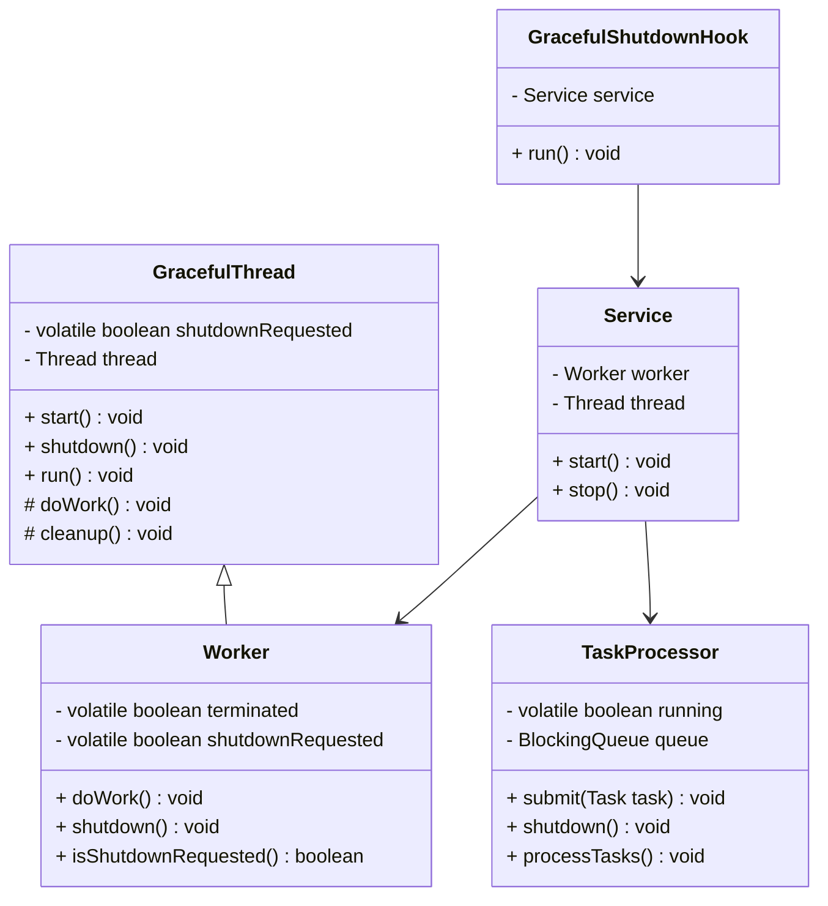
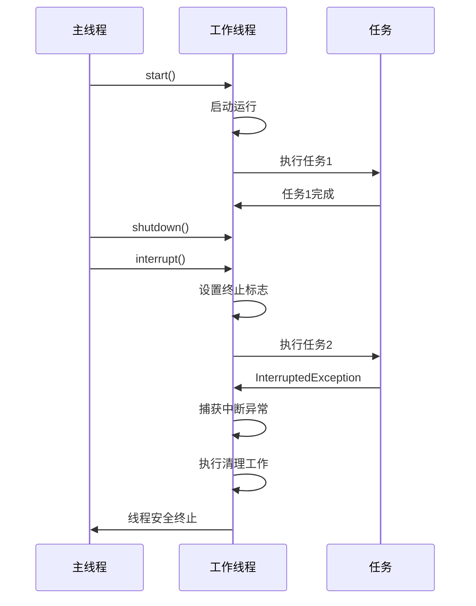
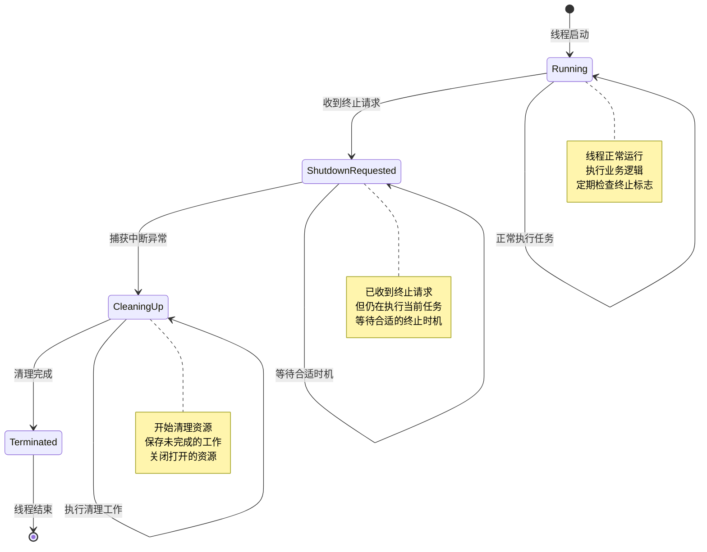

# Two-Phase Termination 模式（两阶段终止模式）

## 1. 模式介绍

Two-Phase Termination（两阶段终止）模式是一种并发设计模式，用于优雅地终止线程。该模式将线程终止分为两个阶段：第一阶段请求终止，第二阶段实际终止。这种模式确保线程能够在完成当前任务后安全地终止，避免数据损坏和资源泄漏。

### 1.1 定义
Two-Phase Termination模式通过设置终止标志和处理中断异常来实现线程的优雅终止，确保线程在合适的时机安全退出。

### 1.2 应用场景
- 服务线程的优雅关闭
- 后台任务的终止
- 定时任务的停止
- 资源清理工作
- 应用程序关闭钩子
- 长时间运行的批处理作业

## 2. UML类图



## 3. 流程图

```mermaid
flowchart TD
    A[线程运行中] --> B{收到终止请求?}
    B -->|否| C[继续执行任务]
    C --> D[检查终止标志]
    D --> B
    
    B -->|是| E[设置终止标志]
    E --> F[中断线程]
    F --> G[线程捕获中断异常]
    G --> H[清理资源]
    H --> I[安全退出]
    
    subgraph 第一阶段: 请求终止
        E
        F
    endgraph
    
    subgraph 第二阶段: 实际终止
        G
        H
        I
    endgraph
```

## 4. 时序图



## 5. 状态图



## 6. 数据结构图

```mermaid
graph TD
    A[Two-Phase Termination结构] --> B[终止标志]
    A --> C[线程引用]
    A --> D[同步机制]
    A --> E[清理方法]
    
    B --> F[volatile boolean shutdownRequested]
    B --> G[AtomicBoolean terminated]
    
    C --> H[Thread.currentThread()]
    C --> I[Worker Thread]
    
    D --> J[synchronized blocks]
    D --> K[Lock objects]
    D --> L[Interrupt mechanism]
    
    E --> M[cleanup()]
    E --> N[finalize()]
    E --> O[resource release]
    
    subgraph 状态管理
        State[状态字段] --> ShutdownFlag[终止标志]
        State --> TerminatedFlag[已终止标志]
        State --> InterruptedFlag[中断标志]
    endgraph
    
    subgraph 资源清理
        Cleanup[清理机制] --> ResourceMgr[资源管理器]
        Cleanup --> FileHandles[文件句柄]
        Cleanup --> NetworkConnections[网络连接]
        Cleanup --> MemoryBuffers[内存缓冲区]
    endgraph
```

## 7. 实现方式

### 7.1 使用终止标志
- 设置volatile布尔标志
- 定期检查终止状态
- 在合适的位置安全退出

### 7.2 处理中断异常
- 捕获InterruptedException
- 适当地重新设置中断状态
- 执行必要的清理工作

### 7.3 结合使用
- 同时使用终止标志和中断机制
- 提供更可靠的终止保证
- 处理各种终止场景

## 8. 常见问题和解决方案

### 8.1 终止不及时问题
线程可能不会立即响应终止请求。

**解决方案：**
- 增加终止检查频率
- 使用更积极的中断策略
- 设置终止超时机制

### 8.2 资源泄漏问题
线程终止时可能未正确释放资源。

**解决方案：**
- 实现完善的清理机制
- 使用try-finally确保资源释放
- 提供显式的资源管理方法

### 8.3 数据不一致问题
线程终止时可能导致数据状态不一致。

**解决方案：**
- 在终止前保存重要数据
- 实现事务性的终止操作
- 使用原子操作保护共享状态

## 9. 与相关模式的区别

### 9.1 与Balking模式
- Two-Phase Termination：优雅地终止正在运行的线程
- Balking：在条件不满足时立即放弃执行

### 9.2 与Guarded Suspension模式
- Two-Phase Termination：关注线程的终止过程
- Guarded Suspension：关注线程的等待和唤醒机制

### 9.3 与Thread-Specific Storage模式
- Two-Phase Termination：处理线程的生命周期
- Thread-Specific Storage：管理线程特定的数据

## 10. 最佳实践

1. 使用volatile变量确保可见性
2. 定期检查终止标志
3. 正确处理InterruptedException
4. 实现完善的资源清理机制
5. 提供优雅的超时终止机制
6. 考虑使用守护线程处理后台任务
7. 实现应用程序关闭钩子
8. 监控线程终止状态