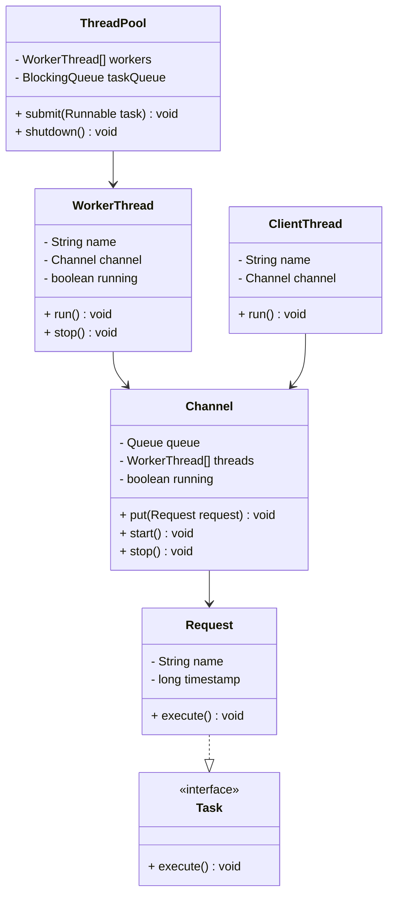
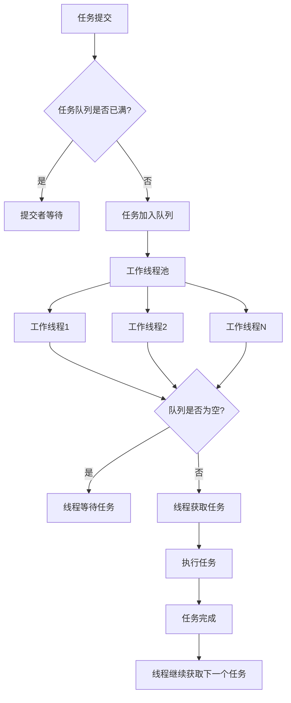
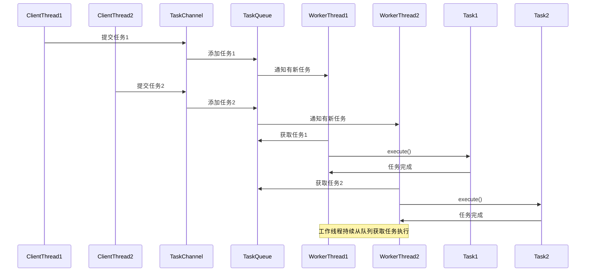
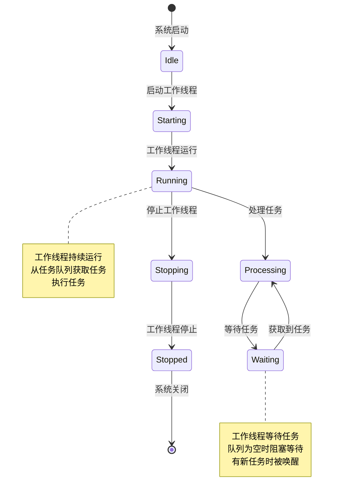

# Worker Thread 模式（工作线程模式）

## 1. 模式介绍

Worker Thread（工作线程）模式是一种并发设计模式，通过预先创建一组工作线程来处理任务队列中的任务。这种模式可以避免为每个任务创建新线程的开销，提高系统的性能和资源利用率。

### 1.1 定义
Worker Thread模式使用固定数量的工作线程从共享任务队列中获取任务并执行，实现了任务处理与线程管理的分离。

### 1.2 应用场景
- Web服务器请求处理
- 批处理作业系统
- 任务调度系统
- 数据处理管道
- 日志处理系统
- 图片处理服务

## 2. UML类图



## 3. 流程图



## 4. 时序图



## 5. 状态图



## 6. 数据结构图

```mermaid
graph TD
    A[Worker Thread架构] --> B[任务队列]
    A --> C[工作线程池]
    A --> D[任务提交者]
    
    B --> E[BlockingQueue]
    B --> F[任务生产者]
    B --> G[任务消费者]
    
    C --> H[WorkerThread1]
    C --> I[WorkerThread2]
    C --> J[WorkerThreadN]
    
    E --> K[队列头]
    E --> L[队列尾]
    E --> M[队列元素]
    
    subgraph 任务队列结构
        Queue[任务队列] --> Head[队列头部]
        Queue --> Tail[队列尾部]
        Queue --> Elements[任务元素]
    endgraph
    
    subgraph 工作线程状态
        WorkerState[工作线程] --> State[运行状态]
        WorkerState --> Task[当前任务]
        WorkerState --> QueueRef[队列引用]
    endgraph
```

## 7. 实现方式

### 7.1 自定义实现
- 手动创建工作线程
- 实现任务队列
- 管理线程生命周期

### 7.2 使用ExecutorService
- Java内置的线程池框架
- 提供丰富的配置选项
- 简化实现复杂度

### 7.3 使用ForkJoinPool
- 适用于分治算法
- 工作窃取机制
- 提高CPU利用率

## 8. 常见问题和解决方案

### 8.1 线程饥饿问题
某些线程长期得不到执行机会。

**解决方案：**
- 使用公平锁策略
- 合理设置线程池大小
- 避免长时间运行的任务

### 8.2 任务堆积问题
任务处理速度跟不上任务提交速度。

**解决方案：**
- 增加工作线程数量
- 限制任务队列大小
- 实现任务拒绝策略

### 8.3 资源耗尽问题
线程过多或任务过多导致系统资源耗尽。

**解决方案：**
- 设置合理的线程池大小
- 实现任务超时机制
- 监控系统资源使用情况

## 9. 与相关模式的区别

### 9.1 与Thread-Per-Message模式
- Worker Thread：使用固定数量的工作线程
- Thread-Per-Message：为每个消息创建新线程

### 9.2 与Producer-Consumer模式
- Worker Thread：关注任务的执行
- Producer-Consumer：关注数据的生产和消费

### 9.3 与Future模式
- Worker Thread：不关注任务执行结果的返回
- Future模式：关注异步计算结果的获取

## 10. 最佳实践

1. 合理设置工作线程数量
2. 选择合适的任务队列实现
3. 实现适当的线程池管理
4. 处理线程异常和中断
5. 监控线程池状态和性能指标
6. 提供优雅的关闭机制
7. 考虑任务的优先级处理
8. 实现合理的任务拒绝策略