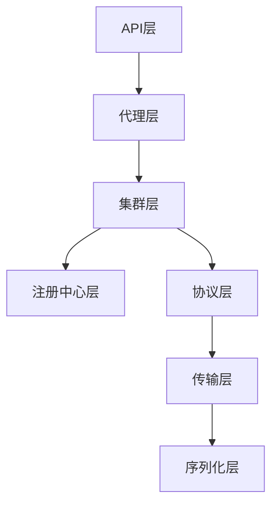
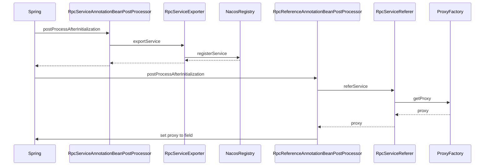
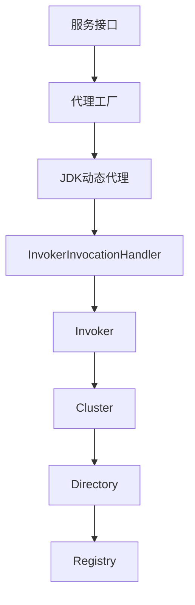
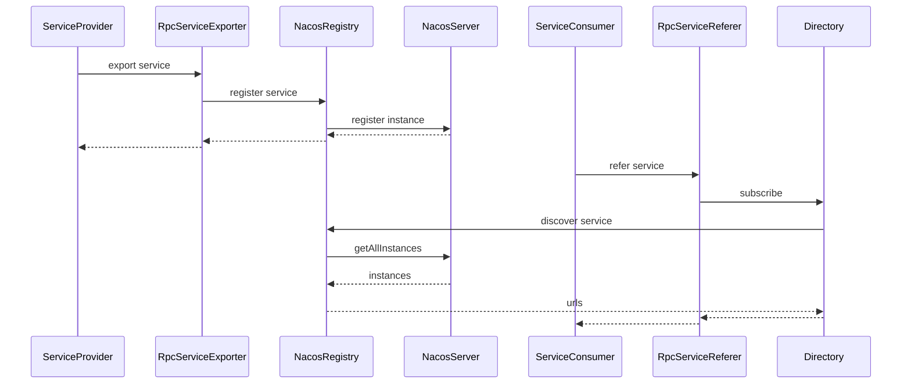
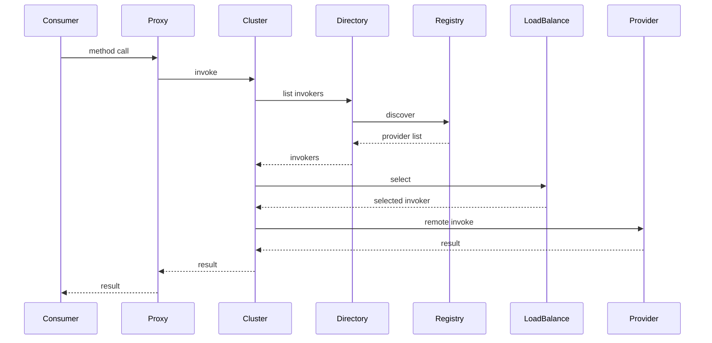

# 自定义RPC框架设计文档

## 1. 整体架构设计

### 1.1 架构概览

我们的自定义RPC框架采用分层架构设计，参考Dubbo的设计理念，主要包括以下层次：



### 1.2 核心组件

1. **API层**：定义服务接口和注解
2. **代理层**：实现动态代理和服务引用
3. **集群层**：实现负载均衡和集群容错
4. **注册中心层**：集成Nacos实现服务注册与发现
5. **协议层**：支持多种协议（dubbo、http等）
6. **传输层**：基于Netty实现高性能网络通信
7. **序列化层**：支持多种序列化方式（hessian、json等）

## 2. Spring注入集成机制

### 2.1 自定义注解

```java
@Target({ElementType.TYPE})
@Retention(RetentionPolicy.RUNTIME)
@Documented
@Component
public @interface RpcService {
    Class<?> interfaceClass() default void.class;
    String version() default "";
    String group() default "";
}
```

```java
@Target({ElementType.FIELD})
@Retention(RetentionPolicy.RUNTIME)
@Documented
@Autowired
public @interface RpcReference {
    String version() default "";
    String group() default "";
    String loadbalance() default "random";
    int retries() default 2;
}
```

### 2.2 服务暴露处理器

```java
@Component
public class RpcServiceAnnotationBeanPostProcessor implements BeanPostProcessor {
    
    @Autowired
    private RpcServiceExporter rpcServiceExporter;
    
    @Override
    public Object postProcessAfterInitialization(Object bean, String beanName) throws BeansException {
        Class<?> clazz = bean.getClass();
        RpcService rpcService = clazz.getAnnotation(RpcService.class);
        if (rpcService != null) {
            // 导出服务
            rpcServiceExporter.exportService(bean, rpcService);
        }
        return bean;
    }
}
```

### 2.3 服务引用处理器

```java
@Component
public class RpcReferenceAnnotationBeanPostProcessor implements BeanPostProcessor {
    
    @Autowired
    private RpcServiceReferer rpcServiceReferer;
    
    @Override
    public Object postProcessAfterInitialization(Object bean, String beanName) throws BeansException {
        Class<?> clazz = bean.getClass();
        Field[] fields = clazz.getDeclaredFields();
        for (Field field : fields) {
            RpcReference rpcReference = field.getAnnotation(RpcReference.class);
            if (rpcReference != null) {
                // 引用服务
                Object proxy = rpcServiceReferer.referService(field.getType(), rpcReference);
                field.setAccessible(true);
                try {
                    field.set(bean, proxy);
                } catch (IllegalAccessException e) {
                    throw new RuntimeException("Failed to inject service reference", e);
                }
            }
        }
        return bean;
    }
}
```

### 2.4 Spring注入流程图



## 3. 动态代理实现机制

### 3.1 代理工厂

```java
public class ProxyFactory {
    
    @SuppressWarnings("unchecked")
    public static <T> T getProxy(Class<T> interfaceClass, Invoker<T> invoker) {
        return (T) Proxy.newProxyInstance(
            interfaceClass.getClassLoader(),
            new Class[]{interfaceClass},
            new InvokerInvocationHandler(invoker)
        );
    }
}
```

### 3.2 调用处理器

```java
public class InvokerInvocationHandler implements InvocationHandler {
    
    private final Invoker<?> invoker;
    
    public InvokerInvocationHandler(Invoker<?> invoker) {
        this.invoker = invoker;
    }
    
    @Override
    public Object invoke(Object proxy, Method method, Object[] args) throws Throwable {
        // 处理Object类的方法
        if (method.getDeclaringClass() == Object.class) {
            return method.invoke(invoker, args);
        }
        
        // 构造调用信息
        RpcInvocation rpcInvocation = new RpcInvocation(
            method.getName(),
            method.getParameterTypes(),
            args
        );
        
        // 执行调用
        Result result = invoker.invoke(rpcInvocation);
        
        // 返回结果
        return result.getValue();
    }
}
```

### 3.3 代理机制图



## 4. Nacos注册中心集成

### 4.1 Nacos注册实现

```java
public class NacosRegistry implements Registry {
    
    private final NamingService namingService;
    private final URL registryUrl;
    
    public NacosRegistry(URL url) {
        this.registryUrl = url;
        // 初始化Nacos NamingService
        this.namingService = createNamingService(url);
    }
    
    @Override
    public void register(URL url) {
        try {
            // 构造Nacos服务实例
            Instance instance = new Instance();
            instance.setIp(url.getHost());
            instance.setPort(url.getPort());
            instance.setServiceName(url.getPath());
            instance.setMetadata(url.getParameters());
            
            // 注册服务
            namingService.registerInstance(url.getServiceInterface(), instance);
        } catch (Exception e) {
            throw new RpcException("Failed to register service to nacos", e);
        }
    }
    
    @Override
    public void unregister(URL url) {
        try {
            // 构造Nacos服务实例
            Instance instance = new Instance();
            instance.setIp(url.getHost());
            instance.setPort(url.getPort());
            instance.setServiceName(url.getPath());
            
            // 注销服务
            namingService.deregisterInstance(url.getServiceInterface(), instance);
        } catch (Exception e) {
            throw new RpcException("Failed to unregister service from nacos", e);
        }
    }
    
    @Override
    public List<URL> discover(URL url) {
        try {
            // 发现服务
            List<Instance> instances = namingService.getAllInstances(url.getServiceInterface());
            List<URL> urls = new ArrayList<>();
            for (Instance instance : instances) {
                URL serviceUrl = new URL(
                    registryUrl.getProtocol(),
                    instance.getIp(),
                    instance.getPort(),
                    url.getPath(),
                    instance.getMetadata()
                );
                urls.add(serviceUrl);
            }
            return urls;
        } catch (Exception e) {
            throw new RpcException("Failed to discover service from nacos", e);
        }
    }
}
```

### 4.2 Nacos注册流程图



## 5. 网络通信机制

### 5.1 Netty服务端实现

```java
public class NettyServer implements Server {
    
    private final ServerBootstrap bootstrap;
    private final EventLoopGroup bossGroup;
    private final EventLoopGroup workerGroup;
    private final Channel channel;
    
    public NettyServer(URL url, ChannelHandler handler) {
        this.bootstrap = new ServerBootstrap();
        this.bossGroup = new NioEventLoopGroup(1);
        this.workerGroup = new NioEventLoopGroup();
        
        bootstrap.group(bossGroup, workerGroup)
            .channel(NioServerSocketChannel.class)
            .childHandler(new ChannelInitializer<SocketChannel>() {
                @Override
                protected void initChannel(SocketChannel ch) throws Exception {
                    ch.pipeline()
                        .addLast(new ObjectDecoder(ClassResolvers.cacheDisabled(null)))
                        .addLast(new ObjectEncoder())
                        .addLast(new NettyServerHandler(handler));
                }
            });
        
        // 绑定端口
        ChannelFuture future = bootstrap.bind(url.getHost(), url.getPort());
        this.channel = future.channel();
    }
    
    @Override
    public void close() {
        if (channel != null) {
            channel.close();
        }
        if (bossGroup != null) {
            bossGroup.shutdownGracefully();
        }
        if (workerGroup != null) {
            workerGroup.shutdownGracefully();
        }
    }
}
```

### 5.2 Netty客户端实现

```java
public class NettyClient implements Client {
    
    private final Bootstrap bootstrap;
    private final EventLoopGroup group;
    private volatile Channel channel;
    
    public NettyClient(URL url, ChannelHandler handler) {
        this.bootstrap = new Bootstrap();
        this.group = new NioEventLoopGroup();
        
        bootstrap.group(group)
            .channel(NioSocketChannel.class)
            .handler(new ChannelInitializer<SocketChannel>() {
                @Override
                protected void initChannel(SocketChannel ch) throws Exception {
                    ch.pipeline()
                        .addLast(new ObjectDecoder(ClassResolvers.cacheDisabled(null)))
                        .addLast(new ObjectEncoder())
                        .addLast(new NettyClientHandler(handler));
                }
            });
        
        // 连接服务器
        ChannelFuture future = bootstrap.connect(url.getHost(), url.getPort());
        this.channel = future.channel();
    }
    
    @Override
    public void send(Object message) {
        if (channel != null && channel.isActive()) {
            channel.writeAndFlush(message);
        }
    }
    
    @Override
    public void close() {
        if (channel != null) {
            channel.close();
        }
        if (group != null) {
            group.shutdownGracefully();
        }
    }
}
```

## 6. 负载均衡策略

### 6.1 负载均衡接口

```java
@SPI("random")
public interface LoadBalance {
    
    <T> Invoker<T> select(List<Invoker<T>> invokers, Invocation invocation);
}
```

### 6.2 随机负载均衡

```java
public class RandomLoadBalance implements LoadBalance {
    
    @Override
    public <T> Invoker<T> select(List<Invoker<T>> invokers, Invocation invocation) {
        if (invokers == null || invokers.isEmpty()) {
            return null;
        }
        
        if (invokers.size() == 1) {
            return invokers.get(0);
        }
        
        // 根据权重随机选择
        return doSelect(invokers);
    }
    
    private <T> Invoker<T> doSelect(List<Invoker<T>> invokers) {
        int length = invokers.size();
        int totalWeight = 0;
        boolean sameWeight = true;
        int[] weights = new int[length];
        
        // 计算总权重
        for (int i = 0; i < length; i++) {
            int weight = getWeight(invokers.get(i));
            totalWeight += weight;
            weights[i] = totalWeight;
            if (sameWeight && i > 0 && weight != weights[i - 1]) {
                sameWeight = false;
            }
        }
        
        if (totalWeight > 0 && !sameWeight) {
            // 按权重随机
            int offset = ThreadLocalRandom.current().nextInt(totalWeight);
            for (int i = 0; i < length; i++) {
                if (offset < weights[i]) {
                    return invokers.get(i);
                }
            }
        }
        
        // 平均随机
        return invokers.get(ThreadLocalRandom.current().nextInt(length));
    }
    
    private int getWeight(Invoker<?> invoker) {
        int weight = invoker.getUrl().getParameter("weight", 100);
        if (weight > 0) {
            // 根据活跃数动态调整权重
            long timestamp = invoker.getUrl().getParameter("timestamp", 0L);
            if (timestamp > 0L && System.currentTimeMillis() - timestamp < 60000L) {
                int warmup = invoker.getUrl().getParameter("warmup", 60000);
                if (warmup > 0 && System.currentTimeMillis() - timestamp < warmup) {
                    weight = calculateWarmupWeight((int) (System.currentTimeMillis() - timestamp), warmup, weight);
                }
            }
        }
        return weight;
    }
    
    private int calculateWarmupWeight(int uptime, int warmup, int weight) {
        int ww = (int) ((float) uptime / ((float) warmup / (float) weight));
        return ww < 1 ? 1 : (ww > weight ? weight : ww);
    }
}
```

## 7. 集群容错机制

### 7.1 集群接口

```java
@SPI("failover")
public interface Cluster {
    
    <T> Invoker<T> join(Directory<T> directory);
}
```

### 7.2 失败自动切换

```java
public class FailoverCluster implements Cluster {
    
    @Override
    public <T> Invoker<T> join(Directory<T> directory) {
        return new FailoverClusterInvoker<>(directory);
    }
    
    public static class FailoverClusterInvoker<T> extends AbstractClusterInvoker<T> {
        
        public FailoverClusterInvoker(Directory<T> directory) {
            super(directory);
        }
        
        @Override
        protected Result doInvoke(Invocation invocation, List<Invoker<T>> invokers) throws Throwable {
            List<Invoker<T>> copyInvokers = invokers;
            if (copyInvokers == null || copyInvokers.isEmpty()) {
                throw new RpcException("No provider available");
            }
            
            // 获取重试次数
            int retries = getUrl().getParameter("retries", 2);
            if (retries <= 0) {
                retries = 0;
            }
            
            RpcException lastException = null;
            for (int i = 0; i <= retries; i++) {
                try {
                    // 重新获取Invoker列表
                    copyInvokers = list(invocation);
                    if (copyInvokers == null || copyInvokers.isEmpty()) {
                        throw new RpcException("No provider available");
                    }
                    
                    // 负载均衡选择Invoker
                    LoadBalance loadbalance = ExtensionLoader.getExtensionLoader(LoadBalance.class)
                            .getExtension(getUrl().getParameter("loadbalance", "random"));
                    Invoker<T> invoker = select(loadbalance, invocation, copyInvokers, null);
                    
                    // 调用
                    return invoker.invoke(invocation);
                } catch (RpcException e) {
                    if (i == retries) {
                        throw e;
                    }
                    lastException = e;
                } catch (Throwable e) {
                    if (i == retries) {
                        throw new RpcException("Failed to invoke", e);
                    }
                    lastException = new RpcException("Failed to invoke", e);
                }
            }
            
            throw lastException;
        }
    }
}
```

## 8. 完整调用时序图



## 总结

本设计文档详细描述了一个类似Dubbo的自定义RPC框架的设计方案，该框架具备以下特点：

1. **Spring集成**：通过自定义注解和Bean后置处理器实现与Spring的无缝集成
2. **动态代理**：使用JDK动态代理实现服务调用的透明化
3. **Nacos集成**：基于Nacos实现服务注册与发现
4. **高性能通信**：基于Netty实现高性能网络通信
5. **负载均衡**：支持多种负载均衡策略
6. **集群容错**：支持多种集群容错模式

该框架采用模块化设计，具有良好的扩展性和可维护性，能够满足企业级应用的需求。