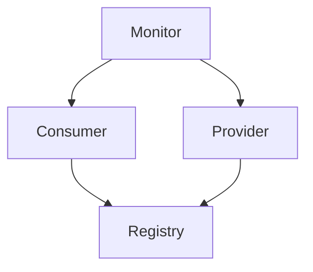
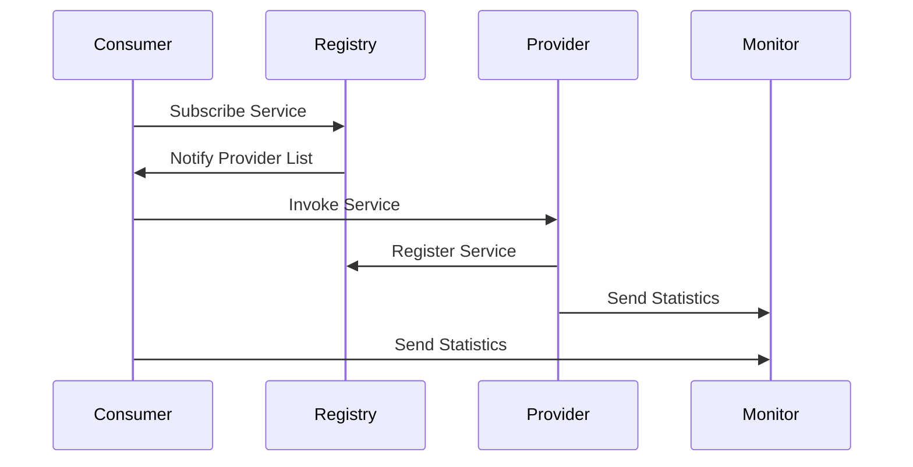
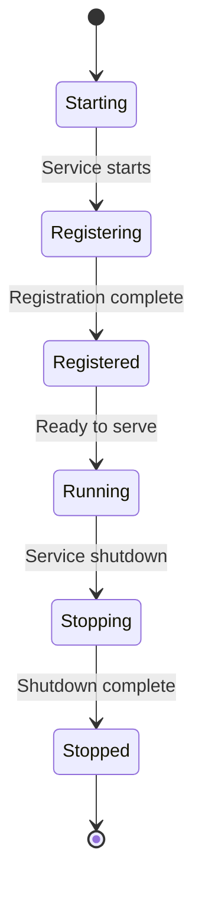
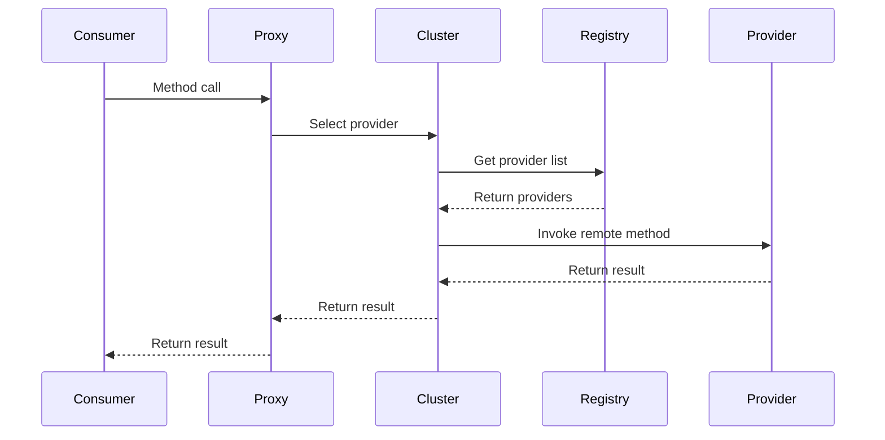

# Apache Dubbo架构设计详细技术分析

## 1. Dubbo的核心架构组件

Apache Dubbo是一个高性能的Java RPC框架，其核心架构由以下五个组件构成：

### Provider（服务提供者）
- 暴露服务的服务提供方，会向注册中心注册自己提供的服务
- 启动时会向注册中心注册服务URL，并监听消费者的调用请求
- 负责实现具体的业务逻辑

### Consumer（服务消费者）
- 调用远程服务的服务消费方，会向注册中心订阅自己所需的服务
- 启动时会向注册中心订阅服务URL，获取服务提供者的地址列表
- 负责发起远程服务调用

### Registry（注册中心）
- 服务注册与发现的中心化组件
- 服务提供者启动时会向注册中心注册服务
- 服务消费者启动时会向注册中心订阅服务
- 当服务提供者变更时，注册中心会通知服务消费者

### Monitor（监控中心）
- 统计服务调用次数和调用时间的监控中心
- 服务消费者和提供者会定时发送统计数据到监控中心
- 提供服务调用的监控和统计功能

### Container（运行容器）
- 服务运行的容器，负责加载、运行服务提供者
- 通常是一个独立的进程或Web容器

## 2. Dubbo的设计模式

### SPI（Service Provider Interface）机制
Dubbo采用了自适应SPI扩展机制，这是Dubbo最核心的设计之一：
- 通过SPI机制，Dubbo实现了高度可扩展的架构
- 允许用户自定义扩展点实现，如协议扩展、注册中心扩展、集群扩展等
- 通过@SPI注解标识扩展点接口，通过@Adaptive注解实现自适应扩展

### 工厂模式
- 通过工厂模式创建各种组件实例
- 如Protocol接口的实现类通过ExtensionLoader获取具体的协议实现
- 降低了组件之间的耦合度

### 代理模式
- 通过动态代理实现服务的远程调用
- 服务消费者通过代理对象调用远程服务，屏蔽了网络通信的复杂性
- 使用JDK动态代理或Javassist字节码技术生成代理对象

### 装饰器模式
- 通过装饰器模式增强功能
- 如Filter链就是典型的装饰器模式应用

### 观察者模式
- 服务注册与发现机制使用了观察者模式
- 当服务提供者发生变化时，注册中心会通知所有订阅者

## 3. Dubbo的工作流程和通信机制

### 工作流程
1. 服务提供者启动时，向注册中心注册服务
2. 服务消费者启动时，向注册中心订阅服务
3. 注册中心返回服务提供者地址列表给消费者
4. 服务消费者从地址列表中选择一个服务提供者进行调用
5. 调用过程通过代理对象完成，代理对象封装了网络通信细节
6. 监控中心收集并统计服务调用数据

### 通信机制
- 基于NIO的异步通信
- 支持多种通信协议，如dubbo、hessian、http、rmi等
- 默认采用Netty作为通信框架
- 通过序列化机制传输数据，支持hessian、json、fastjson等多种序列化方式

## 4. Dubbo的负载均衡策略

Dubbo提供了多种负载均衡策略：

### Random LoadBalance（随机负载均衡）
- 默认负载均衡策略
- 按权重设置随机概率
- 在一个截面上碰撞的概率高，调用性能好

### RoundRobin LoadBalance（轮询负载均衡）
- 按公约后的权重设置轮询比率
- 存在慢的提供者累积请求的问题

### LeastActive LoadBalance（最少活跃调用数负载均衡）
- 使慢的提供者收到更少请求
- 活跃数指调用前后计数差

### ConsistentHash LoadBalance（一致性Hash负载均衡）
- 相同参数的请求总是发到同一提供者
- 当某一台提供者宕机时，原本发往该提供者的请求，基于虚拟节点平摊到其它提供者

## 5. Dubbo的集群容错机制

Dubbo提供了多种集群容错模式：

### Failover Cluster（失败自动切换）
- 默认容错模式
- 当出现失败时，重试其它服务器
- 通常用于读操作，但重试会带来延时

### Failfast Cluster（快速失败）
- 只发起一次调用，失败立即报错
- 通常用于非幂等性的写操作

### Failsafe Cluster（失败安全）
- 出现异常时，直接忽略
- 通常用于写入审计日志等操作

### Failback Cluster（失败自动恢复）
- 失败后，后台记录失败请求，定时重发
- 通常用于消息通知操作

### Forking Cluster（并行调用）
- 同时调用多个服务器，只要一个成功即返回
- 通常用于实时性要求较高的读操作

### Broadcast Cluster（广播调用）
- 逐个调用所有提供者，任意一台报错则报错
- 通常用于通知所有提供者更新缓存或日志等本地资源信息

## 6. 架构图示

### Dubbo架构URL图

### Dubbo工作流程图

### Dubbo状态图

### Dubbo调用时序图

## 总结

Apache Dubbo作为一个成熟的RPC框架，具有以下特点：
1. 高性能：基于NIO通信和高效的序列化机制
2. 高可扩展性：通过SPI机制实现模块化和插件化
3. 高可用性：提供多种集群容错机制和负载均衡策略
4. 易用性：通过代理模式屏蔽远程调用的复杂性
5. 监控能力：提供完善的监控和统计功能

Dubbo的架构设计充分体现了面向接口编程、高内聚低耦合的设计原则，使得整个框架具有良好的扩展性和维护性。